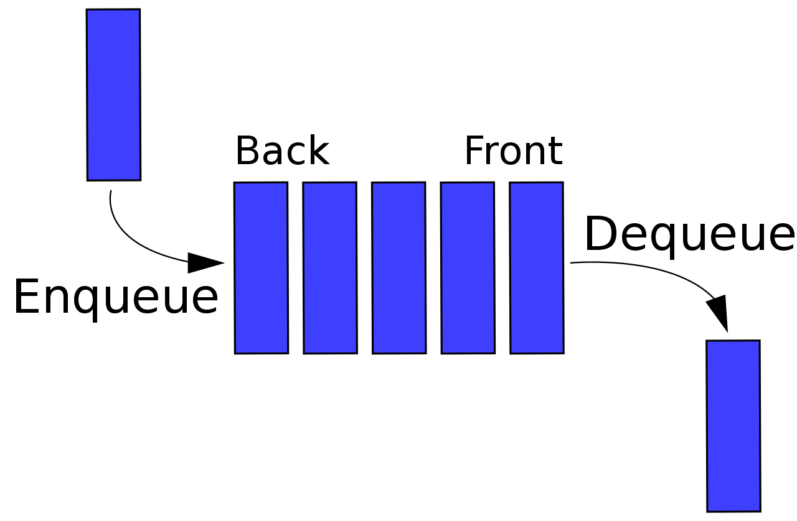

# 1.4 Fundamental Data Structure
## 1.4.1 Linear Data Structure
### Array

---

### Linked list
>a sequence of zero or more elements called node, each containing two kinds of information: 
>+ some data
>+ one or more links called pointers to other nodes of the linked list (a special pointer called "null" is used to indicate the absence of a node's successor).

There are generally two types of linked list:
+ **singly linked list**
  each node except the last one contains a single pointer to the next element (uni-directional)

+ **doubly linked list**
  every node, except the first and the last , contains pointers to both its successor and tis predecessor (bi-directional)

To access a particular node of a linked list, one starts with the list's first node and transverses the pointer chain until the particular node is reached.

We can exploit flexibility of the linked list in a variety of ways. e.g. it is often convenient to start a lined list with a special node called the **header**. This node may contain information about the linked list itself, such as its current length; it may also contain, in addition to a pointer to the first element, a pointer to the linked list's last element.

### List
The array and linked list are two principal choices in representing a more abstract data structure called a linear list or simply a list.
> List: a finite sequence of data items, i.e., a collection of data items arranged in a certain linear order. The basic operations performed on this data structure are searching for, inserting, and deleting an element. 

Two special types of lists, **stack** and **queues**, are particularly important.
+ **stack(堆)**
  a list in which insertion and deletions can be done **only at the end**. This end is called the **top** because a stack is usually visualized not horizontally but vertically(similar to a stack of plates, adding or deleting is only possible at the top). 
  The structure operates in a _"last-in-first-out"(LIFO)_ fashion. Stacks are indispensable for implementing recursive algorithms.

+ **queue(队)**
a list from which elements are **deleted** from **one end** of the structure, called the **front**(this operation is called **dequeue**), and new elements are **added** to **the other end**, called the **rear**(this operation is called **enqueue**). 
Consequently, a queue operates in a _"first-in-first-out" (FIFO)_ fashion (akin to a queue of customers served by a single teller in a bank). Queue also have many important applications, including several algorithms for graph problems.

Many important applications require selection of an items of the highest priority among a dynamically changing set of candidates. A data structure that seeks to satisfy the needs of such applications is called a **priority queue**, which is a collection of data items from a totally ordered universe(most often integer or real numbers).  
The principal operations on a priority queue are _finding its largest element_, _deleting its largest element_, and _adding a new element_. Of course, a priority queue must be implemented so that the last two operations yield another priority queue. Straightforward implementations of this data structure can be based on either an array or a sorted array, but neither of these options yields the most efficient solution possible. A better implementation of a priority queue is based on an ingenious data structure called the **heap**.

## 1.4.2 Graphs
> Formally, a **graph** G=<V,E> is defined by a pair of two sets: a finite nonempty set V of items called **vertices** and a set E of pairs of these items called **edges**(灵魂动了！！fluent的mesh).
>+ **if these pairs of vertices are unordered**, i.e., a pair of vertices (u,v) is the same as the pair (v,u), we say that the vertices u and v are **adjacent** to each other and that they are connected by the **undirected edge** (u,v). We call the vertices u and v **endpoints** of the edge (u,v) and say that u and v are **incident** to this edge; we also say that the edge (u,v) is incident to its endpoints u and v. A graph G is called **undirected** if ==every== edge in it is undirected.
>+ if a pair of vertices (u,v) is not the same as the pair (v,u), we say that the edge (u,v) is **directed** from the vertex u, called the edges's **tail**, to the vertex v, called the edge's **head**. We also say that the edge (u,v) leaves u and enters v. A graph whose ==every== edge is directed is called **directed**. Directed graphs are also called **digraphs**.  

> It is normally convenient to label vertices of a graph or a digraph with letters, integer numbers, if an application calls for it, character strings.
>+ The graph depicted in Fig 1.6a has six vertices and eight undirected edges:
> V = {a,b,c,d,e,f}, E = {(a,c), (a,d), (b,c), (b,f), (c,e), (d,e), (e,f)}.
>+ The digraph depicted in Fig 1.6b has six vertices and eight directed edges:
> V = {a,b,c,d,e,f}, E = {(a,c), (b,c), (b,f), (c,e),(d,a),(d,e), (e,c), (e,f)}.
>

## 1.4.3 Trees

## 1.4.4 Sets and Dictionaries