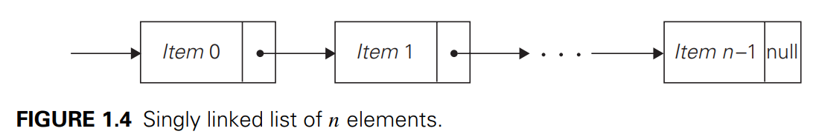
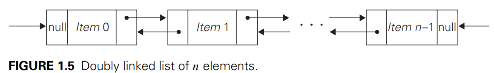
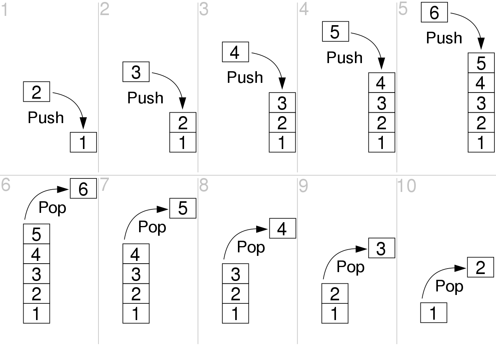
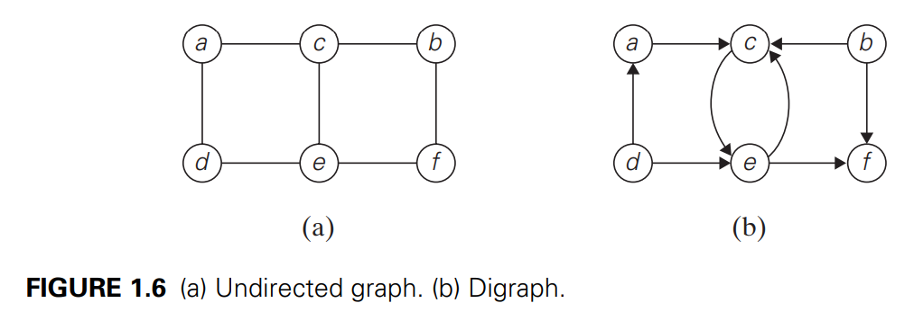

# 1.4 Fundamental Data Structure
## 1.4.1 Linear Data Structure
### Array

---

### Linked list
>a sequence of zero or more elements called node, each containing two kinds of information: 
>+ some data
>+ one or more links called pointers to other nodes of the linked list (a special pointer called "null" is used to indicate the absence of a node's successor).

There are generally two types of linked list:
+ **singly linked list**
  each node except the last one contains a single pointer to the next element (uni-directional)

+ **doubly linked list**
  every node, except the first and the last , contains pointers to both its successor and tis predecessor (bi-directional)

To access a particular node of a linked list, one starts with the list's first node and transverses the pointer chain until the particular node is reached.

We can exploit flexibility of the linked list in a variety of ways. e.g. it is often convenient to start a lined list with a special node called the **header**. This node may contain information about the linked list itself, such as its current length; it may also contain, in addition to a pointer to the first element, a pointer to the linked list's last element.

### List
The array and linked list are two principal choices in representing a more abstract data structure called a linear list or simply a list.
> List: a finite sequence of data items, i.e., a collection of data items arranged in a certain linear order. The basic operations performed on this data structure are searching for, inserting, and deleting an element. 

Two special types of lists, **stack** and **queues**, are particularly important.
+ **stack(堆)**
  a list in which insertion and deletions can be done **only at the end**. This end is called the **top** because a stack is usually visualized not horizontally but vertically(similar to a stack of plates, adding or deleting is only possible at the top). 
  The structure operates in a _"last-in-first-out"(LIFO)_ fashion. Stacks are indispensable for implementing recursive algorithms.

+ **queue(队)**
a list from which elements are **deleted** from **one end** of the structure, called the **front**(this operation is called **dequeue**), and new elements are **added** to **the other end**, called the **rear**(this operation is called **enqueue**). 
Consequently, a queue operates in a _"first-in-first-out" (FIFO)_ fashion (akin to a queue of customers served by a single teller in a bank). Queue also have many important applications, including several algorithms for graph problems.

Many important applications require selection of an items of the highest priority among a dynamically changing set of candidates. A data structure that seeks to satisfy the needs of such applications is called a **priority queue**, which is a collection of data items from a totally ordered universe(most often integer or real numbers).  
The principal operations on a priority queue are _finding its largest element_, _deleting its largest element_, and _adding a new element_. Of course, a priority queue must be implemented so that the last two operations yield another priority queue. Straightforward implementations of this data structure can be based on either an array or a sorted array, but neither of these options yields the most efficient solution possible. A better implementation of a priority queue is based on an ingenious data structure called the **heap**.

---

## 1.4.2 Graphs
> ### Definition
>
> Formally, a **graph** G=<V,E> is defined by a pair of two sets: a finite nonempty set V of items called **vertices** and a set E of pairs of these items called **edges**(灵魂动了！！fluent的mesh).
>+ **if these pairs of vertices are unordered**, i.e., a pair of vertices (u,v) is the same as the pair (v,u), we say that the vertices u and v are **adjacent** to each other and that they are connected by the **undirected edge** (u,v). We call the vertices u and v **endpoints** of the edge (u,v) and say that u and v are **incident** to this edge; we also say that the edge (u,v) is incident to its endpoints u and v. A graph G is called **undirected** if ==every== edge in it is undirected.
>+ if a pair of vertices (u,v) is not the same as the pair (v,u), we say that the edge (u,v) is **directed** from the vertex u, called the edges's **tail**, to the vertex v, called the edge's **head**. We also say that the edge (u,v) leaves u and enters v. A graph whose ==every== edge is directed is called **directed**. Directed graphs are also called **digraphs**.  
>
> ### Labels for graph
> 
> It is normally convenient to label vertices of a graph or a digraph with letters, integer numbers, if an application calls for it, character strings.
>+ The graph depicted in Fig 1.6a has six vertices and eight undirected edges:
> V = {a,b,c,d,e,f}, E = {(a,c), (a,d), (b,c), (b,f), (c,e), (d,e), (e,f)}.
>+ The digraph depicted in Fig 1.6b has six vertices and eight directed edges:
> V = {a,b,c,d,e,f}, E = {(a,c), (b,c), (b,f), (c,e),(d,a),(d,e), (e,c), (e,f)}.
>

> ### Sparsity of a graph 
>
> We have the following inequality for the number of edges |E| possible in an undirected graph with |V| vertices and no loops (means disallow multiple edges between the same vertices of an undirected graph):
> 
>  $$0 <= |E| <= \frac{|V|(|V|-1)}{2}$$ 
> 
>+ A graph with every pair of its vertices connected by an edge is called **complete**. A standard notation for the complete graph with |V| vertices is K~|V|~. 
>+ A graph with relatively few possible edges missing is called **dense**.
>+ A graph with few edges relative to the number of its vertices is called **sparse**.

> ### Graph representation
> 
> Graphs for computer algorithms are usually represented in one of two ways: the adjacency matrix and adjacency lists.
>+ **The adjacency matrix** of a graph with n vertices is an n*n boolean matrix with one row and one column for each of the graph's vertices, in which the element in the ith row and jth column is equal to 1 if there is an edge from the ith vertex to the jth vertex, and equal to 0 if there is no such edge. e.g., the adjacency matrix for the graph of Fig 1.6a is as
>
> note adjacency matrix of an undirected graph is always symmetric. 
>+ **The adjacency lists** of a graph or a digraph is a collection of **linked lists**, one for each vertex, that contain all the vertices adjacent to the list's vertex (i.e. all the vertices connected to it by an edge). Usually, such lists start with a header identifying a vertex for which the list is compiled. e.g., the adjacency list of Fig 1.6a is as:
> 
> In other words, adjacency lists indicate columns of the adjacency matrix that, for given vertex, contain 1's.
>
>If a graph is sparse, the adjacency list representation may use less space; the situation is exactly opposite for dense graphs.  

> ### Weighted Graph
> 
>**Weighted graph** is a graph (digraph) with numbers assigned to its edges. These numbers are called **weights** or **costs**. 
> An interest in such graphs is motivted by numerous real-world application, such as finding the shortest path between two points in a transportation or communication network or the traveling salesman problem mentioned earlier.
>+ If a weighted graph is represented by its **adjacency matrix**, then its element A[i, j] will simply contain the weight of the edge from the ith to the jth vertex if there is such an edge and a special symbol, e.g., $\infty$, if there is no such edge. (such a matrix is called the weight matrix or cost matrix)
>+ Adjacency lists for a weighted graph have to include in their nodes not only the name of an **adjacent vertex**but also the weight of the corresponding edge.
>

> ### Path 
>+ A **path** from vertex u to vertex v of a graph G can be defined as ==a sequence of adjacent (connected by an edge) vertices== that starts with u and ends with v. 
>>+ If all vertices of a path are distinct (截然不同的, 完全分开的), the path is said to be **simple**.
>>+ The **length** of a path is the total number of vertices in the vertex sequence defining the path minus 1, which is the same as the number of edges in the path. 
>>+ E.g., a,c,b,f is a simple path of length 3 from a to f in the graph in Fig 1.6a, whereas a,c,e,c,b,f is a path (not simple) of length 5 from a to f. 
>>> 
>
>+ In the case of directed graph, we are usually interested in directed paths. **A directed path** is ==a sequence of vertices==  in which every consecutive pair of the vertices is connected ==by an edge== directed from the vertex listed first to the vertex listed next. E.g., a,c,e,f is a directed path from a to f in the graph in Fig.1.6b

>### Connectivity and acyclicity
>+ A graph is said to be **connected** if for ==every pair== of its vertices u and v there is a path from u to v.  
>>+ If we make a model of a connected graph by connecting some balls representing the graph's vertices with strings representing the edges, it will be a single piece;
>>+ If a graph is not connected, such a model will consist of several connected pieces that are called connected components of the graph.
>+ **A connected component** is a maximal (not expandable by including another vertex and an edge) connected $subgraph^2$ of a given graph. E.g., the graphs in Fig 1.6a and 1.8a are connected , whereas the graph in Fig1.9 is not, because there is no path, for example, from a to f. The graph in Fig 1.9 has two connected components with vertices {a,b,c,d,e} and {f,g,h,i}, respectively.
>+ A **cycle** of a path of a positive length that starts and ends at the same vertex and does not traverse the same edge more than once. E.g., f,h,i,g,f is a cycle in the graph in Fig 1.9.
>+ A graph with no cycles is said to be **acyclic**. 
>
>>
>>
>>

## 1.4.3 Trees

## 1.4.4 Sets and Dictionaries