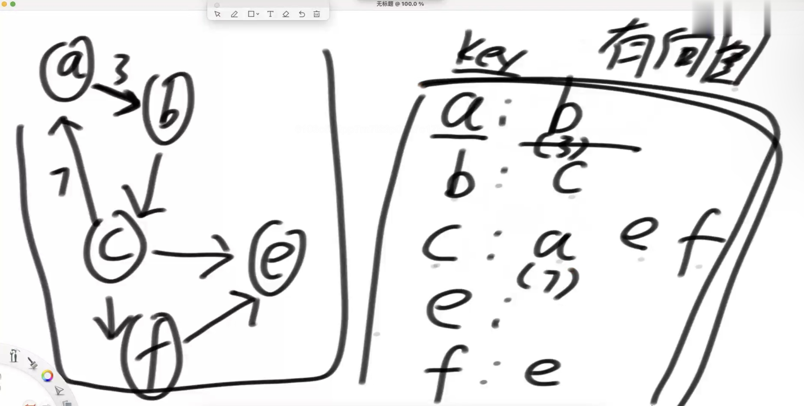
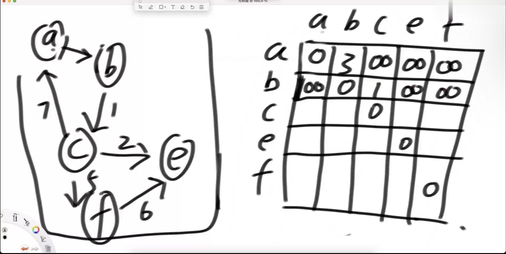
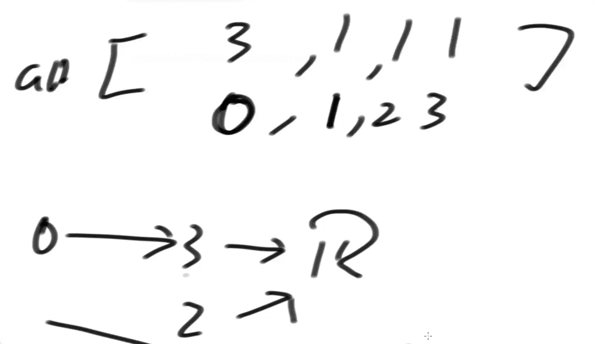

# 体系学习班 
2022-7-28开始学

# Class1
## p62 常数操作
常数操作耗费固定时间 
+ 比如两个32位的int数相加, 甭管是1+1还是1300+15666, 耗费的时间是一样的
+ 数组寻址, 如一个长度为1000万的数组, 索引它的第200万个元素和索引它第800万个元素耗时几乎是一样的的, 因为数组是在内存中逻辑上是连续结构的, 通过计算偏移量来索引. 而Linkedlist这种跳转结构在寻址上耗费的时间不是固定的, 取决于节点所在的位置.

常见的常数时间操作:
+ 算数运算(+, -, *, /, %等)
+ 位运算(>>, >>>, <<, |, &, ^等)
+ 赋值, 比较, 自增, 自减操作等
+ 数组寻址操作

总之, 执行时间固定的操作都是常数时间操作;  
反之, 执行时间不固定的操作, 都不是常数时间操作. 在算法分析中, 应将非常数时间操作继续分解为常数时间操作, 再进行复杂度分析. 比如链表list.get()方法其实每次都是从0node开始寻址到目标node, 它并不是常数时间操作, 它本身的时间复杂度就是O(N).

## p63 时间复杂度
算法复杂度分析: 分解到常数操作(最基本的单元)

以选择排序为例分析:
1) 第一小步: 遍历N个数(需N次), 找到最小值(需N-1次比较)
   第二小步: 将最小值放在0位置(需O(1))
2) 第一小步: 遍历剩下的N-1个数(需N-1次), 找到最小值(需N-2次比较)
   第二小步: 将最小值放在1位置
   ...

最后需要 $aN^2+bN+c$ (a,b,c是常数, 等差数列求和肯定是二次函数的形式)次常数操作

**时间复杂度**: 只取最高项, 舍弃最高项系数, 这里即O($N^2$); 时间复杂度描述的是算法流程的总操作数和数据量之间的关系, 时间复杂度与过程之外的优化无关.

## p64 选择排序,冒泡排序
评估算法优劣的核心指标:
+ 时间复杂度(流程决定)
+ 额外空间复杂度(流程决定)
+ 常数项时间(实现细节决定)

[selectSorting](../beginner/class1/Code07_SelectionSorting.java)
O($N^2$)

[bubbleSorting](../beginner/class1/Code08_bubbleSort.java)
O($N^2$)

选择排序和冒泡排序的流程不受数据状况影响.

## p65 插入排序
[insertSorting](../beginner/class1/Code09_insertSort.java)
**不同于选择排序和冒泡排序, 此时时间复杂度还与数据的分布状况有关,用最差情况来估计**
(面试阶段不用学平均和最好时间复杂度)

## p66 插入排序的代码
上面已给, 略

## p67 额外的空间复杂度
注意  
1. 算法的过程, 和具体的语言是无关的.
2. 想分析一个算法流程的时间复杂度的前提是, 对该算法流程非常熟悉.
3. 一定要确保在拆分算法流程时, 拆分出来的所有行为都是常数时间的操作. 这意味者你写算法时, 对自己的用过的每一个系统api, 都非常熟悉. 否则会影响你对时间复杂度的分析.

> 额外空间复杂度
> 实现要求或功能之外的,必须使用的额外空间(如中间变量, 辅助变量所需的空间). 如果你的流程只需要开辟额外的几个有限的变量， 额外的空间复杂度就是O(1)
> e.g. 累加数组元素: 额外空间复杂度O(1);
> 寻找数组中出现次数最多的元素: 如建立hashmap, 额外空间复杂度O(N) (在最坏情况下);

## p68 算法流程的常数项

## p69 算法的最优解

## p70 对数器的认识

# Class2

# Class3
## p81 单向链表与双向链表

## p82 栈和队列(queue)

# Class4

# Class5
## p96 归并排序

# Class 17 graph
## P136-138
有向图(所有图都可以转化为有向图)
无向图(可以认为是edge双向的有向图)

adjacency list (邻接表)
也可认为是K-V表, K是node, 对应V是node的neighboring node; 如果是weighted graph, 那在V的下标上注明weight

adjacency matrix (邻接矩阵)  
这里是定义没有直接相连的edge的两个Node对应值为无穷, 自己和自己之间的对应matrix值是0

**图还有别的表达法:**
二维矩阵(面试最常见的形式)
arr[][]  
其中arr[i]由[w,p1,p2]三个int组成, w表示weight, p1表示start node, p2表示end node, p1-p2构成一个edge

数组
arr[]
arr[i]表示: node i 指向 node arr[i]
但用这种表达法, 一个节点只能向外延申到另一个节点(而不是延伸到多个节点) 

图的表示方法有很多, 我们可以选择一种自己喜欢的表示方法着重练习, 在面试中遇到其他的表示法直接先写个函数(适配器)转化成我们熟悉的表示方法再coding.

## P139-140

[Node](Class17/Node.java)  
[Edge](Class17/Edge.java)  
[Graph](Class17/Graph.java)

[Graph_generator](Class17/GraphGenerator.java)

## P141 BFS & DFS

1. BFS

set: 有的图内有cycle, 防止一个Node反复进入queue, 程序进入死循环

原则: 当一个node进入queue之后, 也在set内注册, 这样当某个Node再次试图进入queue时, check set内有无该Node，如果已经有了则不能进入queue 

2. DFS

一条路没走完就走到黑，走到黑之后再back track上一层Node看有没有路可走, 有的话继续走到黑，如此往复

