设计模式中的七大设计原则

05-22

# 要点概述 

设计原则核心思想

1) 找出应用中可能需要变化之处，把它们独立出来，不要和那些不需要变化的代 码混在一起。
2) 针对接口编程，而不是针对实现编程. 抽象定框架, 实现定细节
3) 为了交互对象之间的松耦合设计而努力

# 1. 七大设计原则概述

设计模式的目的:
编写软件过程中，程序员面临着来自 耦合性，内聚性以及可维护性，可扩展性，重用性，灵活性 等多方面的挑战，设计模式是为了让程序(软件)，具有更好的

+ 代码重用性 
   + 相同功能的代码，不用多次编写
+ 可读性
  + 编程规范性,便于其他程序员的阅读和理解
+ 可扩展性 
  + 当需要增加新的功能时，非常的方便，称为可维护
+ 可靠性 
  + 当我们增加新的功能后，对原来的功能没有影响
+ 根本目的是最终使程序呈现**高内聚，低耦合**的特性

SOLID 原则


# 2. 设计模式七大原则

七大原则作为23种设计模式的指导思想


## 2.1 单一职责原则 (Single Responsibility Principle)
06-07

体现high cohesion

对类来说的，即一个类应该只负责一项职责。如类A负责两个不同职责:职责1，职责2. 当职责1需求变更而改变A时，可能造成职责2执行错误，所以需要将类A的粒度分解为 A1，A2


### case study

方式一 不遵守单一职责原则

```java
public class SingleResponsibility1 {
    public static void main(String[] args) {
        Vehicle vehicle = new Vehicle();
        vehicle.run("motor cycle");
        vehicle.run("car");

        vehicle.run("plane");
    }
}

// 交通工具类
// 方式一:
// 1. 在方式一的run()方法中, 违反了单一职责原则
// 2. 解决方案: 根据交通工具运行的方式不同, 将Vehicle分解为不同的类
class Vehicle{
    public void run(String vehicle){
        System.out.println(vehicle + "runs on the road");
    }

}
```

方式二 严格遵守单一职责原则

```java
public class SingleResponsibility2 {

    public static void main(String[] args) {
        RoadVehicle roadVehicle = new RoadVehicle();
        roadVehicle.run("motor cycle");
        roadVehicle.run("car");

        AirVehicle airVehicle = new AirVehicle();
        airVehicle.run("plane");
    }
}

/**
 * 分析:
 * 方案二遵守了单一职责原则
 * 但是这样做的改动很大, 即需要将类分解, 同时修改客户端
 * 改进: 直接修改Vehicle类, 改动的代码比较少
 *
 */

class RoadVehicle{
    public void run(String vehicle){
        System.out.println(vehicle + " runs on the road");
    }
}


class AirVehicle{
    public void run(String vehicle){
        System.out.println(vehicle + " flies in the air");
    }
}

class WaterVehicle{
    public void run(String vehicle){
        System.out.println(vehicle + " runs on the water");
    }
}
```

方式三 部分遵守单一职责原则

```java
public class SingleResponsibility3 {
    public static void main(String[] args) {
        Vehicle2 vehicle2 = new Vehicle2();
        vehicle2.run("car");
        vehicle2.runAir("plane");
        vehicle2.runWater("ship");
    }
}

/**
 * 方式三的分析:
 * 1. 这种修改方法没有对原来的类做大的修改, 只是增加了方法
 * 2. 这里虽然没有在类的级别上遵守单一职责原则, 但是在方法级别上, 仍然是遵守了单一职责原则
 */

class Vehicle2{
    public void run(String vehicle){
        System.out.println(vehicle + "runs on the road");
    }

    public void runAir(String vehicle){
        System.out.println(vehicle + "runs in the air");
    }

    public void runWater(String vehicle){
        System.out.println(vehicle + "runs on the water");
    }
}
```


### 单一职责原则总结

1. 降低类的复杂度，一个类只负责一项职责。

2. 提高类的可读性，可维护性

3. 降低变更引起的风险

4. 通常情况下，我们应当遵守单一职责原则

   + 只有逻辑足够简单，才可以在代码级违反单一职责原则 (换句话说, 逻辑越是复杂的代码, 越应该遵守单一职责原则)

   + 只有类中方法数量足够少，可以在方法级别保持单一职责原则 (换句话说, 如果类中方法众多, 你还是得把这个类拆成好几个类来使得每个类中的方法足够少, 使其能够在方法级别保持单一职责原则.)


## 2.2 接口隔离原则 (Interface Segregation Principle)
08-10


客户端不应该依赖它不需要的接 口，**即一个类对另一个类的依赖(使用) 应该建立在最小的接口上**


### Case study

方式一: 不采用接口隔离原则

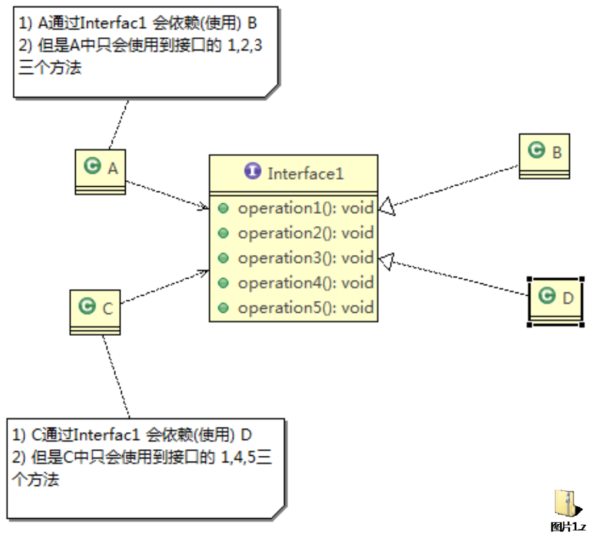

+ 类B, D实现了Interface1, 但它们其实没必要实现Interface1中的所有方法
+ 类A, C依赖Interface1
  + 间接地, 类A通过Interface1依赖类B
  + 间接地, 类C通过Interface1依赖类D

问题描述: 类A通过接口Interface1依赖类B, 类C通过 接口Interface1依赖类D, 如果接口 Interface1对于类A和类C来说不是最小接口,  那么类B和类D必须去实现他们不需要的方法, 这样就造成了不必要的redundency和耦合度

解决方案: 将接口Interface1拆分为独立的几个接口， 类A和类C分别与他们需要的接口建立依赖 关系。也就是采用接口隔离原则


上面UML类图对应代码:

```java
public class InterfaceSegregation1 {
    B b = new B();      // B implements Interface1
    A a = new A();      // A depends on B via Interface1, but only use method 1, 2, 3
    a.depend1(b);
    a.depend2(b);
    a.depend3(b);

    D d = new D();      // D implements Interface1
    C c = new C();      // C depends on B via Interface1, but only use method 1, 4, 5
    c.depend1(d);
    c.depend4(d);
    c.depend5(d);

}

interface Interface1{
    void operation1();
    void operation2();
    void operation3();
    void operation4();
    void operation5();
}

class B implements Interface1{
    public void operation1(){
        System.out.println("B implements operation1");
    };
    public void operation2(){
        System.out.println("B implements operation2");
    };
    public void operation3(){
        System.out.println("B implements operation3");
    };
    public void operation4(){
        System.out.println("B implements operation4");
    };
    public void operation5(){
        System.out.println("B implements operation5");
    };
}

class D implements Interface1{
    public void operation1(){
        System.out.println("D implements operation1");
    };
    public void operation2(){
        System.out.println("D implements operation2");
    };
    public void operation3(){
        System.out.println("D implements operation3");
    };
    public void operation4(){
        System.out.println("D implements operation4");
    };
    public void operation5(){
        System.out.println("D implements operation5");
    };
}

/**
 * A 类通过Interface1 依赖（使用）B类, 但是只会使用到1,2,3 方法
 */
class A {
  // 多态： i是实现了Interface1的类的实例
    public void depend1(Interface1 i){
        i.operation1();
    }

    public void depend2(Interface1 i){
        i.operation2();
    }

    public void depend3(Interface1 i){
        i.operation3();
    }
}

/**
 * C类通过Interface1 依赖（使用）D类, 但是只会使用到1,4,5 方法
 */
class C {
    public void depend1(Interface1 i){
        i.operation1();
    }

    public void depend4(Interface1 i){
        i.operation4();
    }

    public void depend5(Interface1 i){
        i.operation5();
    }
}
```


方式二: 采用接口隔离原则

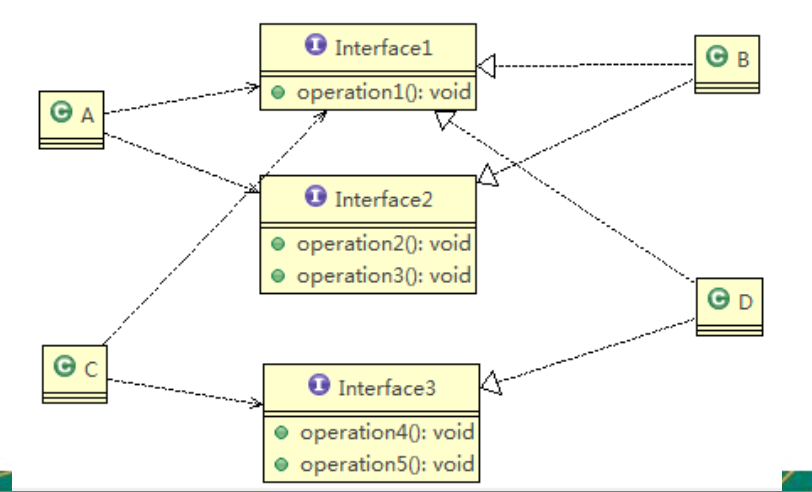


上面的UML类图对应的代码

```java
public class InterfaceSegregation2 {
    public static void main(String[] args) {

        A a = new A();      // A depends on B via Interface1, 2, but only use method 1, 2, 3
        a.depend1(new B()); // 体现A类通过接口依赖(使用)类B
        a.depend2(new B());
        a.depend3(new B());
        
        C c = new C();      // C depends on B via Interface1, 3, but only use method 1, 4, 5
        c.depend1(new D()); 
        c.depend4(new D());
        c.depend5(new D());
    }

}


interface Interface1{
    void operation1();
}

interface Interface2{
    void operation2();
    void operation3();
}

interface Interface3{
    void operation4();
    void operation5();
}

class B implements  Interface1, Interface2{
    public void operation1(){
        System.out.println("B implements operation1");
    };
    public void operation2(){
        System.out.println("B implements operation2");
    };
    public void operation3(){
        System.out.println("B implements operation3");
    };

}


class D implements Interface1, Interface3{
    public void operation1(){
        System.out.println("D implements operation1");
    };
    public void operation4(){
        System.out.println("D implements operation4");
    };
    public void operation5(){
        System.out.println("D implements operation5");
    };
}


class A {
    public void depend1(Interface1 i){
        i.operation1();
    }

    public void depend2(Interface2 i){
        i.operation2();
    }

    public void depend3(Interface2 i){
        i.operation3();
    }
}


class C {
    public void depend1(Interface1 i){
        i.operation1();
    }

    public void depend4(Interface3 i){
        i.operation4();
    }

    public void depend5(Interface3 i){
        i.operation5();
    }
}
```


## 2.3 依赖倒转原则 (Dependency Inversion Principle)
11-13

依赖倒转原则(Dependence Inversion Principle)是指:

1. 高层模块(指抽象类或接口, 画UML类图时一般它们在顶部)不应该依赖低层模块(指底层实现类)，二者都应该依赖其抽象
2. 抽象不应该依赖细节，细节应该依赖抽象
3. <u>**依赖倒转(倒置)的中心思想是面向接口编程**</u>
4. 依赖倒转原则是基于这样的设计理念:  相对于细节的多变性，抽象的东西要稳定的多。以抽象为基础搭建的架构比以细节为基础的架构要稳定的多。**在java中，抽象 指的是接口或抽象类，细节就是具体的实现类**
5. 使用接口或抽象类的目的是制定好规范，而不涉及任何具体的操作，把展现细节的 任务交给他们的实现类去完成


### 2.3.1 Case study

方式一: 不实用依赖倒转原则

```java
public class DependencyInversion {
    public static void main(String[] args) {
        Person p = new Person();
        p.receive(new Email());
    }

}

class Email{
    public String getInfo(){
        return "email info: hello world!";
    }
}

// 完成Person接收消息的功能
// 方式一:
// 1. 优点: 简单容易想到
// 2. 缺点: 如果我们获取的对象是微信, 短信等, 则新增类, 同时Person也要增加相应的接收方法 (需要重载receive()方法比较麻烦)
//  解决思路: 引入一个抽象的接口 IReceiver, 表示接收者, 这样Person类与接口发生依赖
//  这时因为Email, 微信都属于接收的范围, 则他们各自实现IReceiver接口就ok, 这样就符合依赖倒转原则
class Person{
    public void receive(Email email){
        System.out.println(email.getInfo());
    }
}
```


方式二: 使用依赖倒转原则

```java
public class DependencyInversion2 {
    public static void main(String[] args) {
        // 客户端(指Person)无需改变
        Person p = new Person();
        p.receive(new Email());

        p.receive(new Wechat());
    }
}

/**
 * 定义抽象: 接口
 */
interface IReceiver{
    public String getInfo();
}

// 定义细节: 实现类
class Email implements IReceiver{
    public String getInfo(){
        return "email info: hello world!";
    }
}

class Wechat implements IReceiver{
    @Override
    public String getInfo() {
        return "wechat info: hello wechat!";
    }
}

// 完成Person接收消息的功能
// 方式二:
class Person{
    public void receive(IReceiver receiver){
        System.out.println(receiver.getInfo());
    }
}
```


### 2.3.2 :full_moon: 依赖关系传递的三种方式与案例

Case: 通过开关(抽象)打开电视(抽象) . 

以下三种方式在使用时, 对外体现的都是开关(具体)打开电视机(具体), 或者说开关(具体)使用 or 依赖电视机(具体); 这是就是依赖传递, 即两个并没有直接依赖的类通过依赖传递而发生依赖关系了

方式一: 通过接口传递

```java
public class DependencyPass {

	public static void main(String[] args) {
		// TODO Auto-generated method stub
		// 方式一: 通过接口传递依赖
		ChangHong changHong = new ChangHong();
		OpenAndClose openAndClose = new OpenAndClose();
		openAndClose.open(changHong);
	}
}

// 方式1: 通过接口传递实现依赖 --------------------------------------
// 抽象: 开关的接口, 定义开关的抽象行为 -- 打开一个电视
interface IOpenAndClose {
 		void open(ITV tv); //抽象方法, 接收ITV接口的实现类的实例
}

// 具体: 实现开关接口, 具体定义开关的行为
class OpenAndClose implements IOpenAndClose{
  public void open(ITV tv){
    tv.play();
  }
}

// 抽象: 电视的接口, 定义电视的抽象行为 -- 播放
interface ITV { 
 		void play();
}

// 具体: 实现电视的接口 --> 长虹电视机, 具体定义TV的行为
class ChangHong implements ITV {
  @Override
  public void play() {
    System.out.println("changhong TV is opened");
  }
}


```

对应UML类图如下, 此时如果ITV下有另一个实现类比如 Haier电视, 那么OpenAndClose通过interface也可以间接地依赖(使用)Haier电视, 这就体现了interface作为依赖传递的媒介的作用, 可以极大地提升扩展性. 或者可以认为, 如果接口A依赖接口B, 那么接口A的实现类也可以依赖(使用)接口B的实现类

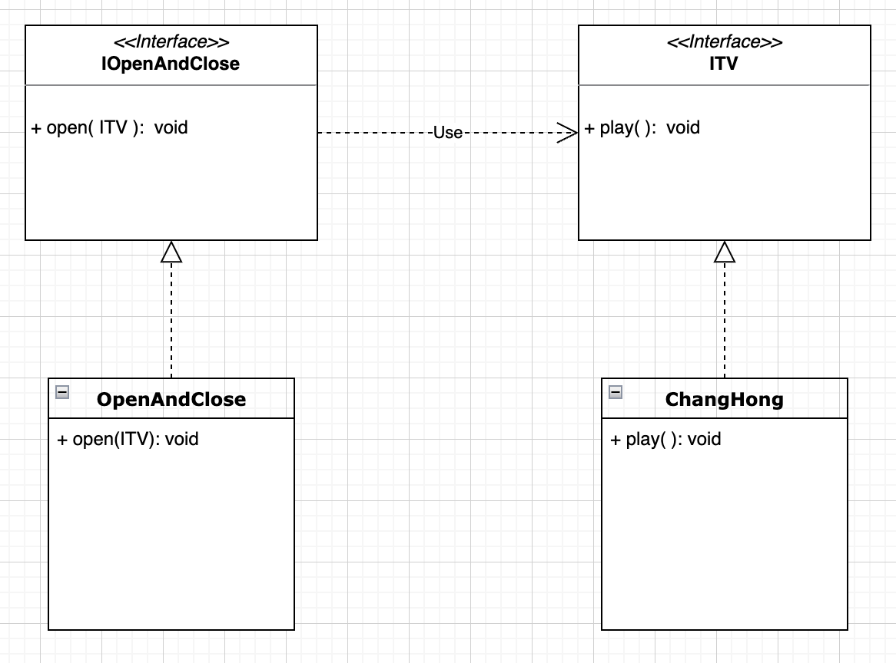


方式二: 构造方法传递

```java
public class DependencyPass {
  
	public static void main(String[] args) {
		// 方式二: 通过构造器进行依赖传递
		ChangHong changHong = new ChangHong();
		OpenAndClose openAndClose = new OpenAndClose(changHong);
		openAndClose.open();
	}
}

// 方式2: 通过构造方法依赖传递 -----------------------------------
// 抽象: 开关的接口, 定义开关的抽象行为 -- 打开一个电视
interface IOpenAndClose {
  public void open(); //抽象方法
}

// 具体: 实现开关接口, 具体定义开关的行为
class OpenAndClose implements IOpenAndClose{
  private ITV tv; // 成员
  public OpenAndClose(ITV tv){ // 构造器
    this.tv = tv;
  }
  public void open(){
    this.tv.play();
  }
}

// 抽象: 电视的接口, 定义电视的抽象行为 -- 播放
interface ITV { 
  public void play();
}

// 具体: 实现电视的接口 --> 长虹电视机, 具体定义TV的行为
class ChangHong implements ITV {
  @Override
  public void play() {
    System.out.println("changhong TV is opened");
  }
}
```

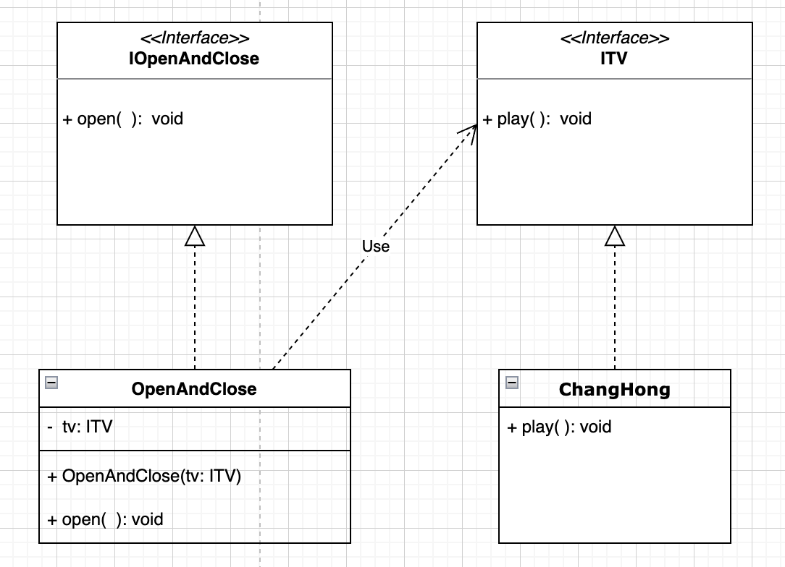


方式三: setter方式传递

```java
public class DependencyPass {

	public static void main(String[] args) {
    
		// 方法三: 通过setter方法进行依赖传递
		ChangHong changHong = new ChangHong();
		OpenAndClose openAndClose = new OpenAndClose();
		openAndClose.setTv(changHong);
		openAndClose.open();
	}
}

// 方式3: 通过setter方法传递 --------------------------------------
// 抽象: 开关的接口, 定义开关的抽象行为 -- 打开一个电视
interface IOpenAndClose {
  public void open(); // 抽象方法

  public void setTv(ITV tv);
}

// 具体: 实现开关接口, 具体定义开关的行为
class OpenAndClose implements IOpenAndClose {
  private ITV tv;

  public void setTv(ITV tv) {
    this.tv = tv;
  }

  public void open() {
    this.tv.play();
  }
}

// 抽象: 电视的接口, 定义电视的抽象行为 -- 播放
interface ITV { 
  public void play();
}

// 具体: 实现电视的接口 --> 长虹电视机, 具体定义TV的行为
class ChangHong implements ITV {
  @Override
  public void play() {
    System.out.println("changhong TV is opened");
  }
}
```

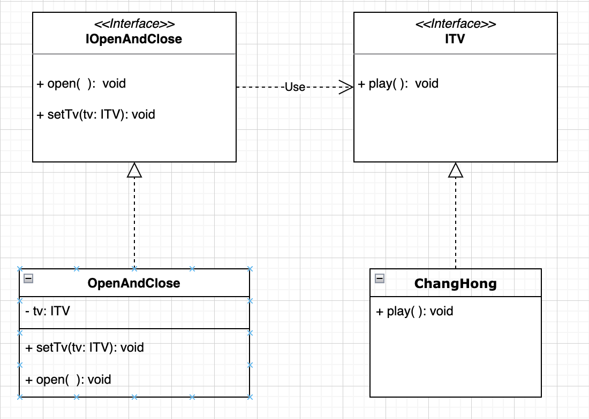


### 2.3.3 总结

依赖倒转原则的注意事项和细节

1. 低层模块尽量都要有抽象类或接口，或者两者都有，程序稳定性更好.
2. 变量的声明类型尽量是抽象类或接口, 这样我们的变量引用和实际对象间，就存在一个缓冲层，利于程序扩展和优化. 

```java
// e.g.
List<Integer> list = new ArrayList<Integer>();
```

3. 继承时遵循里氏替换原则


## 2.4 里氏替换原则 (Liskov Substitution Principle)
14-15

OO中的继承性的思考和说明

1. 继承包含这样一层含义:父类中凡是已经实现好的方法，实际上是在设定规范和契约，虽然它不强制要求所有的子类必须遵循这些契约，但是如果子类对这些已经实现的方法任意修改，就会对整个继承体系造成破坏。
2. 继承在给程序设计带来便利的同时，也带来了弊端。比如使用继承会给程序带来侵入性，程序的可移植性降低，增加对象间的耦合性: 如果一个类被其他的类所继承， 则当这个类需要修改时，必须考虑到所有的子类，并且父类修改后，所有涉及到子类的功能都有可能产生故障
3. 问题提出:在编程中，如何正确的使用继承? => 里氏替换原则

基本介绍

1) 里氏替换原则(Liskov Substitution Principle)在1988年，由麻省理工学院的以为姓里 的女士提出的。
2) 如果对每个类型为T1的对象o1，都有类型为T2的对象o2，使得以T1定义的所有程序 P在所有的对象o1都代换成o2时，程序P的行为没有发生变化，那么类型T2是类型T1 的子类型。**换句话说，所有引用基类的地方*必须能透明地*使用其子类的对象**
3) 在使用继承时，**遵循里氏替换原则，在子类中尽量不要重写父类的方法**. 试想一个子类重写了父类的所有方法, 那子类继承父类就失去了意义
4) 里氏替换原则告诉我们，**继承实际上让两个类耦合性增强了**，**在适当的情况下，可 以通过聚合，组合，依赖 来解决问题**


### Case study

方式一: 继承后重写父类中的方法, 带来潜在隐患

```java
public class Liskov {
    public static void main(String[] args) {
        A a = new A();
        System.out.println("11-3=" + a.func1(11, 3));
        System.out.println("1-8=" + a.func1(1, 8));
        System.out.println("-----------------------");

        B b = new B();
        System.out.println("11-3=" + b.func1(11, 3));       // 这里程序员的本意是想调用父类的求差方法 求11-3, 但程序员无意在子类中重写了那个方法 (或者说, 另一个程序员在调用时, 并不知道类B中重写了其父类中的func1()方法, 因而功能实现错误, 这是由于B类重写其父类的方法破坏了继承体系)
        System.out.println("1-8=" + b.func1(1, 8));
        System.out.println("11+3+9=" + b.func2(11, 3)); }
}

/**
 * A 类
 */
class A {
    // 返回两数的差
    public int func1(int num1, int num2) {
        return num1 - num2;
    }
}

/**
 * B类继承A类
 * 增加了新的功能, 完成两个数相加, 并和9求和
 * 但无意中重写了func1()
 */
class B extends A {
    // 这里重写了A类的方法, 可能是无意识的
    public int func1(int a, int b) {
        return a + b;
    }
    public int func2(int a, int b) {
        return func1(a, b) + 9;
    }
}
```


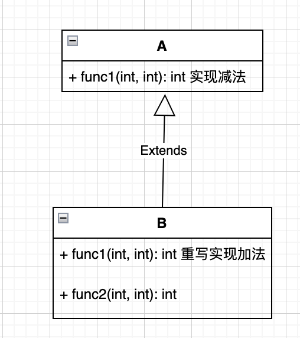


方式二: 利用依赖, 聚合, 组合等关系解耦

解决方法

1. 我们发现原来运行正常的相减功能发生了错误。原因就是类B无意中重写了父类的 方法，造成原有功能出现错误。在实际编程中，我们常常会通过重写父类的方法完 成新的功能，这样写起来虽然简单，但整个继承体系的复用性会比较差。特别是运 行多态比较频繁的时候
2. 通用的做法是:原来的父类和子类都继承一个更通俗的基类，把原有的继承关系去掉，采用依赖，聚合，组合等关系代替, 降低类A与类B之间的耦合性

e.g. 采用组合关系解耦

```java
public class Liskov2 {
    public static void main(String[] args) {
        A a = new A();
        System.out.println("11-3=" + a.func1(11, 3));
        System.out.println("1-8=" + a.func1(1, 8));
        System.out.println("-----------------------");

        // 因为B类不再继承A类, 因此调用者(e.g.另一个程序员)不会去认为func1是求差
        // 调用完成的功能就会很明确, 不会因为耦合而造成错误地调用
        B b = new B();
        System.out.println("11+3=" + b.func1(11, 3));   // 本意是11 + 3
        System.out.println("1+8=" + b.func1(1, 8));
        System.out.println("11+3+9=" + b.func2(11, 3));

        // 使用组合关系, B类仍然可以使用到A类的方法
        System.out.println("11-3="+ b.func3(11, 3));   // 本意是 11 - 3
    }
}

/**
 * 创建更加基础的基类
 */
class Base{
    //  把更加基础的方法和成员写到Base类
}

/**
 * A 类
 */
class A extends  Base{
    // 返回两数的差
    public int func1(int num1, int num2) {
        return num1 - num2;
    }
}

/**
 * B类继承A类
 * 增加了新的功能, 完成两个数相加, 并和9求和
 * 但无意中重写了func1()
 */
class B extends Base {
    // 如果类B需要使用A类的方法, 使用组合关系
    private A a = new A();

    public int func1(int a, int b) {
        return a + b;
    }
    public int func2(int a, int b) {
        return func1(a, b) + 9;
    }

    // 我们仍然想使用类A的方法
    public int func3(int a, int b){
        return this.a.func1(a,b);
    }
}
```


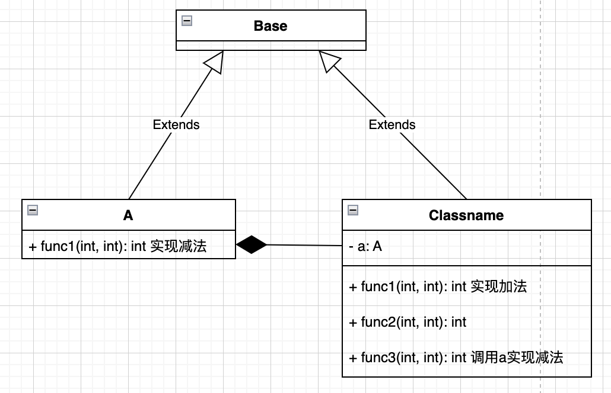


## 2.5 开闭原则 (Open Close Principle)
16-18

基本介绍

1. 开闭原则(Open Closed Principle)是编程中最基础、最重要的设计原则
2. 一个软件实体如类，模块和函数应该对扩展开放(对提供方)，对修改关闭(对使用方)。用抽象构建框架，用实现扩展细节。
3. 当软件需要变化时，尽量通过*<u>**扩展**</u>*软件实体的行为来实现变化，而不是通过<u>***修改***</u>已有的代码来实现变化 (因为修改代码有可能会对耦合到的其他模块造成破坏)
4. 编程中遵循其它原则，以及使用设计模式的目的就是遵循开闭原则. 前面我们讲依赖倒转原则也体现遵循了开闭原则


### Case study

使用画图器画图

方式一 不遵循开闭原则

```java
public class OpenClosed {

    public static void main(String[] args) {
        // 看看问题
        GraphicEditor graphicEditor = new GraphicEditor();
        graphicEditor.drawRectangle(new Rectangle());
        graphicEditor.drawCircle(new Circle());

    }
}

// 使用方
class GraphicEditor {
    // 接收Shape对象, 根据Shape对象的type属性绘制不同的图形
    public void drawShape(Shape s) {
        if (s.m_type == 1)
            drawRectangle(s);
        else if (s.m_type == 2)
            drawCircle(s);
    }

    public void drawRectangle(Shape r) {
        System.out.println("draw rectangle");
    }

    public void drawCircle(Shape r) {
        System.out.println("draw circle");
    }
}

// 基类
class Shape {
    int m_type;
}

class Rectangle extends Shape {
    Rectangle() {
        super.m_type = 1;
    }
}

class Circle extends Shape {
    Circle() {
        super.m_type = 2;
    }
}
```

方式1的优缺点

1) 优点是比较好理解，简单易操作。
2) 缺点是违反了设计模式的ocp原则，即对扩展开放对提供方而言, 提供方可以扩展代码)，对修改关闭(对使用方而言, 即使用方不应关心代码细节, 不应修改使用方的代码). 即当我们给类增加新功能的时候，尽量不修改代码，或者尽可能少修改代码.
3) 比如我们这时要新增加一个图形种类三角形，需要修改的地方较多
   + 需要定义class Triangle extends Shape
   + 同时在使用方 (GraphicEditor)中新定义drawTriangle( ), 在if else中新加branch 


方式二 遵循开闭原则

改进的思路分析

思路: 把创建Shape类做成抽象类，并提供一个抽象的draw方法，让子类去实现即可， 这样我们有新的图形种类时，只需要让新的图形类继承Shape，并实现draw方法即可， 使用方的代码就不需要修改 -> 满足了开闭原则

```java
public class OpenClosed {

    public static void main(String[] args) {
        
        GraphicEditor graphicEditor = new GraphicEditor();
        graphicEditor.drawShape(new Rectangle());
        graphicEditor.drawShape(new Circle());
        graphicEditor.drawShape(new Triangle());
    }
}

// 使用方, 不要修改代码, 只要提供方扩展即可
class GraphicEditor {
    public void drawShape(Shape s){
        s.draw();
    }
}

// 抽象类
abstract class Shape {
    public abstract void draw();
}

// 实现类
class Rectangle extends Shape {
    @Override
    public void draw() {
        System.out.println("draw Rectangle");
    }
}

class Circle extends Shape {
    @Override
    public void draw() {
        System.out.println("draw circle");
    }
}

class Triangle extends Shape{
    @Override
    public void draw() {
        System.out.println("draw triangle");
    }
}
```


## 2.6 迪米特原则 (Demeter Principle)

19-21

基本介绍

1. 一个对象应该对其他对象保持最少的了解
2. 类与类关系越密切，耦合度越大
3. 迪米特法则(Demeter Principle)又叫最少知道(least knowledge)原则，**即一个类对自己依赖的类知道的越少越好**。也就是说，对于被依赖的类不管多么复杂，都尽量将逻辑封装在类的内部。对外除了提供的public 方法，不对外泄露任何信息
4. 迪米特法则还有个更简单的定义: **只与直接的朋友通信**   :question: 为什么这样就使得一个类对自己依赖的类知道的越少
   + 直接的朋友:每个对象都会与其他对象有耦合关系，只要两个对象之间有耦合关系， 我们就说这两个对象之间是朋友关系。耦合的方式很多，依赖，关联，组合，聚合 等。**其中，我们称出现成员变量，方法参数，方法返回值中的类为直接的朋友**，而出现在局部变量中的类不是直接的朋友。也就是说，**陌生的类最好不要以局部变量的形式出现在类的内部。** 因为这样会提升当前类与该陌生类的耦合度

```java
class B {
  
}

class C {
  
}

class A {
  	// 类B的实例作为类A的成员变量  --> 直接朋友
  	private B b;
  	// 类B的实例作为类A的方法参数 --> 直接朋友
  	public void method1(B b){
      ...
    }
  	// 类B的实例作为类A的方法返回值 --> 直接朋友
  	public B method2(){
      B b = new B();
      ...
      return b;
    }
  
  	// 类C的实例进作为局部变量出现在类A的方法中 ---> 不算直接朋友
  	public void method3(){
      C c = new C();	// 此时C对A来说是陌生的类
      ...
    }
}
```


### Case study

有一个学校，下属有各个学院和 总部，现要求打印出学校总部员 工ID和学院员工的id

方式一: 违反Demeter法则

```java
// 客户端
public class Demeter1 {

    public static void main(String[] args) {
        // SchoolManager
        SchoolManager schoolManager = new SchoolManager();
        // 输出学院员工id和学校总部的员工信息
        schoolManager.printAllEmployee(new CollegeManager());

    }

}


// 学院员工
class CollegeEmployee {
    private String id;

    public void setId(String id) {
        this.id = id;
    }

    public String getId() {
        return id;
    }
}


// 学院管理者
class CollegeManager {
    // return all college employee
    public List<CollegeEmployee> getAllEmployee() {
        List<CollegeEmployee> list = new ArrayList<CollegeEmployee>();
        for (int i = 0; i < 10; i++) {  //  这里我们增加了10个员工到list
            CollegeEmployee emp = new CollegeEmployee();
            emp.setId("college employee id = " + i);
            list.add(emp);
        }
        return list;
    }
}


// 学校总部员工
class Employee {
    private String id;

    public void setId(String id) {
        this.id = id;
    }

    public String getId() {
        return id;
    }
}

// 分析SchoolManager类的直接朋友:  Employee, CollegeManager
// CollegeEmployee并不是SchoolManager直接朋友而是陌生类, 这违背了Demeter principle
class SchoolManager {
    // return  学校总部的员工
    public List<Employee> getAllEmployee() {
        List<Employee> list = new ArrayList<Employee>();

        for (int i = 0; i < 5; i++) { // 增加5个学校总部员工
            Employee emp = new Employee();
            emp.setId("学校总部员工id = " + i);
            list.add(emp);
        }
        return list;
    }

    //该方法完成输出学校总部和学院员工信息的方法(id)
    void printAllEmployee(CollegeManager sub) {

        // 分析问题
        //1. 这里的 CollegeEmployee 不是  SchoolManager 的直接朋友
        //2. CollegeEmployee 是以局部变量的形式出现在 SchoolManager 中
        //3. 这违反了Demeter Principle

        // 获取学院员工
        List<CollegeEmployee> list1 = sub.getAllEmployee();
        System.out.println("------------分公司员工------------");
        for (CollegeEmployee e : list1) {
            System.out.println(e.getId());
        }
        // 获取学校总部员工
        List<Employee> list2 = this.getAllEmployee();
        System.out.println("------------学校总部员工------------");
        for (Employee e : list2) {
            System.out.println(e.getId());
        }
    }
}
```


方式二: 遵守Demeter法则

```java
// 客户端
public class Demeter1 {

    public static void main(String[] args) {
        // SchoolManager
        SchoolManager schoolManager = new SchoolManager();
        // 输出学院员工id和学校总部的员工信息
        schoolManager.printAllEmployee(new CollegeManager());
    }
}


// 学校总部员工
class Employee {
    private String id;

    public void setId(String id) {
        this.id = id;
    }

    public String getId() {
        return id;
    }
}

// 学院员工
class CollegeEmployee {
    private String id;

    public void setId(String id) {
        this.id = id;
    }

    public String getId() {
        return id;
    }
}

// 学院管理者
class CollegeManager {
    // return all college employee
    public List<CollegeEmployee> getAllEmployee() {
        List<CollegeEmployee> list = new ArrayList<CollegeEmployee>();
        for (int i = 0; i < 10; i++) {  //  这里我们增加了10个员工到list
            CollegeEmployee emp = new CollegeEmployee();
            emp.setId("college employee id = " + i);
            list.add(emp);
        }
        return list;
    }

    // 输出学院员工的信息
   public void printCollegeEmployee(){
       List<CollegeEmployee> list1 = this.getAllEmployee();
       System.out.println("------------分公司员工------------");
       for (CollegeEmployee e : list1) {
           System.out.println(e.getId());
       }
   }
}

// 分析SchoolManager类的直接朋友:  Employee, CollegeManager
class SchoolManager {
    // return  学校总部的员工
    public List<Employee> getAllEmployee() {
        List<Employee> list = new ArrayList<Employee>();

        for (int i = 0; i < 5; i++) { // 增加5个学校总部员工
            Employee emp = new Employee();
            emp.setId("学校总部员工id = " + i);
            list.add(emp);
        }
        return list;
    }

    //该方法完成输出学校总部和学院员工信息的方法(id)
    void printAllEmployee(CollegeManager sub) {

        // 分析问题
        //1. 将输出学院员工的方法, 封装到CollegeManager中

        // 获取学院员工
        sub.printCollegeEmployee();

        // 获取学校总部员工
        List<Employee> list2 = this.getAllEmployee();
        System.out.println("------------学校总部员工------------");
        for (Employee e : list2) {
            System.out.println(e.getId());
        }
    }
}
```


迪米特法则注意事项和细节

+ 迪米特法则的核心是降低类之间的耦合, 并不是完全消除耦合

+ 但是注意:由于每个类都减少了不必要的依赖，因此迪米特法则只是要求降低 类间(对象间)耦合关系， 并不是要求完全没有依赖关系


## 2.7 合成复用原则 (Composite Reuse Principle)
22

原则是尽量使用合成/聚合的方式，而不是使用继承 

如果想让B类能够复用A类的方法, 有哪些方案? 其实就是我们在依赖倒转原则那里讲的3种依赖传递的方式

+ B extends A, 但增加了耦合性
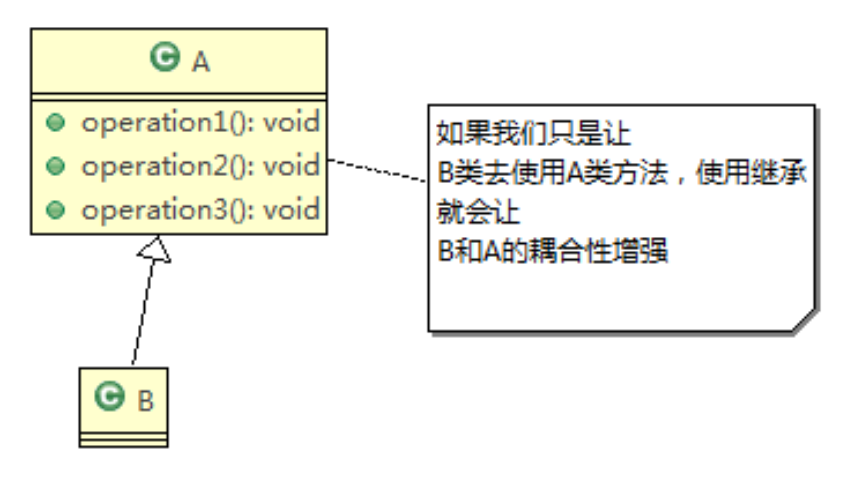
+ B 依赖 A
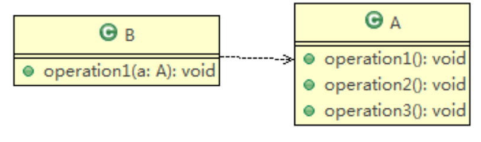
+ B 聚合 A
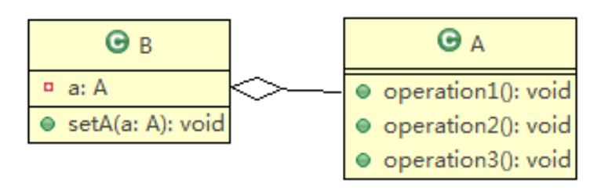
+ B 组合 A 
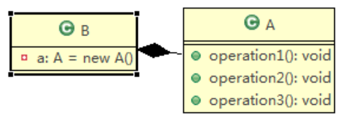


