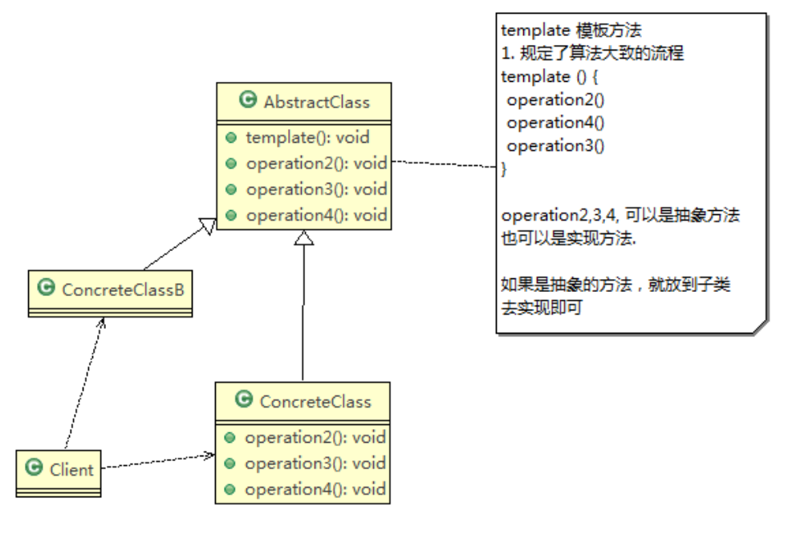

行为型模式: 类或对象如何交互, 如何划分职责, 从而更好地完成任务


# 1. :moon: 模版方法模式 (Template Method)
96-100 GRASP: polymorphism

UniMelb week 10 https://refactoring.guru/design-patterns/template-method


:bangbang: 大体的流程骨架固定, 但是具体某个步骤要求有不同的实现 

+ e.g. binary tree的递归套路


编写制作豆浆的程序，说明如下:

1) 制作豆浆的流程 选材--->添加配料--->浸泡--->放到豆浆机打碎
2) 通过添加不同的配料，可以制作出不同口味的豆浆
3) 选材、浸泡和放到豆浆机打碎这几个步骤对于制作每种口味的豆浆都是一样的
4) 请使用 模板方法模式 完成 (说明:  因为模板方法模式，比较简单，很容易就 想到这个方案，因此就直接使用，不再使用传统的方案来引出模板方法模式 )


基本介绍

1. 模板方法模式(Template Method Pattern)，又叫模板模式(Template Pattern)，在一个抽象类公开定义了执行它的方法的模板。它的子类可以按需要重写方法实现，但调用将以抽象类中定义的方式进行。 这种类型的设计模式属于行为型模式。
2. 简单说，**<u>模板方法模式 定义一个操作中的算法的骨架，而将一些步骤延迟到子类中，使得子类可以不改变一个算法的结构，就可以重定义该算法的某些特定步骤</u>**




对原理类图的说明-即(模板方法模式的角色及职责)

1) AbstractClass 抽象类， 类中实现了模板方法(template)，**规定了算法的骨架**，具体子类需要去实现 其它的抽象方法operation 2,3,4
   + 再次体现面向接口, 面向抽象编程

2) ConcreteClass 实现抽象方法operationr2,3,4, 以完成算法中特点子类的步骤


## 代码实现

制作豆浆的流程 选材--->添加配料--->浸泡--->放到豆浆机打碎

+ 通过添加不同的配料，可以制作出不同口味的豆浆
+ 选材、浸泡和放到豆浆机打碎这几个步骤对于制作每种口味的豆浆都是一样的(红豆、花生豆浆...)


```java
public abstract class SoyaMilk {

    // 模板方法, 一般做成final, 不让子类去override
    final void make(){
        select();
        addCondiments();		// 行为可变
        soak();
        beat();
    }

    // select materials
    void select(){
        System.out.println("step1: select freshing soy");
    }

    // 添加配料
    abstract void addCondiments();

    // 浸泡
    void soak(){
        System.out.println("第三部, 黄豆和配料开始浸泡, needing 3 hours");
    }

    //
    void beat(){
        System.out.println("第四步, 黄豆和配料放到豆浆机去打碎");
    }
}

```

```java
public class RedBeanSoyMilk extends SoyaMilk{
    @Override
    void addCondiments() {
        System.out.println("加入上好的红豆");
    }
}

public class PeanutSoyMilk extends  SoyaMilk{
    @Override
    void addCondiments() {
        System.out.println("加入上好的花生");
    }
}
```

```java
public class Client {
    public static void main(String[] args) {
        // 制作红豆豆浆
        System.out.println("制作红豆豆浆");
        SoyaMilk redBeanSoyMilk = new RedBeanSoyMilk();
        redBeanSoyMilk.make();

        System.out.println("制作花生豆浆");
        SoyaMilk peanutSoyMilk = new PeanutSoyMilk();
        peanutSoyMilk.make();
    }
}
```


## 模板方法模式的钩子方法

98

1) 在模板方法模式的父类中，我们可以定义一个方法，它默认不做任何事，子类可以 视情况要不要覆盖它，该方法称为“钩子”。
2) 还是用上面做豆浆的例子来讲解，比如，我们还希望制作纯豆浆，不添加任何的配 料，请使用钩子方法对前面的模板方法进行改造


Template

+ 定义一个钩子方法, 决定模版中某个方法是否被执行

````java
public abstract class SoyaMilk {

    // 模板方法, 一般做成final, 不让子类去override
    final void make(){
        select();
        if (customerWantCondiments()) {
            addCondiments();
        }
        soak();
        beat();
    }

    // select materials
    void select(){
        System.out.println("step1: select freshing soy");
    }

    // 添加配料
    abstract void addCondiments();

    // 浸泡
    void soak(){
        System.out.println("第三部, 黄豆和配料开始浸泡, needing 3 hours");
    }

    //
    void beat(){
        System.out.println("第四步, 黄豆和配料放到豆浆机去打碎");
    }

    // 钩子方法: 决定是否需要添加配料
    boolean customerWantCondiments(){
        return true;
    };
}

````

```java
public class PureSoyMilk extends SoyaMilk {

    @Override
    void addCondiments() {

    }

    @Override
    boolean customerWantCondiments() {
        return false;
    }
}
```

```java
public class Client {
    public static void main(String[] args) {
        // 制作红豆豆浆
        System.out.println("制作红豆豆浆");
        SoyaMilk redBeanSoyMilk = new RedBeanSoyMilk();
        redBeanSoyMilk.make();

        System.out.println("制作花生豆浆");
        SoyaMilk peanutSoyMilk = new PeanutSoyMilk();
        peanutSoyMilk.make();

        System.out.println("制作纯豆浆");
        SoyaMilk pureSoyMilk = new PureSoyMilk();
        pureSoyMilk.make();
    }
}
```


## IOC 源码

99

有时间再看


# 2. :bangbang: 命令模式 (Command)
101-105 GRASP: Indirection + polymorphism

看一个需求

1. 我们买了一套智能家电，有照明灯、风扇、冰箱、洗衣机，我们只要在手机上安装app就 可以控制对这些家电工作。
2. 但这些智能家电来自不同的厂家，我们不想针对每一种家电都安装一个App，分别控制，我 们希望只要一个app就可以控制全部智能家电. 要实现一个app控制所有智能家电的需要，则每个智能家电厂家都要提供一个统一的接口 给app调用，这时 就可以考虑使用命令模式。
3. 命令模式可将“动作的请求者”从“动作的执行者”对象中解耦出来. 在我们的例子中，动作的请求者是手机app，动作的执行者是每个厂商的一个家电产品


基本介绍

1. 命令模式(Command Pattern):在软件设计中，我们经常需要向某些对象发送请求，但是并不知道请求的接收者是谁，也不知 道被请求的操作是哪个， 我们只需在程序运行时指定具体的请求接收者即可，此时，可以 使用命令模式来进行设计
2. 命名模式使得请求发送者与请求接收者消除彼此之间的耦合，让 对象之间的调用关系更加灵活，实现解耦。
3. ***<u>在命名模式中，会将一个请求封装为一个对象，以便使用不同参 数来表示不同的请求</u>***(即命名)，同时命令模式也支持可撤销的操作。
4. 通俗易懂的理解:将军发布命令，士兵去执行。其中有几个角色: 将军(命令发布者)、士兵(命令的具体执行者)、命令(连接将 军和士兵)。 Invoker是调用者(将军)，Receiver是被调用者(士兵)， MyCommand是命令，实现了Command接口，持有接收对象


原理图


1. Invoker 是调用者角色
2. Command: 是命令角色，需要执行的所有命令都在这里，可以是接口或抽象类
3. Receiver: 接受者角色，知道如何实施和执行一个请求相关的操作
4. ConcreteCommand: 将一个Receiver对象与一个action绑定，调用Receiver相应的操作，实现execute


## Demo: 遥控器

101-103

看到这里


## JDBC Tml源码分析

104


# 3. 访问者模式 (Visitor)
106-110


# 4. :moon: 迭代器模式 (Iterator)
111-116 GRASP: polymorphism + indirection

https://refactoring.guru/design-patterns/iterator

**Iterator** is a behavioral design pattern that lets you traverse elements of a collection without exposing its underlying representation (list, stack, tree, etc.). The main idea of the Iterator pattern is to extract the traversal behavior of a collection into a separate object called an *iterator*,  <u>so that the **data** and **traverse strategy** can be decoupled</u>, providing a simple and single interface for traversing various forms of data structure.

+ 结构特点: 双重polymorphism, one for data, one for iterator that is used to traverse data


基本介绍

+ 迭代器模式(Iterator Pattern)是常用的设计模式，属于行为型模式

+ 如果我们的集合元素是用不同的方式实现的，有数组，还有java的集合类，或者还有其他方式，当客户端要遍历这些集合元素的时候就要使用多种遍历方式，而且还会暴露元素的内部结构，可以考虑使用迭代器模式解决。

+ 迭代器模式，<u>提供一种遍历集合元素的统一接口</u>，用<u>一致的方法遍历集合元素</u>， 不需要知道集合对象的底层表示，即:不暴露其内部的结构。
  + Java 原生的collection的有内部类实现了Iterator interface, 可以通过itetator来统一遍历.

  + 主要实现两个方法:
    + `hasNext()`: 判断下个位置是否valid
    + `next()`: get the element sitting on current index


## 代码demo

114

Data:

+ College (学院)
+ Department (学院下属的系)

```java
public interface College {
    String getName();

    // 增加系的方法
    void addDepartment(String name, String desc);

    Iterator createIterator();
}

public class ComputerCollege implements College{

    Department[] departments;
    int numOfDepartment = 0; // 保存当前数组的对象个数

    public ComputerCollege() {
        this.departments = new Department[5];
        addDepartment("Java", "Java prof");
        addDepartment("Php", "Php prof");
        addDepartment("Javascript", "Js prof");
        addDepartment("Python", "Python prof");
    }

    @Override
    public String getName() {
        return "computer college";
    }

    @Override
    public void addDepartment(String name, String desc) {
        Department department = new Department(name, desc);
        departments[numOfDepartment] = department;
        numOfDepartment++;
    }

    @Override
    public Iterator createIterator() {
        return new ComputerCollegeIterator(departments);
    }
}

public class InfoCollege implements College{

    List<Department> departmentList;

    public InfoCollege(){
        departmentList = new ArrayList<>();
        addDepartment("info security", "info security prof");
        addDepartment("web security", "web security prof");
        addDepartment("server security", "server security prof");
    }

    @Override
    public String getName() {
        return "Info college";
    }

    @Override
    public void addDepartment(String name, String desc) {
        Department department = new Department(name, desc);
        departmentList.add(department);
    }

    @Override
    public Iterator createIterator() {
        return new InfoCollegeIterator(departmentList);
    }
}
```


```java
public class Department {

    private String name;
    private String desc;

    public Department(String name, String desc) {
        this.name = name;
        this.desc = desc;
    }

    public String getName() {

        return name;
    }

    public void setName(String name) {
        this.name = name;
    }

    public String getDesc() {
        return desc;
    }

    public void setDesc(String desc) {
        this.desc = desc;
    }
}
```


+ Iterator used to traverse data

```java
public class ComputerCollegeIterator implements Iterator {
    // 这里我们需要department是以怎样的方式存放

    Department[] departments;
    int position = 0;   // 遍历的位置

    public ComputerCollegeIterator(Department[] departments) {
        this.departments = departments;
    }

    @Override
    public boolean hasNext() {
        if (position >= departments.length || departments[position] == null) {
            return false;
        } else {
            return true;
        }
    }

    @Override
    public Object next() {
        Department department = departments[position];
        position += 1;
        return department;
    }

    // 暂时不需要, 空实现
    @Override
    public void remove() {

    }

    @Override
    public void forEachRemaining(Consumer action) {
        Iterator.super.forEachRemaining(action);
    }
}

public class InfoCollegeIterator implements Iterator {

    List<Department> departmentList;        // 信工学院以List方式存放department
    int index = -1;

    public InfoCollegeIterator(List<Department> departmentList) {
        this.departmentList = departmentList;
    }

    @Override
    public boolean hasNext() {

        if (index >= departmentList.size() -1 ){
            return false;
        } else {
            index += 1;
            return true;
        }
    }

    @Override
    public Object next() {
        return departmentList.get(index);
    }

    // 暂时不需要remove(), 空实现
    @Override
    public void remove(){

    }
}
```

Indirection

```java
public class OutputImp {
    // 学院的集合
    List<College> collegeList;

    public OutputImp(List<College> collegeList) {
        this.collegeList = collegeList;
    }

    // 遍历所有的学院, 然后输出各个学院的系
    public void printCollege(){
        Iterator<College> iterator = collegeList.iterator();
        while(iterator.hasNext()){
            College college = iterator.next();
            System.out.println("===" + college.getName() + "===");
            printDepartment(college.createIterator());
        }
    }

    // 输出学院的系
    public void printDepartment(Iterator iterator){
        while(iterator.hasNext()){
            Department d = (Department) iterator.next();
            System.out.println(d.getName());
        }
    }
}
```


Client

+ use indirection to traverse over various forms of data structure via a single interface

```java
public class Client {
    public static void main(String[] args) {
        List<College> collegeList = new ArrayList<>();

        ComputerCollege computerCollege = new ComputerCollege();
        InfoCollege infoCollege = new InfoCollege();

        collegeList.add(computerCollege);
        collegeList.add(infoCollege);

        OutputImp outputImp = new OutputImp(collegeList);
        outputImp.printCollege();

    }
}
```


## JDK源码ArrayList赏析

115


- 内部类Itr 充当具体实现迭代器Iterator 的类， 作为ArrayList 内部类
- List 就是充当了聚合接口，含有一个iterator() 方法，返回一个迭代器对象
- ArrayList 是实现聚合接口List 的子类，实现了iterator()
- Iterator 接口系统提供
- 迭代器模式解决了 不同集合(ArrayList ,LinkedList) 统一遍历问题


使用细节 116

优点

+ 提供一个统一的方法遍历对象，客户不用再考虑集合的类型，使用一种方法就可以遍历对象了。

+ 隐藏了集合的内部结构，客户端要遍历集合的时候只能取到迭代器，而不会知道集合的具体组成。

+ 体现单一责任原则/GRASP: high cohesion. 在集合类中，我们把迭代器分开，就是要把管理对象集合和遍历对象集 合的责任分开，这样一来集合改变的话，只影响到集合对象。而如果遍历方式改变 的话，只影响到了迭代器。

+ 当要展示一组相似对象，或者遍历一组相同对象时使用, 适合使用迭代器模式

Cons:

+ 每个聚合对象都要一个迭代器，会生成多个迭代器不好管理类


# 5. :moon: 观察者模式 (Observer)
117-122

UniMelb week 10 https://refactoring.guru/design-patterns/observer

:gem: UniMelb distributed system A2: distributed whiteboard 


:bangbang: 分为两个要素: 

+ subject (publisher):
  + 登记一系列observers  
  + 当自己的状态改变时, notifyAllObservers(type: String), 
    + type 是为了传入是什么事件(状态变化)
    + 里面遍历所有的registered observers, 并调用他们对应的response方法 update()
+ observer(subscriber): 
  + update(type: String) 必须定义如何response来自于subject的状态变化的行为 (e.g. 发送email, 写下log... )


天气预报项目需求,具体要求如下:

1) 气象站可以将每天测量到的温度，湿度，气压等等以公告的形式发布出去(比如 发布到自己的网站或第三方)。
2) 需要设计开放型API，便于其他第三方也能接入气象站获取数据。
3) 提供温度、气压和湿度的接口
4) 测量数据更新时，*<u>要能实时的通知给第三方</u>*
   + 这个和DS A2 的实时更新画板上别人的画岂不是很吻合?


普通方案

通过对气象站项目的分析，我们可以初步设计出一个WeatherData类

```java
class Weather{
  getTemp()
  getHumidity()
  getPressure()
  dataChange()
}
```

说明:

1) 通过getXxx方法，可以让第三方接入，并得到相关信息.
2) 当数据有更新时，气象站通过调用dataChange() 去更新数据，当第三方再次获取时，就能得到最新数据，当然也可以推送。


```java
//  想象这个类为气象站自己的网站
public class CurrentConditions {
    private float temperature;
    private float pressure;
    private float humidity;

    // update()是由WeatherData来调用的, 我们这里使用的是推送模式
    public void update(float temperature,float pressure,float humidity){
        this.temperature=temperature;
        this.pressure=pressure;
        this.humidity=humidity;
        display();
    }


    public void display(){
        System.out.println("***Today mTemperature: "+temperature+"***");
        System.out.println("***Today mPressure: "+pressure+"***");
        System.out.println("***Today mHumidity: "+humidity+"***");
    }
}

// ------------------------
// 核心类,
// * 1. 包含最新的天气信息
// * 2. 含有CurrentConditions对象作为成员变量
// * 3. 当数据有更新时, 就主动调用currentConditions对象的update方法 (含display) 相当于向currentConditions对象推送更新的天气信息
public class WeatherData {
    private float temperatrue;
    private float pressure;
    private float humidity;
    private CurrentConditions currentConditions;        //

    public WeatherData(CurrentConditions currentConditions) { this.currentConditions = currentConditions; }
    public float getTemperature() { return temperatrue; }
    public float getPressure() { return pressure; }
    public float getHumidity() {
        return humidity;
    }
    public void dataChange() {
        currentConditions.update(getTemperature(), getPressure(), getHumidity());
    }

    //当数据有更新的时候, 就调用setData
    public void setData(float temperature, float pressure, float humidity) {
        this.temperatrue = temperature;
        this.pressure = pressure;
        this.humidity = humidity;

        // 将刚刚更新好的天气信息推送给接入方
        dataChange();
    }
}

// --------------------------
public class Client {
    public static void main(String[] args) {
        // 创建接入方
        CurrentConditions currentConditions = new CurrentConditions();

        // 创建WeatherData, 并将接入方currentCondtions传递到WeatherData中
        WeatherData weatherData = new WeatherData(currentConditions);

        // 更新天气信息
        weatherData.setData(30,150,40);

        // 天气情况变了
        System.out.println("weather changed: ");
        weatherData.setData(40,160,20);
    }
}
```


普通方案的分析:

1) 其他第三方接入气象站获取数据的问题

2) 无法在运行时动态的添加第三方 (新浪网站) 

   ```java
   public class WeatherData {
       private float temperatrue;
       private float pressure;
       private float humidity;
       private CurrentConditions currentConditions;        //
       private SinLangWeb sinLangWeb;  // 需要hard code来加入第三方, 违反OCP原则
     	
     	public dataChange(){
         currentConditions.update(getTemperature(), getPressure(), getHumidity());
         sinLangWeb.update(getTemperature(), getPressure(), getHumidity());  // 还得手动添加
       }
     ...
   }
   ```

   + 违反ocp原则=>观察者模式


## 观察者模式原理


观察者模式类似订牛奶业务 

1. 奶站/气象局:Subject

2) 用户/第三方网站:Observer


Subject:登记注册、移除和通知

1. registerObserver 注册
2. removeObserver 移除
3. notifyObservers() 通知所有的注册的用户，根据不同需求，可以是更新数据，让用户来取，也可能是实施推送，看具体需求定

观察者模式: 对象之间多对一依赖的一种设计方案，被依赖的对象为`Subject`， 依赖的对象为`Observer`，Subject通知Observer变化,比如这里的奶站是 Subject，是1的一方。用户时Observer，是多的一方


## 代码实现


观察者模式的好处

1) 观察者模式设计后，会以集合的方式来管理用户(Observer)，包括注册，移除 和通知。
2) 这样，我们增加观察者(这里可以理解成一个新的公告板)，就不需要去修改核 心类WeatherData不会修改代码，遵守了ocp原则。


:gem: code

Subject接口及其实现类

```java
public interface Subject {
    void registerObserver(Observer o);
    void removeObserver(Observer o);

    void notifyAllObserver();

}

// 被观察者
public class WeatherData implements Subject{
    private float temperature;
    private float pressure;
    private float humidity;
    private ArrayList<Observer> observerList;

    public WeatherData() {
        observerList = new ArrayList<Observer>();
    }
    public float getTemperature() { return temperature; }
    public float getPressure() { return pressure; }
    public float getHumidity() {
        return humidity;
    }

    public void dataChange() {
        notifyAllObserver();
    }

    //当数据有更新的时候, 就调用setData
    public void setData(float temperature, float pressure, float humidity) {
        this.temperature = temperature;
        this.pressure = pressure;
        this.humidity = humidity;

        // 将刚刚更新好的天气信息推送给registered observer
        dataChange();
    }

    @Override
    public void registerObserver(Observer o) {
        observerList.add(o);
    }

    @Override
    public void removeObserver(Observer o) {
        if(observerList.contains(o)){
            observerList.remove(o);
        }
    }

    // 遍历所有的观察者, 并通知
    @Override
    public void notifyAllObserver() {
        for(int i = 0; i < observerList.size(); i++){
            observerList.get(i).update(temperature, pressure, humidity );       // 包含observer的display()
        }
    }
}
```


Observer接口及其实现类

```java
public interface Observer {
    void update(float temperature, float pressure, float humidity);
}

public class CurrentCondition implements Observer{
    private float temperature;
    private float pressure;
    private float humidity;

    @Override
    // update()是由WeatherData来调用的, 我们这里使用的是推送模式
    public void update(float temperature,float pressure,float humidity){
        this.temperature=temperature;
        this.pressure=pressure;
        this.humidity=humidity;
        display();
    }

    public void display(){
        System.out.println("***Today mTemperature: "+temperature+"***");
        System.out.println("***Today mPressure: "+pressure+"***");
        System.out.println("***Today mHumidity: "+humidity+"***");
    }
}

public class Baidu implements Observer{
    private float temperature;
    private float pressure;
    private float humidity;

    @Override
    // update()是由WeatherData来调用的, 我们这里使用的是推送模式
    public void update(float temperature,float pressure,float humidity){
        this.temperature=temperature;
        this.pressure=pressure;
        this.humidity=humidity;
        display();
    }

    public void display(){
        System.out.println("***百度气温: "+temperature+"***");
        System.out.println("***百度气压: "+pressure+"***");
        System.out.println("***百度湿度: "+humidity+"***");
    }
}
```

Client

```java
public class Client {
    public static void main(String[] args) {
        // 创建一个WeatherData
        WeatherData weatherData = new WeatherData();

        // 观察者
        CurrentCondition currentCondition = new CurrentCondition();

        // 注册观察者到weatherData
        weatherData.registerObserver(currentCondition);
        weatherData.registerObserver(new Baidu());

        // test1
        System.out.println("notify all observes: ");
        weatherData.setData(10, 100, 30.3f);

        // test2
        System.out.println("notify all observes: ");
        weatherData.removeObserver(currentCondition);
        weatherData.setData(20,150, 33.3f);

    }

}
```


## Observable 源码


# 6. 中介者模式 (Mediator)
123-126 


# 7. 备忘录模式 (Memento)
127-130

 https://refactoring.guru/design-patterns/memento

主打一个(部分)克隆然后异地存储


总结:

1. 给用户提供了一种可以恢复状态的机制，可以使用户能够比较方便地回到某个历史 的状态

2. 实现了信息的封装，使得用户不需要关心状态的保存细节

3. 如果类的成员变量过多，势必会占用比较大的资源，而且每一次保存都会消耗一定

   的内存, 这个需要注意

4. 适用的应用场景: 后悔药, 打游戏时的存档, Windows 里的 ctri + z, IE 中的后退, 数据库的事务管理

5. 为了节约内存，备忘录模式可以和原型模式配合使用


游戏角色状态恢复问题

游戏角色有攻击力和防御力，在大战Boss前保存自身的状态(攻击力和防御力)，当大 战Boss后攻击力和防御力下降，从备忘录对象恢复到大战前的状态

传统方案: 

+ 每个角色都copy一个备份, 保存大战boss之前的状态, 结束后再恢复到大战前

传统的方式的问题分析

1) 一个对象，就对应一个保存对象状态的对象， 这样当我们游戏的对象很多时，不利于管理，开销也很大.
2) 传统的方式是简单地做备份，new出另外一个对象出来，再把需要备份的数据放到 这个新对象，但这就暴露了对象内部的细节
3) 解决方案 =>备忘录模式


## 基本介绍

p128

1. 备忘录模式(Memento Pattern)在<span style="color: red">不破坏封装性的前提下，捕获一个对象的内部状态 (所以在需要被记录状态的对象内部来生成Memento instance)</span>，并在该<span style="color: red">对象之外 (即Caretaker)</span>保存这个状态。这样以后就可将该对象恢复到原先保存的状态
2. 可以这里理解备忘录模式: 现实生活中的备忘录是用来记录某些要去做的事情，或者是记录已经达成的共同意见的事情，以防忘记了。而在软件层面，备忘录 模式有着相同的含义，<u>备忘录对象主要用来记录一个对象的某种状态，或者某 些数据，当要做回退时，可以从备忘录对象里获取原来的数据进行恢复操作</u>
3. 备忘录模式属于行为型模式


## Demo1


1. Originator: 对象(需要保存状态的对象)
2. Memento: 备忘对象, 承载对象(Originator)内部需要保存的信息
3. Caretaker: 守护者对象, 负责保存多个备忘录对象, 使用集合管理提高效率
4. 说明: 如果希望保存多个originator对象的不同时间的状态, 也可, 只需要用HashMap<String, List<Memento>> 


为简单起见, demo中用String代表Originator的一个状态, 其实状态的表达也可很复杂 

```java
public class Client {
    public static void main(String[] args) {
        Originator originator = new Originator();       // used to generate a Memento instance, represent player's current state
        Caretaker caretaker = new Caretaker();          // used to store Memento instances

        // generate Memento instance
        originator.setState("state 1: attack point 100");
        caretaker.add(originator.saveStateMemento());

        // fighting boss
        originator.setState("state 2: attack point 80");
        caretaker.add(originator.saveStateMemento());

        // killed boss
        originator.setState("state 3: attack point 50");
        caretaker.add(originator.saveStateMemento());

        // now we hope to rollback to state 1
        System.out.println("current state is: " + originator.getState());       // state 3: attack point 50
        originator.getStateFromMemento(caretaker.get(0));
        System.out.println("now state is: " + originator.getState());       // state 1
    }
}
```

```java

public class Originator {
    private String state;       // state info

    // method that could keep state object Memento
  	// 为了不破坏封装性, 所以在自己内部生成一个Memento instance
    public Memento saveStateMemento(){
        return new Memento(state);
    }

    // use Memento instance to restore state
    public void getStateFromMemento(Memento memento){
        state = memento.getState();
    }

    public String getState() {
        return state;
    }

    public void setState(String state) {
        this.state = state;
    }
}

public class Memento {
    private String state;

    public Memento(String state) {
        this.state = state;
    }

    public String getState() {
        return state;
    }
}

public class Caretaker {
    private List<Memento> mementoList = new ArrayList<>();

    public void add(Memento memento) {
        mementoList.add(memento);
    }

    // 从list中get到第index个Memento intance
    public Memento get(int index){
        return mementoList.get(index);
    }
}
```


## Demo2

游戏角色恢复状态实例

应用实例要求 游戏角色有攻击力和防御力，在大战Boss前保存自身的状态(攻击力和防御力)，当大战 Boss后攻击力和防御力下降，从备忘录对象恢复到大战前的状态


代码和前面的类似, 略


# 8. 解释器模式 (Interpreter)
131-135

# 9. :bangbang: 状态模式 (State)
136-139

https://refactoring.guru/design-patterns/state

不知道redux是否也是利用类似的思想

类图里也是一个常用的套路, 一个context类里聚合了抽象类/接口的实现类, 依靠套娃来实现更多功能. 让context类的行为可以根据state的不同, 而动态地变化, 尤其在面对复杂的状态行为逻辑时, 使用状态模式可以提高可读性, 可维护性


基本介绍

1) 状态模式(State Pattern):它主要用来解决对象在多种状态转换时，需要对外 输出不同的行为的问题。状态和行为是一一对应的，状态之间可以相互转换
2) 当一个对象的内在状态改变时，允许改变其行为，这个对象看起来像是改变了其类 (e.g. 通过聚合别的抽象类/接口的实现类来实现)


原理图


对原理类图的说明-即（状态模式的角色及职责）

1) Context 类为环境角色，用于维护State实例，这个实例定义当前状态
2) state是抽象状态角色，定义一个接口封装与Context 的一个特点接口相关行为
3) ConcreteState 具体的状态角色，每个子类实现一个与Context 的一个状态相关行为


## Demo1`: 抽奖

不同的状态实现类具有不同的实现行为


可见, 想要获得某个class的行为, 最好的方法是把它聚合进来(套娃), 对外暴露的是统一的接口

```java
public class ClientTest {
    public static void main(String[] args) {
        RaffleActivity activity = new RaffleActivity(1);

        for (int i = 0; i< 30; i++){
            System.out.println("---------------第" + (i+1)+ "次抽奖------------------");

            // 参加抽奖, 第一次先扣积分
            activity.deductMoney();
            // 第二部抽奖
            activity.raffle();

            System.out.println("剩余奖品数: " + activity.getCount());
        }
    }
}
```

state管理类

+ State pattern的精髓所在, 即是套娃, 将包含有不同行为的state实现类聚合到state的管理类中, 然后用一个指针来指向当前的状态, 这个state管理类对外只暴露统一的接口

```java
public class RaffleActivity {
    State state = null;     // pointer indicating the current state
    int count = 0;          // 表示当前奖品的数量

    // 以下4个属性, 代表4种状态
    State noRaffleState = new NoRaffleState(this);
    State canRaffleState = new CanRaffleState(this);
    State dispenseState = new DispenseState(this);
    State dispenseOutState = new DispenseOutState(this);

    public RaffleActivity(int count ) {
        this.state = getNoRaffleState();
        this.count = count;
    }

    // activity作为包在state外的类, 同一化行为
    public void deductMoney(){
        state.deductMoney();
    }

    // 抽奖
    public void raffle(){
        if(state.raffle()){
            //领取奖品
            state.dispensePrize();;
        }
    }

	// 各种 getter, setter

}
```

state相关类

```java
public abstract class State {
    // 行为1： 扣除积分
    public abstract  void deductMoney();

    // 行为2: 是否抽中奖品
    public abstract boolean raffle();

    // 行为3: 发放奖品
    public abstract void dispensePrize();
}

// 这里只展示一个state 实现类
public class DispenseState extends State{
    RaffleActivity activity;

    public DispenseState(RaffleActivity activity) {
        this.activity = activity;
    }


    @Override
    public void deductMoney() {
        System.out.println("不能扣除积分");
    }

    @Override
    public boolean raffle() {
        System.out.println("不能抽奖");
        return false;
    }

    @Override
    public void dispensePrize() {
        if(activity.getCount() > 0){
            System.out.println("恭喜中奖了! 扣除1个奖品库存");
            activity.setCount(activity.getCount()-1);
            // 改变状态为不能抽奖
            activity.setState(activity.getNoRaffleState());
        } else {
            System.out.println("恭喜中奖, 但奖品库存现在为0, 很遗憾, 奖品发放完了");
            // 改变状态为奖品发送完毕, 后面activity声明周期结束
            activity.setState(activity.getDispenseOutState());
        }

    }
}
```


## Demo2: 借贷平台

p138

借贷平台的订单，有审核-发布-抢单等等步骤，随着操作的不同，会改变订单的 状态, 项目中的这个模块实现就会使用到状态模式

通常通过if/else判断订单的状态，从而实现不同的逻辑，伪代码如下

```java
if(审核){ 
  //审核逻辑
}elseif(发布){ 
  //发布逻辑 }
elseif(接单){ 
    //接单逻辑
}
```

问题分析 : 这类代码难以应对变化，在添加一种状态时，我们需要手动添加if/else，在添加一种功能时，要对所有的状态进行判断。因此代码会变得越来越臃肿，并且一旦没有处理某个状态， 便会发生极其严重的BUG，难以维护

需求对应的state machine diagram:


使用状态模式完成 借贷平台项目的审核模块:

+ 结合利用adapter pattern, 让concrete state 可以有选择性地去实现state interface中的方法
+ 其他方面和demo1 类似


代码略 => demo2_money, 有中文comment, encoding不太匹配


## 注意事项

p139

状态模式的注意事项和细节

1. 代码有很强的可读性。状态模式将每个状态的行为封装到对应的一个类中

2. 方便维护。将容易产生问题的if-else语句删除了，如果把每个状态的行为都放到一 个类中，每次调用方法时都要判断当前是什么状态，不但会产出很多if-else语句，

   而且容易出错

3. 符合“开闭原则”。容易增删状态

4. 会产生很多类。每个状态都要一个对应的类，当状态过多时会产生很多类，加大维 护难度

5. 应用场景:当一个事件或者对象有很多种状态，状态之间会相互转换，对不同的状 态要求有不同的行为的时候，可以考虑使用状态模式


# 10. :full_moon: 策略模式 (Strategy)
140-144 GRASP: polymorphism

UniMelb week10 https://refactoring.guru/design-patterns/strategy


:bangbang:  策略模式的思想是, 将主体类的多变的行为抽象为策略接口, 然后通过策略接口提供不同的策略实现, 并将策略接口聚合到主体类中来达到主体类的可变行为.  策略接口通常是functional interface, 所以常和lambda表达式连用


鸭子问题

编写鸭子项目，具体要求如下:

1) 有各种鸭子(比如 野鸭、北京鸭、水鸭等， 鸭子有各种行为，比如 叫、飞行等) 
2) 显示鸭子的信息


传统实现方式: 继承 + 重写方法


传统的方式实现的问题分析和解决方案

1) 其它鸭子，都继承了Duck类，所以fly让所有子类都会飞了，这是不正确的, 比如ToyDuck并不会飞
2) 上面说的1的问题，其实是继承带来的问题:对类的局部改动，尤其超类的局部改动，会影响其他部分。会有溢出效应

3) 为了改进1问题，我们可以通过覆盖fly方法来解决=>覆盖解决
4) 问题又来了，如果我们有一个玩具鸭子ToyDuck, 这样就需要ToyDuck去覆盖Duck的所有实现的方法 => 解决思路 策略模式 (strategy pattern)


## 基本介绍

+ 策略模式(Strategy Pattern)中，定义算法族，分别封装起来，让他们之间可以 互相替换，此模式让算法的变化独立于使用算法的客户

+ 这算法体现了几个设计原则，
  + 把变化的代码从不变的代码中分离出来; 
  + `面向接口编程`而不是面向具体类(定义了策略接口);
  + 多用组合/聚合， 少用继承(客户通过组合方式使用策略)。


说明:从上图可以看到，客户context 有成员变量strategy或者其他的策略接口 ,至于需要使用到哪个策略，我们可以在构造器中指定.


## 代码实现

142

思路分析(类图) 策略模式:分别封装行为接口，实现算法族，超类里放行为接口对象，在子类里具体设定行为对象. 原则就是:分离变化部分，封装接口，基于接口编程各种功能。此模式让行为的变化独立于算法的使用者. 

+ 下图中, 还可以添加关于鸭子叫的策略接口, 类似FlyBehaviour


策略接口及其实现类:

```java
public interface FlyBehaviour {
    void fly();
}

public class BadFlyBehaviour implements FlyBehaviour{

    @Override
    public void fly() {
        System.out.println("bad fly behaviour");
    }
}

public class GoodFlyBehaviour implements  FlyBehaviour{

    @Override
    public void fly() {
        System.out.println("good fly skills");
    }
}

public class NoFlyBehaviour implements FlyBehaviour{
    @Override
    public void fly() {
        System.out.println("cannot fly");
    }
}
```

执行策略的主体:

```java
public abstract class Duck {

    // 属性, 策略接口
    FlyBehaviour flyBehaviour;

    public void setFlyBehaviour(FlyBehaviour flyBehaviour) {
        this.flyBehaviour = flyBehaviour;
    }

    public Duck(){
    }

    public abstract void display();     // 显示鸭子信息
    public void fly(){
        if(flyBehaviour != null) {
            flyBehaviour.fly();
        }
    }
}

public class WildDuck extends Duck {
    public WildDuck() {
        this.flyBehaviour = new GoodFlyBehaviour();
    }
    @Override
    public void display() {
        System.out.println("this is wild duck");
    }
}

public class PekingDuck extends Duck {
    public PekingDuck() {
        flyBehaviour = new BadFlyBehaviour();
    }

    @Override
    public void display() {
        System.out.println("this is a peking duck");
    }
}

public class ToyDuck extends Duck {

    public ToyDuck() {
        flyBehaviour = new NoFlyBehaviour();
    }

    @Override
    public void display() {
        System.out.println("this is toy duck");
    }
}
```


## Arrays源码

JDK的Arrays的Comparator就使用了策略模式, 一般strategy interface就是functional interface

```java
public class Strategy {
    public static void main(String[] args) {
        Integer[] data = { 9,1,2,8,4,3 };

        // 实现升序排序，返回-1放左边，1放右边，0保持不变

        // 说明
        // + 实现了Comparator接口(策略接口), 匿名类的对象 new Comparator<Integer>(){} 是实现了策略接口的策略对象
        // + 对象new Comparator<Integer>(){..} 就是实现了策略接口的对象, 包含具体的策略
        //    + public int compare(Integer o1, Integer o2){...} 指定具体的处理方式
        Comparator<Integer> comparator = new Comparator<Integer>() {
            public int compare(Integer o1, Integer o2) {
                if(o1 > o2) {
                    return 1;
                }else{
                    return -1;
                }
            };
        };

        // 说明：
        /**
         * public static <T> void sort(T[] a, Comparator<? super T> c) {
         *         if (c == null) {
         *             sort(a);         // 默认策略
         *         } else {
         *             if (LegacyMergeSort.userRequested)
         *                 legacyMergeSort(a, c);       // 使用策略对象c
         *             else
         *                 TimSort.sort(a, 0, a.length, c, null, 0, 0);
         *         }
         *     }
         */

        // 方式1 提供具体的策略对象
        Arrays.sort(data, comparator);      // (操作对象, 操作策略)
        System.out.println(Arrays.toString(data)); //

        // 方式2 采用lambda表达式, 提供functional interface内唯一的方法的实现
        Integer[] data2 = {19,11,12,18,14,13};
        Arrays.sort(data2, (var1, var2) -> {
            if(var1.compareTo(var2) > 0){
                return 1;
            }else {
                return -1;
            }
        });
        System.out.println( "data2: " + Arrays.toString(data2));
    }
}
```


:question: 在`Comparator`内有不止一个方法, 为什么它是functional interface?

Since Java 8, interfaces can also be used as functional interfaces, which have exactly one abstract method (<u>excluding methods inherited from `Object`)</u>, allowing them to be used with lambda expressions and method references. ----> 所以Comparator是functional interface, 它唯一的abstract method 是 

```java
int compare(T o1, T o2);
```


# 11. :moon: 责任链模式 (Chain of Responsibility)
145-149

https://refactoring.guru/design-patterns/chain-of-responsibility


感觉像是一种heruistics的方法, 类似css属性的计算流程


学校OA系统的采购审批项目:需求是

1. 采购员采购教学器材
2. 如果金额 小于等于5000, 由教学主任审批 (0<=x<=5000)
3. 如果金额 小于等于10000, 由院长审批 (5000<x<=10000)
4. 如果金额 小于等于30000, 由副校长审批 (10000<x<=30000)
5. 如果金额 超过30000以上，有校长审批 ( 30000<x)


传统方案解决OA系统审批问题分析

1) 传统方式是:接收到一个采购请求后，根据采购金额来调用对应的Approver (审批 人)完成审批。
2) 传统方式的问题分析 : 客户端这里会使用到 分支判断(比如 switch) 来对不同的采 购请求处理， 这样就存在如下问题 (1) 如果各个级别的人员审批金额发生变化，在 客户端的也需要变化 (2) 客户端必须明确的知道 有多少个审批级别和访问
3) 这样对一个采购请求进行处理和Approver(审批人)就存在强耦合关系，不利于代 码的扩展和维护
4) 解决方案=》职责链模式


## 基本介绍

1. 职责链模式(Chain of Responsibility Pattern), 又叫 责任链模式，为请求创建了一个接收者对象的链(简单示意图)。这种模式对请求的 发送者和接收者进行解耦。
2. 职责链模式通常每个接收者都包含对另一个接收者的引用。如果一个对象不能处理该请求， 那么它会把相同的请求传给下一个接收者，依 此类推。


## 原理图

职责链模式(Chain Of Responsibility)， <span style="color:red">使多个对象都有机会处理请求，从而避免请求的发送者和接收者之间的耦合关系</span>。将这个对象连成一条链，并沿着这 条链传递该请求，直到有一个对象处理 它为止.


对原理类图的说明-即(职责链模式的角色及职责)

1) Handler: abstract的处理者, 定义了一个处理请求的接口, 同时含有另外的Handler
2) ConcreteHandlerA , B: 是具体的处理者, 处理它自己负责的请求，可以访问它的后继者(即下一个处理者), 如果可以处理当前请求则处理，否则就将该请求交个后继者去处理，从而形成一个职责链 

3. Request: 含义很多属性，表示一个请求, 将被Handler处理


code implementations

P147


## SpringMVC 源码赏析

P148


听不懂MVC handling request的流程, 感觉有AOP?


## 总结

1. 将请求和处理分开，实现解耦，提高系统的灵活性

2. 简化了对象，使对象不需要知道链的结构

3. 性能会受到影响，特别是在链比较长的时候，因此需控制链中最大节点数量，一般 通过在Handler中设置一个最大节点数量，在setNext()方法中判断是否已经超过阀值， 超过则不允许该链建立，避免出现超长链无意识地破坏系统性能

4. 调试不方便。采用了类似递归的方式，调试时逻辑可能比较复杂

5. 最佳应用场景:有多个对象可以处理同一个请求时，比如:多级请求、请假/加薪

   等审批流程、Java Web中Tomcat对Encoding的处理、拦截器
