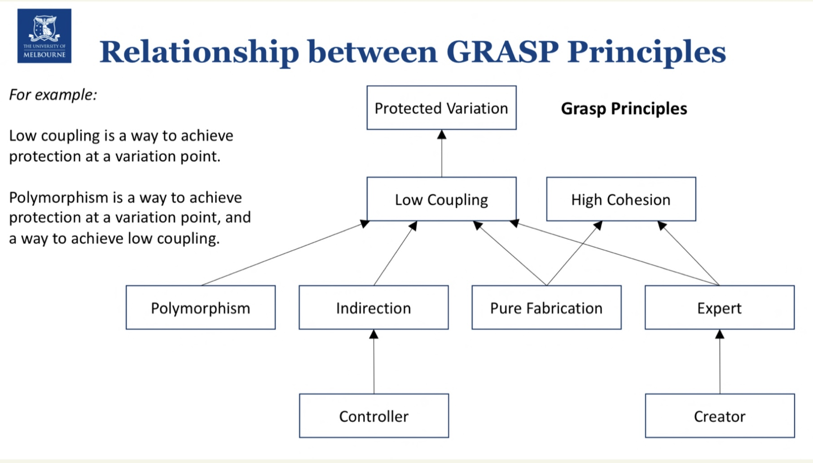

Basics

+ [workshop1: use case ](./Wk1/README.md)
+ [workshop2: domain class diagram, system sequence diagram](./Wk2/README.md)
+ [workshop3: static & dynamic design model ](./Wk3/README.md)

GRASP

+ [workshop4: creator, info expert, controller](./Wk4/README.md)
+ [workshop5: pure fabrication, Indirection, Polymorphism, Protected Variation](./Wk5/README.md)

# General Intro 

#### Brief Background:

Melbourne-based pizza chef Tony Collins has had a lot of success with his pizza restaurant and is now planning to scale his business into a national pizza chain ‘Tony’s Pizza’. He has recruited a team of software engineers to develop a system that will eventually encompass all facets of the business, at each restaurant location. 

The system will be built incrementally, and we will be exploring the requirements of this system through software models and design principles throughout the semester. 

#### Aims:

This case study aims to help you consolidate concepts from the lecture. More specifically, this material will provide you with a more concrete example of how can we apply the concepts or techniques learnt from the lecture to the problem. The content in each week will also help you to better prepare for your own exercises in the workshop. It is highly recommended to check the content before the workshop.

#### Content Structure:

In each week, there will be new content for this case study, which correspond to the lecture content and workshop exercises. The content includes the description of the problem or requirements for the system; the solutions to address the problems, and the demonstration video of how the solution is created.

# Part1 Descriptive tool of software modelling

## Use case

Text

## Domain model

for stakeholder, no software concept

## Design model

software doamin concept

# Part2 GRASP

GRASP (General Responsibility Assignment Software Patterns) is a set of design patterns and principles used to guide the assignment of responsibilities to classes and objects in object-oriented design. The key idea is to create a cohesive, maintainable, and flexible software design. GRASP principles are interconnected, with each principle informing and complementing the others. Here is an overview of the relationship between the main GRASP principles:

1. `Information Expert`: 
   + Assign a responsibility to the class that has the information needed to fulfill it. This principle ensures that each class is responsible for its own data and behavior, promoting encapsulation and cohesion.
2. `Creator`: 
   + Assign the responsibility of creating an object to the class that is closely related to or uses the object. This relationship can be through aggregation, composition, or instantiation. The Creator principle supports the Information Expert principle by encouraging classes to create objects that they are knowledgeable about.
3. `Controller`: 
   + Assign the responsibility of handling system events and user input to a class that acts as a coordinator or a bridge between the user interface and domain objects (indirection的体现, 同时也体现了pure fabrication). This principle helps to manage dependencies and separates concerns between the user interface and the domain logic.
4. `Low Coupling`: 
   + Design the system in a way that reduces dependencies between classes, promoting modularity, maintainability, and flexibility. Low coupling complements the Information Expert, Creator, and Controller principles, as it encourages a design where each class has a clear and focused set of responsibilities.
5. `High Cohesion`: 
   + Strive to create classes that have a focused, single-purpose set of responsibilities. High cohesion promotes maintainability, understandability, and robustness. It is related to the Information Expert principle, as cohesive classes are more likely to encapsulate the necessary information and behavior for their responsibilities.
6. `Polymorphism`: 
   + Leverage polymorphism to create flexible and reusable designs that can handle variations in behavior based on different object types. Polymorphism supports the Low Coupling and High Cohesion principles by allowing different classes to <u>share common interfaces</u> while <u>having distinct implementations</u>.
7. `Pure Fabrication`: 
   + Create a class that does not represent a domain concept but is needed to achieve Low Coupling, High Cohesion, or other design goals. This principle is used when other GRASP principles do not provide a satisfactory solution.
8. `Indirection`: 
   + Introduce an intermediate class to mediate between two classes, reducing coupling and promoting flexibility. Indirection is related to the Controller and Low Coupling principles, as it helps to manage dependencies between classes.
9. `Protected Variations (similar to Open-close principle)`: 
   + Design the system to be stable and resilient to changes by identifying points of potential variation and encapsulating them. This principle is related to Low Coupling and High Cohesion, as **it encourages a design where changes in one part of the system have minimal impact on the rest**.

The relationships between GRASP principles help to create a balanced and efficient design, as each principle influences and supports the others. Applying these principles together leads to a more cohesive, maintainable, and flexible software system.

+ 每个pattern都强调low coupling; low coupling 优先考虑
+ 同时保持class的high cohesion, 提升代码的可读性, 可维护性

# Part3 Design Patterns