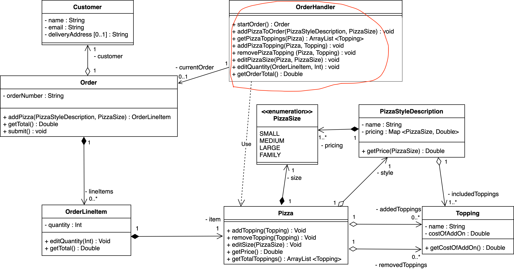
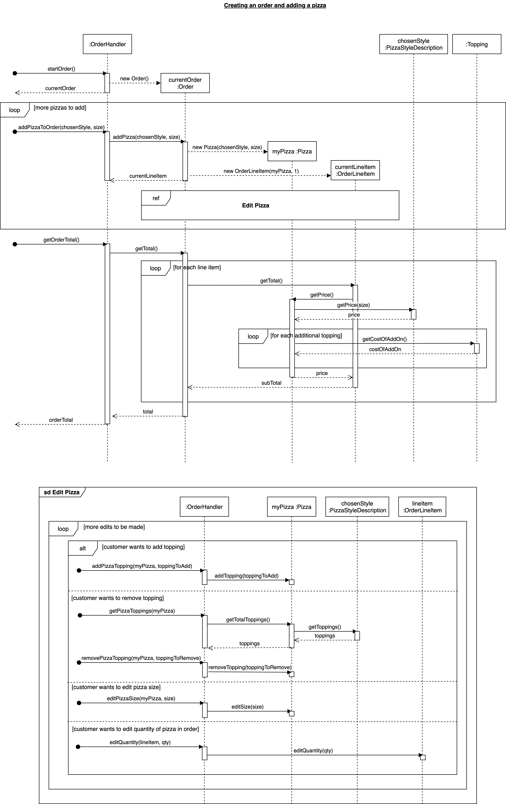

# Abstract

+ 我们不是把现实世界里事物的关系直接映射到software domain 里. e.g., customer class 和 customer actor是不同的! customer class maintains the information of customer,  it is not customer actor itself!


# Brief Background:

Last week, the team worked on the design models for the implementation of Tony’s Pizza Ordering System. In this week and the next week, the team will be discussing how to effectively assign responsibilities to classes, with respect to the GRASP principles. This will include some modifications to improve and extend the design.

### Content Structure:

In this week, we discuss the concepts of `Coupling` and `Cohesion`(and their trade -offs) and relate them to our case study. We also start with software patterns in our pizza case study such as the `Creator`, `Information Expert` and the `Controller` pattern and answer some intriguing questions related to these patterns.


# Case study 4.2 - High Cohesion and Low Coupling

he functionality for *creating a pizza and adding it to an order* involves a set of different classes and associations between them. A significant challenge in modelling this design is balancing the twin goals of  **high** cohesion and **low** coupling. In our design class diagram from Week 3 we have several software classes (e.g. Customer, Order, OrderLineItem, and Pizza) to handle the order operations of the Tony’s Ordering system. Below, we explore some alternative designs and their implications for the cohesion and coupling.

## **Alternative (less preferred) Design**

### 反例1: 

:gem: More responsibilities in Order (Low Cohesion and Low Coupling)

Instead of having all these classes, we can imagine an alternative design model in which the Order class handles most of the order operations on its own (see Figure 1) and stores lists of Toppings in order to describe pizzas. 

+ This alternative design would have lower coupling because the Order class is not highly dependent with other classes.
+ However, it would also have very low cohesion because the Order class now has too many non-cohesive responsibilities, making it a bloated class.


*Figure 1: An example of low coupling and low cohesion*


Although additional classes such as Customer, OrderLineItem and Pizza increase the coupling of our current design, they also help to maintain conceptual cohesion and improve code readability and re-use. **This example illustrates that there is sometimes a trade-off between cohesion and coupling.** 


### 反例2: 

:gem: More responsibilities in Customer (Low Cohesion and High Coupling)

In this alternative design model, we have also included the classes for domain entities such as OrderLineItem, Pizza and PizzaStyleDescription, but assigned most of the order operations (I.e. adding pizzas and editing toppings) to the Customer class (see Figure 2). 

This assignment might seem natural, as the customer actor will be performing these actions in the real world. However, if we operated by this logic, the Customer class would then likely be coupled to almost every class in the system! The set of responsibilities assigned to the Customer class is no longer cohesive (紧密); 再次印证了: real world domain != software domain, 我们不是完全拿现实时间的事物之间的关系直接映射到software里去

the Customer class should actually only be responsible for managing responsibilities related to the customer entity itself. We’ll discuss this a bit more in the next section too.


*Figure 2: An example of high coupling and low cohesion* 


This example illustrates a case in which **poor** assignment of responsibilities has resulted in both high coupling and low cohesion. This shows that it’s not enough to simply add the relevant conceptual classes, they must also have responsibilities assigned carefully in order to reduce coupling and improve cohesion.


# Case study 4.3 - Creator

When modelling the design, one of the responsibilities to be considered is the instantiating of new objects.

**Question: Which class should be responsible for creating a Pizza?** 

In our current design, we assigned Order to be responsible for creating Pizza instances (see Figure 1). This design decision is based on the Creator pattern. Below, we discuss other design options and why Order should be responsible for creating a Pizza:


*Figure 1: A system sequence diagram showing the creation of pizza object from the order object.* 

- We may think of the customer as creating the pizza in real life. :bangbang: *<u>However, remember that the **Customer** class is different from the Customer actor.</u>* <u>The Customer class is responsible for **maintaining information** about the customer entity. It does not have any of the information to create a Pizza</u> (e.g. visibility of toppings and sizes). 
- :x: It might make sense for **PizzaStyleDescription** to instantiate a new Pizza, because PizzaStyleDescription has the key information that we need to create a new Pizza. However, PizzaStyleDescription has little use for the Pizza object once it has been created, so this might not be the most effective choice. 
- :white_check_mark: The **Order** class has much more need to manage the pizza once it has been instantiated. Pizzas are created specifically to belong to Orders and therefore can be added directly to orders as a system operation. This is also conceptually in line with our domain model, in which an Order ‘contains’ Pizzas. For these reasons, we have chosen Order as the class to create Pizza.

# Case study 4.4 - Information Expert

Another strategy for assigning responsibilities is to consider which class has the most information necessary to fulfil the responsibility.

**Question: Which class should be responsible for customising a pizza (e.g. size and toppings)?**

In our current design, the Pizza class is responsible for operations such as editing its size and toppings(see Figure 1). Below we discuss alternative designs with respect to the Information Expert principle:


*Figure 1: Figure showing a possible design of the scenario with respect to the Information Expert principle* 

- :x: It might make sense for the **OrderLineItem** class to manage customisations for the pizza that it contains. However, there is a lot of information required to edit a pizza, including several relationships with the Topping class, that OrderLineItem would have to access secondarily through Pizza. In future, we will want the OrderLineItem class to handle other types of items besides Pizza, so it would be incohesive for this class to contain specific functionality for editing pizzas. 
- :x: Similarly, we could make **Order** responsible for managing customisations of its pizzas. This would have similar issues to assigning to OrderLineItem, with the added concern that Order is already at risk of becoming a bloated class when payment and delivery functionality is added. 
- :white_check_mark: A more natural choice would be for **Pizza** to manage its own customisations. Pizza is instantiated with a PizzaStyleDescription and PizzaSize, and maintains lists of extra toppings to be added and removed. Pizza is therefore the information expert (i.e., has necessary information) to take on the responsibilities of managing its toppings and size. 


# :moon: Case study 4.5 - Controller

In a later stage of development, Tony’s Pizza will have a graphical user interface (GUI) that customers can interact with to place orders. The GUI itself is outside of scope, but we do need to design a way to interface with it. Regardless of what type of user interface is implemented, a software system will always require a way to receive and handle instructions from outside of the system itself. 

**Question: Which class should be responsible for handling system operations?** 

Looking at the design model from last week, none of the classes are well suited to handle the system operations, without compromising their own conceptual cohesion. In our design, Pizzas should be responsible for managing Pizzas, Orders should be responsible for managing orders, etc. The GUI would then need to be directly coupled with every class that can be edited by the user. 

**We therefore need to revise the design to include a controller class**, `OrderHandler` (see Figure 3). The controller acts as a highly cohesive class whose sole responsibility is to manage and redirect system operations. A dedicated controller class allows us to reduce the coupling down to a single point of contact between the domain layer (what we are implementing) and the world outside of our system (any necessary user input/output). 




*Figure 3: A partial Design Class Diagram including an added Controller class (OrderHandler) for managing system operations.* 


**In Figure 4, we can see that the `OrderHandler class` is acting as a single point of interaction for every found message.** We can assume that these found messages might originate from the GUI, which is outside the scope of the system we are currently building. In our case, we have created a controller specifically for handling orders; this will help to maintain cohesion as the system grows and more functionality is added (e.g. handling deliveries).  

:bangbang: <u>Note that the controller does not actually implement any of the order functionality, but **redirects** method calls to the responsible classes</u>; an example of the implementation for this is shown below. 

```java
public class  OrderHandler{
	private order currentOrder;
	...
        // Handles the system operation of adding a piza to an order
	public void addPizzaToOrder(PizzaStyleDiscription chosenStyle, PizzaSize size) {   
          currentOrder.addPizza(chosenStyle, size)  
       
       }
        ...
}
```


:gem:下图展示customer actor从GUI 输入 startOrder() 与 getOrderTotal()



*Figure 4: A Design Sequence Diagram showing system operations being handled by the OrderHandler controller class.* 


# :gem: Tony's Pizza case study: optimization

At last, there is a video using creator, info expert and controller to optimize the design diagram we created last week

https://canvas.lms.unimelb.edu.au/courses/153221/pages/case-study-4-dot-6-tutorial-video?module_item_id=4589478


my notes

based on last weeks's producing of design static and dynamic diagram


