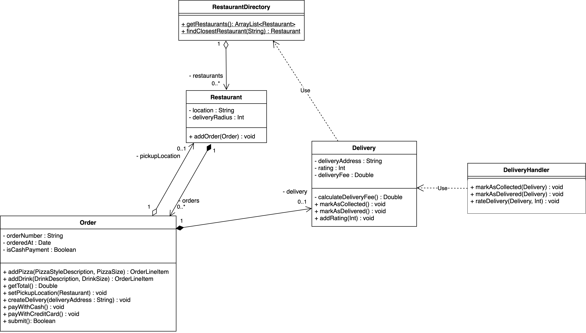
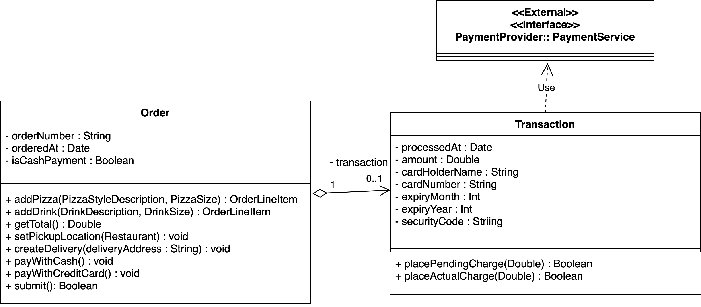
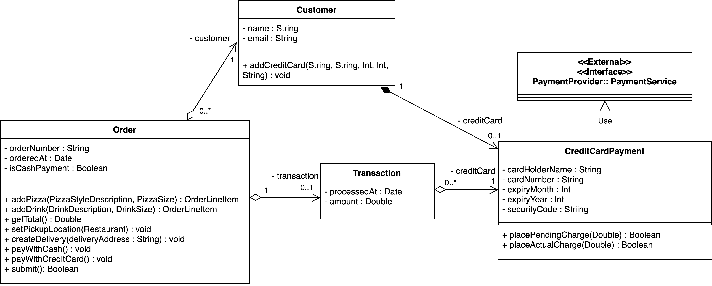
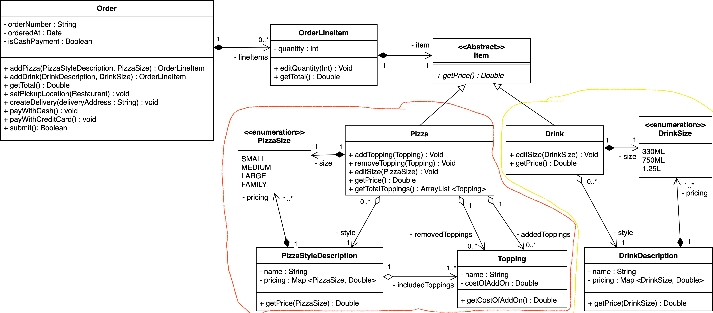
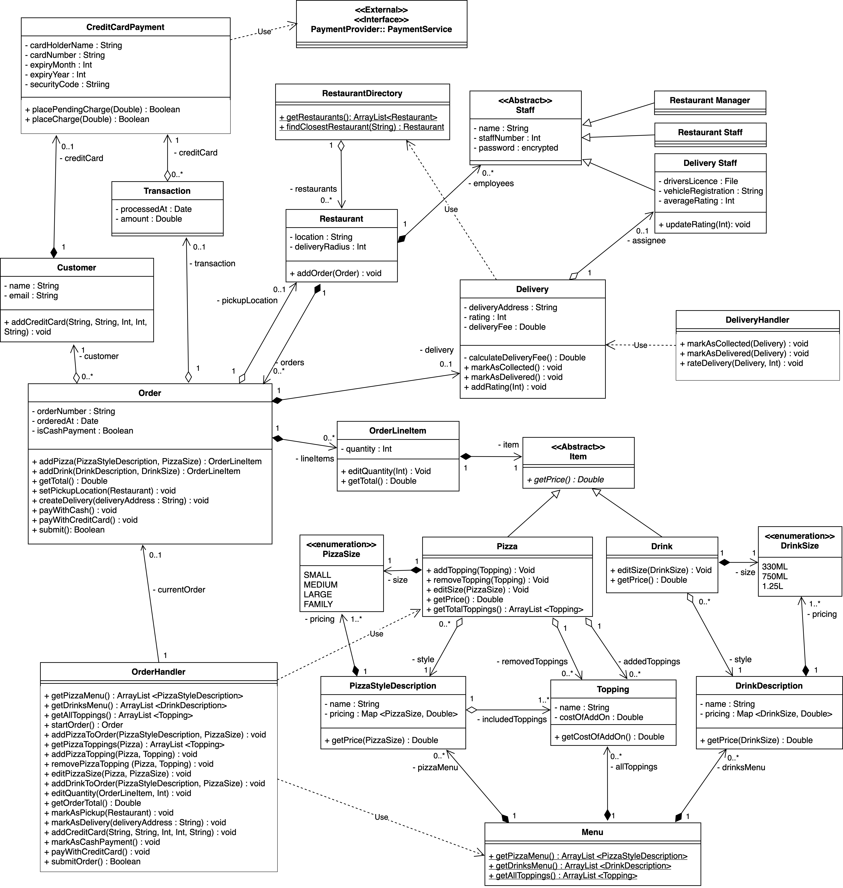
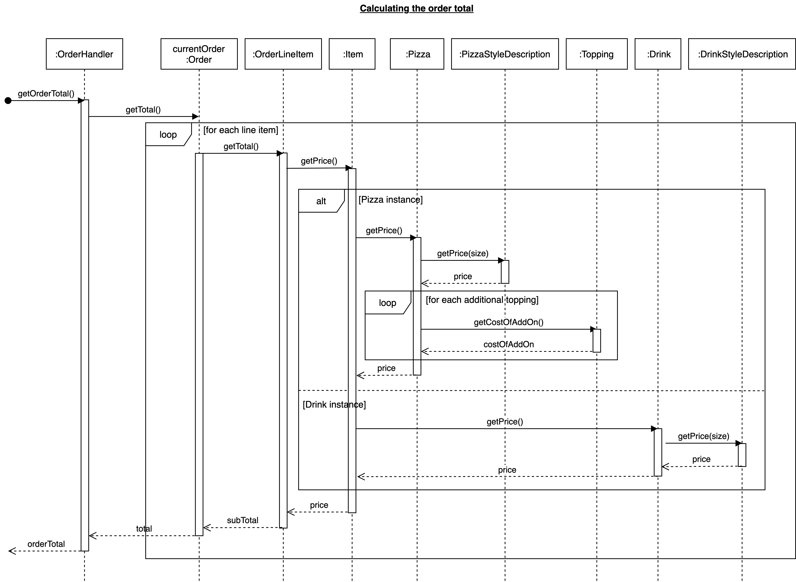

# Brief Background:

Last week, the team started discussing how to effectively assign responsibilities to classes, with respect to the GRASP principles. The team will continue this week by proposing more modifications that relate to the remaining GRASP principles. You'll notice that many of the design decisions made can be explored with respect to more than one principle. After completing this week case study, the class diagram will be updated to include remaining functionality from the domain, including deliveries, payment and menu ([see Figure ](https://canvas.lms.unimelb.edu.au/courses/153221/pages/case-study-5-dot-5-protected-variation)[4 in Case study 5.5](https://canvas.lms.unimelb.edu.au/courses/153221/pages/case-study-5-dot-5-protected-variation) ). 

Content Structure:

In this week, we move on to some advanced GRASP design principles and discuss them in relation to our case study. Understanding them is extremely important when designing a complex software system as we have to decide which responsibility to assign to which software object.

# Case study 5.2 - Pure Fabrication 

:star: 捏造一个domain model中不存在的class

+ controller class就算一种 pure fabrication class. 当然controller class也算indirection的体现

When creating a design model, it is often necessary to add **non-domain entities** in order to make the software system workable and/or to improve its design with respect to principles such as coupling and cohesion. Now, let’s identify pure fabricated classes for Tony’s Pizza Ordering system:

- 关于fabricated class: Note that we have now included a Delivery class that was not present in [our domain model](https://canvas.lms.unimelb.edu.au/courses/153221/pages/case-study-2-dot-3-domain-class-diagram-and-tutorial). Remember from our use cases (see [Use Case 3: Place order (Fully dressed style)](https://canvas.lms.unimelb.edu.au/courses/153221/pages/case-study-1-dot-3-textual-use-cases-examples)) that Orders may be either be picked up by the customer, or delivered by Delivery Staff. This means that delivery functionality will only be applicable to some Orders. Instead of including all the delivery responsibilities in the Order class, **we have improved cohesion by adding a `Delivery class`.** This is a fabricated class that encapsulated responsibilities associated with performing a delivery (when applicable) and is directly associated with the Delivery Staff.
- 关于controller class: `The controller class` that we added to the design model [last week](https://canvas.lms.unimelb.edu.au/courses/153221/pages/case-study-4-dot-5-controller) is an example of a fabricated class because it doesn’t relate to an actual conceptual domain entity. However, the addition of this class *allows us to cohesively encapsulate a specific set of responsibilities* (handling system operations (指用户的输入操作)).
  - We now also require the model to handle system operations relating to deliveries, such as updating the delivery status and rating the delivery experience. We can add another controller **DeliveryHandler**, so as to further maintain cohesion among these fabricated classes. Another alternative would be to add a façade controller that handles all system operations. However, this might quickly become a bloated class, especially as the system grows over time.

Figure 1: Note that we have now added the Delivery Class in our design model since some of our orders will now be delivered. We have also added a delivery handler to further maintain cohesion among these fabricated classes.

# Case study 5.3 - Indirection

:star: 一般在和外部API对接时常用到, 通过加入indirection class, 做到只有这个indirection class与external system 耦合

Tony’s Customers will be able to pay by credit card in the ordering system. However, we know that our system must coordinate with an external payment service in order to actually process the payments. This prompts us to consider:

**Q: which class should be responsible for working with the credit card service?**

:gem: bad design: no indirection with external system

Our design now includes a class Transaction, which records each attempted transaction associated with Orders. We could also make Transaction responsible for invoking the external payment service (see Figure 1). However, co-operating with the payment service is a very specific responsibility that *should have minimal coupling* with the rest of the system. Adding this responsibility to Transaction (primarily a reporting class) will make it an **incohesive** class, and it will be difficult to isolate functionality related to that specific payment service (eg. handling errors).

*Figure 1: Transaction directly uses the external payment service (no indirection) will make the class **incohesive**, and it will be difficult to isolate functionality related to that specific payment service (eg. handling errors).*

:gem: good design: with indirection class with external system

To implement these specific operations, we can include a new class CreditCardPayment, that can be used to represent credit card payments within our system – *<u>noting that the payments themselves are processed outside of our system (I.e. **using an external API**).</u>* This is an example of indirection, as we are using the CreditCardPayment class as a mediator (中间物) between our system and the external payment service. <u>Advantage: By creating an indirection object (CreditCardPayment), we can know that the external service needs only to be coupled with one class.</u>

*Figure 2: Transaction uses indirection object CreditCardPayment to invoke the external payment service, maintaining the cohesion of the class and external service has less coupling with the system.*

# Case study 5.4 - Polymorphism

:star: 一般用于there are perspective future proofing时用到, 比如将来会有新的class variariants (比如drink) 出现, 行为和现有的class (e.g. Pizza)不同

Our design models from Weeks 3 and 4 only considered adding Pizzas to Orders. We had not yet considered that Drinks are also orderable from the menu. When adding Drink into our system, we realise that OrderLineItem must handle both Drink and Pizza – both of which are orderable ‘Items’. To implement this, we can refactor the association between OrderLineItem to introduce an abstract class, Item. Item can then be extended by Pizza and Drink.

This structure allows the method getPrice() to be implemented polymorphically for different types of items that may be added to orders. The calling class, OrderLineItem, no longer needs to care what type of item it holds, even though the methods for calculating price vary greatly between Pizzas and Drinks. The sequence diagram (Figure 5) illustrates how we can obtain the price for any item in an order, dynamically at run time.

*Figure 3: Item has a polymorphic method getPrice() that is implemented differently by Pizza and Drink* 

 *Figure 4: Sequence diagram for the polymorphic implementation of getPrice() on Item* 

# Case study 5.5 - Protected Variation

类似Open-close principle, 某个class的改动要对其他class造成最小影响 (protect  our design from impact of possible variations), 这是建立在low coupling的基础之上

+ 因此, 需要首先identify variation points from our design

The design decisions outlined above also have implications for the way that variations will be handled by our system:

- 说明1: Orders are now associated with the abstract class `Item`, protecting them from variation in the way that Pizzas are structured, and <u>allowing for different kinds of products (possible variation) to be easily added to the system with minimal impact on the customer ordering</u> process. 
  - For example, Tony’s may want to sell garlic bread or chicken wings in the future. Different kinds of items may be added with their own specific attributes that extend the item abstract class.

- 说明2: The addition of the `CreditCardPayment` class has limited the coupling between our system and the external payment system. <u>This protects our system from variation in the way that we integrate with the payment service, and allows us to easily change payment service provider in future.</u>
  -  For example, if we use PayPal only initially, we could switch to a different vendor with little impact on the rest of the system. If we want to allow the user to choose between different payment services, we could do this with polymorphism (similar to the Item implementation).

 *Figure 5**: The Design Class Diagram* *has been modified to include* *responsibilities related to delivery and payment**, as well as a Menu* *to store pizzas and drinks,* *and* *an abstract class Item**.*

*Figure 5: Sequence diagram for the polymorphic implementation of getPrice() on Item* 

# Case study 5.6 - Tutorial Video

In this week's tutorial video, the instructor moves on with the same example from last week and uses GRASP principles to decide on design decisions.

Video主要讲上面的那些图是如何在上周的图的基础上, 通过以上四种GRASP修改得来的

见GoodNotes 笔记吧