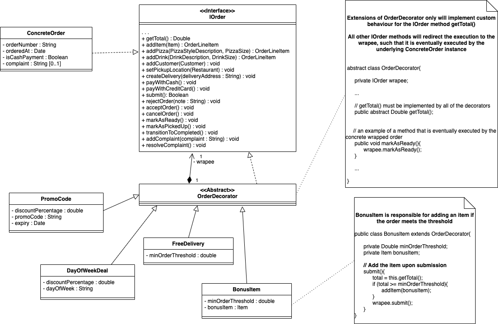
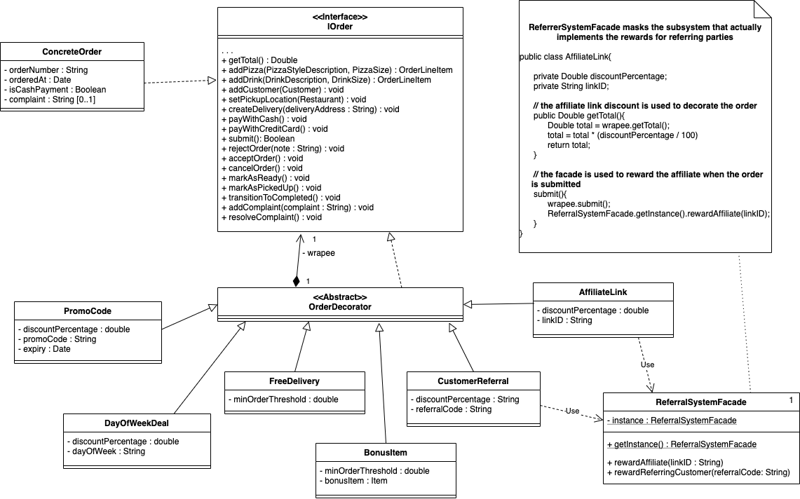
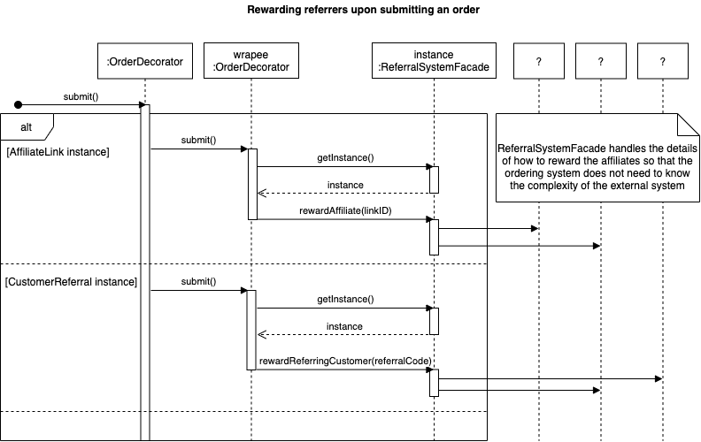

### Welcome to Week 7 of the case study

#### Brief Background:

Last week, the team created a state machine for an Order to gain a better understanding of how orders and deliveries are processed in the existing system. This week, we are looking to implement the two additional functionalities: order discounts and referral promotions, that have not yet been built into Tony’s Pizza system. 

Content Structure:

This week, we begin an analysis of Gang of Four design patterns, and provide demonstrations of implementing:

- the discount functionality using the Decorator Pattern;
- the referral promotion using the Facade pattern

# Case Study 7.2 - Requirement & Design for Order Discounts (Decorator)

### Requirement

Recall in Week 1 that there was an ‘extended’ use case, in which customers could place orders with discount codes. Tony has now finalised how he would like the order discounts to work, and there are multiple ways in which a special offer can be applied. He requires the design of the discount system to be flexible enough to handle the following kinds of cases: 

- Discount based on day of the week 
  - E.g. ‘Cheap Tuesday’ – all pizzas are 10% off on Tuesdays 
  - Automatically applied when checking out 

- Free delivery 
  - Customer receives free delivery if they spend over a certain threshold 
  - E.g. Free delivery if spending over $50 

- Bonus items 

  - Customer receives a bonus item if they spend over a certain threshold 
  - E.g. Free drink if spending over $20 

  - The bonus item is automatically added to the line items in the order when submitting the order and excluded from the calculation of order total 

- Discount codes 
  - Customer specifies a special code when creating the order 
  - Applies a discount percentage to the order total 
  - Every code has an expiry date 

- Multiple discounts may be applied at once 

When a discount is applied, the contents of the order may need to be altered (adding a bonus item) and the order total will need to be calculated differently. This indicates that the behaviour of Order instances will be affected by the special offers that are applied to it. The fact that multiple discounts can be applied at once indicates that we may be looking for a recursive solution. 

### Design Analysis and Models

We can use the Decorator pattern to recursively ‘wrap’ the concrete Order with OrderDecorators, where each concrete decorator corresponds to a particular method of applying a discount. To implement the pattern, we need to create an interface IOrder that is implemented by both the concrete order, as well as all of the order decorators (see Figure 4). We can therefore calculate the order total differently when discounts are applied; all other order functionality will be redirected for the concrete order to execute. Importantly, calling classes can still interact with the decorated order as they would a regular order, without needing to know about any of the discounts applied. 

Figure 4: A partial design class diagram showing how the Decorator pattern is used to ‘wrap’ the Order with special offers. Note the recursive design of the decorator pattern, meaning that one concrete order can be wrapped multiple times. This will affect the way in which the total of the order is calculated at checkout. 

### Discussion

*Why can’t we use the strategy pattern here?* 

The strategy pattern allows us to provide different implementations for a single method. This would work well if we were only interested in calculating the total cost i.e. providing different implementations of the method getTotal(). However, the requirements here affect more than just the cost total. The system will also need to refer to the discounts during other interactions with the Order object, affecting the overall behaviour of the object. For example, when the customer submits their order, the system must check to see if the customer is eligible for a bonus item and, if so, add it to the set of line items. By implementing these requirements as decorators, we can override any Order method(s) we need to implement the requirements. 

# Case Study 7.3 - Requirement & Design for Referral Promotion (Façade) 

### Requirement

Tony would also like to go a step further with the discount system to also handle referral-based marketing for the business. He is hoping to attract new customers by utilising the power of social networks. The requirements for the discount system also be extended to handle 2 new kinds of promotions: 

- Discounts based on referrals from other customers 
  - Existing customers pass along a unique code to their friends 
  - When the new customer creates an order with this code, they will receive 20% off the order 
  - The referring customer will also receive a 20% discount off of their next order 

- Discounts can be based on referrals from other sources via affiliate links 

  - As an example, Tony has approached some local food blogs to promote his restaurant chain 

  - Their blog posts will feature affiliate links to promote Tony’s Pizza 

  - When a customer follows one of these affiliate links to place an order, they will receive a 10% discount on the order 

  - The blog poster will receive a small commission payment when a customer follows the link 

  - The blog poster will receive a further payment if the customer proceeds to place an order 

- Referral-based discounts can also be applied in conjunction with other discounts 
- The referral system will also need analytics capability to track the performance of referrers. 

The way that referral-based discounts are applied to the referred customer’s order are fairly straightforward and can extend similarly from the established OrderDecorator design. However, the additional functionality related to these discounts is complex, and not catered for in our current system design. This includes looking up and recording who the referring customer was and setting them up to receive their referrer discount on their next order. In the case of the affiliate links, the system would also need to look up who the affiliate link belonged to and make the payment to their account. 

 

### Design Analysis and Models

Building this functionality into the design would involve a new set of classes to manage the referrers, which can be considered as a subsystem that is quite distinct from the rest of our system. The referral functionality has limited impact on our existing ordering/delivering system, apart from needing to apply the discount to the order at hand; the existing system shouldn’t need to know the details of how referrers are managed and rewarded. Because the referrer functionality is relatively complex and separate, we can use the Façade pattern to hide its complexity from the rest of the Tony’s Pizza system. An added benefit of the Façade approach is that the developers might not even have to implement the referral themselves and could instead use 3rd party marketing software; our Façade class would then have the responsibility of connecting to the external system (including any necessary authentication). 

As shown in Figure 5, the Façade that is used by the referral-based discount decorators provides an interface for our order system to talk to the referrer system, without needing to actually implement the referrer management in our system. We can also make the ReferralSystemFacade a singleton, as our order system will only ever need to communicate with one instance of the subsystem/façade, regardless of who the referring party is. This instance could also be responsible for maintaining an authenticated connection with the external system. 

Figure 5: The discount system has been extended to include referral-based discounts. The functionality for looking up and applying referral-based discounts and rewards is complex, and is therefore implemented as a subsystem behind a façade that is used by the existing order system.

Figure 6: Upon submitting an order, the referring customer or affiliate (if applicable) should be rewarded. This design sequence diagram shows that the façade handles the details of how to implement the rewards for referrers, such that the impact on the existing system is minimal. 