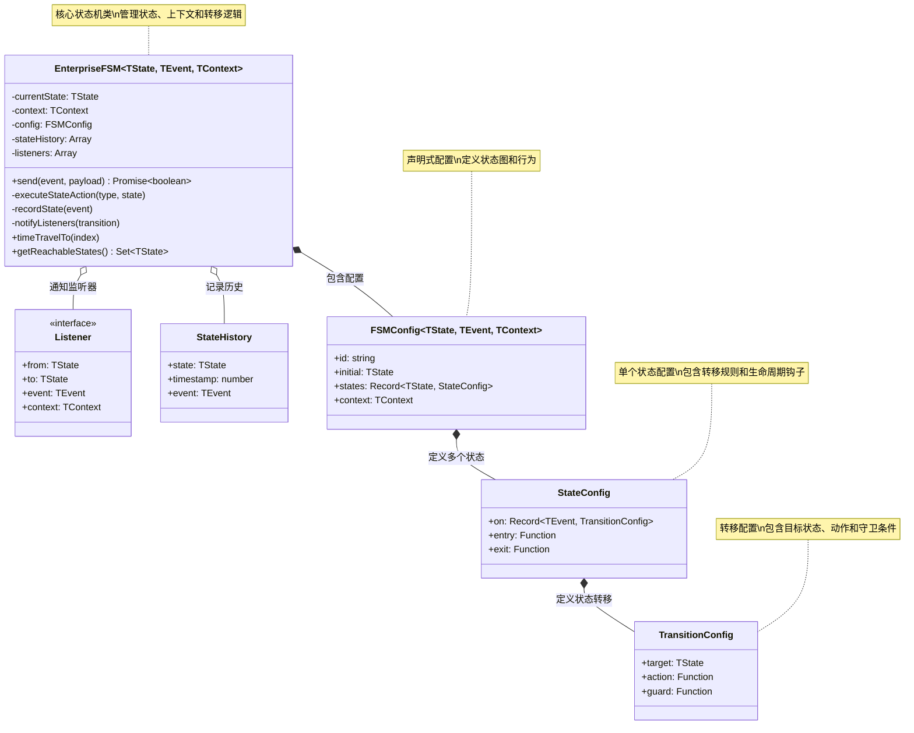
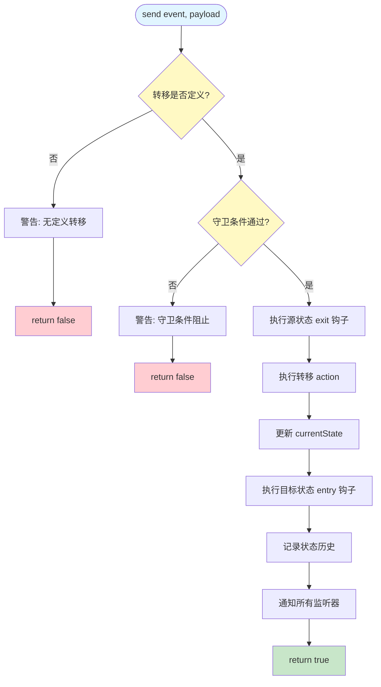
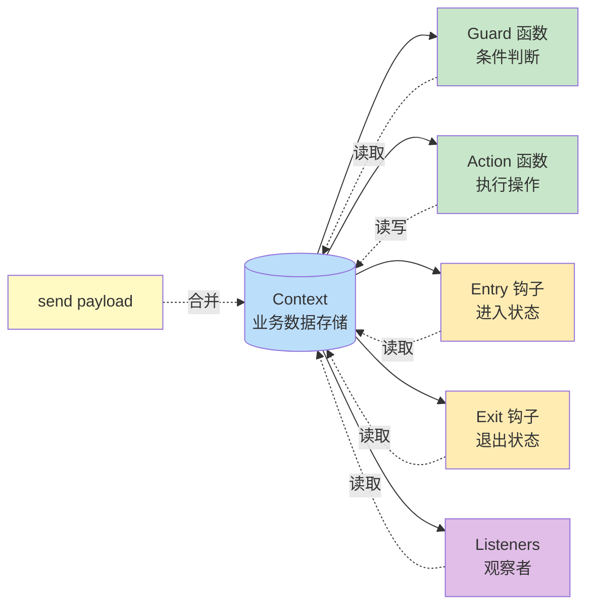
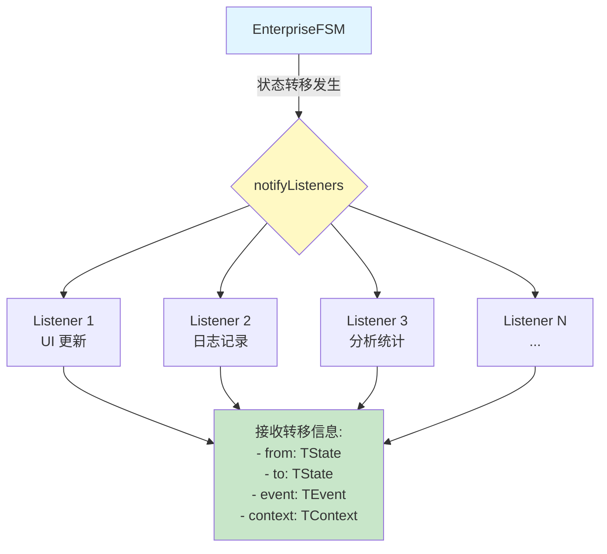
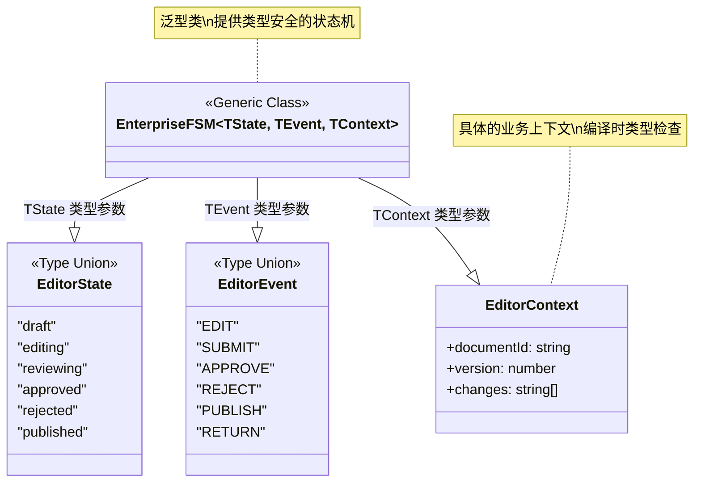

# FSM 思维模型 (Mental Model)

## 核心概念类图

这个图展示了 EnterpriseFSM 的核心思维模型和架构设计：

## 状态转移生命周期

这个图展示了调用 `send()` 方法时的完整状态转移流程：

## Context 的作用域

这个图展示了 Context 在 FSM 各个部分的流动和访问：

## 观察者模式实现

这个图展示了 FSM 如何实现观察者模式，让外部代码响应状态变化：

## 类型安全的泛型设计

这个图展示了泛型参数如何实现类型安全：

## 核心设计模式总结

1. **有限状态机模式 (FSM Pattern)**

   - 将系统行为建模为一组离散的状态和状态之间的转移

2. **观察者模式 (Observer Pattern)**

   - 通过 listeners 让外部代码订阅状态变化

3. **策略模式 (Strategy Pattern)**

   - guard、action、entry、exit 函数作为可插拔的策略

4. **命令模式 (Command Pattern)**

   - 事件（Event）封装了状态转移的请求

5. **模板方法模式 (Template Method Pattern)**

   - send() 方法定义了状态转移的固定步骤

6. **泛型编程 (Generic Programming)**
   - 通过 TypeScript 泛型实现类型安全和代码复用
