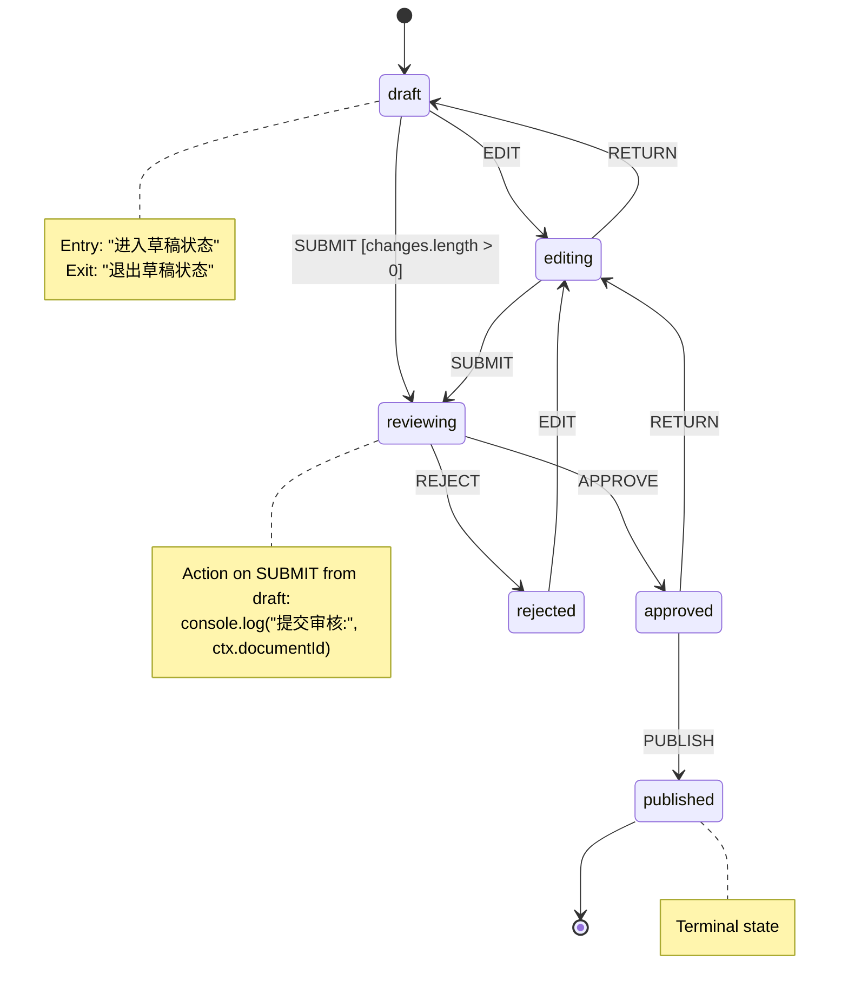

```mermaid
stateDiagram-v2
    [*] --> draft
    
    draft --> editing : EDIT
    draft --> reviewing : SUBMIT [changes.length > 0]
    
    editing --> reviewing : SUBMIT
    editing --> draft : RETURN
    
    reviewing --> approved : APPROVE
    reviewing --> rejected : REJECT
    
    approved --> published : PUBLISH
    approved --> editing : RETURN
    
    rejected --> editing : EDIT
    
    published --> [*]
    
    note right of draft
        Entry: "进入草稿状态"
        Exit: "退出草稿状态"
    end note
    
    note right of reviewing
        Action on SUBMIT from draft:
        console.log("提交审核:", ctx.documentId)
    end note
    
    note right of published
        Terminal state
    end note
```