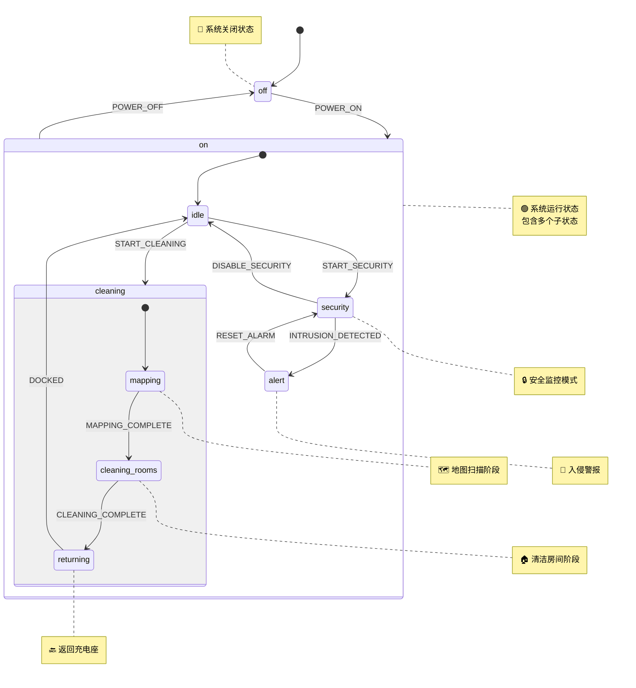

# 智能家居 HFSM 可视化

## 完整的分层状态机结构



## 状态层级结构

```
├── off (关闭)
└── on (开启) - 复合状态
    ├── idle (待机) - 初始状态
    ├── cleaning (清洁) - 复合状态
    │   ├── mapping (地图扫描) - 初始状态
    │   ├── cleaning_rooms (清洁房间)
    │   └── returning (返回充电座)
    ├── security (安全模式)
    └── alert (警报)
```

## 事件和转移说明

### 顶层事件

| 事件        | 源状态 | 目标状态 | 说明                                       |
| ----------- | ------ | -------- | ------------------------------------------ |
| `POWER_ON`  | off    | on.idle  | 开机，自动进入待机状态                     |
| `POWER_OFF` | on.\*  | off      | 关机（事件冒泡，任何 on 的子状态都能处理） |

### on 状态内的事件

| 事件                 | 源状态   | 目标状态         | 说明                   |
| -------------------- | -------- | ---------------- | ---------------------- |
| `START_CLEANING`     | idle     | cleaning.mapping | 开始清洁，进入地图扫描 |
| `START_SECURITY`     | idle     | security         | 启动安全模式           |
| `INTRUSION_DETECTED` | security | alert            | 检测到入侵             |
| `DISABLE_SECURITY`   | security | idle             | 关闭安全模式           |
| `RESET_ALARM`        | alert    | security         | 重置警报               |

### cleaning 状态内的事件（深层嵌套）

| 事件                | 源状态         | 目标状态       | 说明           |
| ------------------- | -------------- | -------------- | -------------- |
| `MAPPING_COMPLETE`  | mapping        | cleaning_rooms | 地图扫描完成   |
| `CLEANING_COMPLETE` | cleaning_rooms | returning      | 房间清洁完成   |
| `DOCKED`            | returning      | idle           | 返回充电座完成 |

## HFSM 核心特性演示

### 1. 复合状态 (Composite States)

- **`on` 状态**: 包含 idle, cleaning, security, alert 四个子状态
- **`cleaning` 状态**: 作为 `on` 的子状态，又包含 mapping, cleaning_rooms, returning 三个子状态

### 2. 初始子状态 (Initial State)

- `on` 的初始状态是 `idle`
- `cleaning` 的初始状态是 `mapping`
- 当进入复合状态时，自动进入其初始子状态

### 3. 事件冒泡 (Event Bubbling)

```typescript
// POWER_OFF 定义在 on 状态
on: {
  // ... 子状态定义
  on: {
    POWER_OFF: "off"; // 👈 在父状态定义
  }
}
```

这意味着：

- 在 `on.idle` 状态可以处理 `POWER_OFF`
- 在 `on.cleaning.mapping` 状态也可以处理 `POWER_OFF`
- 在 `on.security` 状态也可以处理 `POWER_OFF`
- 事件会从当前状态向上冒泡，直到找到能处理的状态

### 4. 状态路径 (State Path)

使用点号表示法表示嵌套状态：

```
off                      // 顶层状态
on.idle                  // on 的子状态
on.cleaning.mapping      // cleaning 的子状态（on 的孙状态）
on.cleaning.cleaning_rooms
on.cleaning.returning
on.security
on.alert
```

## 使用场景示例

### 场景 1: 完整的清洁流程

```
off
  → (POWER_ON) →
on.idle
  → (START_CLEANING) →
on.cleaning.mapping
  → (MAPPING_COMPLETE) →
on.cleaning.cleaning_rooms
  → (CLEANING_COMPLETE) →
on.cleaning.returning
  → (DOCKED) →
on.idle
```

### 场景 2: 深层状态的事件冒泡

```
on.cleaning.mapping
  → (POWER_OFF) →  // 事件向上冒泡到 on 状态处理
off
```

### 场景 3: 安全监控

```
on.idle
  → (START_SECURITY) →
on.security
  → (INTRUSION_DETECTED) →
on.alert
  → (RESET_ALARM) →
on.security
```

## 生命周期钩子执行顺序

### 进入 `on.cleaning.mapping` 状态

```
1. 执行 on.entry()              // 进入父状态
2. 执行 cleaning.entry()        // 进入子状态
3. 执行 mapping.entry()         // 进入孙状态
```

### 从 `on.cleaning.mapping` 退出到 `off`

```
1. 执行 mapping.exit()          // 退出孙状态
2. 执行 cleaning.exit()         // 退出子状态
3. 执行 on.exit()               // 退出父状态
4. 执行 off.entry()             // 进入新状态
```

## HFSM vs FSM 的优势

### 使用扁平 FSM 需要的状态数

如果用扁平 FSM 实现相同功能，需要：

```
1. off
2. on_idle
3. on_cleaning_mapping
4. on_cleaning_cleaning_rooms
5. on_cleaning_returning
6. on_security
7. on_alert

总共: 7 个状态
```

每个状态都需要定义 `POWER_OFF` 事件的处理（重复代码）。

### 使用 HFSM 的优势

```
1. 减少状态数量：通过层级组织
2. 减少重复代码：事件冒泡机制
3. 更好的组织性：逻辑分组
4. 易于扩展：添加新的子状态不影响父状态
```

## 代码实现特点

```typescript
// 1. 支持简写语法
POWER_ON: "on"  // 等价于 { target: "on" }

// 2. 支持完整配置
START_CLEANING: {
  target: "on.cleaning",
  guard: (ctx) => ctx.batteryLevel > 20,
  action: (ctx) => console.log("开始清洁")
}

// 3. 生命周期钩子
states: {
  mapping: {
    entry: (ctx) => console.log("进入地图扫描"),
    exit: (ctx) => console.log("退出地图扫描")
  }
}
```

## 总结

这个智能家居 HFSM 示例展示了：

✅ **分层结构** - 三层嵌套（off/on → idle/cleaning/security → mapping/cleaning_rooms/returning）  
✅ **事件冒泡** - POWER_OFF 可以在任何深度的状态触发  
✅ **初始状态** - 自动进入复合状态的初始子状态  
✅ **状态路径** - 使用点号表示法清晰表达层级关系  
✅ **生命周期** - entry/exit 钩子按正确顺序执行  
✅ **代码复用** - 避免在每个状态重复定义相同的转移

这是学习和理解 HFSM 概念的优秀示例！🎓
