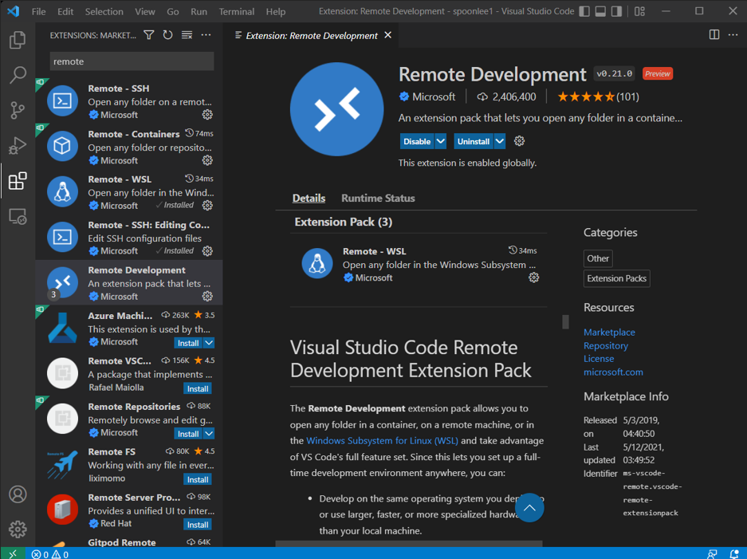
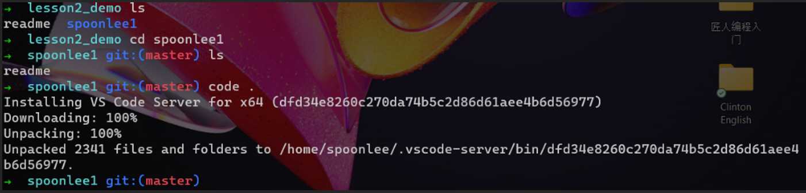

# **Lesson 2**

# **课堂笔记**

以下笔记基于班长笔记有所修缮

前言，程序员一般习惯用类似linux的系统来做开发，可以理解为仅用键盘输入指令来操作电脑，而不是用鼠标，这并不是一种落后的电脑操作方式，今后你就理解了。

# Abstract:

1. 一些在terminal上基本的bash指令（如何进入一个文件夹cd,tap键，上下箭头切换指令的用法）
2. 配置环境（主要是为使用windows的同学）,以及用terminal下载git.

- 记得定期sudo apt update
- 某指令 -h请求命令行帮助信息
- Ubantu作为windows子系统, 安装git, zsh和ohmyzsh; mac不需要

1. 如何用terminal复制一个GitHub仓库并进入复制的仓库

- 在GitHub网站上创建一个仓库，并复制仓库链接
- 进入到你想放置GitHub仓库的文件夹
- 输入git clone 仓库链接
- 如果是在zsh下，ls后会有→ wsl-demo- 2 git: (main)提示

1. 如何使用terminal来上传VsCode写出来的代码文件至GitHub仓库，三步走：

- 上清单：git add .
- 许可打包：git commit -m &quot;first commit&quot;

- 需要git config –-global user.name &quot;&quot;
- 需要git config –-global user.email &quot;&quot;

- 正式上传：git push//git push 需要明确GitHub的token才能运行

- Git push还需要你的GitHub的token来access你的账号。而token的保存还需要你安装gh，而gh则得由homebrew来安装

- 在ubantu的terminal中进入复制的GitHub仓库后，输入Code . // 利用ubantu的terminal打开vscode，这样相当于在ubantu子系统中打开vscode,方便后续用vscode自带的terminal(按&quot;cirl+ ~ &quot;)上传code到GitHub

- [Raymond老师notion链接](https://www.notion.so/windows-9db6a442b0a74af8a147805d938ba851)，作为简略版攻略，并且其中带有本源的网站链接
- [https://docs.microsoft.com/en-us/windows/wsl/install-manual](https://docs.microsoft.com/en-us/windows/wsl/install-manual)，微软官网说明

# **1.Mac**

# **系统如何操作**


**Terminal**** （终端控制台）去哪里找？**

- &quot;效率&quot;→Terminal

**bash command**

- bash
- ls：展现当前文件夹所含文件夹
- mkdir：创建一个文件夹
- ls -all：前面有&quot;.&quot;，就是隐藏文件
- cd Documents（Doc+Tab可以直接弹出）：进入Document这个文件夹
- cd ..：cd和..之间有空格。一个点代表当前，两个点代表往外退一层，三个点代表再退一层。一般两个点，退到外面一层。
- rm：删除一个文件，谨慎，不可恢复
- rm -rf tutorial：删除tutorial这个文件夹
- mv tutorial Documents/：移动tutorial这个文件夹到tutorial的下面，必须加/
- mv tutorial1 tutorial2：把tutorial1改名为tutorial2

加/放在下面，不加/改名。

- touch：创建一个文件，touch 1.txt

**自我练习：**

- [https://towardsdatascience.com/16-must-know-bash-commands-for-data-scientists-d8263e990e0e](https://towardsdatascience.com/16-must-know-bash-commands-for-data-scientists-d8263e990e0e)

# **1. Windows 开发环境搭建(win10 以上）**


**这里是为了让**** windows ****的**** terminal ****和**** Mac ****的保持操作指令一致而进行的前处理，第一次搞好了以后和**** Mac ****就一样了；**** windows ****会存在兼容性问题，只要保持**** windows ****系统更新一般没什么问题。如果在这个过程中有**** error ****报错，上网查教程攻略一般都有。**

**1.1**  **打开**** Terminal**

- 开始搜索→Microsoft Store→搜索&quot;Windows Terminal&quot;→获取→打开→Windows PowerShell

**1.2**  **安装**** WSL 2**

- wsl --install：中间是一个空格，两个小横杠。

⚠️如果显示&quot;The requested operation requires elevation&quot;，是因为没有使用管理员权限导致的。解决方案：

开始搜索→Windows PowerShell→以管理员身份运行→wsl —install

就可以安装了。

#### **WSL 2**** ： ****Windows Subsystem for Linux 2**

- 在Windows下建立一个子系统，这个子系统是Linux系统，不用再像以前一样安装虚拟机了，虚拟机大，影响Linux性能。Win8需要安装虚拟机。

⚠️Windows家庭版，无法升级到WSL 2。需要升级到旗舰版或其他版本，或使用Mac系统。

**1.3**  **在**** WSL 2 ****中安装**** Ubantu ****子系统**

- wsl --install -d Ubuntu
- 在windows中安装Ubuntu子系统。

⚠️Note：

- 安装完成后会让你设置子系统的用户名和密码，设置密码时不会有字符出现，输入密码时即使打字了，也不会在屏幕上出现任何字。

⚠️如果密码设置错误，如何操作：

- Windows PowerShell→
- wsl -h（h即help,看到里面所有东西,会有指令提示出现）→
- wsl --unregister Ubantu（删除ubantu之后，回到1.3开始处重新再安装）

**1.4 ⚠️**** \*\***[**WSL 2 Won&#39;t Run Ubuntu - Error 0x80370102**](https://askubuntu.com/questions/1264102/wsl-2-wont-run-ubuntu-error-0x80370102)**（了解即可） ****\*\***

**1.5**  **打开**** terminal ****，设置**** Ubantu ****为默认配置文件**

- Microsoft Store→Windows Terminal→打开
- 菜单栏中有个下拉框（就在窗口顶部，一个向下的箭头）点开→设置→默认配置文件→Ubantu→保存→关闭→全部关闭

 

#### **设置**** Ubantu ****外观**

- 设置→Ubantu→外观→透明度X%→保存→关闭→全部关闭：变成亚克力外观如下


**1.6**  **清空界面**

- 输入&quot;clear&quot;，回车（就像MATLAB那样）
- ctrl+l

**1.7**  **更新**** Ubantu**

- sudo apt update；注意本指令需在ubantu中执行，而不是powershell(把ubantu设为默认就方便些)。如何区分现在打开的是ubantu还是powershell呢？见下图的图标，第一个是ubantu,另一个是powershell


- sudo：这意味着启动了超级管理员指令，尤其是要安装卸载东西的时候，sudo基本都要用。
- apt：这是ubuntu 这类linux操作系统集成的工具包的开头指令，这意味着要对ubuntu系统做些什么事了。Pt指package tool
- update：这是apt 的一条指令，意味着此时系统要求更新apt 信息。
- 之所以这么做是因为我们安装了操作系统，但这个系统可能已经放在这一段时间了，内容可能不是最新的变化，我们需要获取最新的信息。一个和windows系统不同之处的是，类似linux的系统不会自动提醒你是否需要更新，所以记得定期更新一下

**1.8**  **安装**** Git**

- sudo apt install -y git
  - -y的意思是，里面所有的问题我都答yes
  - 如果没写-y，每一步都手动作答y/n来安装
- 这个时候就可以就有git了，可以下载仓库了，为了好看，还可以安装一些美化的东西zsh和ohmyzsh

#### **为**** terminal **** 配置 ****zsh**  **和** [**ohmyzsh**](https://github.com/ohmyzsh/ohmyzsh) **（上皮肤）**

- sudo apt install -y curl zsh （没错，install后面可以跟多个想下载的东西）
  - curl是一种下载工具，相当于迅雷，可以断点续传等功能，如果网络不好，下次下载的时候，可以从中间下载，不用从头开始了
  - 可以连续安装，zsh git，连续写在curl后面即可
  - zsh能看到GitHub仓库，bash本身看不到，后面第二部分会提到这点（bash和zsh都属于interactive shell，说白了就是皮肤）
  - bash本身也有皮肤，但是配置方式复杂，zsh很快，也是主流
- sh -c &quot;$(curl -fsSL [https://raw.githubusercontent.com/ohmyzsh/ohmyzsh/master/tools/install.sh](https://raw.githubusercontent.com/ohmyzsh/ohmyzsh/master/tools/install.sh))&quot; 包括网址也输入指令！
  - ohmyzsh相当于zsh皮肤
  - zsh相当于壳
  - 大标题链接中有三种获取ohmyzsh方式，我们选择的是第一种
- 安装完毕后，在Ubantu中显示就不一样了，只有~ -(如下)：了
  - ~的意思是home
  - 这时ls，啥也没有（如下），因为我们新开了一个系统，而这个系统及其简单，我们之后的工作就在这个极简的系统中进行。
   


第一个红框是从zsh转化为bash，之后看到第一行从极简的&quot;~&quot;变回了&quot;spoonlee@spoonlee\_lap&quot;;第二个红框是从bash切换回zsh，可见紧接着的一行开头又变回了&quot;~&quot;，此时输入&quot;ls&quot;便啥也不显示了

  - 现在就跟mac本完全一致了

---

到此为止（1h23min），Windows系统和mac系统设置就都完毕了.如果要使用github，windows还需要在下载一个homebrew(1h55min-2h10min讲如何安装)

---


可以操作bash命令进行一些练习，如下：


# 2. Git同步仓库内容(1h26min-3h30min)：


**2.1**** 在使用 ****git**** 之前，要先安装 ****homebrew**** （ ****1h26min-1h30min**** ）**

因为要使用token来access GitHub仓库，而token不会被自动保存

- Terminal中输入homebrew，苹果自带，但是Windows需要安装（见2.2.3 1h55min-2h10min讲这个）
- 苹果系统中git本身应该有，如果没有，需要xcode
  - xcode到哪里找？苹果app store中搜索xcode，下载即可，就是苹果开发用的，把所有东西都集中在里面，就有git了
  - 如果是新本，应该有git；如果是老本，可能要安装xcode

  1. **在**** terminal ****利用指令向**** github ****仓库传输文件（**** 1h26min-2h26min, 2h26min-2h46min ****回答同学问题）**

#### **2.2.1**** 在 ****Github**** 网站上创建一个属于你的仓库（ ****1h30min-**** ）：**

  - GitHub（sign up → sign in）
  - Click your portrait
  - 下拉repositories（仓库）
  - New（新建立一个仓库）
  - wsl-demo-2（给新仓库起一个名字, 随便起）
  - public（对外公开）
  - creat（建立）
  - 复制仓库链接（有复制键）

 

    1. **如何在**** terminal ****上将文件提交到**** Github ****上（**** 1h33min-1h44min ****）：**

  - cd workspace（进入workspace这个文件夹，或者其他你想进的文件夹也可以）
  - ls（显示当前文件夹下文件）
  - cd Tutorial-11-basic（进入Tutorial-11-basic这个文件夹，或者别的你想进入的文件夹也可以）
  - 输入 git clone 仓库链接（把GitHub里刚建立的空仓库copy下来，仓库名叫作wsl-demo-2）

系统提示：

Cloning into &#39;wsl-demo-2&#39;...

Warning: You appear to have cloned an empty repository（提醒：克隆的是个空仓库）

  - ls（在Tutorial-11-basic中就有了一个wsl-demo-2）
  - cd wsl-demo-2（进入这个github仓库里面）
  - → wsl-demo- 2 git: (main)（如果切换成bash就没有git: (main)；zsh明确告诉你，现在使用的是git，仓库的分支是main分支）
    - main分支和master分支都可以，没有关系。

  

_ **----------------------------** __**至此，进入**__ **github** __**仓库成功，接下来在里面写文件**__ **-----------** _

  - touch readme（建立一个文件readme）
  - ×（因为相比原来的仓库，现在多了一个readme，所以这里打了×）
  - git add .（列清单：当前这个目录里的内容，我都要上传到git上。注意add和点之间有一个空格。一个点表示当前目录，两个点表示上一层目录，三个表示上上一层目录）
  - git commit -m &quot;first commit&quot;（打包：commit就是我提交了。）
    - 为什么这么复杂？又add，又commit。
      - 因为在大型项目开发里，不是一个人开发，你是项目主管，不同的人提交，你只要管理他们通过就可以了。所以这里必须有commit选项。
    - &quot;add .&quot;属于只是加在了提交列表上还未正式提交，commit才是真的正式提交了。
    - m是message，-m就是表示提交一个内容

但是此时系统提示你的github用户名和邮箱还没填呢：


老师的电脑显示


我的电脑显示

  - 分别输入：

git config --global [user.name](http://user.name/) &quot;你的github用户名&quot;

git config --global user.email &quot;你的github使用的email&quot;

  - 再输入git commit -m &quot;first commit&quot;

    1. **如何在**** GitHub ****上**** generate **** Token( ****令牌**** ) ****（**** 1h44min- ****）**

  - token说明：令牌
    - 曾经可以用用户名、密码登录，但是不很安全和灵活，后来采用了GitHub用户名，邮箱和令牌来access你的GitHub仓库。
    - 相当于：我现在有一个团队，团队都要进入公司，你不会给每个员工配一把钥匙，你会给每个员工一个门卡，刷卡进入，卡就是令牌。
    - 令牌可以控制。如果员工离开公司，指令撤销就可以。
    - 如果想让员工进入一二层，三四层不让进，也可以设置。
    - 可以给自己一张高权限的token，但是不能输入密码。
    - Token相比密码的好处：提供更加灵活的限制权限。
      - 不能去什么地方
      - 时间到了得走
      - eg.：送外卖员，有一张一次性进入小区的卡，甚至还有时间效应，5min的事给20min可以完成了。
  - 打开老师文档中的[github token](https://docs.github.com/en/authentication/keeping-your-account-and-data-secure/creating-a-personal-access-token)
  - 如何创建token：
    - 打开自己的的GitHub网站，点击头像→
    - settings→
    - developer settings→
    - personal access tokens


  - 回到GitHub网页
    - 点击Generate new token
    - 起名：wsl-demo-2
    - 根据自己需要进行token的权限设置（一般只用点第一个repo就行），最后点击最下方的generate token


    - ⚠️注意：
      - 先不要关掉github token的那个页面（下图），因为一旦关闭就会消失这个token信息。不会再有第二次机会看见它。除非重新做一个token。

 

保留此页面！

    - 复制token

##### 接下来保存token (1h54min-)

      - Windows系统并不会自动保存这个token，mac现在也不可以了，因此需要安装一个gh，而gh又需要homebrew来安装，因此现在ubantu中安装一个homebrew
      - 在ubantu下安装homebrew（1h55min-2h10min）
        - 说明：默认情况下你是不能保存token的，所以需要用工具保留，这样每次提交就不用自己更改。但ubuntu需要安装[homebrew](https://brew.sh/)工具。
        - 安装：到homebrew官网，复制安装指令（如下），粘贴到Windows里的Ubantu里进行安装。即输入（这个不用管在哪个文件夹安装，都一样）：

/bin/bash -c &quot;$(curl -fsSL [https://raw.githubusercontent.com/Homebrew/install/HEAD/install.sh](https://raw.githubusercontent.com/Homebrew/install/HEAD/install.sh))&quot;

        - 安装完成后可能会出现&quot;Next steps:&quot;（这是因为没有加入到PATH这个环境里，这是出于使用terminal时的安全性考虑，必须手动加入path）
   


        - 连续输入（复制粘贴）上面提示的内容（红框里的），然后等待安装完成即可


        - 输入brew，可以看到指令提示，brew指令可以工作了

      - 安装gh（GitHub自带，可以让我们把token写进去，写进之后就不用再次输入了，2h10min-2h21min）
        - Ubantu中输入：brew install gh，安装gh
        - Ubantu中输入：gh auth login（GitHub认证的进入）; 如果今后token过期了，只要在terminal上再次键入 gh auth login然后粘贴上新的token即可更新token
        - 接下来输入选项，按照下图选即可。最后复制粘贴token，显示登陆成功：


        - 这时网页刷新，就看不见token了，token只会出现一次

#### 2.2.4一切就绪（2h21min-2h25min）

接下来就可以上传至GitHub了，回到原来的文件夹，三步走上传想要上传的文件即可


GitHub网站上已经有上传的文件了：


mac应该自带，没有的话，也像这样安装。

# 2h25min-2h46min答疑

## 2.3 VScode（2h46min-3h28min）

### 实例1：用Vscode在自定义文件中写下hello world， 然后用terminal指令将其上传至GitHub(2h46min-3h8min)

- Windows用户在VScode中安装extention：Romote Development


  - 如果有reload required，需要点一下
- 在Ubantu中做如下操作，与VScode连接，操作后直接跳转到VScode



- VScode显示目前处于WSL：Ubantu，表示是从子系统打开的vscode.

并且还有一个readme，是因为我们是从Ubantu子系统中刚刚clone的github仓库打开vscode的

   


- [点击](http://xn--README-2g3j344r.md/)README.md，输入：

hello world

保存后，会在文件名后出现一个&quot;M&quot;，上传到GitHub

- 命令行操作
  - 按住ctrl+~，就会在下方出现一个框，这个就是terminal。


- 在vscode打开的terminal中输入按照三步走上传到GitHub
- 点击链接，就可以跳转到GitHub网站，看到README里有一个hello world了。

至此，本节课最核心的操作，用Vscode向自己的GitHub仓库上传code操作就完成了。

---

3h0min有一个关于自动保存的讲解

### 实例2：在vscode写一个html文件，然后用terminal指令将其上传至GitHub（和上面那个例子大差不差，3h8min-3h28min,其中3h14min-3h28min为答疑）：

- 在VScode里新建一个文件&quot;index.html&quot;
  - 输入一个!+Tab，会立刻显示出来一个模板
  - 在body里输入：HELLO WORLD
  - 在extension中查找Live Server
  - 在VScode下方多出一个Go Live，点击Go Live，打开一个新网页
- 此时我们要把这个代码上传到GitHub，在VScode中输入!+Tab

```shell
ls
git add .
git commit -m "add html file";
git push
```

回到GitHub，刷新，就可以看到index.html代码了

## 2.4  本地与 GitHub 连接的两种方式（了解即可, 3h14min-28min ）：

核心问题在于，在 terminal 中上传文件至GitHub ，但是是如何定位至我们的某个仓库的？

- 第一种：在Github里建立仓库，然后整体clone到电脑里
- 第二种做法：
  - 在GitHub上建立一个新仓库wsl-demo-3
  - 回到terminal，在codespace中建立一个新文件夹叫做haha
- mkdir haha
- cd haha
  - 在haha下面输入：
- git init
- ls -al
  - 此时文件夹里已经有.git的文件了，但并不知道连接到哪个仓库