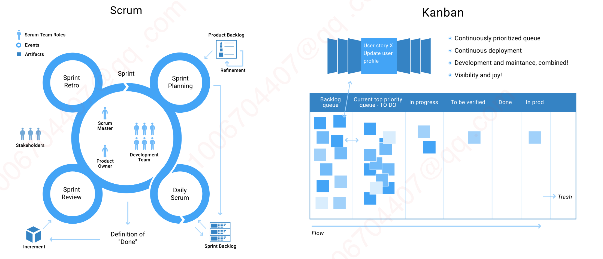

Java 17 2022-09-06 Agile & scrum

Software development life cycle (SDLC) 
+ 传统的waterfall

# 1. Agile

Agile project management is an iterative development methodology that values
+ human communication & feedback
+ adapting to changes
+ producing working results

Agile(敏捷开发)强调软件开发应**快速响应**客户与市场的**需求变更**, 用**短小而频繁的iteration**来快速地满足客户与市场变化的需求, 同时保证产品的**可交付性** (能用)

传统的waterfall开发模式需要长时间的planning, 产品的迭代速度很慢, 开发周期较长, 当需求发生变更时产品的响应周期较长, 很难满足当下互联网时代激烈的市场变化和需求

12 Agile Principles Behind the Agile Manifesto
+ 看PPT

# 2. Scrum
Scrum: 英式橄榄球, 当一个队员抢到球后就全力把球带到对方门

Scrum实际是一种用来实现Agile的工作模式, 1个Agile的开发iteration相当于1个Scrum的sprint

流程描述:
+ **Product BackLog**: 相当于一个wish list, 由大家往里面加各种想实现的点子
+ **Sprint Backlog**: 在Sprint Planning时, 由team里的product ownser, scrum master和少量的senior developer决定wish list里哪些item要真正加入这次sprint的todo list被实现, 每个todo的effort point是多少. 也是y一个sprint的起点 
  + 在澳洲的工作环境下, 一般sprint bakclog中的items被确定下来后不会再修改了, 提前完成了也不会再往里加入新的item
+ **Daily scrum**: developer每天上班第一件事先去Sprint backlog中抢任务做
  + 可以利用kanban等tool, 来选择哪些任务由自己完成, 需要在item上签名
+ **Sprint review**: tech上的review, review code quality, 检查code是否可以被加入到生产环境
+ **Sprint retrospective**: 类似团建, 在sprint结束时, 团队回顾本次sprint哪些地方做得好, 哪些地方做的不好, 和产品, tech无关, 主要是解决团队磨合的问题