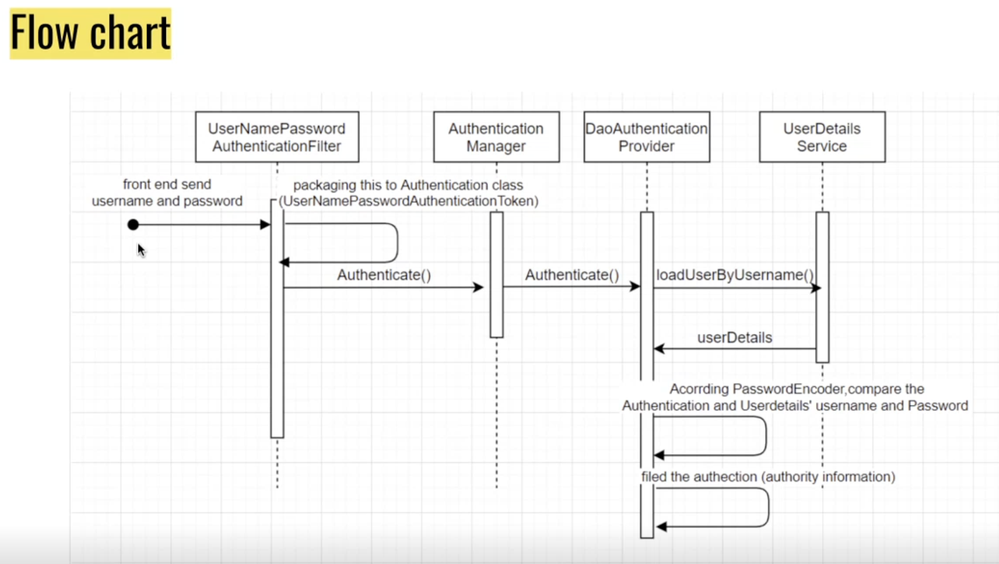

Steven 2-24 tut: spring security继续

# 要点

+ 体会层级结构之间的依赖注入
+ 体会authentication flow chart, 每个层级的责任是什么

下节课讲验证成功后的业务逻辑

# Cors

在用户的发来的数据进入controller前, 需要现在filter chain那里对数据进行筛分, 合格的才能进入controller. Spring security 默认配置了大约10层filter, 组成filter chain, 现在我们来做其中一个filter的'改'


## 简单的背景介绍 0min-

前端访问后端, 我们的例子里是localhost:3000 访问localhost:8080, 浏览器会发现你前端请求的地址和自己的地址不同 (虽然IP相同但是port不同) 浏览器就会认为它们不是同源的(实际上一般很难做前后端同源的), 所以一般需要额外布置cors

cors是浏览器的行为：会拦截返回的内容， 但不会拦截指令, 

```java
比如前端发送get request,  后端可以接收并处理该request, 但是将get信息返回给前端时, 浏览器会发现前后端不同源于是就拦截了返回的信息不让用户去看返回的信息, post, update, delete这些方法不会被cors干涉, 因为这些方法的核心操作已经在后端被完成了.
```


## Cors在filter chain那里做 5min-

在SecurityConfiguration类中添加关于cors的操作

+ 注意类头上加上两个Annotation: `@ConfigurationProperties()`和`@Setter`
+ 注入4个依赖作为成员
  + 注意我们是将环境变量(e.g. allowedOrigins)写在application.yml里的, 通过`@ConfigurationProperties()`来指定去读取他们

```java
@Setter
@EnableWebSecurity
@Configuration  // 一般和@Bean一起用
@ConfigurationProperties(prefix = "management.endpoints.web.cors")  // 需要class里有setter, 这里是指示去读取appication.yml中的key为"management.endpoints.web.cors"数据
public class SecurityConfiguration {

    private List<String> allowedOrigins;        // 在本地环境, UAT环境, production环境的前端的origin的IP:port是不同的(他们是环境变量, 一般我们把他们写到不同的application.yml文件里), 不写死为了提高代码的适用型
    private List<String> allowedMethods;
    private List<String> allowedHeaders;
    private List<String> exposedHeaders;


    @Bean           // 用来修饰方法, 可以将方法的返回对象存起来;  @Component标注在Class上, 可以将Class变成instance存起来.
    public SecurityFilterChain filterChain(HttpSecurity http) throws Exception {
        return http
                .csrf().disable()       // disable 了一层 filter, spring security默认提供了大概10层filter
                .cors().configurationSource(request -> {
                    var cors = new CorsConfiguration();
                    cors.setAllowedMethods(allowedMethods);
                    cors.setAllowedOrigins(allowedOrigins);
                    cors.setAllowedHeaders(allowedHeaders);
                    cors.setExposedHeaders(exposedHeaders);
                    return cors;
                })
                .and()      //不用纠结, 这就是spring security的语法, 怎么设计的我们就怎么写
                .authorizeRequests()
                .antMatchers( "/**").permitAll()
                .anyRequest().authenticated()
                .and().build();
        // csrf 保护get()方法之外的方法(e.g. post, patch, delete)免受互联网攻击, csrf().disable()表示免受这种保护, 一般前端用cookie才会启用
        // antMatchers("/**") 路径匹配: "/**"表示匹配根路径下的所有路径, "/*"表示匹配根路径下一层路径
    }

    @Bean
    public PasswordEncoder passwordEncoder(){
        return new BCryptPasswordEncoder();
    }
}
```


# 验证环节 24min-

正式进入spring security 验证环节

对安全相关的, 其实是对filter chain的增删改. 上面的例子里我们其实已经做的对filter的'删' (e.g. csrf().disable()), '改'(e.g. cors().configurationSource()), 现在我们来做filter的'增'


## Authentication 流程介绍 30min- 



类比住酒店

```java
UserNamePassword AuthenticationFilter: 把用户的username和password放在token令牌(理解成身份证, username相当于你的名字, password相当于你的身份证号)里
Authentication Manage: 前台的服务员接过你的身份证准备接入公安的身份证系统验证信息
DaoAuthentication Provider: 公安的身份证系统
UserDetailService: 公安身份证系统的数据库查询
```


## filter 雏形 40min-

在application路径下新建filter package, 然后在里面新建如下类

```java
public class EmailAndPasswordFilter extends UsernamePasswordAuthenticationFilter {
    // TODO: 重写父类方法

    /**
     *
     * @param request from which to extract parameters and perform the authentication （用户的username和password会放在request）
     * @param response the response, which may be needed if the implementation has to do a
     * redirect as part of a multi-stage authentication process (such as OpenID).
     * @return
     * @throws AuthenticationException
     */
    @Override
    public Authentication attemptAuthentication(HttpServletRequest request, HttpServletResponse response) throws AuthenticationException{

    }

    @Override
    protected void successfulAuthentication(HttpServletRequest request, HttpServletResponse response, FilterChain chain,
                                            Authentication authResult) throws IOException, ServletException {

    }

    @Override
    protected void unsuccessfulAuthentication(HttpServletRequest request, HttpServletResponse response,
                                              AuthenticationException failed) throws IOException, ServletException {

    }
}
```


## 实现UserDetailsService 44min-

其中Authentication Manageer和DaoAuthentication Provider 已经被Spring security实现好了, 我们只需要去实现自己的UserDetailsService即可


UserDetailService

在service package下新建ApplicationUserService类 实现UserDetailsService接口

+ loadByUsername( )返回的UserDetails的实现类中包含从数据库中按指定username查到的password, 返回去会和用户输入的password做对比来进行authentication  (对比这个过程spring security已经实现好了)

```java
package com.example.cruddemorecode.service;

import com.example.cruddemorecode.entity.UserInfo;
import com.example.cruddemorecode.exception.ResourceNotFoundException;
import com.example.cruddemorecode.repository.UserRepository;
import lombok.RequiredArgsConstructor;
import org.springframework.security.core.userdetails.User;
import org.springframework.security.core.userdetails.UserDetails;
import org.springframework.security.core.userdetails.UserDetailsService;
import org.springframework.security.core.userdetails.UsernameNotFoundException;
import org.springframework.stereotype.Service;

import java.util.Collections;

@Service
@RequiredArgsConstructor
public class ApplicationUserService implements UserDetailsService {

    private final UserRepository userRepository;

    @Override
    public UserDetails loadUserByUsername(String email) throws UsernameNotFoundException {

        // 从数据库中查询指定email的User entity
        UserInfo userInfo = userRepository.findByEmail(email).orElseThrow(() -> new ResourceNotFoundException("User"+ email));

        // User是UserDetails的实现类
        return new User(email, userInfo.getPassword(), Collections.emptyList());    // 第三个arg, Authority目前没用， 先只写个empyList
    }
}
```


:bangbang: 中间发现我们之前自己写的entity: User和Spring security中提供的User class重名了, refactor 原来的User entity class , 更名为UserInfo (refactor > preview > select all 再apply, 就会把代码中的User改名为UserInfo)


## 依赖注入 58min-

对于authentication flow chart中的层级结构, 我们做依赖注入: 

```java
filterChain ----> filter ---> Authentication Manager ----> DaoAuthentication Provider ----> UserDetailService
```

即可以让各层连接起来


SecurityConfiguration class:

+ 把authenticationManager 注入到 要添加的filter里, 然后把filter添加到filterChain里
  + `.addFilter(new EmailAndPasswordFilter(authenticationManager()))		// 添加新的filter ****`
+ 添加authenticationManager(), 它可以返回一个依赖注入好的AuthenticationManager的实现类的实例
+ 新加入` private final ApplicationUserService applicationUserService;` 为成员变量, 搭配`@RequiredArgsConstructor`

```java
package com.example.cruddemorecode.configuration;

import com.example.cruddemorecode.filter.EmailAndPasswordFilter;
import com.example.cruddemorecode.service.ApplicationUserService;
import lombok.RequiredArgsConstructor;
import lombok.Setter;
import org.springframework.boot.context.properties.ConfigurationProperties;
import org.springframework.context.annotation.Bean;
import org.springframework.context.annotation.Configuration;
import org.springframework.security.authentication.AuthenticationManager;
import org.springframework.security.authentication.AuthenticationProvider;
import org.springframework.security.authentication.ProviderManager;
import org.springframework.security.authentication.dao.DaoAuthenticationProvider;
import org.springframework.security.config.annotation.web.builders.HttpSecurity;
import org.springframework.security.config.annotation.web.configuration.EnableWebSecurity;
import org.springframework.security.crypto.bcrypt.BCryptPasswordEncoder;
import org.springframework.security.crypto.password.PasswordEncoder;
import org.springframework.security.web.SecurityFilterChain;
import org.springframework.web.cors.CorsConfiguration;

import java.util.List;

/**
 * @author xueshuo
 * @create 2023-02-23 8:40 pm
 */

@Setter
@EnableWebSecurity
@Configuration  // 一般和@Bean一起用
@ConfigurationProperties(prefix = "management.endpoints.web.cors")  // 需要class里有setter, 这里是指示去读取appication.yml中的key为"management.endpoints.web.cors"数据
@RequiredArgsConstructor
public class SecurityConfiguration {

    private List<String> allowedOrigins;        // 在本地环境, UAT环境, production环境的前端的origin的IP:port是不同的(他们是环境变量, 一般我们把他们写到不同的application.yml文件里), 不写死为了提高代码的适用型
    private List<String> allowedMethods;
    private List<String> allowedHeaders;
    private List<String> exposedHeaders;

    private final ApplicationUserService applicationUserService;   // 需要@RequiredArgsConstructor, 它自己被@Service修饰过会被IOC自动依赖注入 ******************


    @Bean           // 用来修饰方法, 可以将方法的返回对象存起来;  @Component标注在Class上, 可以将Class变成instance存起来.
    public SecurityFilterChain filterChain(HttpSecurity http) throws Exception {
        return http
                .csrf().disable()       // disable 了一层 filter, spring security默认提供了大概10层filter
                .cors().configurationSource(request -> {        // 实际上是对cors的'改'
                    var cors = new CorsConfiguration();
                    cors.setAllowedMethods(allowedMethods);
                    cors.setAllowedOrigins(allowedOrigins);
                    cors.setAllowedHeaders(allowedHeaders);
                    cors.setExposedHeaders(exposedHeaders);
                    return cors;
                })
                .and()      //不用纠结, 这就是spring security的语法, 怎么设计的我们就怎么写
                .addFilter(new EmailAndPasswordFilter(authenticationManager()))		// authentication manager注入到自定义filter里, 再把filter加到filter chain里
                .authorizeRequests()
                .antMatchers( "/**").permitAll()
                .anyRequest().authenticated()
                .and().build();
        // csrf 保护get()方法之外的方法(e.g. post, patch, delete)免受互联网攻击, csrf().disable()表示免受这种保护, 一般前端用cookie才会启用
        // antMatchers("/**") 路径匹配: "/**"表示匹配根路径下的所有路径, "/*"表示匹配根路径下一层路径
    }

    @Bean
    public PasswordEncoder passwordEncoder(){
        return new BCryptPasswordEncoder();
    }

    // 依赖注入 到authentication manager里 *****************************************************
    public AuthenticationManager authenticationManager(){

        DaoAuthenticationProvider daoAuthenticationProvider = new DaoAuthenticationProvider();
        daoAuthenticationProvider.setUserDetailsService(applicationUserService);        // 注入依赖
        daoAuthenticationProvider.setPasswordEncoder(passwordEncoder());        // 需要passwordEncoder来比对用户输入的明文密码和数据库中的密文密码

        return  new ProviderManager(daoAuthenticationProvider);     // 注入依赖, 返回AuthenticationManager的实现类
    }
}

```


## 完成 filter 1h07min-

在上一步中我们可以拿到AuthenticationManager后, 我们就可以把它注入到我们的自定义filter里使用它了

+ 在filter里, 我们其实只定义三个方法  
  + ` attemptAuthentication()`: 将用户的输入的email和password转化为token, 交给authentication manager拿去验证
  + `successfulAuthentication()`
  + `unsuccessfulAuthentication()`

```java
package com.example.cruddemorecode.filter;

import com.fasterxml.jackson.databind.ObjectMapper;
import lombok.RequiredArgsConstructor;
import lombok.SneakyThrows;
import lombok.extern.java.Log;
import org.springframework.security.authentication.AuthenticationManager;
import org.springframework.security.authentication.UsernamePasswordAuthenticationToken;
import org.springframework.security.core.Authentication;
import org.springframework.security.core.AuthenticationException;
import org.springframework.security.web.authentication.UsernamePasswordAuthenticationFilter;

import javax.servlet.FilterChain;
import javax.servlet.ServletException;
import javax.servlet.http.HttpServletRequest;
import javax.servlet.http.HttpServletResponse;
import java.io.IOException;

/**
 * @author xueshuo
 * @create 2023-02-25 11:06 am
 */
@RequiredArgsConstructor
public class EmailAndPasswordFilter extends UsernamePasswordAuthenticationFilter {


    private final AuthenticationManager authenticationManager;


    // TODO: 重写父类方法

    /**
     *
     * @param request from which to extract parameters and perform the authentication （用户的username和password会放在request）
     * @param response the response, which may be needed if the implementation has to do a
     * redirect as part of a multi-stage authentication process (such as OpenID).
     * @return
     * @throws AuthenticationException
     */
    @SneakyThrows
    @Override
    public Authentication attemptAuthentication(HttpServletRequest request, HttpServletResponse response) throws AuthenticationException{

        // step1: 读取request(用户输入)的信息
        LoginRequest loginRequest = new ObjectMapper().readValue(request.getInputStream(), LoginRequest.class); // 读取json格式数据(request), 转化为Java object的形式

        // step2: 根据用户输入的email和password产生token
        UsernamePasswordAuthenticationToken usernamePasswordAuthenticationToken = new UsernamePasswordAuthenticationToken(loginRequest.getEmail(), loginRequest.getPassword());

        // step3: authentication manager尝试验证刚刚产生的token
        return authenticationManager.authenticate(usernamePasswordAuthenticationToken);   // 接收一个token, 返回一个token
    }

    // attemptAuthentication 成功了进入这个方法
    @Override
    protected void successfulAuthentication(HttpServletRequest request, HttpServletResponse response, FilterChain chain,
                                            Authentication authResult) throws IOException, ServletException {

    }

    // attemptAuthentication 失败了了进入这个方法
    @Override
    protected void unsuccessfulAuthentication(HttpServletRequest request, HttpServletResponse response,
                                              AuthenticationException failed) throws IOException, ServletException {

    }
}
```


## 回顾 1h21min-1h27min

回归这节课讲了什么


## Q&A1h27min-

关于循环依赖的问题

```java
@RequiredArgsConstructor 方式注入依赖, 可以检测循环依赖, 一般选择这种方式注入依赖

@Autowired 方式注入依赖 无法检测循环依赖, 可能要到生产环境才能发现crash, 不推荐使用
```


下节课讲验证成功后做什么