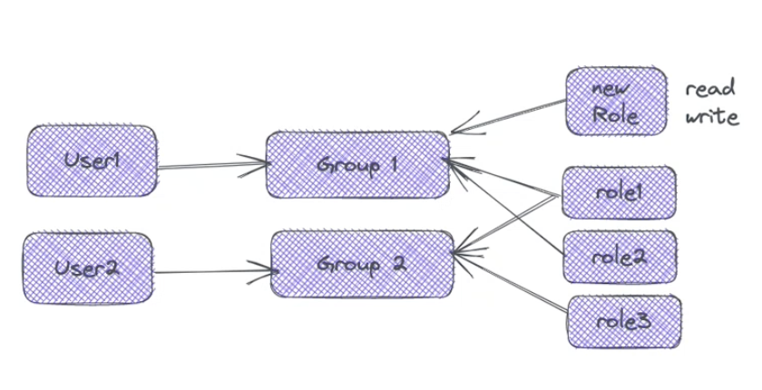
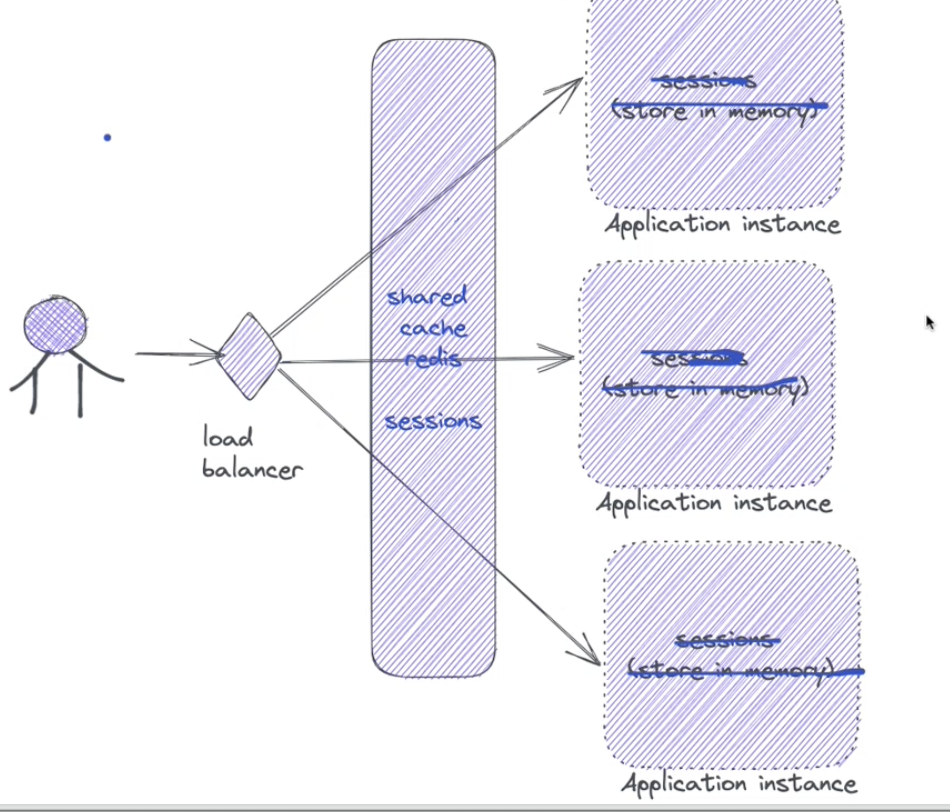
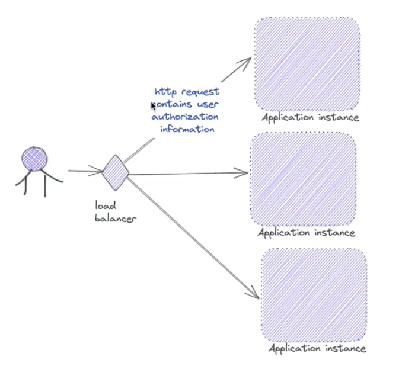
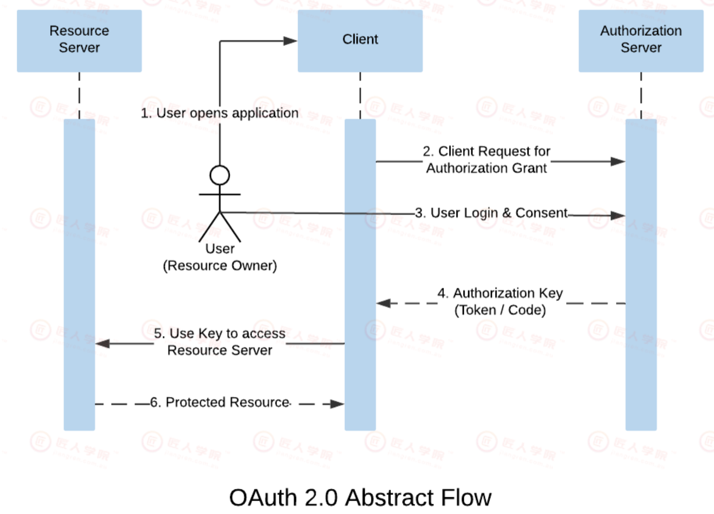
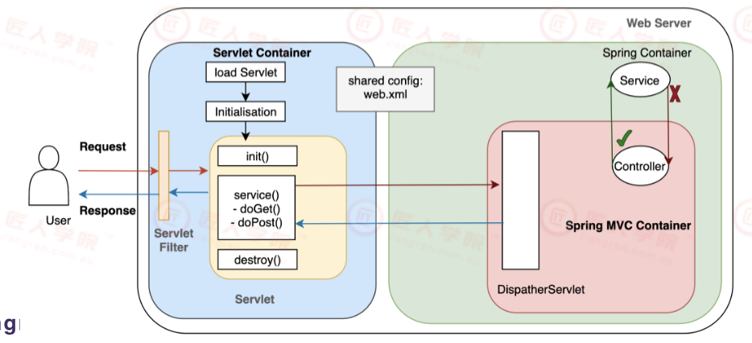
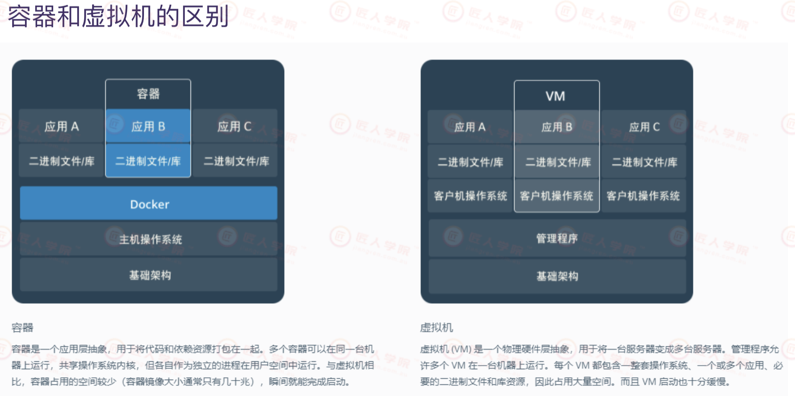
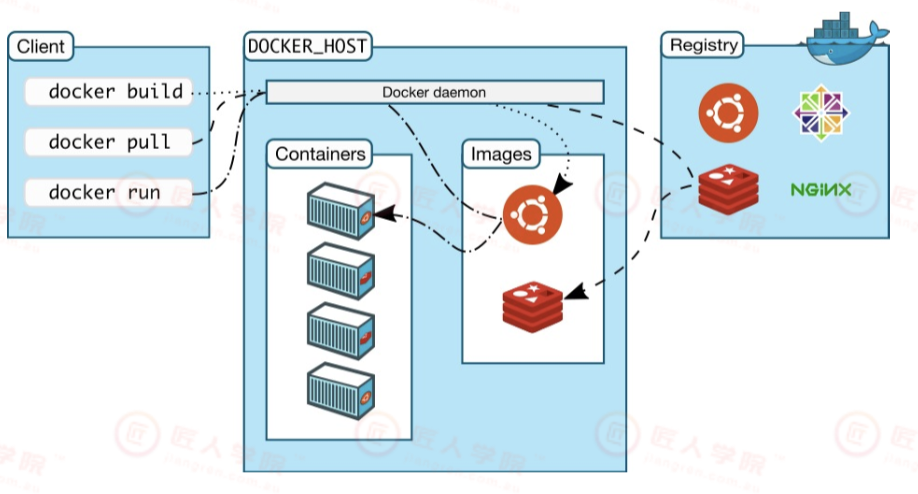

Java18期 2-21 lec


# 1. Security前置知识 0min-

## Introduction 0min-

Security 属于是 Non-Functional Requirement, devops team的工作之一是确保developer的infrastructure没有安全漏洞


Encrypt/Decrypt：对称加密，非对称加密

存储密码的类型为啥是char(64)?


X.509 certificate: 密钥管理与分发的解决方案, AWS里也有负责certifcate的管理与分发的系统


Glossary: AAA (Authentication(认证), Authorisation(授权)  and Accounting ) 

区分Authentication, Authorisation, 


很多大公司会有专⻔针对用户管理方面有一套完整的SSO（Single SignOn单点登录），ACL（access control list权限访问控制），UC(用户中心)系统。

关于SSO: e.g. 用户通过前端登录会被redirect到 SSO系统， 然后SSO系统来负责用户的登录功能


18min-

 Daily practices: Role-based access control, https, avoid SQL injection,no plain text for any password...  

+ Role-based access control: 一个role表示一种权限,  把不同的role放到group, user被分配到不同的group. group的作用，听起来有点像多对多关系中的中间表功能



+ Https: 自己去了解https和http的区别


## Security 场景和解决方案 24min-

对我们P3来说的场景: 

+ web登录
+ 第三方API的使用
+ 安全信息传递

鉴权(鉴别用户的登录状态)的方式

+ 使用Session(被保存在server side)保存用户鉴权结果。这种方式依赖Session来维护状态

  + 传统做法是把session存在application instance对应的memory中, 但问题是如果有多个application instance (e..g 如果用分布式服务器 ) 鉴别用户的登录状态就很不方便
  + 改进做法是将session存在shared cache redis中, 被多个application instance所共享

  

  + 另一种做法, 把能够鉴别用户登录状态的信息放在http request里面  (使用token吗?)

  

+ 使用OAuth进行鉴权。 OAuth目前多在开放平台的公司. OAuth允许第三方登录, 比如chatGPT允许你用google账户登录

  + 锤姐建议P3可以用OAuth2, 比如让用户用gmail登录

  

+ 自行采用Token进行鉴权，例如JWT (JWT是 Json Web Token 的缩写。它是基于 RFC 7519 标准定义的一种可以安全传输的 小巧 和 自包含 的JSON对象。由于数据是使用数字签名的，所以是可信任的和安全的。JWT可以使用HMAC算法对secret进行加密或者使用RSA的公钥私钥对来进行签名。)

  


## Servlet and Servlet filter 46min-


+ A Servlet is a class that handles requests, processes them and replies with a response.

+ Servlets are under the control of another Java application called a Servlet Container. When an application running in a web server receives a request, the Server hands the request to the Servlet Container – which in turn passes it to the target Servlet.

+ Servlet filter: A filter is an object that performs filtering tasks on either the request to a resource (aservlet or static content), or on the response from a resource, or on both

  + a filter is more of a request pre-processor and a response post-processor.
  + Filters are usually used where multiple servlets and any other Java EE web components requiresome common functionality, such as authentication, logging, and encryption.

  

如下图



+ 最外层的Web Server,  我们之前跑的例子用的是TomCat. 我们的SpringBoot application是跑在TomCat 里的
+ Servlet container相当于是一个中间层


# 2. Spring Security 51min-

## Introduction 

Spring Security 基于 Spring 框架，提供了一套 Web 应用安全性的完整解决方案。原名AcegiSecurity，最早于2003年起源于Spring社区，由那时的社区成员们尝试着使用基于Spring的bean来实现安全机制，但并未正式发布，直到2004年3月才正式在SourceForge上成立项目，当时命名为”TheAcegi Security System for Spring”。

Spring Security并不局限于Spring MVC，虽然它是基于Spring Framework实现的，但可以独立于MVC应用在其他框架。Spring Security的安全管制并不只限制于Web请求，除此之外它还可以针对方法调用通过AOP的方式进行安全管制，甚至可以对域对象实例（Domain Object Instance）进行访问控制。

在用户认证方面，Spring Security 框架支持主流的认证方式，包括 HTTP 基本认证、HTTP 表单验证、HTTP 摘要认证、OpenID 和 LDAP 等。在用户授权方面，Spring Security 提供了基于⻆色的访问控制和访问控制列表（Access Control List: ACL），可以对应用中的领域对象进行细粒度的控制。


术语

+ Authentication: refers to the process of verifying theidentity of a user, based on provided credentials. Atypical example is entering a username and a passwordwhen you log in to a website. You can think of it as ananswer to the question Who are you
+ Authorization: refers to the process of determining if auser has proper permission to perform a particularaction or read particular data, assuming that the user issuccessfully authenticated. You can think of it as ananswer to the question, Can a user do/read this? 
+ Principle:  refers to the currently authenticated user
+ Granted authority:  refers to the permission of the authenticated user.
+ Role:  refers to a group of permissions of the authenticated user.  这里的role相当于下图的Group, 这里的permission相当于下图的role


## Hands-on Spring security 57min-


## Spring Security 基础类


1h54min - 2h2min 休息

# 3. Docker 2h2min-

Docker背后是操作系统的知识, Docker主要是为了部署我们代码仓库中的代码


## Introduction

Docker 是 Docker Inc 公司开源的一项基于 Ubuntu LXC 技术之上构建的应用打包运行时引擎，源代码托管在 GitHub 上，完全基于 Go 语言开发并遵守 Apache License 2.0 协议开源。

Docker 是世界领先的软件容器平台。

+ 开发人员利用 Docker 可以消除协作编码时“在我的机器上可正常工作”的问题。
+ 运维人员利用 Docker 可以在隔离容器中并行运行和管理应用，获得更好的计算密度。
+ 企业利用 Docker 可以构建敏捷的软件交付管道，以更快的速度、更高的安全性和可靠的信誉为 Linux 和 Windows Server 应用发布新功能


Docker解决的问题

+ 复杂的环境配置管理：从各种 OS 环境到各种中间件环境以及各种应用环境。Docker 技术旨在简化部署多种应用实例环境依赖，如 Web 应用、后台应用、数据库应用、大数据应用（例如Hadoop集群）、消息队列（例如Kafka）等等都可以打包成一个镜像部署。
+ AWS 的成功，引导开发者将应用转移到云上，解决了硬件管理的问题，然而软件配置和管理相关的问题依然存在（AWS Cloudformation提供相关功能）。Docker 的出现正好能帮助软件开发者开阔思路，尝试新的软件管理方法来解决这个问题。
+ 虚拟化手段的变化：云时代采用标配硬件来降低成本，采用虚拟化手段来满足用户按需分配的资源需求以及保证可用性和隔离性。然而无论是 KVM 还是 Xen，在 Docker 看来都在浪费资源，因为用户需要的是高效运行环境而非 OS，GuestOS 既浪费资源又难于管理，轻量级的 LXC 更加灵活和快速。
+ 容器技术的便携性：LXC 在 Linux 2.6 的 Kernel 里就已经存在了，但是其设计之初并非为云计算考虑的，缺少标准化的描述手段和容器的可便携性，决定其构建出的环境难于分发和标准化管理





## Docker组成  2h09min-

客户端和服务器： Docker是一个（C/S）架构的程序。Docker客户端只需向Docker服务器或者守护进程(Docker daemon)发出请求，服务器或者守护进程将完成所有的工作并返回结果。Docker守护进程有时也称为Docker引擎

镜像（Image）：镜像就是程序运行的环境的只读版本。其包含了所有程序的依赖软件和配置

容器：Docker 利用容器（Container）来运行应用。容器是从镜像创建的运行实例。它可以被启动、开始、停止、删除。每个容器都是相互隔离的、保证安全的平台。可以把容器看做是一个简易版的 Linux 环境（包括root用户权限、进程空间、用户空间和网络空间等）和运行在其中的应用程序

仓库Repository：仓库用来保存镜像，可以理解为代码控制中的代码仓库。




## Docker命令实战 

看ppt, 老师跳过


## 用Docker打包SpringBoot程序 2h16min-


用 Dockerfile定义image. 在spring boot application的根路径下(build.gradle所在的路径)新建dockerfile

```dockerfile
FROM openjdk:17.0.2
COPY ./build/libs/docker-demo-0.0.1-SNAPSHOT.jar /usr/src/hello/		# build spring boot Project之后产生的jar包
WORKDIR /usr/src/hello
EXPOSE 8080
CMD ["java", "-jar", "docker-demo-0.0.1-SNAPSHOT.jar"]
```


在intellij 命令行输入

```bash
docker build -t docker-test-demo .
```

之后可以查看docker image

```bash
docker images
```

启动应用程序的container

```bash
docker run -p 8080:8080 docker-test-demo
```


### 2h30min-

上面的例子里我们是手动在intellij上build project, src code提交到github上后, 运行build project产生Jar包也有脚本

一个例子:

https://github.com/kingtigerwin/wholesale

```dockerfile
# syntax=docker/dockerfile:experimental
FROM openjdk:11 AS build
WORKDIR /workspace/app

COPY . /workspace/app
#RUN --mount=type=cache,target=/root/.gradle ./gradlew clean build
RUN ./gradlew clean build

RUN mkdir -p build/dependency && (cd build/dependency; jar -xf ../libs/*.jar)

FROM openjdk:11
VOLUME /tmp
ARG DEPENDENCY=/workspace/app/build/dependency
COPY --from=build ${DEPENDENCY}/BOOT-INF/lib /app/lib
COPY --from=build ${DEPENDENCY}/META-INF /app/META-INF
COPY --from=build ${DEPENDENCY}/BOOT-INF/classes /app
COPY --from=build /workspace/app/scripts/start.sh /app
RUN chmod +x /app/start.sh
ENTRYPOINT ["sh", "-c", "/app/start.sh"]
```


## docker-compose 2h35min-

Docker Compose是一个编排多容器分布式部署的工具，提供命令集管理容器化应用的完整开发周期，包括服务构建，启动和停止。

Compose 中有两个重要的概念：

+ 服务 ( service )：一个应用的容器，实际上可以包括若干运行相同镜像的容器实例
+ 项目 ( project )：由一组关联的应用容器组成的一个完整业务单元，在 docker-compose.yml文件中定义。

Compose 的默认管理对象是项目，通过子命令对项目中的一组容器进行便捷地生命周期管理。可⻅，一个项目可以由多个服务（容器）关联而成， Compose 面向项目进行管理


# 4. P3 backend summary 2h37min-

Good practice

```java
Did your team write tests? (商业项目必须得有test)
  - Unit tests
  - Integration tests
  - End to end tests
  
Did your team develop functionalities from end-to-end?
  - Front end
  - Rest endpoint design
  - Back end logic implementation
  - Db design and migration scripts (商业项目必须有database migration, 写在简历上是加分项)
  
大家不要为了实现功能而实现功能, 还要保证商业项目的要求: test, database migration...
  
  
  - Did you perform code reviews? And how?
  - Did you try code refactoring? And how?
     
  - How did you design tables in a database?
  - Did you use flyway or other tools to do db migration?
  	- Have you changed an existing migration script file?

    
  - Did you understand how to build docker image for yourapplication?
  - Did you understand your build pipeline?
  - Did you understand the UAT and production environment?
```


## Front-end deployment 2h42min-

PPT图


## Back-end deployment 2h45min-

PPT图


## Infrastructure as code 

PPT图


## Cloud environemnt 2h51min-

有点系统设计的意思， 很多devops的知识

PPT图


作为developer, 至少要知道在哪里找log查看错误, 推荐developer去了解我们的source code是如何被deployed的


# At last 

Message queue 这节课不讲了， 想学的话看以前的课吧

