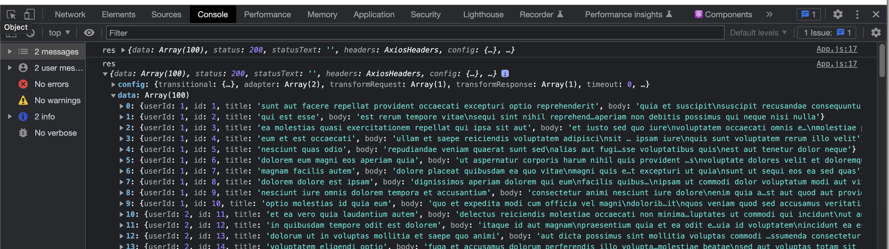

1-30 React

React tut1: Blog List Demo


# 要点

+ jsx中js写法要用{ }包住, 必须有一个`<div>` (或其他的block 元素)爆竹要返回的html代码 
+ useState, useEffect的使用
+ 如何通过axios向后端索要数据
  + 需要try-catch来handle Exception: 如果数据没有索要成功呢

+ 写react project的基本流程
  + step1: 准备工作: 先根据ui, 建立目录结构
  + step2: 根据ui, 先写个假的静态页面调试css
  + :star: step3: 写hooks, 同时定义交互逻辑
    + 需要哪些state ---> useState
    + 何时触发交互逻辑 ---> useEffect(arg1, arg2)
      + Arg1: 待触发的函数
      + Arg2: [ele1, ele2...] 表示任何一项变化时就触发arg1
        + [] 表示初次加载页面时触发arg1


下节课讲状态管理: useReducer, useContext


# 需求

从后端返回一个String[], 将String[]中的元素按每页面10个输出在网页中, 分成多个页面, 并提供按钮来切换这些页面

网页结构:

+ 顶部 title
+ 中部 posts
+ 底部 pagination 显示页码


# 1. 准备工作

5min-
老师在code sandbox react中写, 

+ 我选择在vscode里写, 在vscode中安装axios依赖会导致npm start run失效

安装axios依赖, 在react project路径下 `npm install axios`, 可能会有提示说vulnerability, 先别管


算了就用codesandbox react吧


---

几个面试问题 11min- 

为什么要使用hooks?


functional components中调用hooks要注意什么: 

+ 避免在循环中使用hooks


React哲学前两部 -21min

创建初始代码框架

App.js

Posts.js

Pagination.js

试验性地在每个component中写个hello world, 确保他们能先import成功

这里都是按流程走的, 不需要动脑子, 就不展示代码了


# 2. 正式开始 22min-

## 2.1 静态页面, 调试css

先按照需求的ui写个mock的静态页面 22min-

主要为了方便写css


Pagination.js

```react
const Pagination = () =>{
    return (
        <nav>
            <ul className="pagination">
                <li className="pagination-item">
                    <button className='pagination-btn'>1</button>
                </li>
                <li className="pagination-item">
                    <button className='pagination-btn'>2</button>
                </li>
            </ul>
        </nav>
    )
}

export default Pagination;
```


Post.js

```react
const Post = () =>{
    return (
        <ul className = 'list-group'>
            <li className='list-group-item'>post 1</li>
            <li className='list-group-item'>post 2</li>
        </ul>
    )
}

export default Post;
```


App.js

```react
import './App.css';

import Pagination from './components/Pagination'
import Post from './components/Post'

function App() {
  return (

    <div className="container">
      <h1 className="title">My blog list</h1>
      <Post/>
      <Pagination/>
    </div>
  );
}

export default App;
```


此时就模拟了最终效果的一个静态页面, 我们接着来做layout与style


---

编写css调整样板的布局和样式 27min-

App.css

```css
.App {
  text-align: center;
  font-family: sans-serif;
}

/* 从上往下写 */

.title{
  display: flex;
  justify-content: center;
}

.container{
  max-width: 80%;
  margin: 0 auto;
}

.list-group{
  display: flex;
  flex-direction: column;
}

.list-group-item{
  padding: 0.75rem 1.25rem;
  border: 1px solid rgba(0,0,0,0.125);
  background-color: #fff;

  /* 消除item的border之间的重叠 */
  margin-bottom: -1px;;
  list-style-type: none;

}

.pagination{
  display: flex;
  list-style: none;

  /* 让page item可以流动, 当页面宽度缩小时 */
  flex-wrap:wrap;
}

.pagination-btn{
  color: #0d7bff;
  background-color: #fff;
  border: 1px solid #dee2e6;

  /* 去除border重叠 */
  margin-left: -1px;
  /* 把button 撑大 */
  padding: 0.5rem 0.75rem;
}
```

这里其实可以把App.css也拆开放到各个组件里去

得到如下的静态页面


## 2.2 接收从后端发来的数据 39min-


现在我们开始考虑如何把后端发来的List数据做成分页的, 先做好接收后端发来的数据


useEffect 43min-

如下， 当第二个argument为[], 表示在初次渲染和后续更新的时候会刷新

```react
useEffect(()=>{
		functionToBeImplemented()
  }, [])
```


App.js

+ 定义state
  + [post, setPost]
  + [loading, setLoading]
+ 定义接收后端数据的函数fetchPosts()
  + 里面用到axios (ajax也可做到)
  + axios get数据有可能出错, 所以还要用try-catch把执行逻辑包起来做Exception handling以防止页面崩溃
  + 适时地改变loading的状态, 用来表示是否在loading axios返回的信息
+ useEffect hooks定义何时调用fetchPosts()
  + 这里我们定义为当初次渲染和后续更新的时候会刷新

```react
import {useState, useEffect} from 'react'   // 注意要导入hooks
import axios from 'axios';

import './App.css';

import Pagination from './components/Pagination'
import Post from './components/Post'


function App() {
	
  // ******************* 新定义 state *******************
  const [post, setPost]= useState([]);
  const [loading, setLoading] = useState(false);
	
  // ******************* 定义函数用来接收从后端传来的数据 *******************
  const fetchPosts = async() => {
    setLoading(true); // 表示开始loading后端的数据
    // 因为js是单线程的, 所以需要try-catch包住 axios.get('')以防其失败整个页面崩溃
    try{
      const res = await axios.get('https://jsonplaceholder.typicode.com/posts');
      console.log('res', res);  
      setPosts(res.data); // res is an object, res.data is an array
      setLoading(false);  // 成功load到后端的数据, loading状态应该改为false
    }catch(error){    // 可以具体在这里写error handlding的逻辑, 这里就先不写了
      setLoading(false);
      // 甚至可以具体set一个状态值, 比如401, 404, 500, 对应处理
    }
  }
  
	// ******************* useEffect calls fetchPosts() *******************
  // 当组件渲染时, 调用fetchPosts()
  useEffect(()=>{
    fetchPosts()
  }, [])  // 第二个argument为[], 表示第一次挂载App时就会调用fetchPosts()


  return (
    <div className="container">
      <h1 className="title">My blog list</h1>
      <Post/>
      <Pagination/>
    </div>
  );
}

export default App;
```


至此, 可以看到后端传来的数据




## 2.3 :moon: 将list数据分页 59min-

现在我们应该将axios返回来的list进行分页, 然后每次点击对应page的button只显示currentPage内的posts

在App.js里新定义几个state, 用来做分页

```react
const [currentPage, setCurrentPage] = useState(1);
const [currentPosts, setCurrentPosts] = useState([]);
const [postsPerPage] = useState(10);
```


找state 和 props放进useEffect()的第二个argument

在App.js中定义如何将post list分页, 以及何时分页

```react
useEffect(()=>{
    // get current page posts. 
    // e.g. 点击'5'的button, 对应显示在post lists 中index为40-49的posts
    const indexOfLastPost = currentPage * postsPerPage;  // 50 
    const indexOfFirstPost = indexOfLastPost - postsPerPage;  // 40
    const currentPostArr = posts.slice(indexOfFirstPost, indexOfLastPost);  //[40, 50) 左闭右开
    setCurrentPosts(currentPostArr);
  }, [currentPage, postsPerPage, posts])    // 当[currentPage, postsPerPage, posts]中任何一项发生变化. 就会触发useEffect()中的第一个argument的函数
```


---

一道面试题 1h17min-1h21min

Props 与 state的区别

+ 父传子props:  是readonly, immutable
+ 子传父: callback
+ 父传孙子(不直接相关的component share 数据):  redux toolkit(大项目用这个), context

---

### 2.3.1 将currentPosts里的数据反馈到Post组件里去 1h21min-


App.js

+ 将currentPosts, loading 从App.js传给Post component

```react
return (
    <div className="container">
      <h1 className="title">My blog list</h1>
      <Post currentPosts={currentPosts} loading={loading}/>
      <Pagination/>
    </div>
  );
```


Post.js

+ 将currentPosts, loading 从App.js传过来
+ 将currentPosts适时转化为html, 用map()
  + 边界条件的check: 只有当currentPosts内有内容再转化为html
+ 注意下jsx中要写js语法, 需要{}

```react
const Post = ({currentPosts, loading}) =>{

    if(loading){    // if still loading data, remind user 
        return <h2>Loading</h2>
    }

    return (
        <ul className = 'list-group'>
            {   
                currentPosts.length > 0 &&      // boundary condition: currentPosts有内容再返回html
                currentPosts.map(ele => {
                    return (
                        <li key={ele.id} className='list-group-item'>
                            {ele.title}
                        </li>
                    )
                })
            }
        </ul>
    )
}

export default Post;
```


### 2.3.2 pagination 1h29min-


#### 将posts的数据反馈到pagination里

App.js 

+ 将几个state传入 Pagination Component

```react
return (
    <div className="container">
      <h1 className="title">My blog list</h1>
      <Post currentPosts={currentPosts} loading={loading}/>
      <Pagination 
        postPerPage = {postsPerPage} 
        totalPosts = {posts.length} 
        currentPage = {currentPage}
        setCurrentPage = {setCurrentPage}
      />
    </div>
  );
```


Pagination.js

+ 定义如何计算总共多少页, 何时计算
  + 注意一定是App.js中我们先通过后端接收到 posts, 再去计算总共多少页, 所以useEffect()的依赖argument不能为[]
+ 注意pageNumbers 作为state存在, 而不是普通的变量, 而且目前我们还没把它传递到别的组件
  + 是不是因为pageNumbers要参与jsx? :question: 需要看下尚硅谷的state理解
+ 用map时注意key要unique

```react
import { useState, useEffect } from "react";

const Pagination = ({postsPerPage, totalPosts, currentPage, setCurrentPage}) =>{

    const [pageNumbers, setPageNumbers] = useState([])

    useEffect(()=>{
        let arr = [];
        for(let i =1; i <= Math.ceil(totalPosts/postsPerPage); i++){
                arr.push(i);
        }
        setPageNumbers (arr);
        
    },[totalPosts, postsPerPage])       // 当[totalPosts, postPerPage]任意一项改变时, 触发第一个argument函数 
    // 注意如果你第二个argument为[], 表示初次加载页面时会触发执行函数, 而我们接收从后端的数据也是初次加载页面时触发
    // 如果这样, 那PageNumbers就是空的
    // 很明显有一个先后顺序: 应该是先接收后端数据， 再执行这里的useEffect()中的函数.  

    return (
        <nav>
            <ul className="pagination">
                {
                    pageNumbers.map(number => {
                        return (
                            <li key={number} className="pagination-item">
                            <button className='pagination-btn'>{number}</button>
                         </li>
                        )
                    })
                }
            </ul>
        </nav>
    )
}

export default Pagination;
```


#### on click pagination button 1h45min-1h52min

Pagination.js的最终return项:

+ Button onClick, 点击button 就setCurrentPage为当前页面的index， 同时控制conditional style 的background
+ Conditional style也可直接写在jsx里

```react
return (
        <nav>
            <ul className="pagination">
                {
                    pageNumbers.map(number => {
                        return (
                            <li key={number} className="pagination-item">
                            <button 
                                className='pagination-btn' 
                                onClick= {()=> setCurrentPage(number)}
                                style={{background: currentPage === number ? 'lightblue':null}}
                                >
                                    {number}
                            </button>
                         </li>
                        )
                    })
                }
            </ul>
        </nav>
    )
```


至此, 需求的效果就实现了


# 3. 最终代码

App.js

```react
import {useState, useEffect} from 'react'   // 注意要导入hooks
import axios from 'axios';

import './App.css';

import Pagination from './components/Pagination'
import Post from './components/Post'


function App() {

  const[posts, setPosts]= useState([]);            // 用来存后端发来的post list
  const[loading, setLoading] = useState(false);    // 用来表示是否loading后端发来的数据
  
  const[currentPage, setCurrentPage] = useState(1);     // 表示currentPage index
  const[currentPosts, setCurrentPosts] = useState([]);  // 用来存currentPage对应的post lists
  const[postsPerPage] = useState(10);     // currentPage对应的post lists的长度

  const fetchPosts = async() => {
    setLoading(true); // 表示开始loading后端的数据
    // 因为js是单线程的, 所以需要try-catch包住 axios.get('')以防其失败整个页面崩溃
    try{
      const res = await axios.get('https://jsonplaceholder.typicode.com/posts');
      console.log('res', res);  
      setPosts(res.data); // res is an object, res.data is an array
      setLoading(false);  // 成功load到后端的数据, loading状态应该改为false
    }catch(error){    // 可以具体在这里写error handlding的逻辑, 这里就先不写了
      setLoading(false);
      // 甚至可以具体set一个状态值, 比如401, 404, 500, 对应处理
    }
  }

  // 当组件渲染时, 调用fetchPosts()
  useEffect(()=>{
    fetchPosts()
  }, [])  // 第二个argument为[], 表示第一次挂载App时就会调用fetchPosts()

  // 定义如何将post list分页, 以及何时分页
  useEffect(()=>{
    // get current page posts. 
    // e.g. 点击'5'的button, 对应显示在post lists 中index为40-49的posts
    const indexOfLastPost = currentPage * postsPerPage;  // 50 
    const indexOfFirstPost = indexOfLastPost - postsPerPage;  // 40
    const currentPostArr = posts.slice(indexOfFirstPost, indexOfLastPost);  //[40, 50) 左闭右开
    setCurrentPosts(currentPostArr);
  }, [currentPage, postsPerPage, posts])    // 当[currentPage, postsPerPage, posts]中任何一项发生变化. 就会触发useEffect()中的第一个argument的函数


  return (
    <div className="container">
      <h1 className="title">My blog list</h1>
      <Post currentPosts={currentPosts} loading={loading}/>
      <Pagination 
        postsPerPage = {postsPerPage} 
        totalPosts = {posts.length}   
        currentPage = {currentPage}
        setCurrentPage = {setCurrentPage}
      />
    </div>
  );
}

export default App;
```


App.css

```react
.App {
  text-align: center;
  font-family: sans-serif;
}

/* 从上往下写 */

.title{
  display: flex;
  justify-content: center;
}

.container{
  max-width: 80%;
  margin: 0 auto;
}

.list-group{
  display: flex;
  flex-direction: column;
}

.list-group-item{
  padding: 0.75rem 1.25rem;
  border: 1px solid rgba(0,0,0,0.125);
  background-color: #fff;

  /* 消除item的border之间的重叠 */
  margin-bottom: -1px;;
  list-style-type: none;

}

.pagination{
  display: flex;
  list-style: none;

  /* 让page item可以流动, 当页面宽度缩小时 */
  flex-wrap:wrap;
}

.pagination-btn{
  color: #0d7bff;
  background-color: #fff;
  border: 1px solid #dee2e6;

  /* 去除border重叠 */
  margin-left: -1px;
  /* 把button 撑大 */
  padding: 0.5rem 0.75rem;
}
```


components > Posts.js

```react
const Post = ({currentPosts, loading}) =>{

    if(loading){    // if still loading data, remind user 
        return <h2>Loading</h2>
    }

    return (
        <ul className = 'list-group'>
            {   
                currentPosts.length > 0 &&      // boundary condition: currentPosts有内容再返回html
                currentPosts.map(ele => {
                    return (
                        <li key={ele.id} className='list-group-item'>
                            {ele.title}
                        </li>
                    )
                })
            }
        </ul>
    )
}

export default Post;
```


components > Pagination.js

```react
import { useState, useEffect } from "react";

const Pagination = ({postsPerPage, totalPosts, currentPage, setCurrentPage}) =>{

    const [pageNumbers, setPageNumbers] = useState([])

    useEffect(()=>{
        let arr = [];
        for(let i =1; i <= Math.ceil(totalPosts/postsPerPage); i++){
                arr.push(i);
        }
        setPageNumbers (arr);
        
    },[totalPosts, postsPerPage])       // 当[totalPosts, postPerPage]任意一项改变时, 触发第一个argument函数 
    // 注意如果你第二个argument为[], 表示初次加载页面时会触发执行函数, 而我们接收从后端的数据也是初次加载页面时触发
    // 如果这样, 那PageNumbers就是空的
    // 很明显有一个先后顺序: 应该是先接收后端数据， 再执行这里的useEffect()中的函数.  

    return (
        <nav>
            <ul className="pagination">
                {
                    pageNumbers.map(number => {
                        return (
                            <li key={number} className="pagination-item">
                            <button 
                                className='pagination-btn' 
                                onClick= {()=> setCurrentPage(number)}
                                style={{background: currentPage === number ? 'lightblue':null}}
                                >
                                    {number}
                            </button>
                         </li>
                        )
                    })
                }
            </ul>
        </nav>
    )
}

export default Pagination;
```


# 另一种给pagination传递setCurrentPage的方式 1h52min- 2h

App.js中把setCurrentPage()放进一个function里, 再把这个function作为props传递到Pagination Component

这种做法工作中也常用, 一般这个function里可以放更多的setter, 这里只放了一个setter, 只是为了说明这个意思

```react

const updateActivePage = (number) => setCurrentPage(number)
return (
    <div className="container">
      <h1 className="title">My blog list</h1>
      <Post currentPosts={currentPosts} loading={loading}/>
      <Pagination 
        postsPerPage = {postsPerPage} 
        totalPosts = {posts.length}   
        currentPage = {currentPage}
        updateActivePage = {updateActivePage}
        // setCurrentPage = {setCurrentPage}
      />
    </div>
  );
```


Pagination.js中用updateActivePage()来设置onClick

```react
return (
        <nav>
            <ul className="pagination">
                {
                    pageNumbers.map(number => {
                        return (
                            <li key={number} className="pagination-item">
                            <button 
                                className='pagination-btn' 
                              	onClick= {()=> updateActivePage(number)}
                                //onClick= {()=> setCurrentPage(number)}
                                style={{background: currentPage === number ? 'lightblue':null}}
                                >
                                    {number}
                            </button>
                         </li>
                        )
                    })
                }
            </ul>
        </nav>
    )
```


