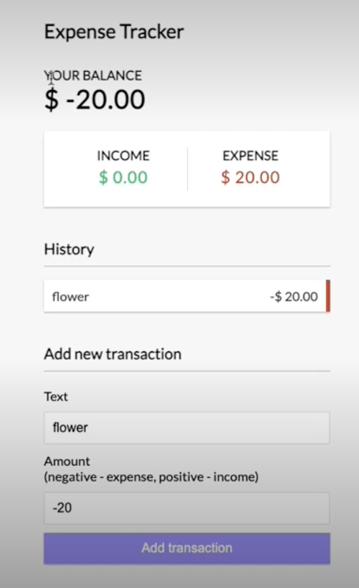

2-20 Ally tut

这节课用useReducer和useContext

下节课讲 redux toolkit

# 要点概述

+ 对于动态页面的分析: 核心的state和action是什么
  + Context -- Provider组件: 封装核心的state和action 
  + 其他组件获取指定Context的Provider的包裹, 并根据核心的state和action来推导其他的state和action
+ useReducer()的使用, useEffect的使用

# 预览效果 0min-

在Text和Amout那里输入参数, Your Balance, Income, Expense会做对应计算, 并且每一笔transaction都会显示在history里




# 开始 5min-

分析如何根据ui分解组件


复制粘贴css到App.css

```css
@import url("https://fonts.googleapis.com/css?family=Lato&display=swap");

:root {
  --box-shadow: 0 1px 3px rgba(0, 0, 0, 0.12), 0 1px 2px rgba(0, 0, 0, 0.24);
}

* {
  box-sizing: border-box;
}

body {
  background-color: #f7f7f7;
  display: flex;
  flex-direction: column;
  align-items: center;
  justify-content: center;
  min-height: 100vh;
  margin: 0;
  font-family: "Lato", sans-serif;
}

.container {
  margin: 30px auto;
  width: 350px;
}

h1 {
  letter-spacing: 1px;
  margin: 0;
}

h3 {
  border-bottom: 1px solid #bbb;
  padding-bottom: 10px;
  margin: 40px 0 10px;
}

h4 {
  margin: 0;
  text-transform: uppercase;
}

.inc-exp-container {
  background-color: #fff;
  box-shadow: var(--box-shadow);
  padding: 20px;
  display: flex;
  justify-content: space-between;
  margin: 20px 0;
}

.inc-exp-container > div {
  flex: 1;
  text-align: center;
}

.inc-exp-container > div:first-of-type {
  border-right: 1px solid #dedede;
}

.money {
  font-size: 20px;
  letter-spacing: 1px;
  margin: 5px 0;
}

.money.plus {
  color: #2ecc71;
}

.money.minus {
  color: #c0392b;
}

label {
  display: inline-block;
  margin: 10px 0;
}

input[type="text"],
input[type="number"] {
  border: 1px solid #dedede;
  border-radius: 2px;
  display: block;
  font-size: 16px;
  padding: 10px;
  width: 100%;
}

.btn {
  cursor: pointer;
  background-color: #9c88ff;
  box-shadow: var(--box-shadow);
  color: #fff;
  border: 0;
  display: block;
  font-size: 16px;
  margin: 10px 0 30px;
  padding: 10px;
  width: 100%;
}

.btn:focus,
.delete-btn:focus {
  outline: 0;
}

.list {
  list-style-type: none;
  padding: 0;
  margin-bottom: 40px;
}

.list li {
  background-color: #fff;
  box-shadow: var(--box-shadow);
  color: #333;
  display: flex;
  justify-content: space-between;
  position: relative;
  padding: 10px;
  margin: 10px 0;
}

.list li.plus {
  border-right: 5px solid #2ecc71;
}

.list li.minus {
  border-right: 5px solid #c0392b;
}

.delete-btn {
  cursor: pointer;
  background-color: #e74c3c;
  border: 0;
  color: #fff;
  font-size: 20px;
  line-height: 20px;
  padding: 2px 5px;
  position: absolute;
  top: 50%;
  left: 0;
  transform: translate(-100%, -50%);
  opacity: 0;
  transition: opacity 0.3s ease;
}

.list li:hover .delete-btn {
  opacity: 1;
}

@media (max-width: 320px) {
  .container {
    width: 300px;
  }
}

```


等待大家脚手架搭好


## 静态页面15min-

HTML, css基本功

```js
|--- components
          AddTransaction.js
          Balance.js
          Header.js
          IncomeExpense.js
          Transaction.js
          TransactionList.js
|--- context
App.js
App.css
index.js
```

按照上述目录结构保证各组件可以正常链接


然后按照UI写出静态页面(也就是考验html, css基本功), 该hardcode的地方先hardcode, 先不涉及任何的state, context


27min-33min

老师的code sanbox crash了, 她重新写


33min- 48min

至此 静态页面搭建好


至此代码: 

App.js

```js
import "./App.css";
import { AddTransaction } from "./component/AddTransaction";
import { Balance } from "./component/Balance";
import { Header } from "./component/Header";
import { IncomeExpense } from "./component/IncomeExpense";
import { TransactionList } from "./component/TransactionList";

export default function App() {
  return (
    <div className="App">
      <Header />
      <div className="container">
        <Balance />
      </div>
      <IncomeExpense />
      <TransactionList />
      <AddTransaction />
    </div>
  );
}
```


Header.js

```js
export const Header = () => {
  return <div>Expense Tracker </div>;
};
```


Balance.js

```js
export const Balance = () => {
  return (
    <div>
      <h4>Your Balance</h4>
      <h1>$1000</h1>
    </div>
  );
};
```


IncomeExpense.js

```js
export const IncomeExpense = () => {
  return (
    <div className="inc-exp-container">
      <div>
        <h4>Income</h4>
        <p id="money-plus" className="money plus">
          $1000
        </p>
      </div>
      <div>
        <h4>Expensses</h4>
        <p id="money-minus" className="money minus">
          $0
        </p>
      </div>
    </div>
  );
};
```


TransactionLists.js

```js
import { Transaction } from "./Transaction";

export const TransactionList = () => {
  return (
    <div>
      <h3>History</h3>
      <ul id="list" className="list">
        <Transaction />
      </ul>
    </div>
  );
};
```


Transaction.js

```js
export const Transaction = () => {
  const sign = "+";

  return (
    <li className="plus">
      salary
      <span>{sign}$1000</span>
      <button className="delete-btn">x</button>
    </li>
  );
};
```


AddTransaction.js

```js
export const AddTransaction = () => {
  return (
    <div>
      <h3>Add new transaction</h3>
      <form>
        <div className="form-control">
          <label>Text</label>
          <input type="text" value="" id="text" placeholder="Enter text..." />
        </div>
        <div className="form-control">
          <label>Amount</label>
          <input
            type="number"
            value=""
            id="amount"
            placeholder="Enter text..."
          />
        </div>
        <button className="btn">Add transaction</button>
      </form>
    </div>
  );
};
```


## 动态页面51min-

### Context 与 Provider

#### :star: 分析: 两个要素 action, state

只分析最最核心的基础的state和action, 如果需要其他的state与action, 但它们可以由核心state与action推导出来, 就不写在context provider里, 而是在具体的组件里useContext()获取核心state与action现场推导

核心action: add transaction / delete transaction

核心State: transaction list 


#### 打包核心action, state到Provider组件

还是老三样,  使用useReducer来产生我们需要的action与state, 然后把他们封装在一个Provider组件里

```react
const [state, dispatch] = useReducer(AppReducer, initialState);

为此, 我们需要定义:
+ state的结构 ---> initialState
+ state如何随action变化 ---> AppReducer
+ action如何赋值 ---> 封装dispatch在function里
```


代码

AppReducer.js

+ 注意case: return的是根据acton变化后的, 具有完整结构的state

```react
export default (state, action) => {
  switch (action.type) {
    // delete action
    case "DELETE_TRANSACTION":
      // return 的是变化后, 具有完整结构的state
      return {
        ...state, // 可能state里有多个成员, 把先把state展开其保证结构完整
        // 再加入别的key-value, 会覆盖原来state展开后同名的key-value
        transaction: state.transactions.filter(
          (transaction) => transaction.id !== action.payload
        )
      };
    // add action, newly added transaction should be placed ahead of old ones
    case "ADD_TRANSACTION":
      return {
        ...state,
        transactions: [action.payload, ...state.transactions]
      };

    // other actions
    default:
      return state;
  }
};

```


GlobalState.js

+ export出去的组件名可以和文件名不同 (问chatGPT: what is default export and named export)
+ 我们一般通过initialState定义state的结构, 因为state往往有多个成员（这个例子里只有transactions这个array一个成员）来满足复杂的需求, 我们往往把initialState写成object
+ 对dispatch进行进一步封装到function里增加可读性
+ 注意initialState, GlobalConext是写在组件外面的, 而hooks必须写在组件里面
  + 注意GlobalContext必须被export, 因为我们后面用useContext获取contextProvider时必须指明是用哪个context的

```react
import React, { createContext, useReducer } from "react";
import AppReducer from "./AppReducer";

// initial state
// state里往往信息不只有一个成员， 因此我们一般选择用object来表示state
const initialState = {
  transactions: [
    { id: 1, text: "Flower", amount: -20 },
    { id: 2, text: "Salary", amount: 300 },
    { id: 3, text: "Book", amount: -10 }
  ]
};

// create context
export const GlobalContext = createContext(initialState);

// Provider component
export const GlobalProvider = ({ children }) => {
  const [state, dispatch] = useReducer(AppReducer, initialState);

  // actions: 定义dispatch如何给action赋值
  // ! TODO: action.payload的类型是any? 它类型不固定啊 !
  function deleteTransaction(id) {
    dispatch({ type: "DELETE_TRANSACTION", payload: id });
  }

  function addTransaction(transaction) {
    dispatch({
      type: "ADD_TRANSACTION",
      payload: transaction
    });
  }

  // jsx
  // 把component里的hooks产生的state和function打包放在GlobalContext.provider里
  return (
    <GlobalContext.Provider
      value={{
        transactions: state.transactions,
        addTransaction,
        deleteTransaction
      }}
    >
      {children}
    </GlobalContext.Provider>
  );
};
```


用刚写好的GlobalProvider包住想使用它内部state和function的组件 1h23min-

App.js

```js
import "./App.css";
import { AddTransaction } from "./component/AddTransaction";
import { Balance } from "./component/Balance";
import { Header } from "./component/Header";
import { IncomeExpense } from "./component/IncomeExpense";
import { TransactionList } from "./component/TransactionList";
import { GlobalProvider } from "./context/GlobalState";

export default function App() {
  return (
    <GlobalProvider>
      <Header />
      <div className="container">
        <Balance />
      </div>
      <IncomeExpense />
      <TransactionList />
      <AddTransaction />
    </GlobalProvider>
  );
}
```


### 让页面显示我们的initialState 1h25min-

useContext去获取包裹好的action与state 

同时根据解包得到的transactions去map出来Trasaction component

TransactionList.js

```react
import { useContext } from "react";
import { GlobalContext } from "../context/GlobalState";
import { Transaction } from "./Transaction";

export const TransactionList = () => {
  const { transactions } = useContext(GlobalContext);		// 解包: 获取context provider里包裹的state

  return (
    <div>
      <h3>History</h3>
      <ul id="list" className="list">
        {transactions.map((transaction) => {
          return <Transaction key="transaction.id" transaction={transaction} />;
        })}
      </ul>
    </div>
  );
};
```

Transaction.js

```react
export const Transaction = ({ transaction }) => {
  const sign = transaction.amount >= 0 ? "+" : "-";

  return (
    // conditional className
    <li className={transaction.amount >= 0 ? "plus" : "minus"}>
      {transaction.text}
      <span>
        {sign}${Math.abs(transaction.amount)}
      </span>
      <button className="delete-btn">x</button>
    </li>
  );
};
```


帮学生debug 1h33min-1h46min


### 根据transaction list计算 income与 expense 1h46min-

IncomeExpense.js

+ 得到核心state, 在这里推导计算依赖于核心state的state
+ useEffect的使用

```react
import { useContext, useEffect, useState } from "react";
import { GlobalContext } from "../context/GlobalState";

export const IncomeExpense = () => {
  const { transactions } = useContext(GlobalContext);

  // income 和 expense 也可以分开作为两个state
  // 但老师建议放在一起合成1个state, 因为income和expense都属于money是一类的
  const [money, setMoney] = useState({
    income: 0,
    expense: 0
  });

  // 当transactions这个状态发生变化时, 就执行第一个arg定义的函数
  useEffect(() => {
    const amounts = transactions.map((transaction) => transaction.amount);

    console.log("amount", amounts);

    const income = amounts
      .filter((item) => item > 0)
      .reduce((acc, item) => (acc += item), 0)
      .toFixed(2);
    const expense = amounts
      .filter((item) => item < 0)
      .reduce((acc, item) => (acc += item * -1), 0)
      .toFixed(2);
    setMoney({
      income,
      expense
    });
  }, [transactions]);

  return (
    <div className="inc-exp-container">
      <div>
        <h4>Income</h4>
        <p id="money-plus" className="money plus">
          ${money.income}
        </p>
      </div>
      <div>
        <h4>Expensses</h4>
        <p id="money-minus" className="money minus">
          ${money.expense}
        </p>
      </div>
    </div>
  );
};
```


2h-2h07min

帮同学debug, 没讲完的下节课讲

