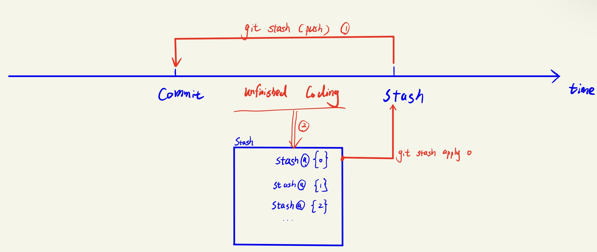
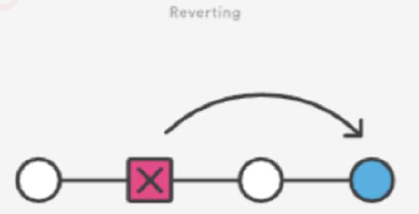
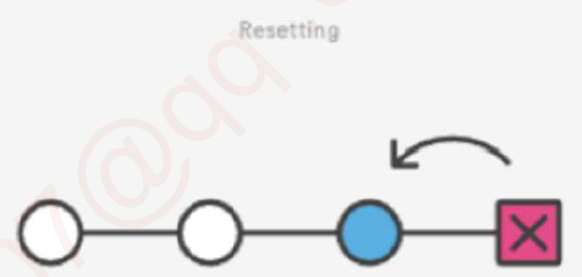
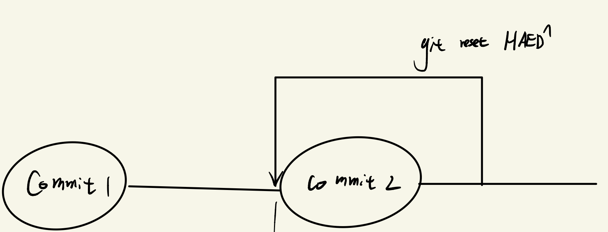
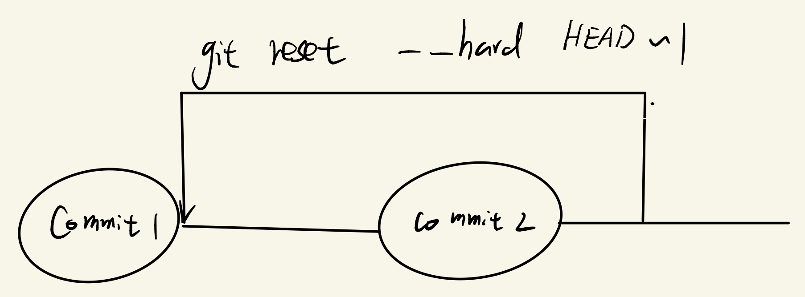
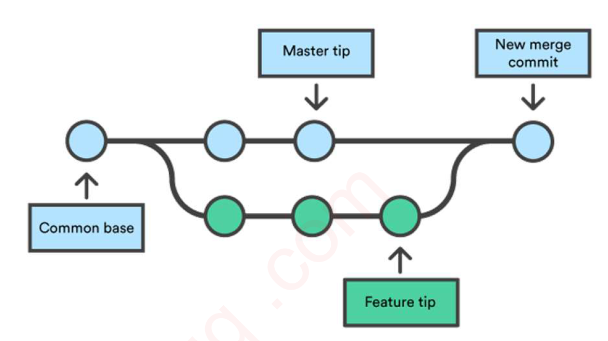
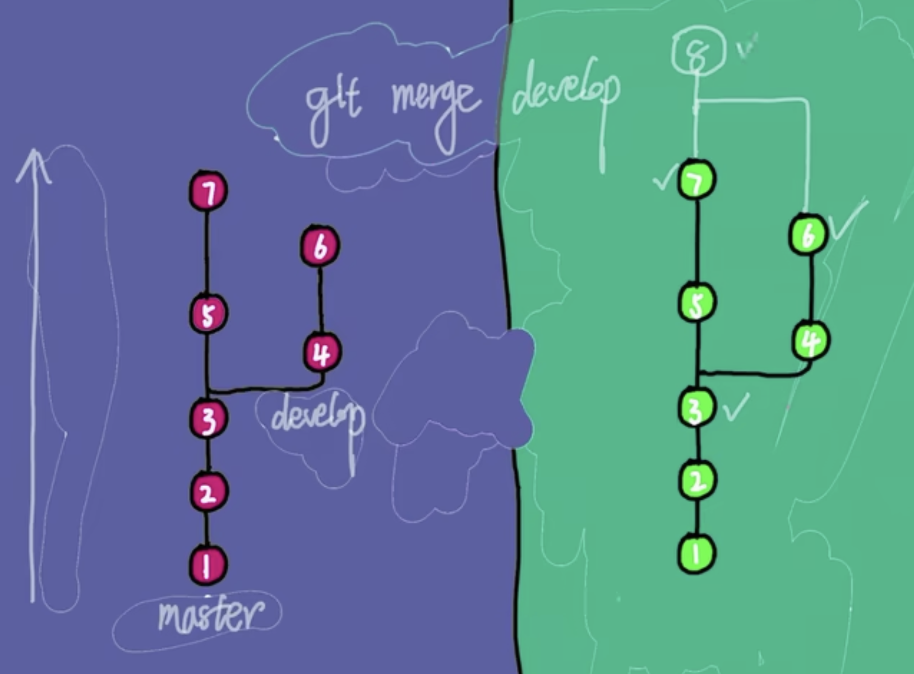
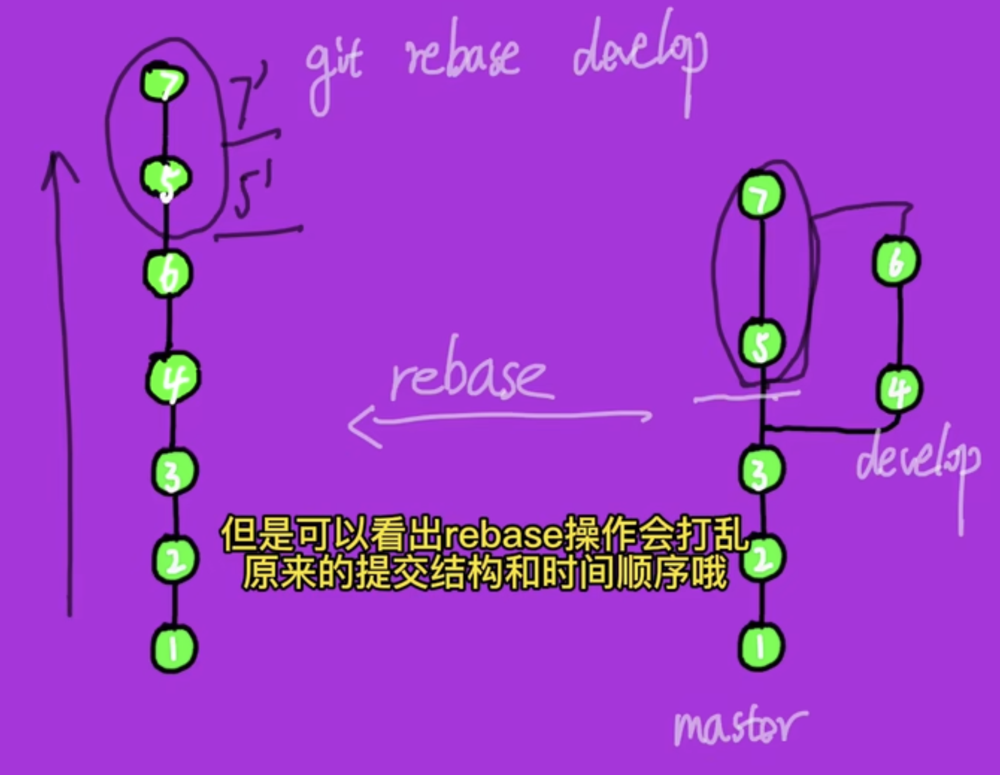
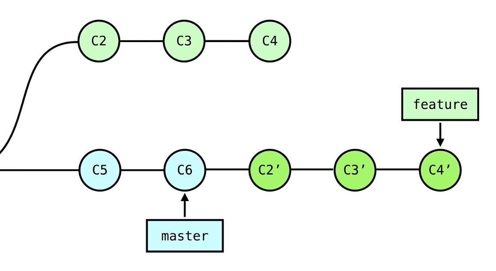

:pencil: [我的git指令手册](./gitCommand.md)
:pencil: [gitPractice](./Git_Practice/gitPractice.md)

---

- [Intro](#intro)
- [Hands on 17min-](#hands-on-17min-)
  - [step 0: 一个点的历史 git set up](#step-0-一个点的历史-git-set-up)
    - [Git Global Setup](#git-global-setup)
    - [Set up repository](#set-up-repository)
  - [step 1: 一条线的历史 commit 47min-](#step-1-一条线的历史-commit-47min-)
    - [常用 git command](#常用-git-command)
    - [:full\_moon: git undo changes 1h17min-](#full_moon-git-undo-changes-1h17min-)
  - [step 2: 两条线的历史 branch \& merge  1h38min-](#step-2-两条线的历史-branch--merge--1h38min-)
    - [branch](#branch)
    - [:full\_moon: merge branch 1h47min-2h13min](#full_moon-merge-branch-1h47min-2h13min)
  - [step 3: 多条线的历史 远程协作 2h25min-](#step-3-多条线的历史-远程协作-2h25min-)
    - [Update remote from local](#update-remote-from-local)
    - [Update local from remote](#update-local-from-remote)
    - [:full\_moon: remote branch 2h39min-](#full_moon-remote-branch-2h39min-)
    - [:full\_moon: merge vs. rebase 3h-3h06min](#full_moon-merge-vs-rebase-3h-3h06min)
    - [git ignore 3h06min-](#git-ignore-3h06min-)
    - [force push 3h10min-](#force-push-3h10min-)
    - [Q\&A 3h11min-](#qa-3h11min-)


ray ma intro: 
+ git, agile, interview, mock interview
+ work in AU microsoft, cloud

---

Git PPT

# Intro
为什么使用git
+ 撤销改动或回滚版本
+ 回溯历史(A complete long-term history of every file that provides traceability)
  + 理解复杂模块的开发历程
  + 责任追究
  + 历史bug的追踪 
+ 协同合作
+ 备份

version control category
+ centralized 
  + 本地不能有公司仓库的全部代码, 为了商业安全 
+ distributed
  + 本地可以有公司仓库的全部代码 
  + e.g. git

git vs. github
+ git
  + distributed version control system 
+ github
  + online git shared repo


# Hands on 17min-

## step 0: 一个点的历史 git set up
+ `git`
+ `git --version`
  + 一般大的版本号一致就可以, 没有必要一定保持版本号最新

### Git Global Setup
+ `git config --global --list`
  + 显示global setup
+ `git config --global user.name "<Your-Full-Name>"`
  + 让别人知道你是谁
  + `--global`就代表只能有一个user.name
    + 不写`--global`就可以让你在某个路径下拥有一个user.name 
+ `git config --global user.email "<your-email-address>"`
  + 一般绑定github邮箱 
+ `git config --global color.ui auto`
+ `git config --global merge.conflictstyle diff3`
+ `git config --global core.editor "code --wait"`
+ and more ...
  

如果上面的指令不带`--global`, 那么就是在local的config

### Set up repository
+ `git init`
  + 将当前文件夹作为git的一个repo, 成功后该文件夹将显示为branch: `git:(master)`
    + 这样会创建`.git文件夹`, 注意千万别碰这个文件夹否则它坏了基本修不好
    + 注意只在独立的文件夹下运行`git init`, 如果当前文件夹属于某个git repo的子文件夹, 不要跑`git init`

:question: 如何在本地电脑找到ubantu中的文件?

OR

+ `git clone` (for remote repo only)

---

+ `git status` 显示在哪个路径, 有哪些文件在stage
+ `git log` 显示当前repo的所有commit的log
  + 用git history extension可以更方便地做到图形化访问log, 查看branch之间的merge历史
+ `git diff`


## Step 1: 一条线的历史 commit 47min-

git 工作原理

本地: working directory ---`git add`---> stage ---`git commit`---> git repo

### 常用 git command 

+ `git add`
  + `git add .` 添加当前路径下所有文件至stage
  + `git add ./filename` 添加当前路径下指定文件至stage
  + `git remove --cached ./filename` 将stage中的指定文件移除出stage 
+ `git commit -m"git message"`
    + commit changes to repo (创建一个commit对象节点) , 往后很多command都是基于commit对象节点而操作的
    + git message要有意义
+ `git rm`
  + 慎用 
+ `git stash (push) -m"stash message"` 本地暂存区
[git stash doc](https://www.git-scm.com/docs/git-stash)
暂存当前代码为新的stash加入stash list, 并回退到上个commit时的代码状态(下图中的1,2两步); 最新创建的stash放在stash@{0}, stash@{1}是在其之前创建的, 其实就是个stack
  + `git stash list` 显示stash list
  + `git stash pop` pop off stash[0] from the stash list
  + `git stash apply index` apply stash with specified index, 回到指定stash所暂存的代码状态(如下图)
这些command在vscode的左侧边栏的source control也可以做到



stage是在本地还是在云端? --本地啊

---

### :full_moon: git undo changes 1h17min-


+ `git checkout`: 辗转branch
+ `git clean`: 清理目录, 很危险!

---

+ `git revert commit_id`
  用一个新的commit对历史记录进行回滚, 这个新的commit是指定commit的反操作(e.g. 指定commit中删除了style.css文件, 现在revert那个commit, 就是恢复了style.css文件)
  
  + 不会删除commit
  
  
  
+ `git reset commit_id`
  从log中删除指定commit及之后的所有commit,  因而非常危险!
  
  + soft reset: put commit into stage, 还没丢失
  + hard reset: 直接删除, 非常危险!
  
  
  
  
  + `git reset HEAD^`和`git reset --soft HEAD~1`: 都是返回到输入`git commit -m"commit2"`之前的时刻, commit1 - now这段时间内做的修改都得以保留
  + 区别是, `git reset HEAD^`是把commit1-commit2这段时间做的修改返回到工作区; 而`git reset --soft HEAD~1`是将commit1-commit2这段时间做的修改返回到暂存区; commit2-now这段时间内的修改本来就在工作区
    

  
  
  + `git reset --hard HEAD~1`: commit1 - now 之间所有做过的修改丢失


## Step 2: 两条线的历史 branch & merge  1h38min-

一般每个人是在自己的branch上工作, 工作完成后大家的branch会汇总到main-branch上.

node代表一个commit对象， 创建新的branch就是在branch上创建新的node

### branch

+ `git branch`: 显示当前路径下有哪些branch
+ `git branch -d`:  删除指定的branch
+ `git checkout -b branch_name`: 创建新的branch
+ `git checkout branch_name`: 切换到指定branch
  + vscode中点击左下角的branch name, 就可以切换branch

Semantic branch names
`<type>/<ticket-number>-<title>`
e.g. feat/JR-101-create-header-for-home-papge

---

### :full_moon: merge branch 1h47min-2h13min



+ `git merge branch_name`: 将branch_name合并到<u>当前所在的branch上</u>; **这个command本质上包含两步操作:** 
  
  想象我们现在站在master-branch上, git merge Feature-branch
  
  1. auto-merging: 将branch_name中的代码merge到当前所在的branch上(期间有可能发生conflict, 此时需要manual merge和manual commit); 
  2. commit: 在当前所在的branch上commit第一步的结果(即在当前branch上产生一个新的commit node). commit之后可以在history里查看merge branch的历程


:bangbang: 注意:


+ :book: [lesson7: git merge conflict and how to resolve it](https://www.simplilearn.com/tutorials/git-tutorial/merge-conflicts-in-git#:~:text=How%20to%20Resolve%20Merge%20Conflicts%20in%20Git%3F%201,a%20new%20merge%20commit%20to%20finalize%20the%20merge):  A merge conflict is an event that takes place when Git is unable to automatically resolve differences in code between two commits. **Git can merge the changes automatically only if the commits are on different lines or branches. (即不同branch的相同文件的同一行如果不一样, merge时会产生conflict)**
  + 我的理解:  一般工作中commit可不是随随便便的, 最好两个人别负责同一个文件的同一个函数模块的编辑, 不然太容易出conflict了. 
  + 公司不会让程序员直接去master branch上编程， 因为master branch是product environment. :star: 程序员都是在branch上工作, 在merge工作到main branch之前, 需要先把master-branch pull到本地, 把本地的master-branch merge到自己负责的branch上, 然后在其上做一系列严格的test, 之后才能被批准将自己的branch merge到main branch上 
+ branch 和main-branch合并成功后, branch依旧可以独自运作而不影响main-branch, 因为git merge的本质只是把sub-branch的代码合并到master-branch上然后再在master branch上commit, `git merge`执行时**不存在建立两个branch的dependency**


---
git graph 2h13min-
使用command来实现类似git history extension能做的图形化visualization (一般也没人用command)

`git log --all --decorate --oneline --graph`

---
git conflict 2h15min-2h25min


如果不想解决冲突:
+ `git merge <branch name> --abort`:
+ `git merge <branch name> --overwrite-ignore`: 以master branch为准
+ `git merge <branch name> --no-overwrite-ignore`: 


## Step 3: 多条线的历史 远程协作 2h25min-
step3之前的都是在local上的操作, 这里就需要引入github: a remote repository

+ `git clone <url>`: 从github clone remote repo onto local

---

直接对remote repo的操作(一般不会用到的): 
+ `git remote add <name><url>`
+ `git remote rm <name>`
+ `git remote rename <old-name> <new-name>`

---

### Update remote from local

+ `git push`: 建立本地repo和github remote repo之间的联系
+ `git push <name><branch>`
+ `git push <name><local_branch>:<remote_branch>`

### Update local from remote
+ `git fetch`: get information(告诉我local repo是提前还是落后remote repo几个commit), 但不会push OR pull
+ `git pull`: 如果github remote repo比local repo新, 用这个来pull remote repo 多出来的commit到local repo

---

### :full_moon::full_moon: remote branch 2h39min-
create branch --> doing something at that branch --> commit --> publish branch (then you can see the branch on github)


pull request

在github上做Merge, 通过pull request(PR)

+ add reviewer --> create PR


Q&A

local 与 remote repo的branch name的匹配


### :full_moon: merge vs. rebase 3h-3h06min

rebase, merge不要混用: 如果一个project刚开始就用rebase, 之后一直用rebase; 一个project一开始用merge, 之后一直用merge

+ `git merge`: commit之间是多线结构, 特点是保留所有的分支结构以及commit的时间顺序

  + 一旦branch多了, 很难梳理commit之间的关系 
  + merge是合并两个分支最新的状态生成一个新的commit
  ```bash
  // merge的操作：
  git checkout master
  git pull                // make sure local master is up to date
  git merge feature1
  // ... then do tests on local master
  ```
  

---

+ `git rebase`: 另一种merge的方法, commit之间是单线结构, 特点是分支结构会被破坏且commit的时间顺序也会被打乱
  + 追溯历史更加直观, 工作中用的更多
  + rebase是把所有的commit在另一个分支上replay一遍，会丢失历史状态
  + 千万别在''公共分支''上rebase
  + `git rebase <branch_name>`: 将commit chain rebase on specified branch上 
  ```bash
  // 不要在公共分支上执行rebase操作.
  // e.g. feature --> master的6步操作
  git checkout master
  git pull					// make sure local master up to date
  git checkout feature1
  git rebase master		//	在feature branch上rebase mater
  git checkout master		// git merge feature1
  git merge feature1
  //... then do tests on local master
  ```
  
  
  **过程是把当前branch的后于公共祖先的commit(的copy, 因为其实commit id不一样, 图中用5', 7'表示)嫁接到rebase branch的commit的后面**
  
  + 注意上面的图例中是在main branch上git rebase develop, 这是不安全的, 永远不要在main branch上rebase! 在main branch上只做merge操作. 
  
  
  
  :gem: 一个实际开发中常见的case
  
  当我们在自己的feature branch上进行开发时, 往往会遇到自己的工作还未完成, main branch上已经新加入了新的commit(如下图中的master branch上的C5-C6), 此时我们在push之前, 必须保证这些新加入的commit也加入了自己的feature branch, 此时应该如何做? 
  
  + 事实上, 站在''公共分支''上进行rebase都是不合适的, 所谓'公共分支‘指的是大家都可以修改代码的分支, 比如我在自己的branch 写了C2,C3,C4 三个commit, 然后push了一下,  那么我自己的branch其实就变成了一个'公共分支' (因为在remote大家都可以来查看修改我的branch上的代码了)， 若此时在local我接着在自己的分支git rebase main, local下我的branch就变成了 C5-C6-C2'-C3'-C4'的状态, 此时就会显示remote和local不同步, 需要你去pull 才行, 
    + 如果你此时去pull, C2-C3-C4代码其实和C2'-C3'-C4'的代码是一样的 (一个commit只是记录你新修改, 添加和删除了哪些代码, 不会记录你所有的代码.) , 然后你再push, 在你的remote就会发现自己的commit记录里包含着别人的C5, C6 这是不make sense的. 
    + 此时不要pull, 如果你完全可以确定自己的branch只有自己在写, 可以此时使用 `git push -f` 强制把C5-C6-C2'-C3'-C4' push到remote来替代掉C2-C3-C4




> my_featureBranch: git rebase main
>
> 含义是, 在my_featureBranch修改commit 链表结构(历史结构)，**在本地** 以 main为基准, 将my_featureBranch上后于与main 的公共祖先的commit (指C2-C3-C4)的copy嫁接到main的后面, 形成 C5-C6-C2'-C3'-C4'. 
>
> 注意此时, 
>
> + 这些修改my_featureBranch的commit链表结构的操作只是发生在本地, 未push前远端的my_featureBranch的结构未变. 
> +  main branch的commit链表结构也没有变, 我们只是修改my_featureBranch的commit历史结构


:tv: [ali could blibili: git merge vs. git rebase](https://www.bilibili.com/video/BV1Xb4y1773F/?spm_id_from=333.337.search-card.all.click&vd_source=c6866d088ad067762877e4b6b23ab9df)

:tv: [git merge vs. git rebase](https://www.bilibili.com/video/BV1VG411F7rB/?spm_id_from=333.337.search-card.all.click&vd_source=c6866d088ad067762877e4b6b23ab9df)

:gem: [git visualizer](https://git-school.github.io/visualizing-git/)

进阶: `git rebase -i` 甚至可以rebase onto commit, 允许我们来合并一条分支上的commits


---

### git ignore 3h06min-

在`.gitignore`文件中specify哪种类型的文件(e.g. .exe, .dll...)不希望被version control
+ 使用通配符, 路径来选定哪个文件夹下的哪种文件应该被ignore

---

### force push 3h10min-
强制push
+ 危险的操作!

---

### Q&A 3h11min-

`git config --local --list`: 显示local的git config list
`git config --list`: 显示global和local的git config list