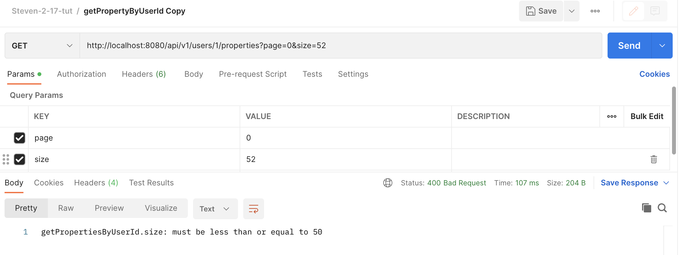

2-17 Steven tut


# 连表查询补充 0min-

refer to entity package

关于`@ManyToOne` `@OneToMany`的成员 fetch的值说明

```java
Property 对 User
  
@ManyToOne // FK: property : user --> many to one
@JoinColumn(name = "owner_id")  // define how to reference user based on database column "owner_id"
private User user;

@ManyToOne成员:  FetchType fetch() default EAGER;		// 表示每当我们查询Property时, 默认也会查询对应的User

// --------------------------------------------

User 对 Property
  
@OneToMany(mappedBy = "user")       // 对应Property里User的成员变量名, JDBC封装?
private List<Property> propertyList;

@OneToMany成员:  FetchType fetch() default LAZY;			// 表示每当我们查询User时, 默认不会去查询 propertyList
```


---

试下效果 

在resource路径下application.yml里设置显示sql

```yml
spring:
  datasource:
    driver-class-name: org.postgresql.Driver
    url: jdbc:postgresql://localhost:5400/postgres
    username: postgres
    password: admin
  jpa:
    database: postgresql
    properties:
      hibernate:
        default_schema: public
        jdbc:
          time_zone: UTC
    show-sql: true   # 生产环境下一般是false的
```


按照上面的设置 Property entity中对User `@ManyToOne`默认fetch eager, 在Postman中跑getProperty()的API, 可以看到后端返回如下的sql语句, 进行了left outer join. 当数据量很大时， 连表查询会很慢

```sql
Hibernate: 
select property0_.id as id1_0_0_, property0_.created_time as created_2_0_0_, property0_.land_size as land_siz3_0_0_, property0_.type as type4_0_0_, property0_.updated_time as updated_5_0_0_, property0_.owner_id as owner_id6_0_0_, user1_.id as id1_1_1_, user1_.created_time as created_2_1_1_, user1_.email as email3_1_1_, user1_.name as name4_1_1_, user1_.password as password5_1_1_, user1_.updated_time as updated_6_1_1_ 
from public.property property0_ 
left outer join public.user user1_ 
on property0_.owner_id=user1_.id 
where property0_.id=?
```


如果手动设置 Property entity中对User `@ManyToOne`默认fetch lazy, 就不会进行连表查询

```java
@OneToOne		// 默认fetch type 为eager, 一般ToOne结尾的fetch type默认为eager

@ManyToMany // 默认fetch lazy
```


总之看业务需求调fetch type, 决定查询时对于外键是否进行连表查询

# 开始正式讲

## 分页 14min- 38min

使用场景:  getPropertyByUserId()

url: http://localhost:8080/api/v1/users/1/properties?page=0&size=10


前端没有必要把查到的property一股脑都展示,  一般后端需要做分页, 限制前端能拿到的数据量. 比如前端给后端一个请求: 需要第1页的10个item


17min-

对UserController里的getPropertyByUserId()方法改进, 添加分页

```java
// http://localhost:8080/api/v1/users/{userId}/properties 之前不采用分页时
// http://localhost:8080/api/v1/users/1/properties?page=1&size=10 采用分页后对应的url
@GetMapping("/{userId}/properties")
public PropertyPageDto getPropertiesByUserId(@PathVariable Long userId, @RequestParam int page, @RequestParam int size){

    // 没采用分页 这个方法的返回值类型是List<PropertyGetDto> -----------------
    // 方法一
   //return  propertyService.getPropertyByUserId(userId);

    // 方法二: 利用 User {List<Property>}
   // return userService.getPropertiesByUserId(userId);


    // 采用分页 这个方法的返回值类型是PropertyPageDto -------------
    return propertyService.getPropertyByUserId(userId, page, size);

}

```


property service

老样子, 在service里先写大致逻辑, 再去repository和dto里补充需要的代码块

```java
public PropertyPageDto getPropertyByUserId(Long userId, int page, int size) {
    Pageable paging = PageRequest.of(page, size);
		
  // 这里返回的是Page的实现类PageImpl的对象, 简单知道它里面不仅有包含查询结果的list, 还有totalPage和totalElement两个参数
    Page<Property>  properties = propertyRepository.findByUser_Id(userId, paging);		// JPA帮我们实现

    // 拿到PageImpl对象里的list
    List<Property> propertyList = properties.getContent();
		
  	// 利用现有信息装配(build)一个PropertyPageDto 作为返回值
    return PropertyPageDto.builder()
            .totalPage(properties.getTotalPages())
            .totalNumber(properties.getNumberOfElements())
            .propertyGetDtoList(properties.stream().map(property -> propertyMapper.mapPropertyToPropertyGetDto(property)).toList())
            .build();
}
```


---

:star: 补充: 这里我们要用到Page interface, 前端除了需要list来作为查询结果的载体, 还往往需要知道总页数和总元素个数

```java
public interface Page<T> extends Slice<T> {
  // ....
	int getTotalPages();			// get总页数  注意page index是从0开始的
	long getTotalElements();  // get总元素数
  // ...
}


// 作为Page的实现类, 可以包含其父类的content成员， 并可以调用 getContent() 
public class PageImpl<T> extends Chunk<T> implements Page<T> {
  
  	// ....
}

//
abstract class Chunk<T> implements Slice<T>, Serializable {

	private static final long serialVersionUID = 867755909294344406L;

	private final List<T> content = new ArrayList<>();		// list
	private final Pageable pageable;
  
  public List<T> getContent() {
		return Collections.unmodifiableList(content);
	}
  
}
```

---


repository 里

```java
public interface PropertyRepository extends JpaRepository<Property, Long> {

    List<Property> findByUser_Id(Long userId);  // 注意方法名一定是 findByUser_Id(), 最后的部分要和数据库里的tuple的column name一致

    Page<Property> findByUser_Id(Long userId, Pageable pageable);		// 只需要声明方法, JPA自动去实现它
}
```


此外, 我们还需要额外的dto来承载分页的返回对象

```java
@Builder
@Getter
public class PropertyPageDto {

    private List<PropertyGetDto> propertyGetDtoList;		// 这个List包含的是page size大小的数据量, 是局部的信息
    private int totalNumber;		// 代表全局信息
    private int totalPage;			// 代表全局信息

}
```


老样子, run application, postman get: http://localhost:8080/api/v1/users/1/properties?page=0&size=10

:bangbang: 注意page的index是从0开始的

我们得到如下的response body:

```json
{
    "propertyGetDtoList": [
        {
            "id": 1,
            "type": "TOWNHOUSE",
            "landSize": 288,
            "userGetDto": {
                "id": 1,
                "name": "user",
                "email": "user@gmail.com",
                "createdTime": "2023-01-25T12:50:12.080028+11:00",
                "updatedTime": "2023-01-25T12:50:12.080448+11:00"
            },
            "createdTime": "2023-01-28T11:09:25.749902+11:00",
            "updatedTime": "2023-01-28T11:09:25.749925+11:00"
        },
        {
            "id": 2,
            "type": "TOWNHOUSE",
            "landSize": 28,
            "userGetDto": {
                "id": 1,
                "name": "user",
                "email": "user@gmail.com",
                "createdTime": "2023-01-25T12:50:12.080028+11:00",
                "updatedTime": "2023-01-25T12:50:12.080448+11:00"
            },
            "createdTime": "2023-01-28T20:09:52.52413+11:00",
            "updatedTime": "2023-01-28T20:09:52.52416+11:00"
        }
    ],
    "totalNumber": 2,
    "totalPage": 1
}
```


38 min-

给page的每页 size加上constriant

在UserController头上加上`@Validated`

在 getPropertyByUserId( ) arg中 用`@Max(value=50)`来修饰size

```java
@RestController
@RequestMapping("users")    // URL中跟着/api/v1的成分
@RequiredArgsConstructor    // for UserService
@Validated
public class UserController {
    private final UserService userService;  // controller要调用service, 以传递数据 不要在controller调用repository

    private final PropertyService propertyService;

		// ........

    // http://localhost:8080/api/v1/users/{userId}/properties 之前不采用分页时
    // http://localhost:8080/api/v1/users/1/properties?page=1&size=10 采用分页后对应的url
    @GetMapping("/{userId}/properties")
    public PropertyPageDto getPropertiesByUserId(@Valid @PathVariable Long userId, @RequestParam int page, @RequestParam @Max(value = 50) int size){

        // 没采用分页 这个方法的返回值类型是List<PropertyGetDto> -----------------
        // 方法一
       //return  propertyService.getPropertyByUserId(userId);

        // 方法二: 利用 User {List<Property>}
       // return userService.getPropertiesByUserId(userId);


        // 采用分页 这个方法的返回值类型是PropertyPageDto -------------
        return propertyService.getPropertyByUserId(userId, page, size);

    }

  	// .....

}
```


run application, postman get: http://localhost:8080/api/v1/users/1/properties?page=0&size=52  ,  故意引入超额的page size

得到如下错误提示

```json
{
    "timestamp": "2023-02-23T05:33:51.285+00:00",
    "status": 500,
    "error": "Internal Server Error",
    "path": "/api/v1/users/1/properties"
}
```


47min-53min

但是一般用户的错误我们应该返回4开头的http status

在exception 包下的ControllerExceptionHandler中加入关于ConstraintViolationException的处理

```java
@RestControllerAdvice   // 监视Controller, 如果controller里的方法报了异常的化, 做如下处理
@Slf4j      // enable log
public class ControllerExceptionHandler {

		// ...

    // e.g. when violating  @Max int size
    @ExceptionHandler(value = {ConstraintViolationException.class})
    @ResponseStatus(HttpStatus.BAD_REQUEST)
    public String handleConstraintViolationException(ConstraintViolationException e){
        return  e.getMessage();

    }

}
```


此时可以看到http status返回为400 



# 登录验证 53min 

全新的领域, 需要用到Spring security (之前我们并没有加入这个dependency)

这部分只需要知道怎么用即可,  简单知道原理就行, 将来工作如果不是新项目可能也接触不太到, junior职位一般也不会让你碰安全相关的东西


## 准备工作57min-

https://docs.spring.io/spring-security/reference/getting-spring-security.html#getting-gradle

在gradle中加入

```gradle
compileOnly "org.springframework.boot:spring-boot-starter-security"
```

:bangbang: 注意导入后可以在external resources查看是否导入成功, 如果不成功可以尝试重启intellij


## 1h03min-

验证(authentication): e.g. 登录时验证自己是自己

授权(authorization): e.g. 你没有授权xxx查看你的朋友圈, 他如果请求查看你的朋友圈那就返回啥也没有


直接跑application, 会发现原来的代码不起作用了 (md 我没出现这种情况) 因为SpringSecurity默认配置会启用, 此时你应该手动配置让SpringSecurity失效


## 写配置 1h07min-1h16min

新建configuration package, 新建如下类

```java
@EnableWebSecurity
@Configuration  // 一般和@Bean一起用
public class SecurityConfiguration {

    @Bean           // 用来修饰方法, 可以将方法的返回对象存起来;  @Component标注在Class上, 可以将Class变成instance存起来.
    public SecurityFilterChain filterChain(HttpSecurity http) throws Exception {
        return http
                .csrf().disable()
                .authorizeRequests()
                .antMatchers( "/**").permitAll()
                .anyRequest().authenticated()
                .and().build();
        // csrf 保护get()方法之外的方法(e.g. post, patch, delete)免受互联网攻击, csrf().disable()表示免受这种保护, 一般前端用cookie才会启用
        // antMatchers("/**") 路径匹配: "/**"表示匹配根路径下的所有路径, "/*"表示匹配根路径下一层路径
    }
}
```

正常情况下现在可以正常run application了


而我一直报错

```bash
Caused by: java.lang.IllegalStateException: Failed to introspect Class [com.example.cruddemorecode.configuration.SecurityConfiguration] from ClassLoader [jdk.internal.loader.ClassLoaders$AppClassLoader@7aec35a]
```

