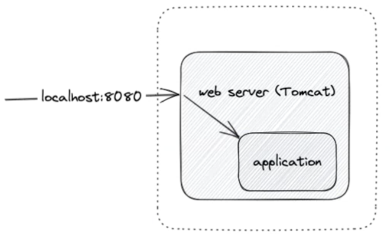
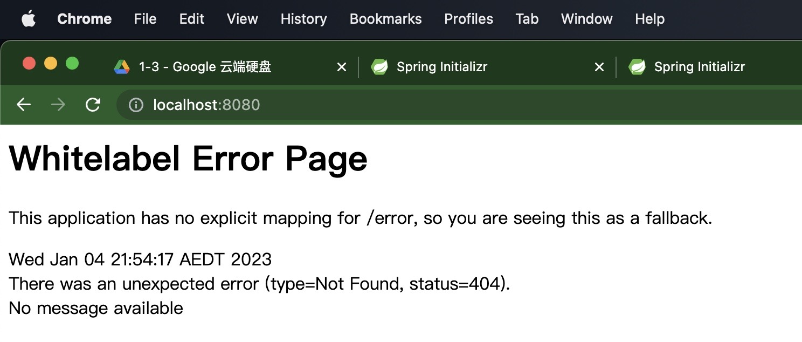
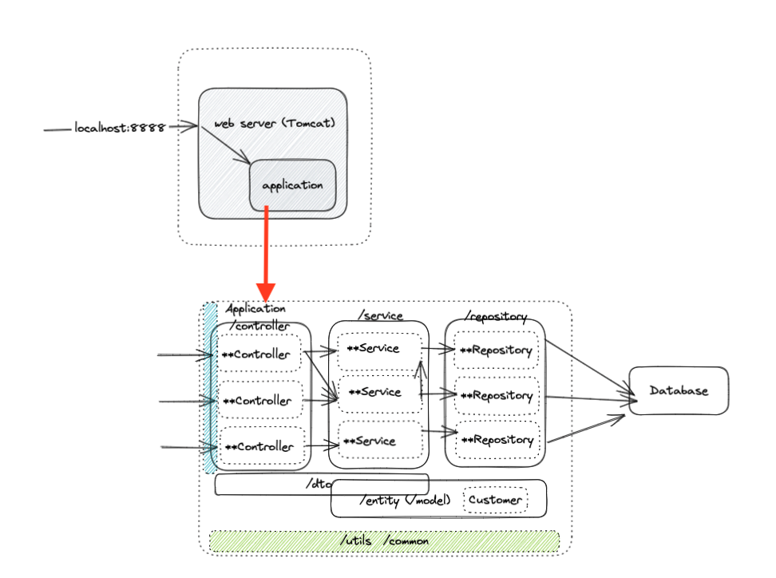
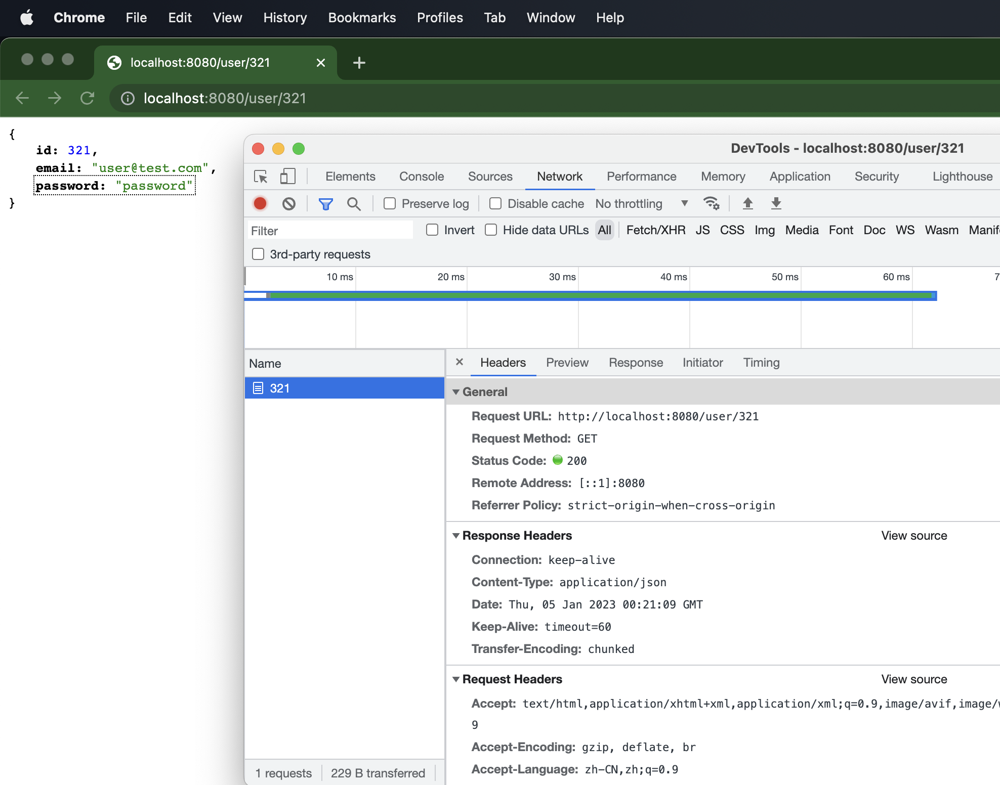
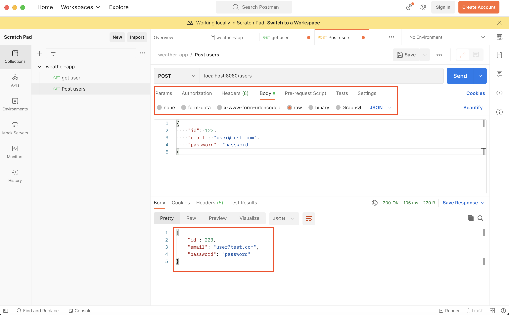
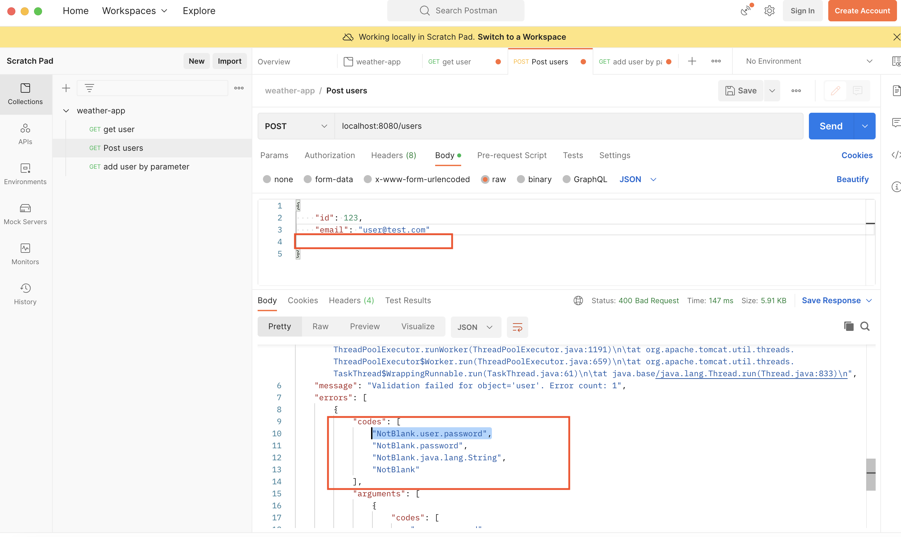

:book: [baeldung: SpringBoot自学](https://www.baeldung.com/spring-boot)

:book: [javapoint: SpringBoot自学](https://www.javatpoint.com/spring-vs-spring-boot-vs-spring-mvc)

JR wk4 lec2 Springboot, 配Intellij project: weather-app 

---

Content:
- [1. Spring intro: 0min-15min](#1-spring-intro-0min-15min)
  - [Spring Framework:](#spring-framework)
  - [Spring Boot:](#spring-boot)
- [2. 第一个Spring Boot project 15min-1h35min](#2-第一个spring-boot-project-15min-1h35min)
- [3. build tool: gradle](#3-build-tool-gradle)
  - [3.1 gradle command 44min-1h14min](#31-gradle-command-44min-1h14min)
  - [3.2 为什么需要构建工具(build tool)? 1h14min-1h19min](#32-为什么需要构建工具build-tool-1h14min-1h19min)
- [4. Annotation, AutoConfiguration 1h19min-1h53min](#4-annotation-autoconfiguration-1h19min-1h53min)
  - [4.1 A little bit deeper: Annotation](#41-a-little-bit-deeper-annotation)
  - [4.2 A little bit deeper: AutoConfiguration:](#42-a-little-bit-deeper-autoconfiguration)
- [5. :full\_moon: 代码目录结构 1h53min-2h15min](#5-full_moon-代码目录结构-1h53min-2h15min)
- [6. :full\_moon:RESTful API 2h20min-](#6-full_moonrestful-api-2h20min-)
  - [6.1 @RequestMapping: hello world controller](#61-requestmapping-hello-world-controller)
  - [6.2 @RequestMapping: by parameter](#62-requestmapping-by-parameter)
  - [6.3 复杂一点的](#63-复杂一点的)
    - [e.g.1 @GetMapping: return an object by path variable @PathVariable](#eg1-getmapping-return-an-object-by-path-variable-pathvariable)
    - [e.g.2 @GetMapping: return an object by request parameter @RequestParam](#eg2-getmapping-return-an-object-by-request-parameter-requestparam)
    - [e.g.3 @PostMapping: return new object by request body (a given object) @RequestBody 2h53min- 3h5min](#eg3-postmapping-return-new-object-by-request-body-a-given-object-requestbody-2h53min--3h5min)
- [7. Unit Test for Spring Boot 9min-](#7-unit-test-for-spring-boot-9min-)
  - [7.1 test HelloWorldController: GET方法 9min-](#71-test-helloworldcontroller-get方法-9min-)
  - [7.2 test UserController: POST方法 28min-](#72-test-usercontroller-post方法-28min-)
- [8. :moon: Controller层级错误处理 51min-](#8-moon-controller层级错误处理-51min-)
  - [8.1 参数校验 51min-1h04min](#81-参数校验-51min-1h04min)
    - [POST by RequestBody](#post-by-requestbody)
    - [GET by RequestParam](#get-by-requestparam)
  - [8.2. Controller层级错误处理 1h04min-](#82-controller层级错误处理-1h04min-)
    - [e.g.1 捕捉getUserByParameter()可能异常](#eg1-捕捉getuserbyparameter可能异常)
    - [e.g.2 捕捉createUser()可能异常](#eg2-捕捉createuser可能异常)
    - [e.g.3 捕捉getUserByParameter(), createUser()可能异常 1h40min-1h54min](#eg3-捕捉getuserbyparameter-createuser可能异常-1h40min-1h54min)
- [9. @RestController and more about Bean 2h-2h12min](#9-restcontroller-and-more-about-bean-2h-2h12min)
- [10. 参数校验 2h12min-2h20min](#10-参数校验-2h12min-2h20min)
- [11. 自定义Filter 2h20min-2h28min](#11-自定义filter-2h20min-2h28min)
- [12. 向内存加载properties 2h28min-2h59min](#12-向内存加载properties-2h28min-2h59min)


---

# 1. Spring intro: 0min-15min

+ EJB太复杂了, 
+ Rod Johnson: <<Expert one-on-one J2EE Design and Development>>  --> Sprring framework

## Spring Framework: 

+ an open source Java application framework, based on two key principles: 
  +  dependency injection; 
  +  inversion of control;
+ Spring has the ability to auto-wire the dependency at run time, which allows the developer to write loosely couped code.
+ high cohesion and loose coupling (高内聚低耦合) 有点类似encapsulation的意思


## Spring Boot:
SpringBoot一套全新框架, 来自Spring大家族, 它的设计初衷是为Spring开发者提供一种更为快速, 体验更好的Spring应用开发方式. Spring boot以**约定大于配置**的核心思想, 默认帮我们进行了很多配置, 开箱即用, 同时也可快速扩展. 支持运行期内嵌容器, 如Tomcat, Jetty等. 没有冗余代码, 无需XML配置 (避免manual configuration带来错误)

https://spring.io/projects/spring-boot%C2%A0 官网介绍:

Spring Boot = Spring Framework + Embedded Server - Manual Configuration

可以看官方文档或者Spring官方GitHub来学习

---

Spring Boot 特性:

+ 使用Spring项目引导页面可以在几秒内构建一个project
+ Spring容器, 日志, 自动配置AutoConfiguration, Starter, 方便对外输出各种形式的服务, 如REST API, WebSocket, Web, Streaming, Tasks
+ 非常简洁的安全策略集成
+ 支持relational DB, non-relational DB
+ 支持运行期内嵌容器, 如Tomcat, Jetty
+ 强大的开发包, 支持热启动
+ 自动管理依赖
+ 自带应用监控
+ 支持各种IDE, 如Intellij, NetBeans

# 2. 第一个Spring Boot project 15min-1h35min

创建你的第一个spring boot project: https://start.spring.io/

选择gradle-Groovy, Java, SpringBoot 3.01, Artifact: weather-app, packaging Jar, Java17

dependency选择Spring web, Lombok, DevTools, validation, 然后点击generate

用intellij打开刚才generate的gradle project, 打开project structure --> set up SDK (JDK 17),  之后去build, Execution, Deployment > build tool > gradle 检查gradle确实使用了指定版本的JDK, 之后便会自动下载dependency

File > setting 搜索Annotation Processors: enable Annotation Processing

现在, WeatherappApplication class可以被run了(我们自己还没写任何代码), 邮件点击class name, run: 可以看到terminal 打印了log: 

debug时一定要注意看log, 尤其是第一个Exception

```bash
2023-01-04T21:50:24.682+11:00  INFO 4316 --- [  restartedMain] c.e.weatherapp.WeatherAppApplication     : Starting WeatherAppApplication using Java 17.0.5 with PID 4316 (/Users/lixueshuo/spoonlee/GitHub_Repo/spoonlee1/fullStack/Programming_Language/Java_Spring/weather-app/build/classes/java/main started by lixueshuo in /Users/lixueshuo/spoonlee/GitHub_Repo/spoonlee1/fullStack/Programming_Language/Java_Spring/weather-app)
2023-01-04T21:50:24.684+11:00  INFO 4316 --- [  restartedMain] c.e.weatherapp.WeatherAppApplication     : No active profile set, falling back to 1 default profile: "default"
2023-01-04T21:50:24.702+11:00  INFO 4316 --- [  restartedMain] .e.DevToolsPropertyDefaultsPostProcessor : Devtools property defaults active! Set 'spring.devtools.add-properties' to 'false' to disable
2023-01-04T21:50:24.703+11:00  INFO 4316 --- [  restartedMain] .e.DevToolsPropertyDefaultsPostProcessor : For additional web related logging consider setting the 'logging.level.web' property to 'DEBUG'
2023-01-04T21:50:25.078+11:00  INFO 4316 --- [  restartedMain] o.s.b.w.embedded.tomcat.TomcatWebServer  : Tomcat initialized with port(s): 8080 (http)
2023-01-04T21:50:25.083+11:00  INFO 4316 --- [  restartedMain] o.apache.catalina.core.StandardService   : Starting service [Tomcat]
2023-01-04T21:50:25.083+11:00  INFO 4316 --- [  restartedMain] o.apache.catalina.core.StandardEngine    : Starting Servlet engine: [Apache Tomcat/10.1.4]
2023-01-04T21:50:25.110+11:00  INFO 4316 --- [  restartedMain] o.a.c.c.C.[Tomcat].[localhost].[/]       : Initializing Spring embedded WebApplicationContext
2023-01-04T21:50:25.110+11:00  INFO 4316 --- [  restartedMain] w.s.c.ServletWebServerApplicationContext : Root WebApplicationContext: initialization completed in 407 ms
2023-01-04T21:50:25.240+11:00  INFO 4316 --- [  restartedMain] o.s.b.d.a.OptionalLiveReloadServer       : LiveReload server is running on port 35729
2023-01-04T21:50:25.252+11:00  INFO 4316 --- [  restartedMain] o.s.b.w.embedded.tomcat.TomcatWebServer  : Tomcat started on port(s): 8080 (http) with context path ''
2023-01-04T21:50:25.256+11:00  INFO 4316 --- [  restartedMain] c.e.weatherapp.WeatherAppApplication     : Started WeatherAppApplication in 0.712 seconds (process running for 0.939)
```

+ 可以看到port: 8080(http) --> 来源于Spring Boot默认配置
+ service: Tomcat; 想要我们的server side application要接受http请求, 需要web server, Tomcat就是这样一个web server, 我们的application是跑在web server中的. Spring Boot则是包在web server外面. 



在intellij运行project之后, 在浏览器输入http://localhost:8080/, 可见如下:




# 3. build tool: gradle

## 3.1 gradle command 44min-1h14min

+ build.gradle > dependency: Springboot-starter 不写版本号是因为它自动follow up plungins中Springboot版本

+ maven central repo: 用来搜索dependency(找library) https://mvnrepository.com/repos/central, 搜索apache common lang, 在build.gradle中导入如下dependency:

  + ```
    implementation 'org.apache.commons:commons-lang3:3.12.0'
    ```


gradle command(也可在terminal输入命令): 在intellij右侧的gradle面板的task也可, e.g:

+ Application > bootRun: 编译project并运行
+ build > build: 在build > libs产生jar包
+ help > dependencies: 生成tree来显示dependency之间的依赖关系

---

题外话 1h10min- 1h14min:  

iTerm2: 老师用的Mac上的terminal 

ohmyzsh: 使得terminal五颜六色


## 3.2 为什么需要构建工具(build tool)? 1h14min-1h19min

+ 管理依赖.
+ 管理构建过程(build process). 我们希望在开发, 测试, production环境下能有一致的行为, 能够把build 出来的jar包运行在不同的环境

build tool的发展: Apache Ant --> maven --> gradle

further reading: :book: [maven vs. gradle](https://tomgregory.com/maven-vs-gradle-comparison/)


# 4. Annotation, AutoConfiguration 1h19min-1h53min

## 4.1 A little bit deeper: Annotation 

Annotations assigns extra metadata to the source code it's bound to. Their typical uses are:

+ **Information for the compiler** - with anotations, the compiler can detect errors or suppress warnings
+ **Compile-time and deployment-time processing** - software tools can process annotations and generate code, configuration files, etc
+ **Runtime processing** - annotations can be examined at runtime to customize the behavior of a program

Annotation are a form of an interface where keyword *interface* is preceded by @, and whose body contains *annotation type element* declarations that loo very similar to methods 

:gem: e.g. @SpringBootApplication 修饰我们的application class的Annotation

```java
@Target(ElementType.TYPE)
@Retention(RetentionPolicy.RUNTIME)
@Documented
@Inherited
@SpringBootConfiguration
@EnableAutoConfiguration
@ComponentScan(excludeFilters = { @Filter(type = FilterType.CUSTOM, classes = TypeExcludeFilter.class),
		@Filter(type = FilterType.CUSTOM, classes = AutoConfigurationExcludeFilter.class) })
public @interface SpringBootApplication {
```

+ 注意里面的`@ComponentScan`, 只会scan与被@SpringBootAplication修饰的类所在同一package下的文件

+ `@SpringBootConfiguration`, `@EnableAutoConfiguration`体现约定大于配置的思想, 不需要我们再在代码中manual configration
+ `@SpringBootApplication` = `@Configuration`+`@EnableAutoConfiguration`+`@ComponentScan`

---

## 4.2 A little bit deeper: AutoConfiguration: 

AutoConfigration原理：

+ SpringBoot采用约定大于配置的思想, 将所有可能遇到的配置信息提前配置好, 写在自动配置的jar包里. 每个starter基本都会有对应的自动配置
  + starter是依赖关系的整理和封装. starter是一套依赖坐标的整合, 可以让导入的应用开发的依赖坐标更加方便.利用Maven依赖传递的特性: 把所有相关依赖全部打包
+ SpringBoot将配置信息存放在一个jar包中: spring-boot-autoconfigure-{VERSION}.jar, jar包里存放的都是配置类, 让配置类生效的规则类

:book: [SpringBoot common Application properties: 查看springboot默认配置](https://docs.spring.io/spring-boot/docs/current/reference/html/application-properties.html)

如果需要手动配置, 在代码目录结构的 main > resources > application.properties OR application.yaml 文件处配置

手动配置: 在代码目录结构的 main > resources >  application.yaml 文件里配置:

```yaml
server:
  port: 8888      // 注意中间的空格
```

之后运行application, 可见打印出来的log中, server port 变成了 8888 (默认是8080)

```bash
2023-01-05T10:18:46.016+11:00  INFO 1618 --- [  restartedMain] o.s.b.w.embedded.tomcat.TomcatWebServer  : Tomcat initialized with port(s): 8888 (http)
```


# 5. :full_moon: 代码目录结构 1h53min-2h15min

SpringBoot的基础结构共分为3个目录 (都在后端内):

+ src/main/java: 程序开发以及主程序entry
+ Src/main/resources: 配置文件
  + Static: 存放web访问的静态资源, 如JS, CSS, images
  + Templates: 存放页面模板
  + Application.properties/application.yaml: project的配置信息
+ Src/test/java: 测试程序

---

Src/main/java/com.company.project 下的代码结构目录:

+ **web/controller**: 负责页面访问控制, 如接受http请求, *对接前端*
+ **service**: 业务逻辑代码 
  + service之间可以相互调用, 而不是直接把数据送到别的service对应的repository, 这样做不同的service的边界可以划的更加清晰, 方便重用降低耦合
+ **repository**: 数据库访问代码, *对接数据库或其他第三方库*
+ **dto**: data transform object, 负责数据转化, 一般作用于controller layer或者service layer
+ **domain/model/entity**: 负责定义业务中涉及的entity (尤其是数据库mapping过来的), 比如user, customer
+ **Util/common:** 负责放置公共类, 如全局的配置文件, 工具类等.
+ **ProjectNameApplication.java**: 一般放在src/main/java/com.company.project下(根目录), 是项目的启动类, Spring Boot项目只能有一个main()方法

3-layer 架构: controller -- service -- repository




---

2h14min-2h20min 

歇息

# 6. :full_moon:RESTful API 2h20min-

## 6.1 @RequestMapping: hello world controller

在controller package下新建HelloWorldController class

```java
@RestController		// 表示controller里的方法都以json格式输出
public class HelloWorldController {
    @RequestMapping("/hello")		// 相当于路由, 指定接受路径
    public String helloWorld(){
        return "Hello World";
    }
}
```

运行并访问localhost:8080/hello, 可以看到:


## 6.2 @RequestMapping: by parameter


```java
@RestController
public class HelloWorldController {
    @RequestMapping("/hello")
    public String helloWorld(String name){
        return "Hello World" + name;
    }
}
```

运行并访问: localhost:8080/hello?name=Shawn, 可见return中包含了输入参数


## 6.3 复杂一点的

### e.g.1 @GetMapping: return an object by path variable @PathVariable

在entity pacakge下新建User class:

```java
@Data
@AllArgsConstructor
public class User {
    private int id;
    private String email;
    private String password;
}
```

在 controller package下新建UserController class:

```java
@RestController								// 表示controller里的方法都以jason格式输出
public class UserController {
    @GetMapping("/user/{id}")           // extension of RequestMapping using request method: Get
    public User getUser(@PathVariable int id){      // @PathVariable 声明id是一个Path variable, 从url中找到它作为函数的输入
        return new User(id, "user@test.com", "password");
    }
}
```

之后运行, 再访问localhost:8080/user/321, 可见返回结果是以JASON格式呈现的:





### e.g.2 @GetMapping: return an object by request parameter @RequestParam

在UserController class下定义如下方法:

```java
@GetMapping("/user")
    public User getUserByParameter(@RequestParam String email){
        return new User(111, email, "password");
    }
```

此时需要访问localhost:8080/user?email=myemail@gmail.com 

 注意url中的变量名需要和getUserByParameter()的argument中的变量名一致才能匹配上


### e.g.3 @PostMapping: return new object by request body (a given object) @RequestBody 2h53min- 3h5min

在UserController class中定义如下方法:

```java	
@PostMapping("/users")
public User createUser(@RequestBody User user){
  return new User(user.getId()+100, user.getEmail(),user.getPassword() );
}
```

然后运行application

使用postman作为API测试工具, postman相当于模拟前端向我们的server发送http请求， 经过server中的application代码处理再返回给我们信息.

在postman中新建collection > 新建request > POST, 

+ 访问localhost:8080/users
+ POST必须制定request body: body选择raw, JSON, 然后输入一个JSON格式的user object
+ 再点击send模拟前端发送给我们的server http request, 可以发现下面的窗口generate了一个新的修改过(id + 100)的user object:




---

以下来自spring boot lec2 

# 7. Unit Test for Spring Boot 9min-

这里相当于我们用test代码来做上面postman做的事情, 并且可以**自动化**检测test输出结果是否expected

这里我们将测试section 6里用RESTful API写的代码

## 7.1 test HelloWorldController: GET方法 9min-

intellij可以允许我们方便地测试main下的class, 右键点击 HelloWorldController class name > show context action > create test, 即可在test下建立这个class的test class


方法一: 用@SpringBooTest


run test method, 注意不是run project!

## 7.2 test UserController: POST方法 28min-

方法二: 用@WebMvcTest + @Autowired MockMcv  (与方法一没有本质区别) 


# 8. :moon: Controller层级错误处理 51min-


遇到exception, 不能只log exception的第一个参数, 要把step tree log下来.


## 8.1 参数校验 51min-1h04min

检查Controller的输入是否合法

### POST by RequestBody

在UserController class中: 

```java
@PostMapping("/users")
@ResponseStatus(HttpStatus.CREATED)     // 指定http status为201
public User createUser(@Valid @RequestBody User user){
  return new User(user.getId()+100, user.getEmail(),user.getPassword() );
}
```


检查用户输入是否合法, 需要两步:

+ 在方法的argument中写@valid, 开启检查

+ 设定class的instance variable的合法取值. e.g. @NotBlank

User class:

```java
@Data
@AllArgsConstructor
public class User {
    private int id;
    @NotBlank
    private String email;
    @NotBlank
    private String password;
}
```


之后运行application, 在postman中输入如下, 可见@valid起效果了, 检查出了 password should @NotBlank




### GET by RequestParam

方法argument中加上@NotBlank , 表示输入参数email不能为空, 否则引发exception

```java
 @GetMapping("/user")
    public User getUserByParameter(@NotBlank @RequestParam String email){
        return new User(111, email, "password");
    }
```


## 8.2. Controller层级错误处理 1h04min-

在8.1的基础上, 我们添加一个exception handler来捕捉可能出现的exception (e.g. 8.1 中POST 的request body的email, password is blank; GET的parameter is blank)

在controller路径下新建 ControllerExceptionHandler class:

```java
@Slf4j
@RestControllerAdvice
public class ControllerExceptionHandler {
  	/**
     * 用来处理general exception
     * @param exception
     * @return
     */
    @ExceptionHandler(Exception.class)
    @ResponseStatus(HttpStatus.INTERNAL_SERVER_ERROR)		// 500
    public ErrorResponse handleException(Exception exception){
        log.error(exception.getMessage(), exception);

        return new ErrorResponse(500, exception.getMessage());
    }

}
```

在controller路径下新建 ErrorResponse class, 用来产生ControllerExceptionHandler的方法的返回对象:

```java
@Data
@AllArgsConstructor
@NoArgsConstructor
public class ErrorResponse {
    private int code;					// Http status code
    private String message;
}
```

---

### e.g.1 捕捉getUserByParameter()可能异常

之后运行application, 在postman中GET访问:

```bash
localhost:8080/user?name=a@test.com
```

这是由于UserController中的getUserByParameter()引发的, 因为我们在8.1中定义了getUserByParameter(@NotBlank), 这里url中变量名没有匹配上, email为blank,   会出现如下错误提示:

```bash
{
    "code": 500,
    "message": "Required request parameter 'email' for method parameter type String is not present"
}
```

### e.g.2 捕捉createUser()可能异常

在postman中, POST访问请求:

```bash
localhost:8080/users
```

并在body内输入:

```bash
{
    "id": 123,
    "email": "user@test.com"
}
```

因为没有password的取值, 而8.1中我们又给User class加上了constraint: @NotBlank password, 因而上面的输入也会引发exception, postman中会出现如下提示 (同时在terminal中也可看到关于exception的log打印):

```bash
{
    "code": 500,
    "message": "Validation failed for argument [0] in public com.example.weatherapp.entity.User com.example.weatherapp.controller.UserController.createUser(com.example.weatherapp.entity.User): [Field error in object 'user' on field 'password': rejected value [null]; codes [NotBlank.user.password,NotBlank.password,NotBlank.java.lang.String,NotBlank]; arguments [org.springframework.context.support.DefaultMessageSourceResolvable: codes [user.password,password]; arguments []; default message [password]]; default message [must not be blank]] ",
    "details": "Validation failed for argument [0] in public com.example.weatherapp.entity.User com.example.weatherapp.controller.UserController.createUser(com.example.weatherapp.entity.User): [Field error in object 'user' on field 'password': rejected value [null]; codes [NotBlank.user.password,NotBlank.password,NotBlank.java.lang.String,NotBlank]; arguments [org.springframework.context.support.DefaultMessageSourceResolvable: codes [user.password,password]; arguments []; default message [password]]; default message [must not be blank]] "
}
```


---

handling `MethodArgumentNotValidException` 1h26min-

@NotBlank还可以附带warning message, 在User class中:

```java
@Data
@AllArgsConstructor
public class User {
    private int id;
    @NotBlank(message = "email cannot be blank")
    private String email;
    @NotBlank(message = "password cannot be blank")
    private String password;
}
```

在ControllerExceptionHandler class中再定义如下方法:

```java
    @ExceptionHandler(MethodArgumentNotValidException.class)
    @ResponseStatus(HttpStatus.BAD_REQUEST)			//400
    public ErrorResponse handleBadRequest(MethodArgumentNotValidException exception) {
        //log.error(exception.getMessage(), exception);
        return new ErrorResponse(HttpStatus.BAD_REQUEST.value(),
                exception.getFieldErrors().stream()
                                 					.map(e -> e.getDefaultMessage())
                                 					.collect(Collectors.joining(";")));
    }
```

对应处理UserController中的 createUser()方法可能的异常：

```java
@PostMapping("/users")
    @ResponseStatus(HttpStatus.CREATED)     // 指定http status为201
    public User createUser(@Valid @RequestBody User user){
        return new User(user.getId()+100, user.getEmail(),user.getPassword() );
    }
```

运行application, 之后在postman中跑POST request, body输入, 还是让passoword为空: 

```bash
{
    "id": 123
}
```

结果postman返回如下ErrorResposne对象:

```bash
{
    "code": 400,
    "message": "email cannot be blank;password cannot be blank"
}
```

+ 可见code: 400 而不是500, 说明这个ErrorResponse对象确实是被handleBadRequest()方法返回的,  而不是被处理general exception的handleException()返回
+ 同时我们也看到ErrorResponse对象的"message"中有: "email cannot be blank;password cannot be blank"


###  e.g.3 捕捉getUserByParameter(), createUser()可能异常 1h40min-1h54min


在ControllerExceptionHandler class中再定义如下方法， 这样处理的异常会更加特定:

```java
		/**
     * 用来处理MissingRequestValueException, HttpMessageNotReadableException
     * @param exception
     * @return
     */
    @ExceptionHandler({MissingRequestValueException.class, HttpMessageNotReadableException.class})
    @ResponseStatus(HttpStatus.BAD_REQUEST)			// 400
    public ErrorResponse handleBadRequestInput(Exception exception) {
        return new ErrorResponse(HttpStatus.BAD_REQUEST.value(), exception.getMessage());
    }
```

---

getUserByParameter()的可能异常-`MissingRequestValueException`:

之后run application, 在postman的GET中访问 localhost:8080/user?name=a@test.com

postman返回如下ErrorResponse:

```bash
{
    "code": 400,
    "message": "Required request parameter 'email' for method parameter type String is not present"
}
```

+ 其中code为400, 说明这个ErrorResponse对象确实是我们刚定义的handleBadRequestInput()返回的
+ message的内容对应MissingRequestValueException

---

createUser()可能异常-`HttpMessageNotReadableException`:

在postman的POST中访问localhost:8080/users, 并在body中输入如下:

```bash
{
    "id": 123,
    "email": "test@test.com"
    "password":"password"
}
```

由于JSON格式故意不对少个逗号, postman返回如下ErrorResponse对象:

```bash
{
    "code": 400,
    "message": "JSON parse error: Unexpected character ('\"' (code 34)): was expecting comma to separate Object entries"
}
```

+ 同样, code =400, 说明这个ErrorResponse对象确实是我们刚定义的handleBadRequestInput()返回的
+ message的内容对应HttpMessageNotReadableException


1h54min-1h59min 休息


# 9. @RestController and more about Bean 2h-2h12min

Spring会自己instantiate class, 

Beans are the objects of classes that are managed by Spring. Traditionally, objects used to create their dependencies, but Spring manages all the dependencies of an object and instantiates the object after injecting the required dependencies.

+ `@Component`: most common way to define beans. 
+ `@RestController`: controller to provide the rest api. 
+ `@Service`: write business logic. 
+ `@Repository`: for accessing database or other 3rd party dependency. 
+ `@Bean`: need to create object instance by yourself. 

前四个Annotation表示SpringBoot会自动实例化class if the class is used

`@Bean`, 就表示SpringBoot不会自动实例化了, 需要自己手动实例化


# 10. 参数校验 2h12min-2h20min

[8.1 参数校验](#81-参数校验-51min-1h04min)的继续

参数校验在日常开发中非常常见, 最基本的校验有判断属性是否为空, 长度是否符合要求...在传统的开发模式中需要写一堆的if else来处理这些逻辑, 很繁琐效率也低. 使用@Valid + BindingResult就可以优雅地解决这些问题.

在User class中定义额外的field:

```java
    @Max(value = 200, message = "age cannot be bigger than 200")
    @Min(value = 0, message = "age canno be smaller than 0")
    @NonNull
    private Integer age;            // by default: null
```

之后运行application, 在postman的POST request中的body输入如下:

```bash
{
    "id": 123,
    "email": "test@test.com",
    "password":"password"
}
```

返回的ErrorResponse对象:

```bash
{
    "code": 400,
    "message": "JSON parse error: Cannot construct instance of `com.example.weatherapp.entity.User`, problem: age is marked non-null but is null"
}
```

> P3的要求: Controller层的所有API必须参与参数校验, 字段长度相关建议与数据库保持一致


# 11. 自定义Filter 2h20min-2h28min

FIlter作用在controller之前, 用来筛选数据, 符合要求的才会被forward给controller. 通常Filters用于记录请求日志, 排除有XSS威胁的字符, 执行权限验证等等. Spring Boot自动添加了OrderedCharacterEncodingFilter, HiddenHttpMethodFilter, 并且可以自定义Filter.

自定义Filter的两个步骤:

+ 实现Filter接口, 实现Filter方法, 添加@Configuration注解.
+ 将自定义Filter加入过滤链


:question: PPT中代码留作作业自己跑


# 12. 向内存加载properties 2h28min-2h59min

即将配置文件里的指定信息转化为内存中的类和对象.

首先在application.yaml file中定义:

```yaml
com:
  fiona:
    demo:
      className: JavaSpringBoot
      description: description
```

这和在application.properties中定义如下是一样的

```properties
com.fiona.demo.className=JavaSpringBoot
com.fiona.demo.description=description
```

接下来在service package下新建DemoProperties class, 作为将配置文件的内容加载到程序的载体:

```java
@Component
@ConfigurationProperties(prefix = "com.fiona.demo")
@Data
public class DemoProperties {
    private String className;
    private String description;
}
```

新建针对DemoProperties class的test:

```java
@SpringBootTest
class DemoPropertiesTest {
    @Resource
    private DemoProperties demoProperties;          // 用到时自动被实例化
  
    @Test
    void getClassName() {
        assertEquals("JavaSpringBoot", demoProperties.getClassName());
    }

    @Test
    void getDescription() {
        assertEquals("description", demoProperties.getDescription());
    }
}
```

运行test, all tests passed

---

除了上面的使用`@ConfigurationProperties(prefix = "com.fiona.demo")`来修饰DemoProperties class, 将配置文件信息转化为class的方法2( 了解即可):

```java
@Component
@Data
public class DemoProperties {
    @Value("${com.fiona.demo.className}")
    private String className;

    @Value("${com.fiona.demo.description}")
    private String description;
}
```

运行test, all tests passed

---

环境变量也可以覆盖properties (了解即可) 2h50min-2h58min

e.g.

com.fiona.demo.className 对应的环境变量为: COM_FIONA_DEMO_CLASSNAME (全大写, 中间的.用_替代)

环境变量可以在Intellij右上角的edit configuration按钮添加


