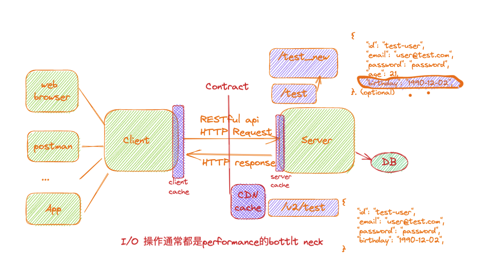

JR-18-Java SpringBoot class3 RESTful api


主要和RESTful API的设计有关系


# 1. Tips 0 -

be careful when you want to use `static`. Define static method only in following scenarios:

​	1.if you are writing utitility classes and they are not supposed to be changed

​	2.if the method is not using any instance variable

​	3.if any operation is not dependent on instance creation

​	4.if there is some code that can easily be shared by al the instance methods, extract that code into a static method

​	5.if you are sure that the definition of the method will never be changed or overriden. As static method cannot be overridden

​	remember it might affect when you test other methods who use a static method

there should be no business logic in controller. Controller usually contain required validation (you could choose to put dto <-> entity in controllers too)

e.g. better not to define instance variable in controller class, might lead to bug. 

```java
@RestController
public class UserController {
    private List<User> users = new ArrayList<>();		// 后面如果你想对方法return的User object进行存储, 这种在controller里定义instance variable的写法不推荐. 会出现奇奇怪怪的问题,
}
```


If using default @Service / @Component annotation. should avoid adding any field that you want to use to stroe data in request


# 2. RESTful API 10min-

REST stands for *Representational State Transfer*. **REST is a web standards based architecture and uses HTTP Protocol for data communication.** It revolves around resources where every component is a resource and a resource is accessed by a common interface using HTTP standard methods. 

In REST architecture, a REST Server simply provides access to resources and the REST client accesses and presents the reousrces.

+ Here each resource is identified by **URIs / Global IDs**. 

+ REST uses various representations to represent a resource like Text, JSON and XML. JSON is now the most popular format being used in Web Services. 

**RESTful Web Services** are basically ***REST Achitecture based Web Services***. In REST Architecture everything is a resource. RESTful web services are light weight, highly scalable and maintainable and are very commonly used to create APIs for web-based applications.


REST server and REST client:



## 2.1 Resource 18min-

**In REST architecture, everything is a resource.** 

A **REST Server** simply provides access to resources and the **REST client** accesses and presents the reousrces. I/O流的产物.

+ Here each resource is identified by **URIs / Global IDs**. Every resource is unique.

+ REST uses various representations to represent a resource like Text, JSON and XML. JSON is now the most popular format being used in Web Services. 

:gem: Representation of resources: XML, JSON, HTML etc. 

```XML
// XML:
<user>
  <id>1</id>
  <name>Mahesh</name>
  <profession>Teacher</profession>
</user>
```

```jason
// JSON:
{
	"id": 1,
	"name": "Mahesh",
	"profession": "Teacher"
}
```

Good resource representation:

+ Understandability: Both server and client should be able to understand and utilize the representation format of the resource.
+ Completeness: Format should be able to represent a resource completely
+ Linkability: A resource can have a linkage to another resource. 就像对象里面可以包含另一个对象.


## 2.2 Messages 27min-

:book: [MDN: HTTP message](https://developer.mozilla.org/en-US/docs/Web/HTTP/Messages)

Message: HTTP request, HTTP response

Component of a HTTP Request: 

+ **Verb**: indicate HTTP methods (e.g. GET, POST, DELETE, PUT etc.)
+ **URI**: Uniform Resouce Identifier to identify the resource on the server
+ **HTTP Version**: e.g. HTTP v1.1
+ R**equest Header:** Contains metadata for the HTTP Request message as key-value pairs. e.g. client (or browser) type, format supported by the client, format of the message body, cache settings, etc.
+ **Request Body:** Message content or Resource representation


Component of a HTTP response:

+ **Status/Response code:** Indicates the Server status for the requested resource. e.g. 404 means resource not found. 200 means response is OK. 记住常见的规定的status code和对应含义.  :book: [MDN: HTTP status code](https://developer.mozilla.org/en-US/docs/Web/HTTP/Status)
+ **HTTP Version:** e.g. HTTP v1.1
+ **Response Header:** Contains metadata for the HTTP Response message as key-value pairs. e.g. content length, content type, response date, server type, etc.
+ **Response Body:** Response message content or Resource representation


用DevTool > Network可以查看HTTP request, response; e.g.用如下url查看

https://samples.openweathermap.org/data/2.5/forecast?q=Melbourne,au&appid=b6907d289e10d714a6e88b30761fae22


## 2.3 Addressing: URI 49min-

Addressing refers to locating a resource or multiple resources **lying on the server**.

e.g. https://samples.openweathermap.org/data/2.5/forecast?q=Melbourne,au&appid=b6907d289e10d714a6e88b30761fae22 is URL, in which: <u>data/2.5/forecast?q=Melbourne,au&appid=b6907d289e10d714a6e88b30761fae22</u> is URI


Constructing a standard URI:

+ **Use Plura Noun:** use plural noun to define resources
+ **Avoid using space:** use underscore (_) or hypenth (-) (more recommended) instead
+ **Use lowercase letter:** Although URI is case-insensitive, it is good practice to keep the url in lower case letters only
+ :star: **Maintain backward compatibility:** As web service is a public service, a URI once made public should always be available. In case, URI gets updated, redirect the older URI to a new URI using the HTTP status code, 300.
  + 可以在URI里声明版本号
+ **Use HTTP Verb:** Alway use HTTP Ver like GET, PUT, DELETE to do the operation on the resources. It is no good to include operations name in the URI.

```bash
// bad practice
GET http://localhost:8080/UserManagement/rest/UserService/getUser/1
DELETE http://localhost:8080/UserManagement/rest/UserService/deleteUser/1

// good practice: 添加 version number
GET http://localhost:8080/usermanagement/api/v1/userservice/users/1
DEL http://localhost:8080/usermanagement/api/v1/userservice/users/1

// better： more concise
GET http://localhost:8080/api/v1/users/1
DEL http://localhost:8080/api/v1/users/1
```


## 2.4 Methods 1h06min-

即HTTP Verb提示的HTTP Method

The most commonly used HTTP methods in a REST based  architecture:

CRUD:

+ **GET:** provides a read only access to a resource
+ **POST:** used to create a new resource
+ **PUT (两个功能):** used to update an existing resource or create a new resource
+ **DELETE:** used to remove a resource (大多数情况下不会用, 我们不会随便删除生产环境的数据)
+ **OPTIONS:** used to get the supported operations on a resource

---

中间穿插一些Q&A

:question: what are the differences between GET and POST ?


:gem: e.g.

URI 应该具有可读性, 别人看到就知道啥意思

| HTTP Method | URI       | Operation                                    |
| :---------- | --------- | -------------------------------------------- |
| GET         | /books    | Get list of books                            |
| GET         | /books/1  | Get book with Id 1                           |
| PUT         | /books2/2 | Update book with Id 2                        |
| POST        | /books    | Create a book                                |
| DELETE      | /books/1  | Delete Book with Id 1                        |
| OPTIONS     | /books    | List the supported operations in web service |


## 2.5 :moon: Stateless 1h26min-

**As per the REST architecture, a RESTful Web Service should not keep a client state on the server (也正因如此, 我们不应该在controller, service层面存储数据). **This restriction is called Statelessness. It is the responsibility of the client to pass its context to the server and then the server can store this context to process the client's further request. For example, session maintained by server is identified by session identifier passed by the client.

```xml
<book>
  <id>1</id>
  <name>Game of throne</name>
</book>
```

**Stateless means every time, you hit the RESTful Service, it should return the same value, regardless the State of the user journey.**

Ideompotency: 幂等性. 当用户短时间内输入多次相同的操作时, 服务器该如何处理. 比如1s内两次支付商品, 1s内多次booking restaurant. :question: google做further understanding


### Stateless Pros vs. Cons

+ Pros
  + web services can treat each method request independently. 很大程度上降低server side的软件设计复杂度.
  + web services need not maintain the client's previous interactions. It simplifies the application design
  + As HTTP is itself a statelessness protocol, RESTful web services work seamlessly with HTTP protocols
+ Cons
  + Web services need to get extra information in each request and then interpret to get the client's state in case the client interactions are to be taken care of.
+ Solutions
  + Server side session, business process engine in the background etc.


1h44min-1h57min 歇息


## 2.6 :moon: Caching 1h57min-

Caching refers to **storing the server response in the client itself**, so that a client need not make a server request for the same resource again and again, especially for some large sized multi-media files e.g. icons, imgs... Cache本质是空间换时间的思想, 我们需要Cache是因为通常I/O 操作 (e.g. HTTP request, HTTP response) 经常成为performance的bottle neck (e.g. establish connection很耗费时间), 应当尽量减少I/O操作的次数


A *server response* should have information about how caching is to be done, so that a client caches the response for a time period or never caches the server response

| Header        | Description                                                  |
| ------------- | ------------------------------------------------------------ |
| Date          | Date and Time of the resource when it was created            |
| Last Modified | Date and Time of the resource when it was last modified      |
| Cache-Control | Primary header to control caching                            |
| Expires       | Expiration date and time of caching                          |
| Age           | Duration in seconds from when resource was fetched from the server |

同样在Dev tool > Network 可以查看被服务器发送过来的文件, 有的是被cached的, 在这些文件对应的response header可以查看这些Caching的属性

在Dev tool > Application, 可以查看Storage的信息 (including Local storage, session storage, Cookies...). 以如下网站为例:

https://partner.booking.com/en-us/help/reservations/manage/all-you-need-know-about-double-bookings


Caching-control header:

```bash	
cache-control: max-age=2628000, public
```

| Header              | Description                                                  |
| ------------------- | ------------------------------------------------------------ |
| Public              | Indicates that resource is cacheable by any component.       |
| Private             | Indicates that resource is cacheable only by the client and the server, no intermediary can cache the resource. |
| No-cache / no-store | Indicates that a resource is not cacheable                   |
| max-age             | Indicates the caching is valid up to max-age in seconds. After this, client has to make another request |
| Must-revalidate     | Indication to server to revalidate resource if max-age has passed. |


注意图中Cache的位置: 

+ Client cache

+ CDN cache 

+ Server cache


```java
@GetMapping("/user")
public User getUserByParameter(@NotBlank @RequestParam String email, final HttpServletResponse response){

  String value = CacheControl.maxAge(10, TimeUnit.SECONDS).getHeaderValue();
  response.addHeader(HttpHeaders.CACHE_CONTROL, value);

  return new User(111, email, "password", 23);
}
```


## 2.7 :full_moon: REST Principle: Client/Server Separation 2h28min-


如何设计一个好的REST API? 有哪些principle?

:book: https://microsoft.github.io/code-with-engineering-playbook/design/design-patterns/rest-api-design-guidance/

:book: https://rapidapi.com/learn/rest/rest-apis-for-experts/principles-of-rest-api


### 构建RESTful API doc工具:

关于OpenAPI

The OpenAPI Specification (OAS) defines a standard, programming language-agnostic interface description for HTTP APIs, which allows both humans and computers to discover and understand the capabilities of a service without requiring access to source code, additional documentation, or inspection of network traffic. When properly defined via OpenAPI, a consumer can understand and interact with the remote service with a minimal amount of implementation logic. Similar to what interface descriptions have done for lowerlevel programming, the OpenAPI Specification removes the guesswork in calling a service.


OpenAPI [springdoc-openapi v2.0.2](https://springdoc.org/v2/#getting-started)

在gradle中加入如下dependency

```bash
// https://mvnrepository.com/artifact/org.springdoc/springdoc-openapi-starter-webmvc-ui
implementation 'org.springdoc:springdoc-openapi-starter-webmvc-ui:2.0.2'
```

运行application, 之后:

Visit: http://localhost:8080/v3/api-docs; 返回JSON格式的openAPI

OR

visit: http://localhost:8080/swagger-ui/index.html 显示swaggerUI (更好看), 提供直观且美观的API doc; 可以try-out, 就像用postman一样.


# 3. 拓展内容

以下作为拓展知识, 详见PPT

## GraphQL 2h53min-

与RESTful API 平行的另一种API架构, 使用 BFF (backend for frontend)


GraphQL tool - Hasura

作为自己选学的内容


## 其他接口通信方式3h-

除了使用HTTP protocol,  还可以使用RPC (Remote Procedure Call)来进行接口通信

+ Protocol: TCP, HTTP 

+ Format: xml, JSON, protocol buffer

+ Tools: Thrift, gPRC


