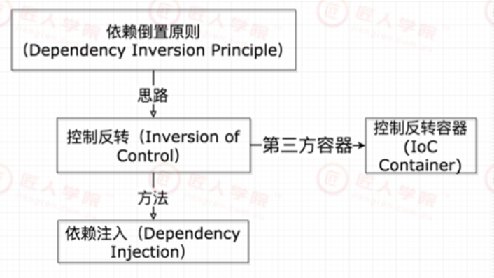
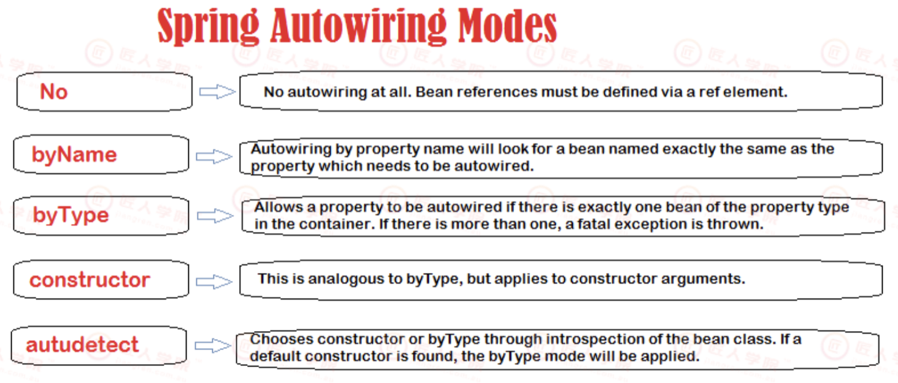
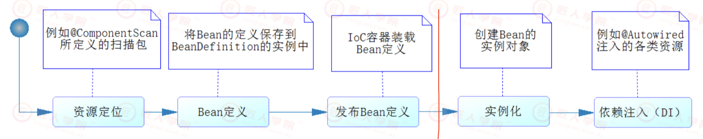
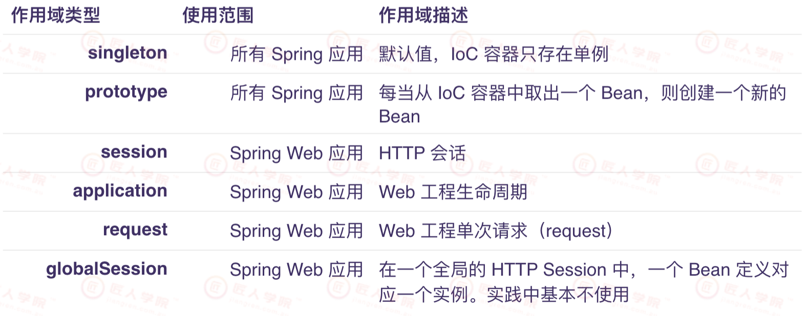
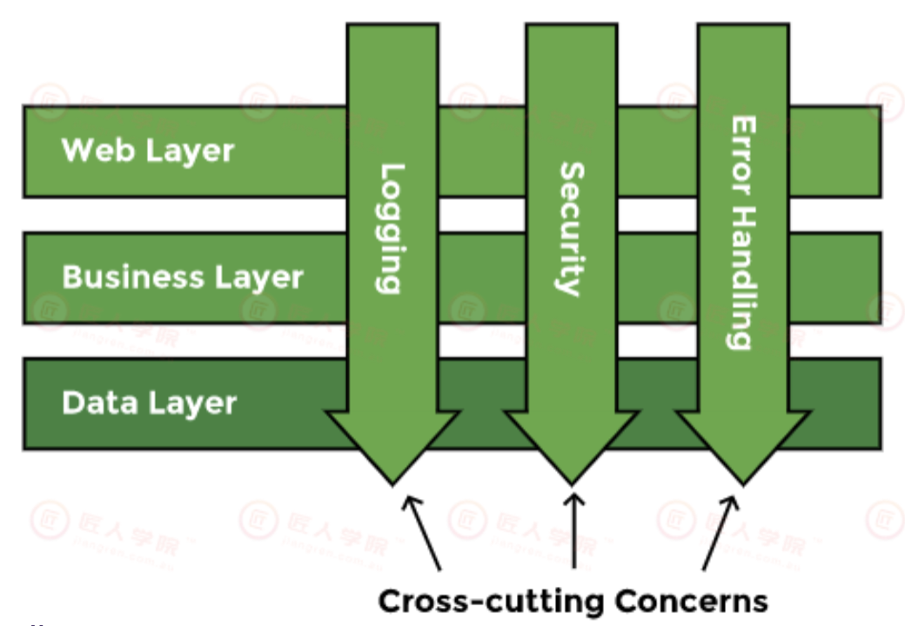
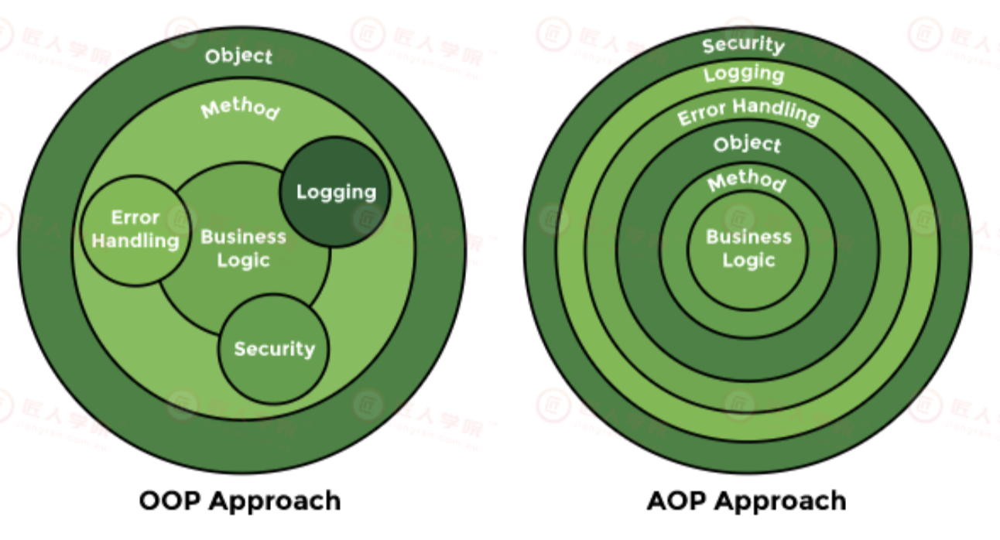
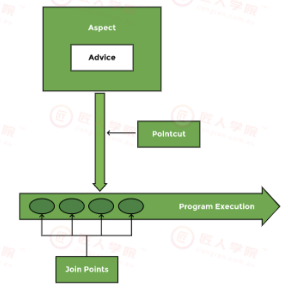
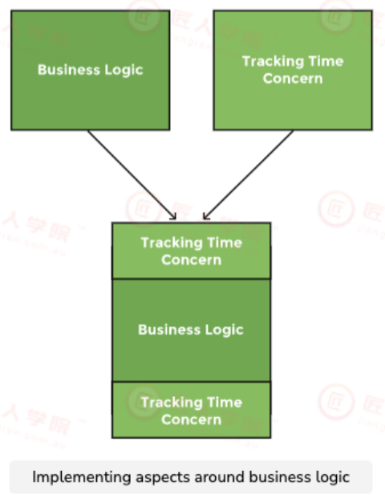

JR17 2022-09-27

Spring IOC & AOP

本节课偏原理, 需要设计模式的知识

不懂的话也可以做P3


# 1. Intro

Dependency Insersion Principle

核心思想是面向接口编程, 细节应该依赖抽象. 见Design Pattern chapter1的笔记


## Inversion of Dependency (IoC)

Inversion of Control is a principle in software engineering and IoC enables a frameworkto take control of the flow of a program and make calls to our custom code. To enablethis, frameworks use abstractions with additional behaviour built in. If we want to add our own behaviour, we need to extend the classes of the framework or plugin our own classes.

The advantages of this architecture are:

+ decoupling the execution of a task from its implementation

+ making it easier to switch between different implementations

+ greater modularity of a program

+ greater ease in testing a program by isolating a component or mocking itsdependencies and allowing components to communicate through contracts

IoC 主要的作用就是解耦各个组件，让高层模块不依赖底层模块，而是让两者依赖接口和抽象来实现。Ioc的思想最核心的地方在于，资源不由使用资源的双方管理，而由不使用资源的第三方管理，这可以带来很多好处。

+ 资源集中管理，实现资源的可配置和易管理。
+ 降低了使用资源双方的依赖程度，也就是我们说的耦合


## Dependency Injection (DI) 14min-

Dependency injection is a pattern (there are many other patterns to do so) through which to implement IoC, where the controlbeing inverted is the setting of object’s dependencies.

The act of connecting objects with other objects, or “injecting” objects into other objects,is done by an assembler rather than by the objects themselves.



```java
// 耦合度较高
public class Store {    
    private Item item;      
    public Store() {        
      item = new ItemImpl1();       		// 只能注入ItemImpl1这个实现类
    }
}

// 耦合度比上面的低
public class Store {   
    private Item item;    
    public Store(Item item) {       
      this.item = item;    						// 注入Item接口的实现类 
    }
}

public interface Item{
  ...
}
```


Downside of DI: management of dependencies is inconvenient

```java
public class Main {
    public static void main(String[] args) {
      MyClass4 myClass4 = new MyClass4();
      MyClass3 myClass3 = new MyClass3();
      // If we want to add another dependency to MyClass2 (e.g. myClass5), we have to change the code by ourselves.
      MyClass2 myClass2 = new MyClass2(myClass3, myClass4);
      MyClass1 myClass1 = new MyClass1(myClass2);
      myClass1.doSomething();
    }
}
```


A more convenient way to combat downside of DI: 

:star: DI  & IOC work together

With IoC, the dependencies are managed by the container, and the programmer is relieved ofthat burden.

Using annotations like `@Autowired`, the container is asked to inject a dependencywhere it is needed, and the programmers do not need to create/manage those dependencies bythemselves.

```java
public class MyClass2 {
  @Autowired
  private MyClass3 myClass3;
  
  @Autowired
  private MyClass4 myClass4;
  
  public void doSomething(){
    myClass3.doSomething();
    myClass4.doSomething();}
}
```


## Spring开发的策略 20min-

Spring最根本的使命：简化Java开发。
为了降低Java开发的复杂性，Spring采取以下4种关键策略：

+ 基于POJO(plain old java object)的轻量级和最小侵入性编程

+ 通过dependence injection, interface oriented 实现松耦合

+ 基于切面和惯例进行声明式编程

+ 通过切面和模版减少样板示代码


# 2. :moon: Spring中的IoC 24min-

IoC（Inversion of Control，控制倒转），是spring的核心，贯穿始终。

**所谓IoC，对于spring框架来说，就是由spring来负责控制对象的生命周期和对象间的关系。**所有的类都会在**spring容器**中登记，告诉spring你是个什么，你需要什么，然后spring会在系统运行到适当的时候，把你要的东⻄主动给你，同时也把你交给其他需要你的东⻄。

所有的类的创建、销毁都由 spring来控制，也就是说控制对象生存周期的不再是引用它的对象，而是spring。对于某个具体的对象而言，以前是它控制其他对象，现在是所有对象都被spring控制，所以这叫控制反转。

>  前面我们提到:
>
> Ioc的思想最核心的地方在于，资源不由使用资源的双方管理，而由不使用资源的第三方(这里指Spring)管理，这可以带来很多好处。
>
> + 资源集中管理，实现资源的可配置和易管理。
>
> + 降低了使用资源双方的依赖程度，也就是我们说的耦合


**IoC 容器**需要具备两个基本的功能：

+ 通过描述管理 Bean，包括发布和获取 Bean
+  通过描述完成 Bean 之间的依赖关系


## 2.1 The Spring IoC Container

**Spring中将IoC容器管理的对象称为Bean (Bean是指对象!!!)**，这个和JavaBean并没有什么关系。。

+ `BeanFactory`接口：在 Spring 的定义中，它要求所有的 IoC 容器都需要实现接口BeanFactory，它是一个顶级容器接口。Bean工厂，借助于配置文件能够实现对JavaBean的配置和管理，用于向使用者提供Bean的实例。

+ `ApplicationContext`接口：ApplicationContext构建在BeanFactory基础之上，提供了更多的实用功能。 在现实中我们使用的大部分Spring IoC 容器是 ApplicationContext 接口的实现类


## 2.2 通过扫描装配Bean 30min-

如果一个个的 Bean 使用注解`@Bean` 注入 Spring IoC 容器中，很麻烦。

Spring 允许我们进行扫描装配 Bean 到 IoC 容器中，对于扫描装配而言使用的注解是

+ `@Component` : 标明哪个类被扫描进入 Spring IoC 容器
+ `@ComponentScan`:  标明采用何种策略去扫描装配 Bean。自动扫描和application同路径下的package. 策略分为:
  + Constructor-based dependency injection
  + Setter-based dependency injection
  + Field-based dependecny injection


### Constructor-Based Dependency Injection 34min-

用的多一些

the container will invoke a constructor with arguments each representing a dependency we want to set.

```java
@Configuration
public class AppConfig {     
  @Bean    
  public Item item1() {        
    return new ItemImpl1();    
  }     
  @Bean    
  public Store store() {        
    return new Store(item1());    
  }
}
```

+ The `@Configuration` annotation indicates that the class is a source of bean definitions. Also, we can add it to multiple configuration classes.

+ The `@Bean` annotation is used on a method todefine a bean. 
  + If we don’t specify a custom name,the bean name will default to the method name.

For a bean with the default singleton scope(单例模式), Spring first checks if a cached instance of the bean already exists and only creates a new one if itdoesn’t. If we’re using the prototype scope(原型模式), the container returns a new bean instance for each method call. 


### Setter-Based Dependency Injection

36min-

其实用的很少

:question: 17期锤姐的ppt忘了加例子了, 看18期的


Constructor-based and setter-based types of injection can be combined for the same bean.The Spring documentation recommends using constructor-based injection for mandatorydependencies, and setter-based injection for optional ones.


### Field-Based Dependency Injection

38min-

we can inject the dependencies by marking them with an` @Autowired` annotation:

`@Autowired`用在field上

```java
public class Store {    
  @Autowired    
  private Item item;
}
```

While constructing the Store object, if there’s no constructor or setter method to injectthe Item bean, the container will use reflection to inject Item into Store.


:bangbang: This approach might look simpler and cleaner but <u>is not recommended</u> to use because it has a few drawbacks such as:

+ This method uses reflection to inject the dependencies, which is costlier thanconstructor-based or setter-based injection

+ It’s really easy to keep adding multiple dependencies using this approach. 因为使用简单， 你可能容易往里面注入太多依赖, 这容易违反Single Responsibility Principle.  If you wereusing constructor injection having multiple arguments would have made us think thatthe class does more than one thing which can violate the Single Responsibility


#### Autowired注解

45min-

@Autowired 的缺省规则：首先它会根据类型找到对应的 Bean (被Spring Ioc容器管理的对象)，如果对应类型的 Bean不是唯一的，那么它会根据其属性名称和 Bean 的名称进行匹配。如果匹配得上，就会使用该 Bean；如果还无法匹配，就会抛出异常。



消除歧义性: @Primary & @Qualifier

+ `@Primary` 的含义告诉 Spring IoC 容器，当发现有多个同样类型的 Bean 时，请优先使用这个进行注入

+ `@Qualifier` 的配置项 value 需要一个字符串去定义，它将与@Autowired 组合在一起，通过类型和名称一起找到 Bean。


带有参数的构造方法类的装配

51min-

使用@Autowired注解对构造方法的参数进行注入

`@Autowired`用在参数上

```java
@Component
public class BussinessPerson implements Person {
  private Animal animal = null;
  
  public BussinessPerson(@Autowired @Qualifier("dog") Animal animal) {
    this.animal = animal;
  }
  
  @Override 
  public void service() { 
    this.animal.use();
  }
  
  @Override 
  public void setAnimal(Animal animal) {
    this.animal = animal;
  }
}
```


52min-

另一个不推荐用@Autowired的缘故是, 它是依赖于Spring的, Java原生也有支持注入的Annotation

| Annotation | Package                                     | Source |
| ---------- | ------------------------------------------- | ------ |
| @Resource  | javax.annotation                            | Java   |
| @Inject    | javax.inject                                | Java   |
| @Qualifier | javax.inject                                | Java   |
| @Autowired | org.springframework.bean.factory.annotation | Spring |


# Bean's life cycle 53min-

Spring IoC 初始化和销毁 Bean 的过程，这便是 Bean 的生命周期的过程，它大致分为4个阶段:

1. Bean 定义
2. Bean 的初始化
3. Bean 的生存期和
4. Bean 的销毁


## Bean的定义过程

Bean 定义过程大致如下：

+ Spring 通过我们的配置，如@ComponentScan 定义的扫描路径去找到带有@Component 的类，这个过程就是一个资源定位的过程
+ 一旦找到了资源，那么它就开始解析，并且将定义的信息保存起来。注意，此时还没有初始化Bean，也就没有 Bean 的实例，它有的仅仅是 Bean 的定义
+ 然后就会把 Bean 定义发布到 Spring IoC 容器中。此时，IoC 容器也只有 Bean 的定义，还是没有Bean 的实例生成。

完成了这3步只是一个资源定位并将 Bean 的定义发布到 IoC 容器的过程，还没有 Bean 实例的生成，更没有完成依赖注入。在默认的情况下，Spring 会继续去完成 Bean 的实例化和依赖注入，这样从IoC 容器中就可以得到一个依赖注入完成的 Bean。


## Bean的初始化

ComponentScan 中还有一个配置项 lazyInit，只可以配置 Boolean 值，且默认值为false，也就是默认不进行延迟初始化，因此在默认的情况下 Spring 会对 Bean 进行实例化和依赖注入对应的属性值。




56min-

到这里


## Bean的作用域1h02min-

```java
@Component
@Scope(WebApplicationContext.SCOPE_REQUEST)
```




一般我们只用singleton与prototype


## 使用@Profile 指定不同环境 1h04min-

针对开发环境、测试环境、staging环境（用于模拟真实生产环境部署所用）和生产环境的切换，每一套环境的上下文是不一样的。例如，它们会有各自的数据库资源，这样就要求在不同的数据库之间进行切换。Spring 提供了Profile 机制，很方便地实现各个环境之间的切换


1h06min-1h15min

实际工作中, 我们一般在不同环境下, 可以加不同的配置文件 (property file)

也可以用环境变量注入重要信息 (e.g. Password)


休息 1h15min- 1h25min 


# Aspect oriented programming (AOP) 1h25min-

# Intro

面向切面编程是面向对象编程的有益补充。

AOP是将那些与业务无关，却为业务模块所**共同调用**的逻辑或责任进行封装。


应用AOP的功能举例：


+ Authentication 权限


+ Caching 缓存


+ Context passing 内容传递


+ Error handling 错误处理


+ Lazy loading　懒加载

+ Debugging　　调试





OOP vs. AOP



chatGPT: what is the difference between AOP and OOP

> AOP (Aspect-Oriented Programming) and OOP (Object-Oriented Programming) are two distinct programming paradigms.
>
> OOP is based on the idea of objects and classes, where objects are instances of classes and contain data and methods that operate on that data. OOP is used to model real-world objects and their interactions and is centered around the concept of encapsulation, which is the idea of hiding the internal details of an object and exposing only what is necessary to interact with it.
>
> AOP, on the other hand, is a programming paradigm that aims to separate concerns in a software application. It allows developers to modularize cross-cutting concerns, such as logging, security, and transaction management, into separate components that can be woven into the main application. AOP provides a mechanism for adding behavior to existing code without modifying the code itself(最小化侵入式编程), making it easier to maintain and modify the software over time.
>
> In short, OOP is focused on modeling real-world objects and their interactions, while AOP is focused on separating and modularizing cross-cutting concerns. Both paradigms can be used together, and many modern programming languages, such as Java, support both OOP and AOP.


## :moon: AOP terminology 1h30min

+ Aspect (切面)
  + An aspect is a Java class that implements cross-cutting concerns (竖切关注点).The `@Aspect` annotation is used to define a class as an aspect. An aspect is a combination of the kinds of methods to intercept(拦截) and what to do after intercepting them.

+ Pointcut (切点)
  + Pointcuts are expressions(表达式) that determine which method calls will be intercepted.

+ Advice
  + The tasks performed after intercepting a method call are called advices. It is the logic of the methods in a class marked with `@Aspect`.

+ Joinpoint
  + All method calls that are intercepted arejoinpoints. It is a point in the program executionwhere an aspect can be plugged in. It contains thename of the intercepted method call. 




+ Weaving
  + The process of implementing AOP around method calls iscalled weaving. Weaving links an aspect with objects in theapplication to create an advised object. The aspect is calledat the right moment.
+ Weaver
  + The framework that ensuresthat an aspect is invoked atthe right time is called aweaver.




# Hands-on AOP 1h36min-

Demo: Implement rate limit for querying weather information per user (token)

流量控制: Internet tech里的data link layer (sliding window) 与 transport layer TCP window management 有涉及到类似的思想

如何定义1个小时的范围是核心


正式开始1h52min-

+ step1: Add spring-app

```yml
implementation 'org.springframework.boot:spring-boot-starter-aop'
```


+ Step2: Add @Aspect class and @EnableAspectJAutoProxy

在和application同路径下 新建aop package, 新建如下类, 定义一个aspect

```java
@Aspect
@Component
//@RequiredArgsConstructor	// 这个不一定用
public class RateLimitAspect {

}
```


同时, 给application 加上annotation: `@EnableAspectJAutoProxy`

```java
@EnableAspectJAutoProxy
@SpringBootApplication
public class WeatherAppApplication {

	public static void main(String[] args) {
		SpringApplication.run(WeatherAppApplication.class, args);
	}

}
```


+ Step3: create annotation interface

在和application同路径下的aop package, 新建如下annotation

```java
@Target(ElementType.METHOD)
@Retention(RetentionPolicy.RUNTIME)
public @interface RateLimit {

}
```


+ step4: in aspect, define a method that contains the logic of the steps that need to be carried out when a methodcall gets intercepted. 即写advice

1h57min-

```java
@Aspect
@Component
//@RequiredArgsConstructor
public class RateLimitAspect {

    public Object exceedingLimit (ProceedingJoinPoint jointPoint) throws Throwable{
        // TODO: implement logics codes

        return jointPoint.proceed();
    }
}
```


+ Step5: Pointcut expression: Choose to use `@Around` annotation on our method with annotation interface 

1h59min

还是在aspect里的advice头上加上`@Around`

```java
@Aspect
@Component
//@RequiredArgsConstructor
public class RateLimitAspect {
	
  	@Around("@annotation(RateLimit)")		// 表示当使用`@RateLimit`时, 就会执行下面这个方法, 来判断是否超过rate limit
    public Object exceedingLimit (ProceedingJoinPoint jointPoint) throws Throwable{
        // TODO: implement logics codes

        return jointPoint.proceed();
    }
}
```


不是, 之后锤姐哪儿来的controller的写好的代码????

