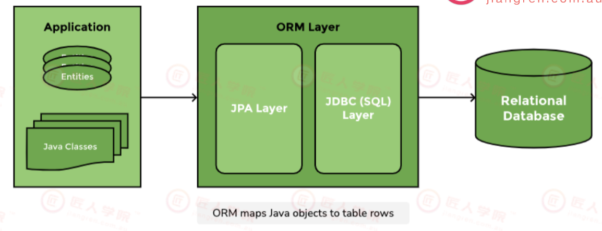
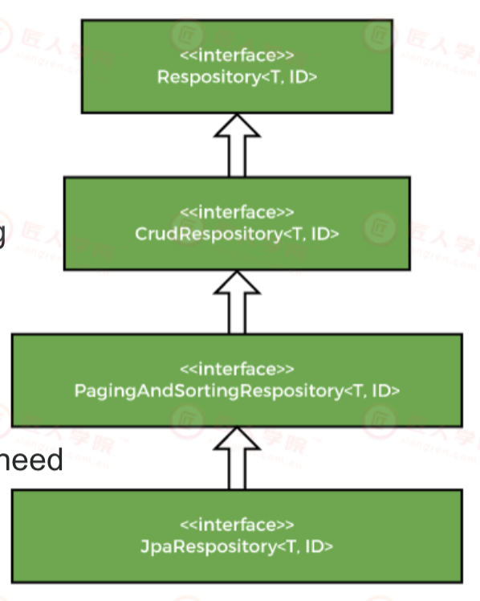
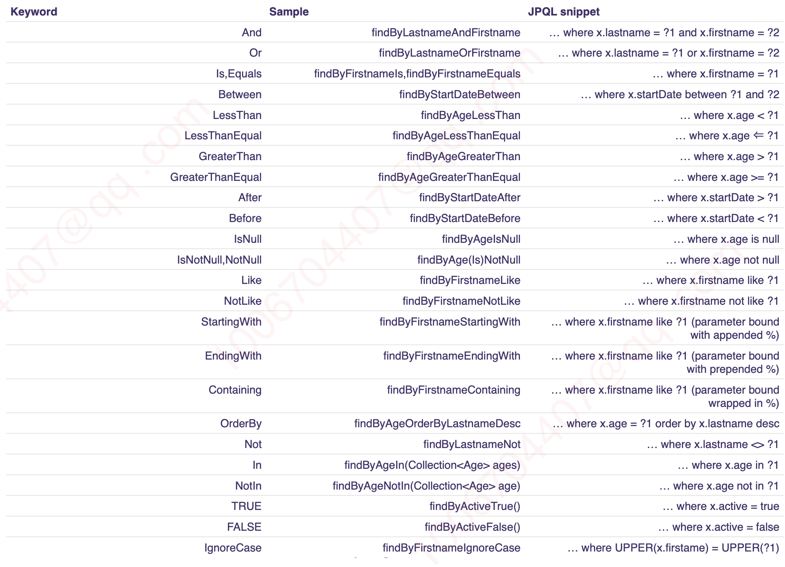
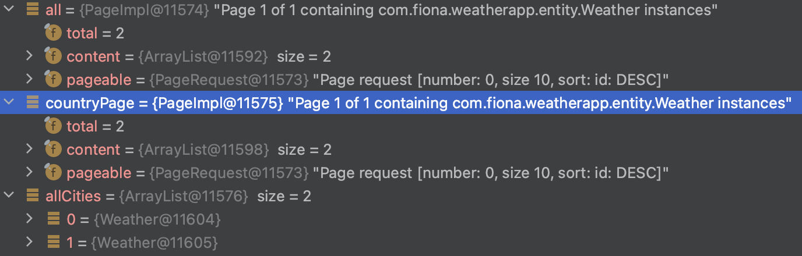
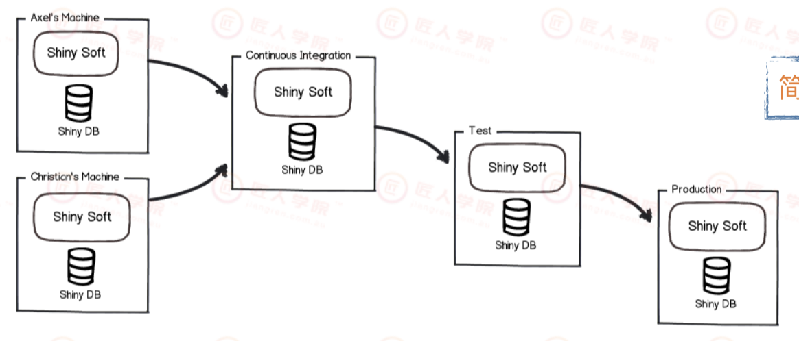
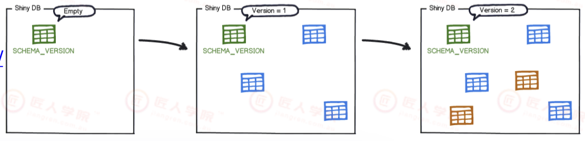
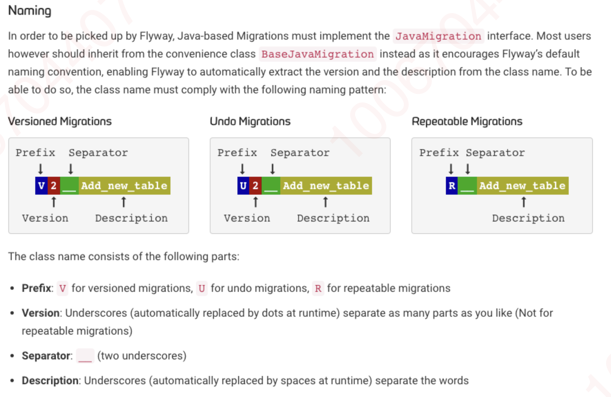
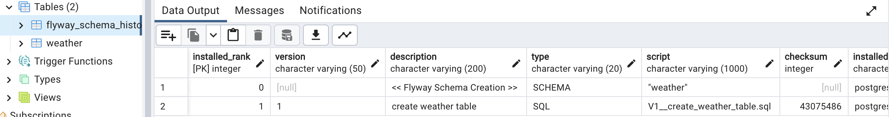

JR17: 22-9-25 lec


接上节Database SQL的课, 配weatherapp-2


# 要点概述

+ 什么是ORM, 什么是JPA
+ Spring Data JPA的好处, Hibernate和Mybatis相比的异同
+ 使用Spring Data JPA做query
  + 基本查询
  + 复杂查询 
    + JPQL (:question: 懵逼状态)
+ repository 的'unit test'
+ Spring Data JPA如何支持Transaction (:question: 懵逼状态)
+ Database migration


# 1. Introduction to JPA 0-12min

## 1.1 ORM

**Object Relational Mappinp (ORM)** 模式是一种为了解决**面向对象**与**关系数据库**存在的互不匹配的现象技术。简单的说，ORM 是通过使用描述对象和数据库之间映射的元数据，将程序中的对象**自动持久化**到<u>关系数据库</u>中

当开发一个应用程序的时候（不使用 O/R Mapping），你可能会写不少数据访问层的代码，用来从数据库保存、删除、读取对象信息等。在 DAO 中写了很多的方法来读取对象数据、改变状态对象等任务，而这些代码写起来总是重复的。 针对这些问题ORM 提供了解决方案，简化了将程序中的对象持久化到关系数据库中的操作, **ORM 框架的本质是简化编程中操作数据库的编码**. 

在 Java 江湖中发展到现在基本上就剩两家，一个是宣称可以*<u>不用写一句 SQL</u>* 的 **Hibernate** (澳洲企业一般都用这个)，一个是以<u>*动态 SQL*</u> ⻅⻓的**MyBatis**，两者各有特点。在企业级系统开发中可以根据需求灵活使用，一个有趣的现象：传统企业大都喜欢使用 Hibernate，而国内互联网行业通常使用 MyBatis


:bangbang: ORM本身与语言无关


## 1.2 JPA

JPA (Java Persistence API) 是 Sun官方提出的 Java 持久化规范，它为Java 开发人员提供了一种对象/关联映射工具来管理 Java 应用中的关系数据，它的出现主要是为了简化现有的持久化开发工作和整合 ORM 技术，结束现在 Hibernate、TopLink、JDO 等 ORM 框架各自为营的局面


下图可见JPA 作为连接Relational databse和Java Application的桥梁




:bangbang: 注意：JPA 是一套规范，不是一套产品，像 Hibernate、TopLink、JDO 他们是一套产品，如果说这些产品实现了这个 JPA 规范，那么我们就可以叫他们为JPA 的实现产品


## 1.3 Spring Data JPA

Spring Data JPA 是 Spring 基于 ORM 框架、JPA 规范的基础上封装的一套**JPA 应用框架**，可使开发者用极简的代码即可实现对数据的访问和操作。它提供了包括CRUD等在内的常用功能，且易于扩展。学习并使用 Spring Data JPA 可以极大提高开发效率。

Spring Data JPA 让我们解脱了 DAO 层的操作 (就是早期程序员需要手写SQL然后再用Java来接收数据)，基本上所有 CRUD 都可以依赖于它来实现。


:bangbang: Spring Data JPA 


# 2. Hands-on 12min-

## Spring Data Jpa依赖与配置

打开上次的weather-app (fullstack/...../springboot2/weather-app2)

打开对应docker database和pgAdmin


build.gradle放入Spring data jpa依赖

```gradle
implementation 'org.springframework.boot:spring-boot-starter-data-jpa'
runtimeOnly 'org.postgresql:postgresql'
implementation 'org.flywaydb:flyway-core'
```


接着配置好main > resource > application.yml

```yml
spring:
  datasource:  		# 注意database的数据要和docker.compose.yml中的匹配
    driver-class-name: org.postgresql.Driver
    url: jdbc:postgresql://localhost:15432/postgres?currentSchema=weather			
    username: postgres
    password: admin
  flyway:				# 用来做database migration
    enabled: true
    schemas: weather
  jpa:					# jpa相关配置
    properties:
      hibernate:
        default_schema: weather
        jdbc:		# JPA: hibernate里肯定封装了jdbc
          time_zone: UTC
    show-sql: true			# 这样执行的时候能够看到由Spirng JPA到底生成并运行了哪些SQL语句
```


18-20min intellij注入环境变量 了解即可, 用到再学 (不知道这个这节课不受影响)


## Run application 21min-

Run application, 正常没报错

可以看到jpa启动起来的日志提示信息, 并且里面也能看到与postgres连接成功了

```bash
2023-02-09 10:56:23.232  INFO 5009 --- [  restartedMain] o.hibernate.jpa.internal.util.LogHelper  : HHH000204: Processing PersistenceUnitInfo [name: default]
2023-02-09 10:56:23.254  INFO 5009 --- [  restartedMain] org.hibernate.Version                    : HHH000412: Hibernate ORM core version 5.6.10.Final
2023-02-09 10:56:23.321  INFO 5009 --- [  restartedMain] o.hibernate.annotations.common.Version   : HCANN000001: Hibernate Commons Annotations {5.1.2.Final}
2023-02-09 10:56:23.359  INFO 5009 --- [  restartedMain] com.zaxxer.hikari.HikariDataSource       : HikariPool-1 - Starting...
2023-02-09 10:56:23.462  INFO 5009 --- [  restartedMain] com.zaxxer.hikari.HikariDataSource       : HikariPool-1 - Start completed.
2023-02-09 10:56:23.475  INFO 5009 --- [  restartedMain] org.hibernate.dialect.Dialect            : HHH000400: Using dialect: org.hibernate.dialect.PostgreSQL10Dialect
2023-02-09 10:56:23.721  INFO 5009 --- [  restartedMain] o.h.e.t.j.p.i.JtaPlatformInitiator       : HHH000490: Using JtaPlatform implementation: [org.hibernate.engine.transaction.jta.platform.internal.NoJtaPlatform]
2023-02-09 10:56:23.724  INFO 5009 --- [  restartedMain] j.LocalContainerEntityManagerFactoryBean : Initialized JPA EntityManagerFactory for persistence unit 'default'
2023-02-09 10:56:23.791  WARN 5009 --- [  restartedMain] JpaBaseConfiguration$JpaWebConfiguration : spring.jpa.open-in-view is enabled by default. Therefore, database queries may be performed during view rendering. Explicitly configure spring.jpa.open-in-view to disable this warning
```


## :moon: 写Weather entity 25min-

```java
package com.fiona.weatherapp.entity;

import lombok.AllArgsConstructor;
import lombok.Builder;
import lombok.Getter;
import lombok.NoArgsConstructor;

import javax.persistence.*;     // Java persistence api (JPA): Spring Data JPA enabled
import java.time.OffsetDateTime;

/**
 * @author xueshuo
 * @create 2023-01-30 9:36 pm
 */
@Entity
@Builder
@Getter
@AllArgsConstructor
@NoArgsConstructor
@Table(name = "weather")        // refer to database table: "weather"
public class Weather {
    @Id         // PK
    @GeneratedValue( strategy = GenerationType.IDENTITY)        // auto-generation strategy
    @Column(name = "id", updatable = false, nullable = false)       // constraint
    private Long id;

    @Column(nullable = false)
    private String city;
    @Column(nullable = false)
    private String country;
    @Column
    private String description;
    @Column
    private OffsetDateTime updatedTime;
}
```


其中用的多的Spring Data JPA enabled annotation (主要是能够和数据库交互, JPA内封装了JDBC) 

```java
import javax.persistence.*;     // Java persistence api (JPA): Spring Data JPA enabled

@Entity

@Table(name = "")

@Id

@GeneratedValue( strategy = GenerationType.IDENTITY)

@Column()
```


:bangbang:一些注意事项 https://www.jpa-buddy.com/blog/lombok-and-jpa-what-may-go-wrong/， lombok和Spring Data JPA一起用有的地方会冲突 30min-

- Avoid using `@EqualsAndHashCode` and `@Data` with JPA entities;
  - 此时自己手动写equals(),  hashCode()

- Always exclude lazy attributes when using `@ToString`;
- Don’t forget to add `@NoArgsConstructor` to entities with `@Builder` or `@AllArgsConstructor`.


## Demo 33min-

 

:bangbang: 注意这里的配置在实际开发中其实是应该避免使用的, 这里只是教学demonstration


如果启用如下的main > resources > application.yml的配置

```yml
spring:
  datasource:
    driver-class-name: org.postgresql.Driver
    url: jdbc:postgresql://localhost:15432/postgres?currentSchema=weather
    username: postgres
    password: admin
  flyway:
    enabled: false				# don't do this in real production 
    schemas: weather
  jpa:
    properties:
      hibernate:
        default_schema: weather
        jdbc:
          time_zone: UTC
    show-sql: true
    hibernate:
      ddl-auto: update		# don't do this in real production
```


run application, 能在intellij看到下面的log, 因为我们刚配置了ddl-auto: update

```bash
Hibernate: create table weather.weather (id int8 generated by default as identity, city varchar(255) not null, country varchar(255) not null, description varchar(255), updated_time timestamp, primary key (id))
```

同时在pgAdmin > database > postgres下能够看到weather schema下自动创建了一个weather的table, 但里面是没有内容


### 即兴讲的 40min-

intellij的log里还有 

```bash
2023-02-09 11:18:45.734  INFO 6180 --- [  restartedMain] com.zaxxer.hikari.HikariDataSource       : HikariPool-1 - Starting...
2023-02-09 11:18:45.836  INFO 6180 --- [  restartedMain] com.zaxxer.hikari.HikariDataSource       : HikariPool-1 - Start completed.
```

这其实是数据库连接池


性能瓶颈主要是I/O操作, 也就是数据库访问时用的是TCP, 最花时间的是建立连接的操作, 而数据库连接池(database connection pool)就是为了缓解这个问题提升performance, 起到类似缓存的作用, 把connection缓存到一个pool中. 当然pool有capcaity上限, Database自己也有可以连接数上限


## :moon: 写repository 48min-

repository 路径下新建 WeatherRepository:

```java
import com.fiona.weatherapp.entity.Weather;
import org.springframework.data.domain.Page;
import org.springframework.data.domain.Pageable;
import org.springframework.data.jpa.repository.JpaRepository;
import org.springframework.stereotype.Repository;

import java.util.List;
import java.util.Optional;


@Repository                                           // <entity, pk's data type>
public interface WeatherRepository extends JpaRepository<Weather, Long> {
    Optional<Weather> findByCityAndCountry(String city, String country); // Optional class避免nullPointer
    Page<Weather> findByCountry(String country, Pageable pageable);
    List<Weather> findAllByCountry(String country, Pageable pageable);
}
```


如果返回结果只是一个Enity对象, 就用Optional<>, 避免NullPointerException

如果返回结果是一组Entity对象, 用List<>

Page<>后面再说


### 'Unit test' for repository 51min- 1h15min

repository unit test的tricky point:

+ 需要真的另起一个数据库专门用来做测试, 而如果要从数据库做CRUD, 数据库其实作为第三方依赖了, 这里其实就不是unit test而是某种层面的integration test


开始Unit test:  

先在Test下新建一个directory: resources, 然后在里面新建一个application-test.yml的文件, 先不往里放东西

WeahterRepository对应的test class

```java
import com.fiona.weatherapp.entity.Weather;
import org.junit.jupiter.api.BeforeEach;
import org.junit.jupiter.api.Test;
import org.springframework.beans.factory.annotation.Autowired;
import org.springframework.boot.test.context.SpringBootTest;

import java.time.OffsetDateTime;

import static org.assertj.core.api.AssertionsForClassTypes.assertThat;
import static org.junit.jupiter.api.Assertions.*;

/**
 * @author xueshuo
 * @create 2023-02-03 10:47 am
 */
@SpringBootTest
public class WeatherRepositoryTest {

    @Autowired
    private WeatherRepository repository;

    @BeforeEach
    public void setUp() {
        repository.deleteAll();
    }

    @Test
    public void testRepositoryFunctions() {
        OffsetDateTime now = OffsetDateTime.now();
        Weather mel = Weather.builder().city("Melbourne").country("AU").description("Windy").updatedTime(now).build();
        Weather syd = Weather.builder().city("Sydney").country("AU").description("Cloudy").updatedTime(now).build();
        repository.save(mel);
        repository.save(syd);

        // findByCityAndCountry 测试
        assertEquals(2, repository.findAll().size());
        assertThat(repository.findByCityAndCountry("Melbourne", "AU").get())
                .usingRecursiveComparison().ignoringAllOverriddenEquals().isEqualTo(mel);   // 用assertThat()就不用重写equals()了
      
      	// 删除 测试
        repository.deleteAll();
        assertEquals(0, repository.findAll().size());
    }
}
```


在P3的项目测试里我们一般尽量不用@SpringBootTest , 但WeatherRepositoryTest头顶却有它, 为什么呢?  57min-

+ 测试的是Spring Data Jpa的东西， 需要SpringBoot底层的东西
+ WeatherRepository weather 是一个interface, 写上@SpringBootTest 与 @AutoWired保证它可以正常被初始化 :question: 需要回去复习springBoot introduction那节课

而相比之下, service层的代码写Unit test就够了 


run test class, 可以在log里看到当运行 `testRepositoryFunctions()` 到底Hibernate生成并执行了哪些sql语句 (因为我们在application.yml里的show-sql: true)

```Java
Hibernate: select weather0_.id as id1_0_, weather0_.city as city2_0_, weather0_.country as country3_0_, weather0_.description as descript4_0_, weather0_.updated_time as updated_5_0_ from weather.weather weather0_

Hibernate: insert into weather.weather (city, country, description, updated_time) values (?, ?, ?, ?)
Hibernate: insert into weather.weather (city, country, description, updated_time) values (?, ?, ?, ?)

// assertEquals(2, repository.findAll().size());
Hibernate: select weather0_.id as id1_0_, weather0_.city as city2_0_, weather0_.country as country3_0_, weather0_.description as descript4_0_, weather0_.updated_time as updated_5_0_ from weather.weather weather0_

// assertThat(repository.findByCityAndCountry("Melbourne", 
// "AU").get()).usingRecursiveComparison().ignoringAllOverriddenEquals().isEqualTo(mel);   
Hibernate: select weather0_.id as id1_0_, weather0_.city as city2_0_, weather0_.country as country3_0_, weather0_.description as descript4_0_, weather0_.updated_time as updated_5_0_ from weather.weather weather0_ where weather0_.city=? and weather0_.country=?

Hibernate: select weather0_.id as id1_0_, weather0_.city as city2_0_, weather0_.country as country3_0_, weather0_.description as descript4_0_, weather0_.updated_time as updated_5_0_ from weather.weather weather0_

// repository.deleteAll();
Hibernate: delete from weather.weather where id=?
Hibernate: delete from weather.weather where id=?

// assertEquals(0, repository.findAll().size());
Hibernate: select weather0_.id as id1_0_, weather0_.city as city2_0_, weather0_.country as country3_0_, weather0_.description as descript4_0_, weather0_.updated_time as updated_5_0_ from weather.weather weather0_
```


Q&A  1h07min - 1h15min

:bangbang: 锤姐: 

不要在repository里滥用SQL

同时谨慎使用findAll(), delete()


Spring Data JPA的性能有局限性, 如果是频繁做findAll()这种需要query很大数据量的需求, 就别用Spring Data JPA了 (不过一般前端不会需求这么大的数据量, 我们做分页的)


# 3. Spring Data JPA 查询方法


## 3.1 基本查询 1h15min-

基本查询分两种:

+ Spring Data默认已经实现
+ 根据查询方法来自动解析成SQL


### 预先生成方法

Spring Data JPA默认预先生成了一些基本的CRUD的方法. e.g. Inside of your repository class

+ findAll()
+ Delete()


JpaRepository, PagingAndSortingRepository, CrudRepository 之间的关系

JpaRepository extends PagingAndSortingRepository which in turnextends CrudRepository

Their main functions are

+ CrudRepository mainly provides CRUD functions.
+ PagingAndSortingRepository provides methods to do pagination and sortingrecords.
+ JpaRepository provides some JPA-related methods such as flushing thepersistence context and deleting records in a batch.

So if you don't needthe repository to have the functions providedby JpaRepository and PagingAndSortingRepository , use CrudRepository.




### 自定义简单查询 1h19min-

自定义的简单查询就是根据方法名来自动生成 SQL，主要的语法是 findXXBy、readAXXBy、queryXXBy、countXXBy、getXXBy 后面跟属性名称

```java
List<User> findByEmailLike(String email); 
User findByUserNameIgnoreCase(String userName); 
List<User> findByUserNameOrderByEmailDesc(Stringemail);
```


甚至还可以跟一些fitering condition e.g. Like IgnoreCase...





## 3.2 复杂查询 1h23min-

在实际的开发中, 需要用到分页, 筛选, 连表等查询的时候, 就需要用到特殊的方法或者自定义SQL


### 分页查询 1h23min-

WeatherRepository 中 有3个方法, 现在我们测试 分页查询

```java
@Repository                                           // <entity, pk data type>
public interface WeatherRepository extends JpaRepository<Weather, Long> {
    Optional<Weather> findByCityAndCountry(String city, String country); // Optional class避免nullPointer

    // Optional<Weather> findByCityLike(String city);

    Page<Weather> findByCountry(String country, Pageable pageable);		// return  a Page
    List<Weather> findAllByCountry(String country, Pageable pageable);		// return a List
}
```


一般我们在后端就做好分页

Spring Data JPA已经帮我们实现了分页的功能, 在查询的方法中, 需要传入参数Pageable 当查询中有多个参数的时候, Pageable建议做为最后一个参数输入:


在WeatherRepository对应的Test Class中写入如下测试方法

unit test: pageable

```java
@Test
public void testPageQuery() {

    // save mock data into database
    OffsetDateTime now = OffsetDateTime.now();
    Weather syd = Weather.builder().city("Sydney").country("AU").description("Cloudy").updatedTime(now).build();
    Weather mel = Weather.builder().city("Melbourne").country("AU").description("Windy").updatedTime(now).build();
    repository.save(mel);
    repository.save(syd);

    // page的settings
    int page = 0, size = 10;
    Sort sort = Sort.by(Sort.Direction.DESC, "id"); // 由id降序sort
    Pageable pageable = PageRequest.of(page, size, sort);

    // 分别测试WeatherRepository中的3个方法
    Page<Weather> all = repository.findAll(pageable);
    Page<Weather> countryPage = repository.findByCountry("AU", pageable);
    List<Weather> allCities = repository.findAllByCountry("AU", pageable);

    System.out.println("test");		// 在这打个断点
}
```

debug  testPageQuery(), 可以看到 all, countPage, allCities到底是个啥

+ Page, List 都是接口, 上面的写法现了多态, PageImpl类实现了Page接口,  ArrayList实现了List接口
+ all, countPage返回的其实是PageImpl类的对象, allCities返回的是ArrayList类的对象




### 限制查询 1h29min

有时候需要查询前 N 个元素，或者只取前一个实体。

```java
User findFirstByOrderByLastnameAsc();

User findTopByOrderByAgeDesc();

Page<User> queryFirst10ByLastname(String lastname, Pageable pageable);

List<User> findFirst10ByLastname(String lastname, Sort sort);

List<User> findTop10ByLastname(String lastname, Pageable pageable);
```


mySQL, Postgres等不同数据库写SQL限制数据时有略微不同, 使用Spring Data JPA也可以适配, mitigate这种不同带来的不便利


### 自定义SQL查询： JPQL 1h30min-

使用Spring Data的大部分SQL都可以根据方法名定义的方式来实现, 但是由于某些原因我们想使用自定义的SQL来查询, Spring Data也可以完美支持: 

在SQL的查询方法上使用@Query注解, 如*涉及到删除和修改需要加上@Modifying*. 也可以根据需要添加@Transactional对事务的支持, 查询超时的设置等.


By default, the query definition uses JPQL (就是下面@Query()括号里写的, 看起来很像SQL但其实并不是):

The **JPQL (Java Persistence Query Language)** is anobject-oriented query language which is used toperform database operations on persistent entities.


:bangbang: JPQL中不是写table name, 而是entity class name; 写的不是column name, 而是entity的field name

```java
@Transactional(timeout = 10)
@Modifying
@Query("update User set userName = ?1 where id = ?2")
int modifyById(String userName, Long id);

@Transactional
@Modifying
@Query("delete from User where id = ?1")
void deleteById(Long id);

@Query("select u from User u where u.email = ?1")
User findByEmail(String email);
```


#### :full_moon: 多表查询1h34min-


:question:完全不知所云

还是那句话, 知道怎么用就行了, 先不追究原理


看到这里

多表查询在 Spring Data JPA 中有两种实现方式

+ 第一种是利用 Hibernate 的级联查询来实现
+ 第二种是创建一个结果集的接口来接收连表查询后的结果，这里主要使用第二种方式


创建一个用户详情类 (entity)

```java
@Entity
public class UserDetails {
  private static final long serialVersionUID = 1L;
  
  @Id
  @GeneratedValue
  private Long id;
  
  @Column(nullable = false, unique = true)
  private String userId;
  
  @Column(nullable = true)
  private String address;
  
  @Column(nullable = true)
  private String hobby;
  
  // need to add getter and setter
}
```


定义一个结果集的**接口**, 接口的内容来自于User table和 UserDetail table

```java
public interface UserInfo {
  // 来自User
  String getUserName();
  String getEmail();
  	
  // 来自UserDetail 
  String getAddress();
  String getHobby();
}
```


下面我们的操作都是针对结果集的:


(1) 在UserDetailRepository中定义如下的方法:

```java
@Query("select u.userName as userName, u.email as email, d.address as address , d.hobby as hobby fromUser u , UserDetail d " +
       "where u.id=d.userId and d.hobby = ?1 ")	// 这行JPQL体现了连表查询, 但并不是SQL的语法
List<UserInfo> findUserInfo(String hobby); 		//查询的方法返回类型为UserInfo
```


(2) UserDetailRepository对应的test:

```java
public class UserDetailsRepositoryTest {
  @Resource private UserDetailsRepository userDetailRepository;
  
  @Test
  public void testUserInfo() {
    // 多态 List中的元素一定是实现了UserInfo接口的类
    List<UserInfo> userInfos = userDetailRepository.findUserInfo("打球");		
    
    for (UserInfo userInfo : userInfos) {
      // 在运行中, Spring会给接口(UserInfo)自动生产一个代理类来接收返回的结果, 代码中使用getXX的形式来获取
      System.out.println("address " + userInfo.getAddress());
		}
    
  }
}
```


#### 多参数 1h40min-

:question: lecturer似乎并没有想教会我们


多参数

方式一: 方法的arguments中里有@Param修饰的argument将作为参数传入Query()里

```java
@Query("SELECT u FROM UserEntity u WHERE u.tenantId = :tenantId " +
       "AND u.customerId = :customerId AND u.authority = :authority " +
       "AND LOWER(u.searchText) LIKE LOWER(CONCAT(:searchText, '%'))" +
       "AND u.id > :idOffset ORDER BY u.id")
List<UserEntity> findUsersByAuthority(@Param("tenantId") String tenantId,
                                      @Param("customerId") String customerId,
                                      @Param("idOffset") String idOffset,
                                      @Param("searchText") String searchText,
                                      @Param("authority") Authority authority,
                                      Pageable pageable);
```


方式二: 也可以使用Native Sql, nativeQuery = true

```java
@Query(value = "SELECT * FROM USERS u WHERE u.status = 1",
      nativeQuery = true)
Collection<User> findAllActiveUsersNative();
```


1h45min-1h55min 休息


# 4. Transactional 1h55min-

+ `value` and `transactionManager`

+ **propagation** – defines how the transaction boundaries propagate to other methods that will be called directly or indirectly from withinthe annotated block. 
  + The default value of propagation is *REQUIRED* and means that a transaction is started if no transaction is already available. Otherwise, the in-progress transaction will be used by the current running method.

+ `timeout` and `timeoutString` – define the maximum number of seconds the current method is allowed to run before throwinga TransactionTimedOutException

+ `readOnly` – defines if the current transaction is read-only or read-write

+ `rollbackFor` and `rollbackForClassName` – define one or more Throwable classes for which the current transaction will be rolledback. By default, a transaction is rolled back if a RuntimeException or an Error is thrown, but not if it throws a checked Exception.

+ `noRollbackFo`r and `noRollbackForClassName`


The `@Transactional` annotation belongs to the Service layer because it is the Service layer’s responsibility to define the transaction boundaries.

Don’t use it in the Web layer because this can increase the database transaction response time and make it more difficult to provide the correcterror message for a given database transaction error (e.g., consistency, deadlock, lock acquisition, optimistic locking).

The DAO (Data Access Object) or Repository layer requires an application-level transaction, but this transaction should propagate from theService layer


2h04min-

在service packge下新建WeatherService class

```java
@Service
@RequiredArgsConstructor
public class WeatherService {
    private final WeatherRepository weatherRepository;
    
    @Transactional
    public void updateWeather(){
        // weatherRepository的操作
    }

}
```


2h06min-

:question: 完全没听懂

PPT page 21


:bangbang: Note that only calls from “outside” the target bean go through the proxy.

Be careful when you have multiple database sources. Consider using TransactionalManager .


# 5. 连接多个数据源 2h13min-

了解即可, P3应该还用不到


在项目开发中, 常常需要在一个项目中使用多个数据源, 因此需要配置Spring Data JPA对多数据源的使用, 一般分为以下3步

+ 配置多数据源
+ 不同源的repository放入不同包路径
+ 声明不同的包路径下使用不同的数据源, 事务支持


application.properties:

```yml
pring:
	primary:
		datasource:
			driver-class-name: org.postgresql.Driver
			url: jdbc:postgresql://localhost:15432/postgres?currentSchema=weather
			username: postgres
			password: admin
  secondary:
  	datasource:
  		url: jdbc:mysql://localhost:3306/test2
  		username: root
  		password: root
  		driver-class-name: com.mysql.jdbc.Driver
```


# 6. More 2h15min-

使用枚举的时候, 如果选择数据库中存储的是枚举对应的String类型, 而不是枚举的索引值, 需要在属性上面添加@Enumerated(EnumType.STRING)注解:

```java
@Enumerated(EnumType.STRING)
@Column(nullable = true)
private UserStatus status;
```


不需要和数据库映射的属性

正常情况下, 实体类上加入注解 @Entity, 就会让实体类和表相关联; 如果entity中某个属性我们不需要和数据库来关联, 只是在展示的时候做计算, 只需要加上@Transient属性即可

```java
@Transient
private String fullName;		// fullName可以由数据库table中的firstName, lastName column计算出来, 不需要再和数据库映射

@Transient
private int age;			// 保存不变的数据(e.g. birthday)在数据库中, 计算可变的数据 age每年都要变化
```


# 7. :full_moon: Database migration 2h23min-

简历和面试一定要准备Database migration!


让hibernate自动更新数据库(我们在本节课33min-做的)是不可取的, 

正确的数据库操作: Database Migration: enable flyway & disable auto update of hibernate

Application.yml

```yml
spring:
  datasource:
    driver-class-name: org.postgresql.Driver
    url: jdbc:postgresql://localhost:15432/postgres?currentSchema=weather
    username: postgres
    password: admin
  flyway:
    enabled: true		# enabled flyway!
    schemas: weather
  jpa:
    properties:
      hibernate:
        default_schema: weather
        jdbc:
          time_zone: UTC
    show-sql: true
    #hibernate:						# don't do this!
      #ddl-auto: update		# don't do this in real production
```


## why database migration

我们在开发时, 不同的环境下往往需要不同的独立的database, 这些环境下的database的version应有一致性

database migration就是为了方便做Database改动的version control





## database migration tools 2h27min-

Flyway vs. Liquidbase


工具能做的是如果看到source code中有对应version, 但是数据库中没有对应的version, 我们就会设置让它去run对应的version 这样保证数据库是一样的, 也验证这些脚本对数据库的改动是正确的




## How flyway works

Default directory for flyway: src/main/resources/db/migration





### src/main/resources/db/migration下空的

先保证postgres > schema 下没有weather schema

然后运行application, 可以看到pgAdmin中postgres > schema > weather > table 中有flyway_schema_history这个table

里面的column有 version, script, checksum

其中checksum是对script进行计算的结果, 如果script被改动了, checksum也会变, 所以千万不要改动已经有的flyway script(包括往里加空格), 否则flyway会fail


### src/main/resources/db/migration下创建一个文件

在src/main/resources/db/migration下, 新建V1__create_weather_table.sql

```sql
CREATE TABLE weather (
    id BIGSERIAL PRIMARY KEY,
    city VARCHAR(127) NOT NULL,
    country VARCHAR(2) NOT NULL,
    description VARCHAR(255) NOT NULL,
    updated_time TIMESTAMP WITH TIME ZONE NOT NULL
);
CREATE UNIQUE INDEX weather_city_country ON weather(city, country);
```


再次运行application, 可见log提示我们 now at version 1

```bash
2023-02-10 09:35:32.378  INFO 38751 --- [  restartedMain] o.f.core.internal.command.DbValidate     : Successfully validated 2 migrations (execution time 00:00.015s)
2023-02-10 09:35:32.387  INFO 38751 --- [  restartedMain] o.f.core.internal.command.DbMigrate      : Current version of schema "weather": null
2023-02-10 09:35:32.392  INFO 38751 --- [  restartedMain] o.f.core.internal.command.DbMigrate      : Migrating schema "weather" to version "1 - create weather table"
2023-02-10 09:35:32.418  INFO 38751 --- [  restartedMain] o.f.core.internal.command.DbMigrate      : Successfully applied 1 migration to schema "weather", now at version v1 (execution time 00:00.036s)
```


同时可以看到pgAdmin中postgres > schema > weather > table 中有一个weather table被新建了, 而且flyway_schema_history这个table中也有了新的tuple:




:bangbang: 之后千万别在V1_create_weather_table.sql中改动任何字符(哪怕加空格)


#  8. Security: SQL injection 2h43min-2h53min

SQL注入是比较常⻅的网络攻击方式之一，它不是利用操作系统的BUG来实现攻击，而是针对程序员编程时的疏忽，通过SQL语句，实现无帐号登录，甚至篡改数据库

UniMelb DB wk8 也有讲


比如在一个登录界面，要求输入用户名和密码, 可以这样输入实现免帐号登录：

```sql
username： ‘or 1 = 1 --
password：
```

点登陆,如若没有做特殊处理,那么这个非法用户可以登陆进去

从理论上说，后台认证程序中会有如下的SQL语句：

```sql
String sql = "select * 
from user_table 
where username=' "+userName+" ' and password=' "+password+" '";
```

当输入了上面的用户名和密码，上面的SQL语句变成：

```sql
SELECT * 
FROM user_table 
WHERE username='’or 1 = 1 -- and password='’
```

这样 Where statement为true (因为(username=' ') or (1 = 1)永远是true, --后面是注释了), 这将会泄漏所有user的信息


UI输入时, 注意事项

1.永远不要信任用户的输入，要对用户的输入进行校验，可以通过正则表达式，或限制⻓度，对单引号和双"-"进行转换等。

2.永远不要使用*动态拼装SQL*，取而代之，请使用*参数化的SQL*或者直接使用存储过程进行数据查询存取。

3.永远不要使用管理员权限的数据库连接，为每个应用使用单独的权限有限的数据库连接。

4.不要把机密信息*明文*存放，请加密或者hash掉密码和敏感的信息。

5.应用的异常信息应该给出尽可能少的提示，最好使用自定义的错误信息对原始错误信息进行包装，把异常信息存放在独立的表中。如果使用原始错误信息, 有可能会带出来某些泄漏安全的信息

