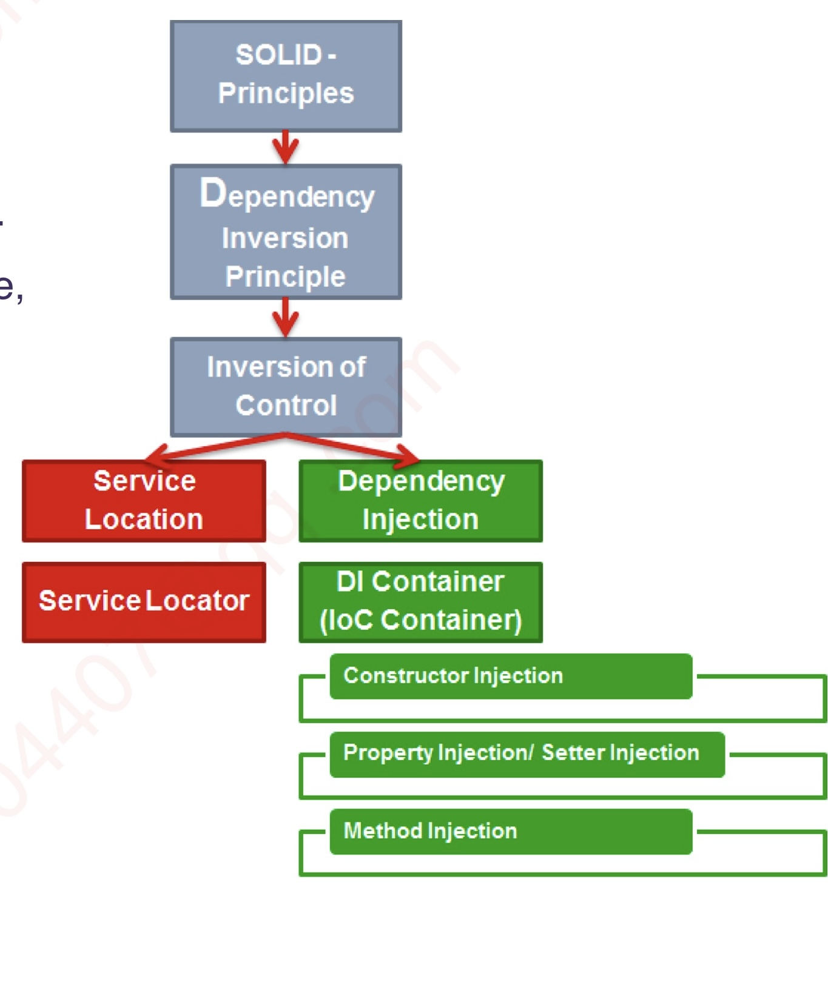
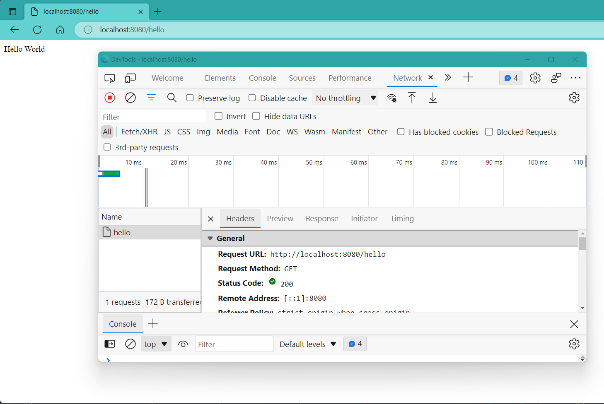

# 1. Spring intro: 0min-15min

+ EJB太复杂了, 
+ Rod Johnson: <<Expert one-on-one J2EE Design and Development>>  --> Sprring framework

## Spring Framework: 

+ an open source Java application framework, based on two key principles: 
  +  dependency injection; 
  +  inversion of control;
+ Spring has the ability to auto-wire the dependency at run time, which allows the developer to write loosely couped code.
+ high cohesion and loose coupling (高内聚低耦合) 有点类似encapsulation的意思




## Spring Boot:
SpringBoot一套全新框架, 来自Spring大家族, 它的设计初衷是为Spring开发者提供一种更为快速, 体验更好的Spring应用开发方式. Spring boot以**约定大于配置**的核心思想, 默认帮我们进行了很多配置, 开箱即用, 同时也可快速扩展. 支持运行期内嵌容器, 如Tomcat, Jetty等. 没有冗余代码, 无需XML配置 (避免manual configuration带来错误)

https://spring.io/projects/spring-boot%C2%A0 官网介绍:

Spring Boot = Spring Framework + Embedded Server - Manual Configuration

可以看官方文档或者Spring官方GitHub来学习

---

Spring Boot 特性:

+ 使用Spring项目引导页面可以在几秒内构建一个project
+ Spring容器, 日志, 自动配置AutoConfiguration, Starter, 方便对外输出各种形式的服务, 如REST API, WebSocket, Web, Streaming, Tasks
+ 非常简洁的安全策略集成
+ 支持relational DB, non-relational DB
+ 支持运行期内嵌容器, 如Tomcat, Jetty
+ 强大的开发包, 支持热启动
+ 自动管理依赖
+ 自带应用监控
+ 支持各种IDE, 如Intellij, NetBeans

# 2. 第一个Spring Boot project 15min-1h35min

创建你的第一个spring boot project: https://start.spring.io/


44min-

dependency: Springboot-starter 不写版本号是因为它自动follow up plungins中Springboot版本

+ maven central repo: 用来搜索dependency https://mvnrepository.com/repos/central

---
gradle command: 在intellij右侧的gradle面板也可


iTerm2: 老师用的Mac上的terminal 

ohmyzsh: 使得terminal五颜六色

---
## 为什么需要构建工具(build tool)? 1h14min-

+ 管理依赖
+ 管理构建过程

build tool的发展: Apache Ant --> maven --> gradle

阅读: [maven vs. gradle](https://tomgregory.com/maven-vs-gradle-comparison/)

---
## A little bit deeper: Annotation 1h19min-1h35min

就是一个类或方法开头@...


AutoConfiguration


---
# 3. :full_moon:代码目录结构 1h35min-2h15min

配置相关
```yaml
server:
  port: 8888      // 注意中间的空格
```


---

代码目录结构与应用的架构关系: 

service之间可以相互调用, 而不是直接去调用别的service对应的repository, 这样边界可以划的更加清晰, 方便重用降低耦合

结合PPT看


---

2h15min-2h21min 

歇息

---
# 4. :moon:RESTful API 2h21min-

最简单的request mapping 




Post 的结果. 利用postman


