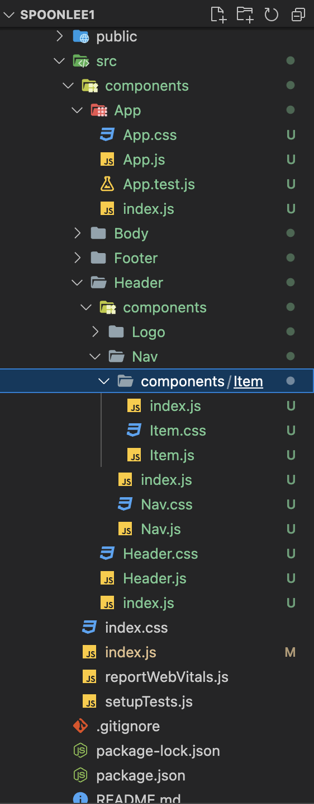
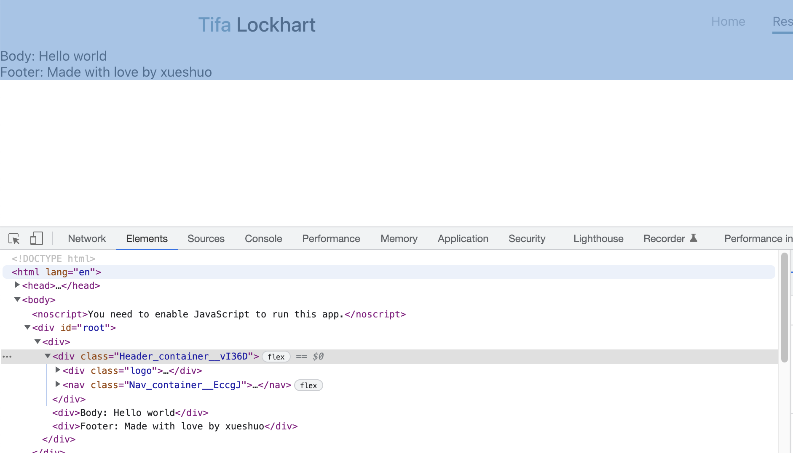

1-29 react 2


# 要点


+ react组件化
  + Component.js在import处导入所有要用的资源为object

+ 目录结构与css module
  + 非常有助于网页结构组件化
  + css module解决了className命名担心重名的问题, 需要和目录结构一起用

+ react允许我们自定义html标签, 这不仅有助于组件化, 也有利于声明式 e.g.通过函数定义html标签中的conditional className
  + 这里react的Component.js中的Component就有点像java中的类了, 你可以调用Component来生成一个已经封装好特定功能(比如on click 添加conditional className 以触发某种特效)的自定义标签 (就像在Java中new一个object一样), 我们只需要声明标签以及他的property, children参数即可, 不用再去重头写那些特效逻辑了.


复盘上节课 0- 16min

declerative

Component


面试问题没有把握不要蒙

培养自己参加讨论的能力, 公司里面开会你总得张口有观点吧

谦虚谨慎, 代码不能只要能跑就行, 注意readable, maintainable, reusable


# 继续组件化16min-

接上节课最后的jsx操作将\<app\>组件化

React 里html标签的class写为className, 以和OOP的class进行区分


往js中注入css file: 只需在js中import对应文件即可

key map: cmd+d 多行批量选择


对Header进一步组件化 (Body, Footer先不管)

+ 将Header里的logo 和 nav继续组件化, 分出去称为独立的js file

+ logo, nav的css也独立出去

## Header.js

```react
import './Header.css'
import Logo from './Logo'
import Nav from './Nav'

// 函数名首字母大写
const Header = () => {
    return(
        <div className="header">
            <Logo></Logo>
            <Nav></Nav>
      </div>
    )
}
  
export default Header
```

Header.css

```css
.header{
    max-width: 1000px;
    margin: 0 auto;

    display: flex;
    justify-content: space-between;     
    align-items: center;
}
```


### Logo.js

```react
import './Logo.css'

const Logo = () =>{
    return(
        <div className="logo">
            <span className="logo_highlight">Tifa</span>
            Lockhart
        </div>
    )
}

export default Logo;
```


Logo.css

```css
.logo{
    font-size: 1.5rem;
    font-weight: 500;
}


.logo_highlight{
    color: #377e9a;
    margin-right: 6px;
}
```


### Nav.js

```react
import './Nav.css'

const Nav = () => {
    return (
        <nav className="nav">
            {/* Copy paste a lot */}
            <a href="/home" className='nav__item nav__item--active'>Home</a>
            <a href="/resume" className='nav__item'>Resume</a>
            <a href="/blog" className='nav__item'>Blog</a>
            <a href="/services" className='nav__item'>Service</a>
            <a href="/contacts" className='nav__item'>Contacts</a>

        </nav>
    )
}

export default Nav;
```


Nav.css

```css
.nav{
    display: flex;
}

.nav__item{
    text-decoration: none;
    padding: 16px;
    color: #49515d;
    font-size: 15px;
    opacity: 0.6;

}

/* active effect for nav item */
.nav__item--active{
    opacity: 1;
}

.nav__item--active::after{
    content: "";
    display: block;
    height: 3px;
    background-color: #377e9a;
    margin-top: 4px;

}
```


# refactor 43min-

## 利用函数产生相似标签

上面Header > Nav下有5个相似的标签, 我们继续把这些标签作为NavItem独立成组件并用function来生成它们


+ property object: 一个html标签的property作为一个object输入函数

+ children 57min-: 夹在在一对html开闭标签中间的东西 :question: children也属于property的成员?


NavItem.js

```react
import './NavItem.css'

// we just destruct property object in function argument
const NavItem = ({href, children}) =>{
    return (
        <a href={href} className="nav__item">{children}</a>
    )
}

export default NavItem
```

NavItem.css

```css
.nav__item{
    text-decoration: none;
    padding: 16px;
    color: #49515d;
    font-size: 15px;
    opacity: 0.6;

}

/* active effect for nav item */
.nav__item--active{
    opacity: 1;
}

.nav__item--active::after{
    content: "";
    display: block;
    height: 3px;
    background-color: #377e9a;
    margin-top: 4px;
}
```


利用children使得我们的jsx写法更加接近html的写法

```react
<NavItem href="/home">Home</NavItem>			// prefer


<NavItem href="/home" label="Home"></NavItem>		// 不用children的写法 not prefer， 因为看起来不像html

// 如果不用children, 如下写法
const NavItem = ({href, label}) =>{
    return (
        <a href={href} className="nav__item">{label}</a>
    )
}

```


## 实现conditional classsname 58min-1h10min

上面利用函数产生相似标签中, 标签的className一直是"nav_item", 现在我们来做conditional classname.  满足某个条件使得NavItem的className变成 ‘nav_item nav_item--active’


只选定home, 使得其className为 'nav_item nav_item--active'

### 方式一: 手写

在className = ? 的地方写个函数由href的值conditionally 返回一个字符串作为className

NavItem.js

```react
import './NavItem.css'

const getClassName = (href) => {
    if(href === '/home'){
        return 'nav__item nav_item--active'
    }
    return 'nav__item'
}


// we just destruct property object in function argument
const NavItem = ({href, children}) =>{
    return (
        <a href={href} className={getClassName(href)}>
            {children}
        </a>
    )

}

export default NavItem
```


### 方式二: 使用第三方classnames库  1h05min-

how to render conditional className https://stackoverflow.com/questions/30533171/react-js-conditionally-applying-class-attributes

https://github.com/JedWatson/classnames 安装第三方包, 阅读它的文档说明来使用它

```bash
npm install classnames
```

安装的依赖会体现在package.json中


NavItem.js

```react
import './NavItem.css'
import classNames from 'classnames'


// we just destruct property object in function argument
const NavItem = ({href, children}) =>{
    return (
        <a 
        href={href} 
        className={classNames('nav__item', {
            'nav__item--active': href === '/home'})}>
            {children}
        </a>
    )

}

export default NavItem
```


但是P3不推荐去用别人的包, 还是先自己写锻炼学习比较好; 

工作可以用别人的库, 但要和同事商量好, 保证某一问题的解决方案的consistency


1h10min-

动态一点, 当NavItem标签的pros.active为true时, 再在className加上'nav__item--active'

NavItem.js

```react
import './NavItem.css'
import classNames from 'classnames'


// we just destruct property object in function argument
const NavItem = ({href, children, active}) =>{
    return (
        <a 
        href={href} 
        className={classNames('nav__item', {
            'nav__item--active': active})}>
            {children}
        </a>
    )

}

export default NavItem
```


Nav.js

```react
import './Nav.css'
import NavItem from './NavItem'

const Nav = () => {
    return (
        <nav className="nav">
            {/* refactor: use function */}
            <NavItem href="/home">Home</NavItem>
            <NavItem href="/resume" active>Resume</NavItem>
            <NavItem href="/blog">Blog</NavItem>
            <NavItem href="/services">Services</NavItem>
            <NavItem href="/contacts" active>Contacts</NavItem>
        </nav>
    )
}

export default Nav;
```


# :full_moon: 目录结构 1h14min-1h28min


atomic design https://medium.com/@janelle.wg/atomic-design-pattern-how-to-structure-your-react-application-2bb4d9ca5f97

使得每个文件夹都是一个Component

调成如下的目录结构, 为了避免import时重复 (e.g. import ./components/App/App), 我们在每个Component js所在的路径下加一个索引文件index.js 并在里面写:

```react
// import App from './App'
// export default App

export {default} from './App'	// 顶上面两行
```





休息15min


# className命名问题 1h40min-

## BEM 

`block__element--modifier-value`

https://getbem.com/introduction/


block必须, element, modifier是optional的


e.g. 

```css
.header__navigation--mode-light{}
.header__navigation--mode-dark{}

.login__button--disabled{}
```


## :full_moon: CSS modules 1h51min-

借助js产生classname, 可以在自己声明的class name后面产生一个随机字符串用以保证classname的独特性

https://github.com/css-modules/css-modules (create-react-app自带的不需要额外导入包), 原理是将.module.css导入到Component.js形成一个styles object, 然后用styles的属性为Component.js中html标签的className属性赋值 :question: 为什么js里要加一个花括号呢


Header.js

注意这里我们import 一个.module.css文件进入js, 使其成为一个styles object

```react
import styles from './Header.module.css'           // import everything from Header.css into an object: styles
import Logo from './components/Logo'
import Nav from './components/Nav'

// 函数名首字母大写
const Header = () => {
    return(
      //!!注意这里我们是直接用styles object的container属性来为className赋值 !!
        <div className={styles.container}>		
                <Logo></Logo>
                <Nav></Nav>
         </div>
    )
}
  
export default Header
```

对应css改名为Header.module.css

```css
.container{
    max-width: 1000px;
    margin: 0 auto;

    display: flex;
    justify-content: space-between;     
    align-items: center;
}
```


此时, 我们可以在dev tool中看到Header return的<div>的实际className为: Header_container--vI360




以这种方式生成的className格式为: componentName_className__randomString, 我们在.module.css中的className就可以不用写componentName, 直接就写其element的名字即可(e.g. container, highlight...)


对往下的组件也可以采用这种方法进行className的命名, 这样就不用自己考虑className的命名重复问题了, 因为css module已经帮我们解决了

---

Nav.js

```react
import styles from './Nav.module.css'
import Item from './components/Item'

const Nav = () => {
    return (
        <nav className={styles.container}>
            {/* refactor: use function */}
            <Item href="/home">Home</Item>
            <Item href="/resume" active>Resume</Item>
            <Item href="/blog">Blog</Item>
            <Item href="/services">Services</Item>
            <Item href="/contacts" active>Contacts</Item>
        </nav>
    )
}

export default Nav;
```

Nav.css

```css
.container{
    display: flex;
}
```


Nav > Item也可以这么办, 这里就不展示了


---

Logo.js

```react
import styles from './Logo.module.css'

const Logo = () =>{
    return(
        <div className={styles.container}>
            <span className={styles.highlight}>Tifa</span>
            Lockhart
        </div>
    )
}

export default Logo;
```


Logo.css

```css
.container{
    font-size: 1.5rem;
    font-weight: 500;
}


.highlight{
    color: #377e9a;
    margin-right: 6px;
}
```


---

1h59min-2h2min

使用classnames(用来解决conditioanl className的)和css module(用来解决className人为起名容易重名的)一起: 用bind

(了解即可, 我个人不喜欢classnames这个包)


# 字体 2h07min-

导入google font: roboto

+ @import 放到 public > index.html
+ Font-family 放到 src > index.css 做全局的style


# homepage 2h14min-


## 为App添加main_bg 2h14min - 17min

App.js

```react
import styles from './App.module.css';

// html Component
import Header from '../Header'
import Body from '../Body'
import Footer from '../Footer'


// 函数名首字母大写
const App = () =>{
  return(
  	<div className={styles.container}>
    	<Header></Header>
      <Body></Body>    
      <Footer></Footer>
    </div>
  )
}

export default App;
```


App.css 改名为 App.module.css

```css
.container {
  background-color: #f5f5f5;
  background-image: url(./main_bg.jpg);
  background-size: cover;
  background-repeat: no-repeat;

  min-height: 100vh;

}
```


此时就可以看到有背景图片了


## Body以下继续组件化 2h14min-


Body.js

```react
import Home from "./components/Home"
import styles from './Body.module.css'

// 函数名首字母大写
const Body = () => {
    return(
        <div className={styles.container}>
            <Home></Home>
        </div>

    )
}
  
export default Body
```

Body.module.css

```css
.container{
    max-width: 1000px;
    margin: 0 auto;         
    border-radius: 24px;
    box-shadow: 0px 15px 25px 0px rgba(0, 0, 0, 0.1) ;

    margin-top: 48px;
    background-color: red;

}
```


Body下的Home组件化

2h23min-

太细了不写了


## background 组件化 2h30min-

某些要重复使用的background可以独立成组件, 减少copy-paste

还是组件化的体现

太细节了就不写了, 体会组件化就好


Q&A 2h37min-

html渲染是一层层往上贴

如果子元素比父元素的面积大, 那子元素依然会覆盖在父元素上, 用overflow: hidden可以使子元素溢出父元素的部分hidden
