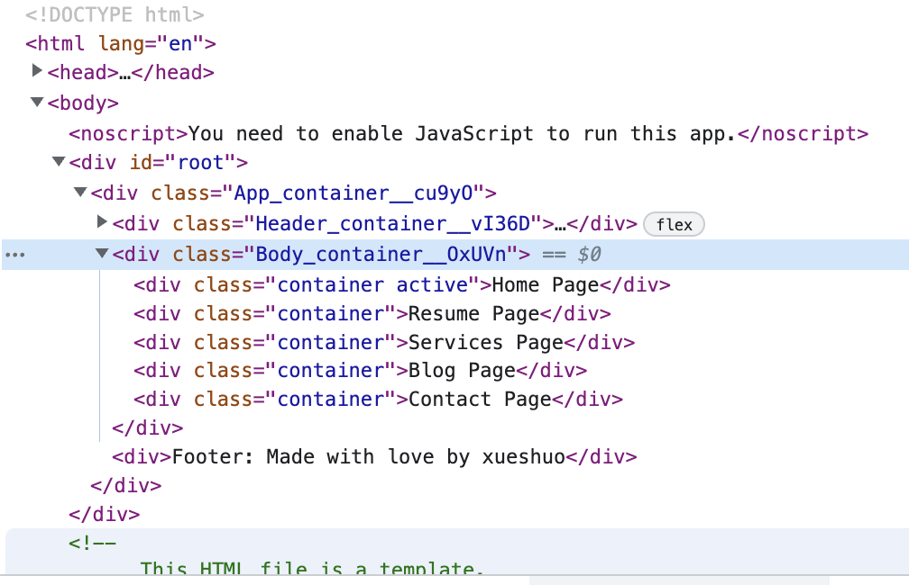
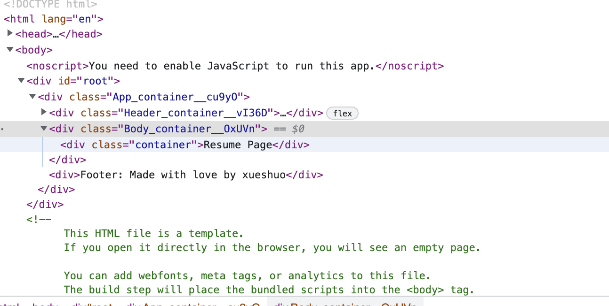

1-31 react lec3


# 要点

+ Hooks, 为什么需要hooks
+ 状态参数在兄弟node之间传递: state lifting
+ Virtual DOM 与 selective render


---

上节课回顾

组件化


写react代码时, 考虑顺序

1. component, declarative
2. Single responsibility, open close
3. Readable, Maintainable, Reusable


---


# React state 5min-


SPA: single page application (浏览器在渲染不同内容时, 不通过切换页面来实现, 而是通过JavaScript更新DOM来实现) preferred

MPA: muliple page application 远古网页


## 为什么需要hooks

demonstration: 

Nav.js

将Enum赋给active

```react
import styles from './Nav.module.css'
import Item from './components/Item'

const Nav = () => {
    return (
        <nav className={styles.container}>
            {/* Copy paste a lot */}
            {/* <a href="/home" className='nav__item nav__item--active'>Home</a>
            <a href="/resume" className='nav__item'>Resume</a>
            <a href="/blog" className='nav__item'>Blog</a>
            <a href="/services" className='nav__item'>Service</a>
            <a href="/contacts" className='nav__item'>Contacts</a> */}

            {/* refactor: use function */}
            <Item href="/home" active={true | false}>Home</Item>
            <Item href="/resume" active={true | false}>Resume</Item>
            <Item href="/blog" active={true | false}>Blog</Item>
            <Item href="/services" active={true | false}>Services</Item>
            <Item href="/contacts" active={true | false}>Contacts</Item>
        </nav>
    )
}

export default Nav;
```


Item.js

先定义active = false, onClick NavItem时就将active变成true, 此时应该触发特效

```react
import './Item.css'
import classNames from 'classnames'


// we just destruct property object in function argument
const Item = ({href, children}) =>{

    // ! Declarative is not free ! 
    // ! 浏览器的所有JavaScript语法都是命令式, 即底层还是在命令式地运行代码 !
    // ! 我们需要一个中介 (React), 把声明式, 转化为命令式 !
    let active = false;

    const handleClick = (event) => {
        // SPA, 我们不需要页面跳转
        event.preventDefault();
        active = true;
        console.log('HERE');
    }

    return (
        <a 
        href={href} 
        onClick = {handleClick}             // declarative: do something when this tag is onClick
        className={classNames('nav__item', {
            'nav__item--active': active})}>
            {children}
        </a>
    )

}

export default Item
```


但此时在网页上点击 NavItem 元素, 发现并定义的conditioanl className引发的特效并没有奏效, 这是为什么呢? 因为上面的代码:

```react
let active = false;

const handleClick = (event) => {
  ...
  active = true;
  ...
}
```

是命令式的, 和react的声明式并不兼容！


由此:

+ Declarative is not free 
+ 浏览器的所有JavaScript语法都是命令式, 即底层还是在命令式地运行代码
+ 我们需要一个中介 (React), 把声明式, 转化为命令式

引出hook


## hook 21min-

react提供了一系列hooks, 帮我们实现声明式语法


我们做如下处理, 来使得active的定义兼容声明式

修改Item.js中

```react
const [active, setActive] = useState(false);		// 定于active初始值为false, 有点像Java里用带参构造器new一个对象
// let active = false;

const handleClick = (event) => {
  // active = true;
  setActive(!active);
}
```

这样就work了, 点击一个NavItem就会切换它下面的短横线是否显示

上面的

```react
// 解构写法
const [value, setValue] = useState()

// 一般写法
const handler = useState()
const value = handler[0]
const setValue = handler[1]
```


Q & A 29min-37min

为什么不直接写命令式的代码?

+ 命令式的代码, 关注于过程, 因而实现相同的结果会有很多种写法, 读起来费劲, 也不好维护
+ 声明式的代码关注于结果, 写法相对固定, 易读易于维护


## 同时只让一个NavItem呈现点击特效 37min-


需求: 点击Home的时候, 把Resume的active设置成false

问题: NavItem本身并不知道Home和Resume的存在

只有在Nav中, 才有Home, Resume, Blog, Services, Contact

|--- Nav

​		|--- NavItem


父传子OK

子传父NO

兄弟互传NO

:question: JS里还能在function里再定义一个function???


如果想实现"子传父", 只能把子类的状态提升到父类中, 再通过父传子来进行信息沟通

state lifting 状态提升

我们把在NavItem中的active, setActive转移到它的父级Nav中, 将它们作为NavItem()的argument传入

Nav.js

```react
import styles from './Nav.module.css'
import Item from './components/Item'
import { useState } from 'react';

const Nav = () => {
    const [active, setActive] = useState(false)     // active is a variable, setActive is a function

    return (
        <nav className={styles.container}>

            {/* refactor: use function */}
            <Item href="/home" active={active} setActive={setActive}>Home</Item>
            <Item href="/resume" active={active} setActive={setActive}>Resume</Item>
            <Item href="/blog" active={active} setActive={setActive}>Blog</Item>
            <Item href="/services" active={active} setActive={setActive}>Services</Item>
            <Item href="/contacts" active={active} setActive={setActive}>Contacts</Item>
        </nav>
    )
}

export default Nav;
```

Item.js

```react
import './Item.css'
import classNames from 'classnames'
import { useState } from 'react';


// we just destruct property object in function argument
const Item = ({href, children, active, setActive}) =>{

    //const [active, setActive] = useState(false);

    const handleClick = (event) => {
        // SPA, 我们不需要页面跳转
        event.preventDefault();
        setActive(!active);
        console.log('HERE');
    }

    return (
        <a 
        href={href} 
        onClick = {handleClick}             // declarative: do something when this tag is onClick
        className={classNames('nav__item', {
            'nav__item--active': active})}>
            {children}
        </a>
    )

}

export default Item
```


但这时因为共享一个active, setActive, 5个NavItem的onClick的行为是绑定在一起的


## 继续优化52min-

[react: curely bracket vs. quotes](https://sawyerh.medium.com/how-react-props-relate-to-html-attributes-and-js-functions-6785a89a299#:~:text=In%20React%2C%20%E2%80%9Cprops%E2%80%9D%20is,element%20that%20accepts%20custom%20attributes.)

[react: curely bracket vs. quotes2](https://stackoverflow.com/questions/69376913/react-native-property-values-in-quotes-vs-braces#:~:text=Quotes%20are%20for%20when%20you,you%20need%20to%20use%20braces.)

+ **Quotes** are for when you're passing a simple string.
+ **Braces** are for when you want to run Javascript code. For example if you wanted to pass a variable as a prop, you'd need to use braces.


Nav.js

声明式: 当这个标签的active为它的名字的时候

:question: 下面这段怎么执行????? {}中的active和props.active是一个东西吗? 尤其`setActive = {() => setActive('Home')}`是怎么和NavItem.js中的`setActive(!active)`一起工作的?

```react
import styles from './Nav.module.css'
import Item from './components/Item'
import { useState } from 'react';

const Nav = () => {

    // active is a String, setActive(String)
    const [active, setActive] = useState('HOME')     // active is a variable, setActive is a function

    return (
        <nav className={styles.container}>

            {/* refactor: use function */}
            {/* 注意这里html标签里的property的赋值, 等号右边是花括号括起来的 */}
            {/* 注意html标签的props.active为boolean, */}
            <Item href="/home" active={active === 'HOME'} setActive={() => setActive('HOME')}>Home</Item>
            <Item href="/resume" active={active === 'RESUME'} setActive={() => setActive('RESUME')}>Resume</Item>
            <Item href="/blog" active={active === 'BLOG'} setActive={() => setActive('BLOG')}>Blog</Item>
            <Item href="/services" active={active === 'SERVICES'} setActive={() => setActive('SERVICES')}>Services</Item>
            <Item href="/contacts" active={active === 'CONTACTS'} setActive={() => setActive('CONTACTS')}>Contacts</Item>
        </nav>
    )
}

export default Nav;
```


Item.js 不变

```react
import './Item.css'
import classNames from 'classnames'
import { useState } from 'react';


// we just destruct property object in function argument
const Item = ({href, children, active, setActive}) =>{

    //const [active, setActive] = useState(false);

    const handleClick = (event) => {
        // SPA, 我们不需要页面跳转
        event.preventDefault();
        setActive(!active);
        // console.log('HERE');
    }

    return (
        <a 
        href = {href} 
        onClick = {handleClick}             // declarative: do something when this tag is onClick
        className={classNames('nav__item', {
            'nav__item--active': active})}>
            {children}
        </a>
    )

}
```


此时就实现让一个NavItem呈现点击特效了


## :moon: 继续优化代码写法55min-

上面Nav.js中我们仍有许多重复的代码, 我们采用Array来批量输入HTML tag的props参数 (JS技巧)

```react
import styles from './Nav.module.css'
import Item from './components/Item'
import { useState } from 'react';


const ITEMS = [
    {href: '/home', value: 'HOME'},
    {href: '/resume', value: 'Resume'},
    {href: 'service', value: 'Services'},
    {href: '/blog', value: 'Blog'},
    {href: 'contact', value: 'Contact'}
]

const Nav = () => {

    // flag is a String, setFlag(String)
    const [flag, setFlag] = useState('HOME')     // active is a variable, setActive is a function

    return (
        <nav className={styles.container}>

            {/* 减少copy, passte, 和下面的代码等效, 写法比较高级 map(), destruct, HTML标签的props传递综合在一起 */}
            {ITEMS.map(({href, value}) => (
                <Item 
                    href={href} 
                    active={flag=== href} 
                    setActive={() => setFlag(href)}
                >
                    {value}
                </Item>
            ))}

        </nav>
    )
}

export default Nav;
```


## 难点来了! 我们继续优化代码的readability 1h04min-

Nav.js

提升我们代码的可读性, 将Item函数(React eanabled jsx操作)的输入参数(props的一个成员)从之前的

```react
setActive={() => setFlag(href)
```

改为

```react
onClick={() => setFlag(href)
```


这样一来, 看到Item函数里有一个叫onClick的函数变量 (它的名字叫成其他的也没关系, :question: 等等onClick不是保留字段吗??)就知道它应该是定义了Item函数如何处理onClick事件 (\<a\>一个property) 的  (---个人觉得应该不是保留字, 因为即使在\<a\>中我们把onClick写成onCliiik也没有出现错误提示) 可读性大大提高了, 别人看到Item那段声明式的代码就知道Item的行为是怎样的

```react
const Nav = () => {

    // flag is a String, setFlag(String)
    const [flag, setFlag] = useState('/home')     // active is a variable, setActive is a function

    return (
        <nav className={styles.container}>

            {/* 减少copy, passte, 和下面的代码等效, 写法比较高级 map(), destruct, HTML标签的props传递综合在一起 */}
            {ITEMS.map(({href, value}) => (
                <Item 
                    href={href} 
                    active={flag=== href} 
                    onClick={() => setFlag(href)}			// !!! *****改动在这里, 代表一个函数变量, 将会把一段代码（操作）传入到Item函数里****** !!!
                >
                    {value}
                </Item>
            ))}

        </nav>
    )
}


```


Item.js

对应的, 在handleClick函数中, 将原来的

```react
setActive(!active);
```

改为

```react
onClick();
```


```react
const Item = ({href, children, active, onClick}) =>{

    //const [active, setActive] = useState(false);

    const handleClick = (event) => {
        // SPA, 我们不需要页面跳转
        event.preventDefault();
        onClick();              // !!! ******改动在这里!! 执行onClick()里的代码****** !!!
        // console.log('HERE');
    }

    return (
        <a 
        key = {href}
        href = {href} 
        onClick = {handleClick}             // declarative: do something when this tag is onClick
        className={classNames('nav__item', {
            'nav__item--active': active})}> 
            {children}
        </a>
    )

}

export default Item
```


这样一来, 代码的可读性大大提高了

还是挺神奇的, 传入Item函数的一个代码块, 在执行时居然对引用Item函数的函数(Item的`父级`函数)内的其他变量进行了修改


1h14min-1h24min 休息


# Virtual DOM 1h24min- 

上面的代码中在ITEMS.map()中动态生成HTML元素时如果没写`key = {href}`, 有可能报错:

`Each child in a list should have a unique "key" prop`

针对这个error我们来讨论react 引入的 Virtual DOM


## Angular.js的诟病

wk9 lec2_demo

Index.html

```html
<!DOCTYPE html>
<html lang="en">
<head>
    <meta charset="UTF-8">
    <meta http-equiv="X-UA-Compatible" content="IE=edge">
    <meta name="viewport" content="width=device-width, initial-scale=1.0">
    <title>Myact</title>
</head>
<body>
    <div id="root"></div>

</body>
<script src="./index.js"></script>
</html>
```


index.js

```js
let num = 0

const Count = () =>{
    const container = document.createElement('div')

    // text
    const text = document.createTextNode(num)       // create text node here once per render

    const handleClick = () => {
        num++;
    }
    
    // button
    const button = document.createElement('button')
    button.innerHTML = 'Plus'
    button.type = 'button'
    button.addEventListener('click', handleClick);

    // add up
    container.appendChild(text)
    container.appendChild(button)

    // div
    //      text
    //      button
    return container

}


document.querySelector('#root').appendChild(Count())
```


发现想实现的功能并未实现, 因为TextNode只在被render的时候创建了1次, 但当click on button, num更新了而页面并没有被再次渲染, 

想要实现我们的功能就得让页面re-render on update of num


index.js

```js
let num = 0

const Count = () =>{

    const container = document.createElement('div')

    // text
    const text = document.createTextNode(num)       // create text node here once per render

    // button
    const handleClick = () => {
        num++;

        // !!! re-render !!!
        document.querySelector('#root').innerHTML = ''
        document.querySelector('#root').appendChild(Count())
    }
    
    const button = document.createElement('button')
    button.innerHTML = 'Plus'
    button.type = 'button'
    button.addEventListener('click', handleClick);

    // add up
    container.appendChild(text)
    container.appendChild(button)

    // div
    //      text
    //      button
    return container

}


document.querySelector('#root').appendChild(Count())
```


但面临巨大的性能问题, 因为我们每次修改都需要重新渲染整个页面

这就是Angular.js的最初逻辑: 总得重复渲染


## :full_moon: React 提出了virtual DOM的概念 1h39min-

DOM 是tree view (树状结构)

```react
HTML 
	- BOdy
  	- text 	{className}
		- button {onClick ...}
```

JS 的运行效率远大于 Browser的DOM的渲染效率

+ Angular.js: render -> DOM -> browser -> update -> DOM -> browser

+ React: render -> VDOM -> compare (其实是reconcilation, 要比compare复杂) with DOM  -> know which element neeed update -> only update element that needs to be updated
  + React需要给用jsx生成的标签打上标记(key), 来uniquely identify HTML中的每个元素, 这样才能比对知道到底是哪个元素改变了
  + :bangbang: React规定: 如果HTML标签是动态生成(e.g. 比如上面我们通过array, map()来动态生成html标签元素, 动态指的是声明式的标签生成函数中有变量作为props)的, 必须手动为它们定义key属性; 如果是静态的HTML标签, react自己会打key

Further reading reconcilation原理:  https://reactjs.org/docs/reconciliation.html


# 继续2h-

实现点击NavItem, 能够跳转到不同的页面


## Page组件实现复用

page component作为复用


在src > component路径下新建Page folder, 往里面定义Page.js, Page.css, index,js

这里我们只使用了classnames来生成conditional className, 因为不知道为啥如果我同时使用classnames和css module, Page.module.css文件不起作用

一般我们同时用classnames和css module


Page.js

```react
import "./Page.css"      // ! 只用classNames(), 不用css module的写法 !

import classNames from 'classnames'     // for conditional class name

// Page is like a mold, it is used to instantiate a page instance: home, service, contact....
const Page = (
    {children,
    active}
) => {

    return (
        <div 
            className={classNames("container", {"active": active})} // ! 只用classNames(), 不用css module的写法 !
        >
            {children}
        </div>
     
    )
}

export default Page
```


Page.css

```css
.container{
    padding: 32px 65px;
    background: white;
    

    display: none;
}


.active{
    display: block;

}
```


这样, 我们可以将Page.js作为一个模具, 可以复用来生成Body下的home, contact, blog...

e.g. home.js, 在这里我们要向Page组件传递参数: active, children

```react
import Page from "../../../Page"


const Home = ({active}) =>{
    return(
        <Page active={active}>
            Home Page
        </Page>
    )
}


export default Home
```


同时我们在Body.js中再使用Home, Contact, Blog组件, 这里相当于我们生成Home, Resume...的入口, 我们需要在这里传递参数: active

```react
import Home from "./components/Home"
import Resume from "./components/Resume"
import Services from "./components/Services"
import Blog from "./components/Blog"
import Contact from "./components/Contact/Contact"
import styles from './Body.module.css'


// 函数名首字母大写
const Body = () => {
    return(
        <div className={styles.container}>
            <Home active></Home>
            <Resume></Resume>
            <Services></Services>
            <Blog active></Blog>
            <Contact active></Contact>
        </div>

    )
}
  
export default Body
```


## :full_moon: 兄弟相传2h13min- 

现在来实现需求: 点击NavItem, 切换Body中该显示的page

即我们需要把NavItem的onClick和Body中Page的actvie属性关联起来

本质上是一个参数传递的问题


兄弟相传: 状态提升到最近公共祖先

```js
- App
  - Header
       - Logo
       - Nav {active}
  - Body  {active} 
       - Blog
       - Contact
  - Footer
```

**所以我们应该把active这个state提升到到App中**

:question: js中按引用传递的吗？不然参数传递到子代那里怎么会反向传播影响到父代里的参数? active是全局唯一的吗? 

这俩feature让js很tricky

+ 按引用传递
+ 可以传递代码


App.js

+ 改变active状态的操作在由点击NavItem触发, 所以Header同时往下传递active, setActive
+ 而Body中只是作为actvie的状态响应, 所以只传递active

```react
// 函数名首字母大写
const App = () =>{

  // active: String 可取的值有['/home', '/cotact', '/services', '/blog', '/resume']
  // ! 我感觉js是按引用传递的, 全局只有actvie, setActvie一个内存地址
  const [active, setActive] = useState('/home') // 兄弟相传, 状态提升到二者的最近公共祖先

  return(
  	<div className={styles.container}>
    	<Header active = {active} setActive={setActive}></Header>		
      <Body active={active}></Body>    
      <Footer></Footer>
    </div>
  )
}

export default App;
```


Header.js

```react
const Header = ({
    active,
    setActive
}) => {
    return(
        //!!注意这里我们是直接用styles object的container属性来为className赋值 !!
        <div className={styles.container}>
                <Logo></Logo>
                <Nav active={active} setActive={setActive}></Nav>
         </div>
    )
}
  
export default Header
```

Nav.js

+ 从这里开始往下, active的意义就变了
  + Nav传入的active还是String, 取值是['/home', '/cotact', '/services', '/blog', '/resume']
  + 但从Nav传入Item的active就变成了boolean类型, 用来在Item中控制conditional classname的生成
    + 我们可以考虑在最后一层改变active的意义

```react
const ITEMS = [
    {href: '/home', value: 'HOME'},
    {href: '/resume', value: 'Resume'},
    {href: '/services', value: 'Services'},
    {href: '/blog', value: 'Blog'},
    {href: '/contact', value: 'Contact'}
]

const Nav = ({
    active,
    setActive
}) => {

    // active状态提升前的代码
    // // active is a String, setActive(String), !!用来代表点击NavItem的状态信息!!
    // const [active, setActive] = useState('/home')     // active is a variable, setActive is a function

    return (
        <nav className={styles.container}>

            {/* 减少copy, passte, 和下面的代码等效, 写法比较高级 map(), destruct, HTML标签的props传递综合在一起 */}
            {ITEMS.map(({href, value}) => (
                <Item 
                    key={href} 
                    href={href} 
                    active={active=== href} 
                    onClick={() => setActive(href)} 
                >
                    {value}
                </Item>
            ))}
        </nav>
    )
}

export default Nav;
```

Item.js

+ 传入的active其实是boolean类型的
+ 传入的onClick其实是我们在Nav.js中定义的`() => setActive(href)`这段代码, 其中setActive(href)方法指的就是我们最开始在App.js中由useState()得到的和active绑定的, 用来改变active状态的方法

```react
const Item = ({href, children, active, onClick}) =>{

    //const [active, setActive] = useState(false);

    const handleClick = (event) => {
        // SPA, 我们不需要页面跳转
        event.preventDefault();
        onClick();              // !!! ******改动在这里!! 执行onClick()里的代码****** !!!
        // console.log('HERE');
    }

    return (
        <a 
        href = {href} 
        onClick = {handleClick}             // declarative: do something when this tag is onClick
        className={classNames('nav__item', {    // conditional className
            'nav__item--active': active})}>     
            {children}
        </a>
    )

}

export default Item
```


---


Body.js

+ 传入的active依然是String

```react
// 函数名首字母大写
const Body = ({
    active
}) => {
    return(
        <div className={styles.container}>
            <Home active= {active === '/home'}></Home>
            <Resume active= {active === '/resume'}></Resume>
            <Services active= {active === '/services'}></Services>
            <Blog active= {active === '/blog'}></Blog>
            <Contact active= {active === '/contact'}></Contact>
        </div>

    )
}
  
export default Body
```


以Home.js为例

+ 传入的active变成了boolean类型, 这也算是在最底层了吧, Home调用Page组件不能算又是nested一层

```react
import Page from "../../../Page"


const Home = ({active}) =>{
    return(
        <Page active={active}>
            Home Page
        </Page>
    )
}


export default Home
```


Page.js

+ 传入的active为boolean类型, 用来控制conditional classname的生成

```react
import "./Page.css"      // ! 只用classNames(), 不用css module的写法 !

import classNames from 'classnames'     // for conditional class name

// Page is like a mold, it is used to instantiate a page instance: home, service, contact....
// ! 注意这里的props.active的值是boolean
const Page = (
    {children,
    active}
) => {

    return (
        <div 
            className={classNames("container", {"active": active})} // ! 只用classNames(), 不用css module的写法 !
        >
            {children}
        </div>
     
    )
}

export default Page
```


### 完成状态提升后 2h22min-

状态提升完成后, 要再次回看, 提升代码可读性

如果传入某个Component只是setActive, 别人很难读懂到底啥意思, 所以需要改个名字提升可读性

而且前面我们提到active的含义随着从App到Item是有变化的, 那么我们干脆直接把active改名字就得了


App.js

+ 把表示string的active 改名为currentPage, 对应setActive改名为setCurrentPage, 往下传递

```react
import styles from './App.module.css';

// html Component
import Header from '../Header'
import Body from '../Body'
import Footer from '../Footer'
import { useState } from 'react';


// 函数名首字母大写
const App = () =>{

  // active: String 可取的值有['/home', '/cotact', '/services', '/blog', '/resume']
  // ! 我感觉js是按引用传递的, 全局只有actvie, setActvie一个内存地址
  const [currentPage, setCurrentPage] = useState('/home') // 兄弟相传, 状态提升到二者的最近公共祖先

  return(
  	<div className={styles.container}>
    	<Header currentPage = {currentPage} onNavItemClick={setCurrentPage}></Header>
      <Body currentPage={currentPage}></Body>    
      <Footer></Footer>
    </div>
  )
}

export default App;
```


到tree底部的node时, 表示boolean的active就不用改名了,因为它的含义很明确了别人看了就知道


## :full_moon: 选择性渲染: 简洁与高效 2h30min-2h34min

上面我们只是把className中没有active的body的子元素display:none, 但他们还依然存在还参与渲染, 




这次我们希望可以有选择性的渲染, 也就是`currentPage === {href}`时再渲染, 否则不渲染, 大大提升了性能




Body.js

+ 采用短路计算来实现selective render, 都不用将currentPage转化为Item的active属性来实现conditional className从而用css来控制stlye了, 简洁又高效

```react
import Home from "./components/Home"
import Resume from "./components/Resume"
import Services from "./components/Services"
import Blog from "./components/Blog"
import Contact from "./components/Contact/Contact"
import styles from './Body.module.css'

// 函数名首字母大写
const Body = ({
    currentPage
}) => {
    return(
        <div className={styles.container}>
            {currentPage === '/home' && <Home></Home>}
            {currentPage === '/resume' && <Resume></Resume>}
            {currentPage === '/services' && <Services></Services>}
            {currentPage === '/blog' && <Blog></Blog>}
            {currentPage === '/contact' && <Contact></Contact>}
        </div>

    )
}
  
export default Body
```


以Home.js为例子

```react
import Page from "../../../Page"


const Home = () =>{
    return(
        <Page >
            Home Page
        </Page>
    )
}


export default Home
```


Page.js

```react
import "./Page.css"      // ! 只用classNames(), 不用css module的写法 !
import classNames from 'classnames'     // for conditional class name

// Page is like a mold, it is used to instantiate a page instance: home, service, contact....
// ! 注意这里的props.active的值是boolean
const Page = (
    {children}
) => {

    return (
        <div 
            className={classNames("container")} // ! 只用classNames(), 不用css module的写法 !
        >
            {children}
        </div>
     
    )
}

export default Page
```


Page.css

```react
.container{
    padding: 32px 65px;
    background: white;
}


```


