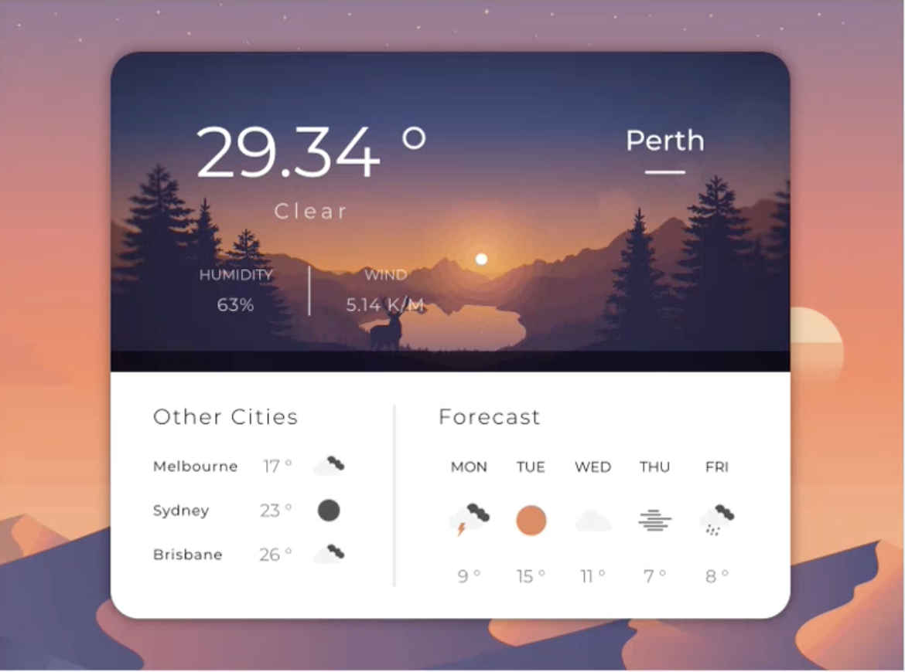

2-5 React 4


# 1. 要点

+ 简短地对React1-3总结
+ Think in React (React 哲学): 未完, 之后讲build LMS会继续讲


# 复盘之前的react课 0-22min


React理念

1. Declarative
2. Component based


React知识点

+ jsx
+ props - 通过props来实现组件的差异性和多样性
+ state - 体现declarative, 组件之间的state信息传递
  + state lifting 把当前的状态转移到别的组件里, 把需要的状态(state)和状态管理(setState通过props传递到别的组件里
    + 父传子
    + 子传父
    + 兄弟相传

  + 验证state的可读性和可维护性, 确定状态和props是足够Single Responsibility, Open Close

+ lifecycle (useEffect)
+ context


branch的写法选择 (优先级从高到低):

+ 短路计算 (short-circuit evaluation)
+ 三元表达式 (conditional operator)
+ 字典数据 (dictionary structure)
+ switch
+ if else (做boundary check)


```js
if (有包子){
  买包子
}else if (有油条) {
  买油条
}else {
  买馒头
}


// 短路计算
买包子 || 买油条 || 买馒头			// 一行顶上面7行


// 字典数据, 把条件和执行代码做一一对应---------
const color = blue

const behaviourM = {
  blue: 买包子,
  green: 买馒头
  yellow: 买油条
}[color]
```


:moon: 自学: composition vs. inheritance

https://reactjs.org/docs/composition-vs-inheritance.html

有兴趣再看下context

https://reactjs.org/docs/context.html


# Think in React 22min-

Think in react https://reactjs.org/docs/thinking-in-react.html

One of the many great parts of React is **how it makes you think about** apps as you build them. 标准化流程了


## Step 0: Start With A Mock


## Step 1: Break The UI Into A Component Hierarchy

先打草稿, 再演算; 先写大纲, 再详细展开; 先设计, 再执行

先设计组件和声明


### 如何划分组件层级 38min-

Component Hierarchy: tree view (Root)


以龙哥写的P2为例




```js
App

	|--- CurrentCity

			|--- Temperature

			|--- Weather

			|--- Meta

					|--- Humidity

					|--- Wind

			|--- CityName

	|--- OtherCities

			|--- City

					|--- Name

					|--- Temperature

					|--- Icon

	|--- Forecast

			|--- Day

					|--- Name

					|--- Icon

					|--- Temperature
```

结论: Icon, Temperature可以复用


:bangbang: 注意

+ 业务组件: 业务组件的名字要足够具体足以反映页面的内容 (readability), 让别人光看代码就大概知道这个页面是要干啥, 不要起名叫Header, Body, Footer这种任何页面都能起的名字;
+ 组件可以细, 越细越好, 所有能描述出责任的UI设计模块, 都可以作为组件出现


+ UI 组件: e.g. Button, Input, Box


## Step 2: Build A Static Version in React 1h04min-

`npx create-react-app weather-app` 创建project 


然后根据step1的tree view建立目录结构与组件js, 并测试保证各个组件可以通过import, export链接成功


龙哥写上面的要求  1h08min - 1h32min

初学者最好别用IDE的代码生成功能, 自己手写, 毕竟最后code test有可能要白板写

Settings: JavaScript > update imports on file move 移动文件自动更新import


1h32min-

看到这里

决定每个组件要做什么css style

```js
App {卡片居中， 背景图片, Layout}

	|--- CurrentCity	{内间距, 背景图片, Layout, 底部黑框分割线}
 
			|--- Temperature {font}
 
			|--- Weather	{font}

			|--- Meta	{Layout, 分割线}

					|--- Humidity	{font}
	
					|--- Wind	{font}

			|--- CityName {font}

	|--- OtherCities	{Layout, 内间距}

			|--- City	{Layout}

					|--- Name	{font}

					|--- Temperature {font}

					|--- Icon {图片}

	|--- Divider {样式} //新加的, 竖着的那个黑线

	|--- Forecast	{Layout, 内间距}

			|--- Day	{Layout}

					|--- Name	{font}

					|--- Icon	{图片}

					|--- Temperature	{font}
```


休息闲聊 1h41min- 2h15min


根据上面的设计图, 接着写css (其实就是用html,css写静态页面)  2h15min-2h43min

因为此时要考虑布局, 在html中加入一些辅助的div或者嵌套来做布局

有时可能还要在最外层包一个.wrapper调整页面颜色(滤镜, 一般包在最外层, 里面一层包background (如果有的话), 再往里一层包container)


## Step 3: Identify The Minimal (but complete) Representation Of UI State


下节react课从这里开始


## Step 4: Identify Where Your State Should Live


## Step 5: Add Inverse Data Flow


