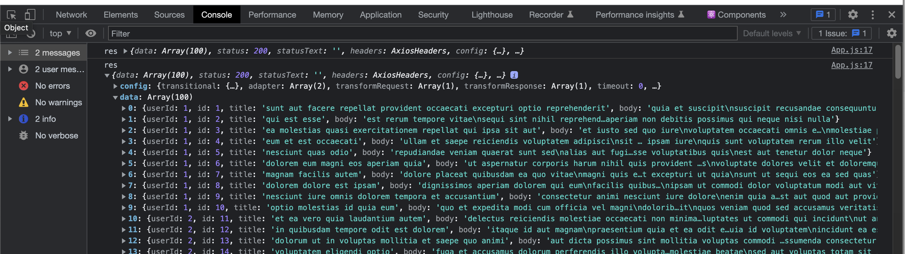

1-30 React

Blog List Demo

下节课讲状态管理


# 要点

+ useState, useEffect的使用
+ 如何从后端索要数据


# 需求

从后端返回一个String[], 将String[]中的元素按每页面10个输出在网页中, 分成多个页面, 并提供按钮来切换这些页面

网页结构:

+ 顶部 title
+ 中部 posts
+ 底部 pagination 显示页码


# 准备工作

5min-
老师在code sandbox react中写, 

+ 我选择在vscode里写, 在vscode中安装axios依赖会导致npm start run失效

安装axios依赖, 在react project路径下 `npm install axios`, 可能会有提示说vulnerability, 先别管


算了就用codesandbox react吧


---

几个面试问题 11min- 

为什么要使用hooks?


functional components中调用hooks要注意什么: 

+ 避免在循环中使用hooks


React哲学前两部 -21min

创建初始代码框架

App.js

Posts.js

Pagination.js

试验性地在每个component中写个hello world, 确保他们能先import成功

这里都是按流程走的, 不需要动脑子, 就不展示代码了


# 正式开始 22min-

## 静态页面, 调试css

先按照需求的ui写个mock的静态页面 22min-

主要为了方便写css


Pagination.js

```react
const Pagination = () =>{
    return (
        <nav>
            <ul className="pagination">
                <li className="pagination-item">
                    <button className='pagination-btn'>1</button>
                </li>
                <li className="pagination-item">
                    <button className='pagination-btn'>2</button>
                </li>
            </ul>
        </nav>
    )
}

export default Pagination;
```


Post.js

```react
const Post = () =>{
    return (
        <ul className = 'list-group'>
            <li className='list-group-item'>post 1</li>
            <li className='list-group-item'>post 2</li>
        </ul>
    )
}

export default Post;
```


App.js

```react
import './App.css';

import Pagination from './components/Pagination'
import Post from './components/Post'

function App() {
  return (

    <div className="container">
      <h1 className="title">My blog list</h1>
      <Post/>
      <Pagination/>
    </div>
  );
}

export default App;
```


此时就模拟了最终效果的一个静态页面, 我们接着来做layout与style


---

编写css调整样板的布局和样式 27min-

App.css

```css
.App {
  text-align: center;
  font-family: sans-serif;
}

/* 从上往下写 */

.title{
  display: flex;
  justify-content: center;
}

.container{
  max-width: 80%;
  margin: 0 auto;
}

.list-group{
  display: flex;
  flex-direction: column;
}

.list-group-item{
  padding: 0.75rem 1.25rem;
  border: 1px solid rgba(0,0,0,0.125);
  background-color: #fff;

  /* 消除item的border之间的重叠 */
  margin-bottom: -1px;;
  list-style-type: none;

}

.pagination{
  display: flex;
  list-style: none;

  /* 让page item可以流动, 当页面宽度缩小时 */
  flex-wrap:wrap;
}

.pagination-btn{
  color: #0d7bff;
  background-color: #fff;
  border: 1px solid #dee2e6;

  /* 去除border重叠 */
  margin-left: -1px;
  /* 把button 撑大 */
  padding: 0.5rem 0.75rem;
}
```

这里其实可以把App.css也拆开放到各个组件里去

得到如下的静态页面


## 接收从后端发来的数据 39min-


现在我们开始考虑如何把后端发来的List数据做成分页的


useEffect 43min-

在初次渲染和后续更新的时候会刷新


App.js

+ 定义state
  + [post, setPost]
  + [loading, setLoading]
+ 定义接收后端数据的函数fetchPosts()
  + 里面用到axios (ajax也可做到)
  + axios get数据有可能出错, 所以还要用try-catch把执行逻辑包起来做Exception handling以防止页面崩溃
  + 适时地改变loading的状态, 用来表示是否在loading axios返回的信息
+ useEffect hooks定义何时调用fetchPosts()
  + 这里我们定义为当初次渲染和后续更新的时候会刷新

```react
import {useState, useEffect} from 'react'   // 注意要导入hooks
import axios from 'axios';

import './App.css';

import Pagination from './components/Pagination'
import Post from './components/Post'


function App() {
	
  // ******************* 新定义 state *******************
  const [post, setPost]= useState([]);
  const [loading, setLoading] = useState(false);
	
  // ******************* 定义函数用来接收从后端传来的数据 *******************
  const fetchPosts = async() => {
    setLoading(true); // 表示开始loading后端的数据
    // 因为js是单线程的, 所以需要try-catch包住 axios.get('')以防其失败整个页面崩溃
    try{
      const res = await axios.get('https://jsonplaceholder.typicode.com/posts');
      console.log('res', res);  
      setPosts(res.data); // res is an object, res.data is an array
      setLoading(false);  // 成功load到后端的数据, loading状态应该改为false
    }catch(error){    // 可以具体在这里写error handlding的逻辑, 这里就先不写了
      setLoading(false);
      // 甚至可以具体set一个状态值, 比如401, 404, 500, 对应处理
    }
  }
  
	// ******************* useEffect calls fetchPosts() *******************
  // 当组件渲染时, 调用fetchPosts()
  useEffect(()=>{
    fetchPosts()
  }, [])  // 第二个argument为[], 表示第一次挂载App时就会调用fetchPosts()


  return (
    <div className="container">
      <h1 className="title">My blog list</h1>
      <Post/>
      <Pagination/>
    </div>
  );
}

export default App;
```

可以看到后端传来的数据




## 思考如何将list数据分页 59min-

现在我们应该将axios返回来的list, 分页, 然后只显示currentPage的内容


看到这里


创建新的state

App.js

```react
const [currentPage, setCurrentPage] = useState(1);
const [currentPosts, setCurrentPosts] = useState([]);
const [postsPerPage] = useState(10);
```


---

面试题 1h17min-

Props 与 state的区别

+ 父传子props:  readonly, immutable
+ 子传父: callback
+ 父传孙子(不直接相关的component share 数据):  redux toolkit, context


currentPagePost做完


1h29min- pagination


1h41min- 

Pagination.js 

useEffect() 依赖项


1h45min-

Pagination.js

Button onClick


# 至此, 效果实现了


# 最终代码

App.js

```react
import React, { useState, useEffect } from "react";

import "./App.css";
import Posts from "./components/Posts";
import Pagination from "./components/Pagination";
import axios from "axios";

const App = () => {
  // states -------------------------------------
  const [posts, setPosts] = useState([]);
  const [loading, setLoading] = useState(false);
  const [currentPage, setCurrentPage] = useState(1);
  const [currentPosts, setCurrentPosts] = useState([]);
  const [postsPerPage] = useState(10);

  // fetch all posts using axios API -----------------
  const fetchPosts = async () => {
    // note JS is single threaded, use try-catch to
    // handle exceptions like axios API fails
    setLoading(true);
    try {
      const res = await axios.get("https://jsonplaceholder.typicode.com/posts");
      console.log("res", res);
      setPosts(res.data); // 将API返回的data赋值给state: posts
      setLoading(false); // 表示data loading完毕
    } catch (error) {
      setLoading(false); // data loading 出错
    }
  };

  useEffect(() => {
    // fetch all posts 在第一次挂载时就执行
    fetchPosts();
  }, []);

  // 当[currentPage, postsPerPage, posts]中有任意一项改变时,
  // 执行 () => {}里的代码: setCurrentPosts()
  useEffect(() => {
    // get current posts (on current page): page 5: posts[40, 49]
    const indexOfLastPost = currentPage * postsPerPage;
    const indexOfFirstPost = indexOfLastPost - postsPerPage;
    // 从posts里截取current page的posts
    const currentPostArr = posts.slice(indexOfFirstPost, indexOfLastPost);
    setCurrentPosts(currentPostArr);
  }, [currentPage, postsPerPage, posts]);


  // jsx return html -------------------
  return (
    <div className="container">
      <h1 className="title">My Blog</h1>
      <Posts currentPosts={currentPosts} loading={loading} />
      <Pagination
        postsPerPage={postsPerPage}
        totalPosts={posts.length}
        currentPage={currentPage}
        setCurrentPage={setCurrentPage}
      />
    </div>
  );
};

export default App;
```


App.css

```react
.App {
  font-family: sans-serif;
  text-align: center;
}

.title {
  display: flex;
  justify-content: center;
}

.container {
  max-width: 80%;
  margin: 0 auto;
}

.list-group {
  display: flex;
  flex-direction: column;
}

.list-group-item {
  padding: 1.75rem 1.25rem;
  border: 1px solid rgba(0, 0, 0, 0.125);
  background-color: #fff;
  /* 让上面的post的bottom border往上收一收, 防止和下面的post border重叠 */
  margin-bottom: -1px;

  list-style: none;
}

.pagination {
  display: flex;
  list-style: none;
  flex-wrap: wrap;
}

.page-btn {
  color: #0d7bff;
  background-color: #fff;
  border: 1px solid #dee2e6;
  margin-left: -1px;
  padding: 0.5rem 0.75rem;
}
```


components > Posts.js

```react
// 当前页面的posts
import React from "react";

const Posts = ({ currentPosts, loading }) => {
  if (loading) {
    // if data not ready (loading = true)
    return <h2>Loading</h2>;
  }

  // jsx
  return (
    <ul className="list-group">
      {currentPosts.length > 0 &&
        currentPosts.map((post) => (
          <li key={post.id} className="list-group-item">
            {post.title}
          </li>
        ))}
    </ul>
  );
};

export default Posts;
```

components > Pagination.js

```react
// 底部的页码
import React, { useEffect, useState } from "react";

const Pagination = ({
  postsPerPage,
  totalPosts,
  currentPage,
  setCurrentPage
}) => {
  // state
  const [pageNumbers, setPageNumbers] = useState([]);

  //
  useEffect(() => {
    let arr = [];
    for (let i = 1; i <= Math.ceil(totalPosts / postsPerPage); i++) {
      arr.push(i);
    }
    setPageNumbers(arr);
  }, [totalPosts, postsPerPage]);

  // jsx ----------------------------------------
  return (
    <nav>
      <ul className="pagination">
        {/* 将一个array的信息转化为一组html tag */}
        {pageNumbers.map((number) => (
          <li key={number} className="page-item">
            <button
              style={{
                background: currentPage === number ? "lightblue" : null
              }}
              className="page-btn"
              onClick={() => {
                setCurrentPage(number);
              }}
            >
              {number}
            </button>
          </li>
        ))}
      </ul>
    </nav>
  );
};

export default Pagination;
```


另一种做法 1h52min- 2h

子传父: callback


