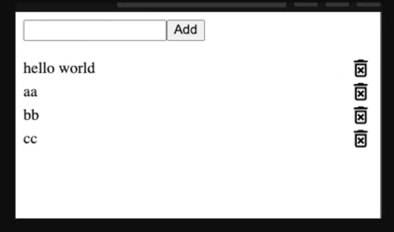
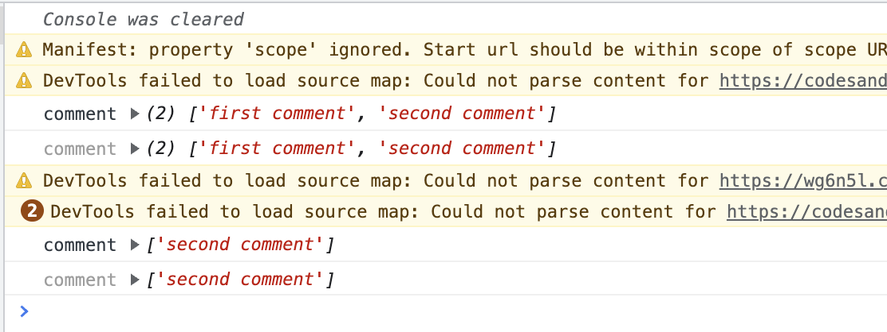
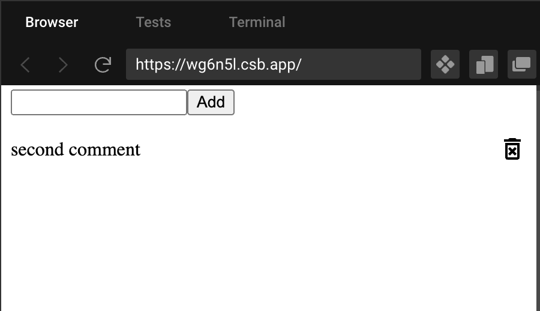

Ally 2-6 react tut

本节课讲状态管理

Github上可以放一些小项目(7,8个足矣), GitHub链接放在简历上, 别人是有可能看的

# 要点

核心是操作state的成员属性comments (一个array), 再通过comments.map()将其转化为html list进行渲染呈现在前端

+ useReducer, useContext的使用
+ jsx中, 将array map为html list时, 注意给`<li>`加上key, 指定unique id, 并且要足够unique
+ 体会写一个react app 的流程
  + Step1: 搭建框架, 拆分页面, 保证component连接正确
  + Step2: mock page, 先写个静态页面作为中间代码好改为动态页面
  + :bangbang: Step3: 着手把静态页面改为动态页面, 此间引入hooks. 难点所在

+ JS的基本语法复习: [spread operator](https://developer.mozilla.org/en-US/docs/Web/JavaScript/Reference/Operators/Spread_syntax), destruct, Array API


:question: ReducerList中, 为何return()要先...state, 后面的commenst: {}也会覆盖掉...state代表的comments{}吧

# 最终效果展示

add/delete TODO-list

在输入框输入text, 将增加comment		--->   AddComment component

点击comment 右侧的垃圾桶图标, 可以删除对应的comment   	--->  CommentList component


# 1. Review: state management 

code sandbox


父传子 props readonly immutable

子传父	callback

父传孙子 redux toolkit, context

```react
1. context API: 实现了数据传递和共享

2. context + userReducer: 实现低配版的redux, 用于中小型项目的状态管理  基于react devtools

3. redux + react-redux: 公司级别的项目基本都要用redux, 用于中大型项目的状态管理  基于redux  devtools
```

今天讲第二个 context + userReducer, 用useState, useEffect, useReducer, useContect做一个低配中的低配的redux


12min-

:book: [React官方文档: hooks](https://reactjs.org/docs/hooks-reference.html)

用到两个hooks: useReducer, useContext


# 2. 正式开始15min-





可见components:

+ top: add comment bar
+ bottom: comment list


## Step1: 准备工作 15min-

打开code sandbox react, 加入dependencies

```react
@mui/material
@mui/icons-material
@emotions/styled
@emotions/react
```


vscode的话, 输入如下装dependency

```bash
npm install @mui/material @emotion/react @emotion/styled @mui/icons-material
```


在Src下创建components, context folder


创建目录结构, 并保证组件连接成功 17min-26min


## React doc: useReducer & useContext 26min-

看到这里


### :moon: 看看useReucer的文档

:book: [React官方文档: hooks](https://reactjs.org/docs/hooks-reference.html)

**useReducer核心还是围绕state, 只不过我们这次我们不是直接给state set a specific value, 而是用dispatch方法间接地控制state如何变化(increment / derivative)** 前面的useState返回的setState相当于是`state = value`, 而这里useReducer返回的dispatch相当于是`state += difference`

```react
const [state, dispatch] = useReducer(reducer, initialArg, init);
// dispatch, reducer 都是函数
```

:bangbang: 难点: 理解dispatch与reducer之间的关系

+ Reducer(state, action): 描述用户给定action, state object如何变化(属性值的变化, 或者增加新的属性, 或者对内部成员数组的操作)
+ Dispatch: set value for action, indirectly manipulate state


:star: 使用场景: 

+ `useReducer` is usually preferable to `useState` when you have complex state logic that 
  + involves multiple sub-values or 
  + when the next state depends on the previous one.

+ `useReducer` also lets you optimize performance for components that trigger deep updates because [you can pass `dispatch` down instead of callbacks](https://reactjs.org/docs/hooks-faq.html#how-to-avoid-passing-callbacks-down).
  + Callbacks:在component tree 一步步往下传state
  + Dispatch: state直达想要的component node


:gem: Here’s the counter example from the [`useState`](https://reactjs.org/docs/hooks-reference.html#usestate) section, rewritten to use a reducer:

:question: dispatch的argument代表啥意思??? ---代表action object

:question: reducer里的return {}是return 了什么, 给了谁? --- return 的是 state object

```react
const initialState = {count: 0};		// 给state的inital value

// 定义随action.tpye的取值, 如何操作state
// reducer我们经常另外放在一个js文件里
function reducer(state, action) {
  switch (action.type) {
    case 'increment':
      return {count: state.count + 1};
    case 'decrement':
      return {count: state.count - 1};
    default:
      throw new Error();
  }
}

function Counter() {
  // 1. 这里相当于我们根据reducer定义state根据自变量(这里指action)如何变化
  // 		action的取值 ---> state的变化率 (注意是'变化率', 不是取值)
  // 2. 返回的dispatch这个函数用来设置自变量(这里指action)的值
  // 		dispatch ---> set value for action
  // action只是中间变量
	// 结论: 相当于间接地我们可以通过dispatch来控制state的变化率
  const [state, dispatch] = useReducer(reducer, initialState);
  return (
    <>
      Count: {state.count}
      <button onClick={() => dispatch({type: 'decrement'})}>-</button>
      <button onClick={() => dispatch({type: 'increment'})}>+</button>
    </>
  );
}
```


#### 关于Reducer

https://beta.reactjs.org/reference/react/useReducer#adding-a-reducer-to-a-component


### :moon: 看useContext的官网文档  29min-

useContext是封装了context的一些API, 主要用于祖先组件和其(深层)后代组件间的(跨中间组件)通信, 记得两个要素即可:

+ 要素一工作方式: 采用myContext.Provider发送, 后代组件接收 (`useContext(myContext)`) 的模式

+ 要素二包裹: 发送和接收的包裹是Provider的props.value, 可以把value看成是一个'容器', 里面的方法, 参数都可以往后代组件传递, 这也就提供了和其他hook结合使用的可能性, 比如value里的方法和参数由useReducer提供.  我们甚至可以把Provider结合其他hooks单独封装称为一个组件 (后面GlobalState.js就是这么干的)

关系: 

```js
myContext{
  Provider{
    value
  }
}
```


基本语法

```react
const value = useContext(MyContext);
```

Accepts a context object (the value returned from `React.createContext`) and *returns the current context value for that context.* 

+ :bangbang: The current context value is determined by the `value` prop of **the nearest** `<MyContext.Provider>` **above the calling component in the tree.**

+ When the nearest `<MyContext.Provider>` above the component updates, this Hook will trigger a rerender with the latest context `value` passed to that `MyContext` provider.


:bangbang:Don’t forget that the argument to `useContext` must be the *context object itself* !

> - **Correct:** `useContext(MyContext)`
> - **Incorrect:** `useContext(MyContext.Consumer)`
> - **Incorrect:** `useContext(MyContext.Provider)`

A component calling `useContext` will always re-render when the context value changes. If re-rendering the component is expensive, you can [optimize it by using memoization](https://github.com/facebook/react/issues/15156#issuecomment-474590693).


:gem: 

This example is modified for hooks from a previous example in the [Context Advanced Guide](https://reactjs.org/docs/context.html), where you can find more information about when and how to use Context.

基本上分3步:

+ step1: `const myContext = React.createContext(themes.light)`
  + :bangbang: 注意写在组件外面

+ Step2: 在jsx中指明myContext.Provider标签 与对应的props.value
+ Step3: 在myContext.Provider下的某个component node  调用 `useContext(myContext)`, 返回step2中定义的props.value
  + 这样就做到了, 从父级component直接传递cotext信息到指定的调用useContext(myContext)的component, 而不用像useState()那样一层一层地传递信息
  + :bangbang: 只是注意: myContext.Provider 往后代组件传递value并不是任意的, 后代组件调用useContext(myContext)后, 只有在该后代组件之上的nearest的myContext.Provider 包含的value才会被后代组件接收

```react
// 这里的例子是函数式组件
const themes = {
  light: {
    foreground: "#000000",
    background: "#eeeeee"
  },
  dark: {
    foreground: "#ffffff",
    background: "#222222"
  }
};

// step1: create a context object, given its initial value
const ThemeContext = React.createContext(themes.light);	// ThemeContext initial value是 themes.light

function App() {
  return (
    // step2: 指明 myContext.provider, 准备给它下面的component node提供props.value
    // given ThemeContext.Provider, component below it might call useContext(), what will return is the value props given here
    // value 在这里就相当于一个包裹, value本质是一个object, 下面的后代组件可以直接接收这个包裹, 得到里面含有的所有参数, 函数...
    <ThemeContext.Provider value={themes.dark}>		
      <Toolbar />
    </ThemeContext.Provider>
  );
}

function Toolbar(props) {
  return (
    <div>
      <ThemedButton />
    </div>
  );
}

function ThemedButton() {
  // step3: call useContext(myContext), return props.value  
  // the nearest myContext.provier is ThemeContext.Provider, its value is {themes.dark}
  // so that theme (returned by useContext()) here is {themes.dark}
  const theme = useContext(ThemeContext);	
  return (
    <button style={{ background: theme.background, color: theme.foreground }}>
      I am styled by theme context!
    </button>
  );
}
```


#### 关于Context

https://reactjs.org/docs/context.html

:question: 到底什么是context?  ---> 见尚硅谷的React chapter8, context本质上也是object, 这里useContext()只是封装了context的一部分API

Context provides a way to pass data through the component tree without having to pass props down manually at every level.


# 3. 正式写

## 3.1 写GlobalState.js  &  ListReducer.js 32min-

:bangbang:难点: 理解如何结合useReducer和useContext


### 3.1.1 :full_moon: GlobalState.js

+ export 两个函数, 注意他们的类型都是对象
  + GlobalContext: 全局的context object
  + :star: GlobalProvider: 组件,  封装好GlobalContext.Provider标签为`GlobalProvider`组件, value (当然是作为object) 里甚至还提供了操作方法,  提高复用性
    + 封装了 state {comments[ ]}, 以及两个操作方法; 封装state这个操作非常有必要

```react
import { createContext, useReducer } from "react";
import ListReducer from "./ListReducer";

// set initial value for state
const initialState = {
  comments: ["first comment", "second comment"]
};

// -----------------useContext() step1: create context object ----------------------
export const GlobalContext = createContext(initialState);
// GlobalContext initial value是 initialState, 注意他们都是object

// provider component
export const GlobalProvider = ({ children }) => {
  
  // userReducer 获取state和dispatch
  const [state, dispatch] = useReducer(ListReducer, initialState);

  // 利用useReducer返回的dispatch对ListReducer中的action的赋值操作--------------------------
  // deleteComment(comment)函数封装了对action object的赋值操作(dispatch)
  function deleteComment(comment) {
    dispatch({
      type: "DELETE_COMMENT",
      payload: comment // 将要删除的comment
    });
  }

  function addComment(comment) {
    dispatch({
      type: "ADD_COMMENT",
      payload: comment //将要 add 的 comment
    });
  }

  return (
    // ----------useContext() step2: context object的Provider标签包裹后代组件, 并声明value ----------------------
    <GlobalContext.Provider
      value={{
        comments: state.comments,
        addComment,
        deleteComment
      }}
    >
      {children}
    </GlobalContext.Provider>
  );
};

```


### 3.1.2 ListReducer.js

reducer(state, action) 的目的:

+ 传入的是state object (一般含有多个属性), action object

+ **返回的是根据action指令变化后的state object**, 
  + 所谓''变化后'就是是对原本的state object进行操作, 比如改变其内部属性值, 增加新的属性... 其中spread operator, Stream API操作会比较常用
+ ​	这里定义的DELETE_COMMENT对应的操作, 其实是按照comment的内容来filter

:question: return 那里为什么要先`...state`一下? --- 经过测试, 不写`...state`也行

```react
// state{comments}
// action{type, payload}

// 定义state随action.tpye的取值的操作
export default (state, action) => {
  switch (action.type){
    case 'DELETE_COMMENT':
      // return 的相当于是在原来的state object 多加了comments属性(这个应该不对), 并筛选合格的comment
        return{
          ...state,
          comments: state.comments.filter(
            comment => comment !== action.payload
          )
        };
    case 'ADD_COMMENT':
      //
      return{
        ...state,
        comments:[...state.comments, action.payload]
      };
    default:
        return state;
  }
}
```


## Step2: Mock static page 54min- 

初步在搭建好的文件目录结构中为每个组件写一些结构,  做一个假的静态页面, 搭好架子, 这里还没涉及child component和ancestor component之间的通信


在App.js中导入刚刚写好的GlobalProvider组件, 并包住代码

```react
import { AddComment } from "./components/AddComment";
import { CommentList } from "./components/CommentList";
import "./styles.css";

// 这里file其实也是个object, 里面有很多的function (也是object)
// 所以采用destruct的写法
import { GlobalProvider } from "./context/GlobalState";

// export default function App() {
const App = () => {
  return (
    // GlobalProvider下的component node都可以用到GlobalProvider中value包裹的东西(函数, 参数...)
    <GlobalProvider className="App">
      <AddComment />
      <CommentList />
    </GlobalProvider>
  );
};

export default App;
```


56min-

AddComment.js

```react
export const AddComment = () => {
  return (
    <form>
      <input />
      <button>Add</button>
    </form>
  );
};
```


CommentList.js

可以通过mui.com来查找资源

```react
import DeleteForeverOutlinedIcon from "@mui/icons-material/DeleteForeverOutlined";

export const CommentList = () => {
  return (
    <ul>
      <li>
        <div className="comment">Comment 1</div>
        <DeleteForeverOutlinedIcon></DeleteForeverOutlinedIcon>
      </li>
    </ul>
  );
};
```


style.css

https://developer.mozilla.org/en-US/docs/Web/CSS/flex

```css
.App {
  font-family: sans-serif;
  text-align: center;
}

ul {
  padding: 0;
}

li {
  list-style: none;
  display: flex;
  align-items: center;
}

.comment {
  /* 实现类似space-between 的效果, 把其他和它平行的tag元素顶到右边去 */
  flex: 1;
}
```

得到样板


1h05min - 1h15min 帮学生debug

## Step3: state page to dynamic page 1h15min-

着手把静态页面改为动态页面， 需要child component和ancestor component 通信


CommentList.js

+ 通过调用useContext(GlobalContext)， 来得到在祖先component那里定义好的ContextProvider所准备好的value包裹

```react
import DeleteForeverOutlinedIcon from "@mui/icons-material/DeleteForeverOutlined";

import { useContext } from "react";
import { GlobalContext } from "../context/GlobalState";

export const CommentList = () => {
  // call useContext(): 接收value包裹
  // destruct value object: 拆value包裹
  const { comments, deleteComment } = useContext(GlobalContext);

  console.log("comment", comments);
	
  // 把comments array 转化为 html标签
  return (
    <ul>
      {comments.map((comment, i) => {
        return (
          <li key={`${i}-${comment}`}>
            <div className="comment">{comment}</div>
            <DeleteForeverOutlinedIcon></DeleteForeverOutlinedIcon>
          </li>
        );
      })}
    </ul>
  );
};
```

此时得到如下的页面


### 3.3.1 CommentList component 1h 23min-


点击delete icon, 可以删除对应comment

:bangbang: 难点, 看到这,  需要理解

+ what is context
  + 本质上是一个对象, 记得两个要素即可: 1) 收发的工作方式; 2) value包裹

+ what is the relationship between reducer and dispatch: 
  + reduce描述的是state object随着用户action如何变化
  + 而dispatch是useReducer(reducer, initialState)返回的一个函数, 用来给reducer中的action赋值

+ dispatch的argument是一个object, 到底代表啥意思: 代表对reducer中的action object的赋值操作


CommentList.js

给`<DeletedForeverOutlinedIcon>`定义onClick属性

```react
import DeleteForeverOutlinedIcon from "@mui/icons-material/DeleteForeverOutlined";

import { useContext } from "react";
import { GlobalContext } from "../context/GlobalState";

export const CommentList = () => {
  const { comments, deleteComment } = useContext(GlobalContext);

  console.log("comment", comments);

  return (
    <ul>
      {/* 注意comments.map((comment)=>{})中comment也是中间对象, 和forEach()一样的 */}
      {comments.map((comment, i) => {
        return (
          <li key={`${i}-${comment}`}>
            <div className="comment">{comment}</div>
            {/*这里!*/}   
            <DeleteForeverOutlinedIcon onClick={() => deleteComment(comment)} />
          </li>
        );
      })}
    </ul>
  );
};

```


注意state的initialState = {comments: ["first comment", "second comment"]}


---

流程分析

前端神奇的逻辑... 我更愿意把前端看成是用编程语言实现的一个应用

当onClick icon后, 就触发`() => deleteComment(comment)`, 也就执行GlobalContext.js如下代码, 利用userReducer()返回的dispatch给ListReducer中的action赋值

+ action.payload用来filter删掉哪条comment

```react
export const GlobalProvider = ({ children }) => {
  // userReducer 获取state和dispatch
  // dispatch用来间接操作state, dispatch --- reducer --- state
  const [state, dispatch] = useReducer(ListReducer, initialState);  
  
	// actions --------------------------
  // 这里dispatch()的argument代表啥????
  function deleteComment(comment) {
    dispatch({
      type: "DELETE_COMMENT",
      payload: comment // 将要删除的comment
    });
  }
  
  // ...
}
```

之后 由于ListReducer.js描述的action-state关系, 对state进行对应的操作并返回操作后的state (我猜是把操作后的state返回给了当初定义state的GlobalProvider)

+ :question: return 那里为什么要...state一下?

```react
// initialState is {comments: ["first comment", "second comment"]}
// action{type, payload}

// 定义state随action.tpye的取值的操作
export default (state, action) => {
  switch (action.type) {
    case "DELETE_COMMENT":
      // return 的相当于是在原来的state object 多加了comments属性, 并筛选合格的comment
      return {
        ...state,
        comments: state.comments.filter((comment) => {
          return comment !== action.payload;
        })
      };
    case "ADD_COMMENT":
      //
      return {
        ...state,
        comments: [...state.comments, action.payload]
      };
    default:
      return state;
  }
};
```

接着CommentList.js接收到GlobalProvider中state的变化, rerender

```react
import DeleteForeverOutlinedIcon from "@mui/icons-material/DeleteForeverOutlined";

import { useContext } from "react";
import { GlobalContext } from "../context/GlobalState";

export const CommentList = () => {
  // 此时, 这里接收到GlobalContext.Provider变化后的value
  const { comments, deleteComment } = useContext(GlobalContext);

  console.log("comment", comments);

  return (
    <ul>
      {/* 注意comments.map((comment)=>{})中comment也是中间对象, 和forEach()一样的 */}
      {comments.map((comment, i) => {
        return (
          <li>
            <div className="comment">{comment}</div>
            {/*这里!*/}   
            <DeleteForeverOutlinedIcon onClick={() => deleteComment(comment)} />
          </li>
        );
      })}
    </ul>
  );
};

```

可以看到点击首个comment对应的delete icon后, state.comment中的首个元素确实被删去了



rerender也验证了这点



总结: 本质上还是对state的成员comments (对state的理解?) 进行CRUD, 然后再通过渲染( map comments  into HTML list )在前端体现出来CRUD的操作

---


1h27min-1h30min 给学生debug


### 3.3.2 AddComment component 1h30min-1h49min

原理类似, 对GlobalProvider中的state.comments进行CRUD, 然后通过渲染在前端体现出来

AddComment.js

```react
import { useContext, useState } from "react";
import { GlobalContext } from "../context/GlobalState";

export const AddComment = () => {
  
  const [text, setText] = useState("");
  const { addComment } = useContext(GlobalContext);
  console.log("text is ", text);

  const onSubmit = (e) => {
    e.preventDefault();
    addComment(text);
    setText(""); // 用户在输入框内输入结束后, 清空输入框
  };

  return (
    <form onSubmit={onSubmit}>
      {/* 通过input标签, 来给text state进行setText */}
      <input value={text} onChange={(e) => setText(e.target.value)} />
      <button>Add</button>
    </form>
  );
};

```


---

:bangbang: 注意 1h43min-

CommentList.js中

map comments into html list时, 注意要给`<li>`指定unique id, 不要直接放index, 因为不够unique

```react
 <li key={`${i}-${comment}`}>
```


1h45min- 1h49min

总结 

