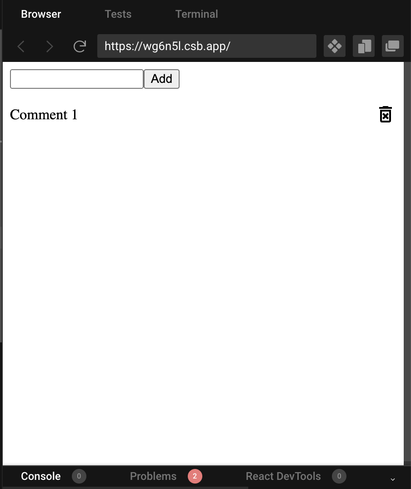

Ally 2-6 react tut

本节课讲状态管理

Github上可以放一些小项目(7,8个足矣), GitHub链接放在简历上, 别人是有可能看的


# 要点

+ useReducer, useContext的使用


最终效果展示


# Review: state management 

code sandbox


父传子 props readonly immutable

子传父	callback

父传孙子 redux toolkit, context


```react
1. context API: 实现了数据传递和共享

2. context + userReducer: 实现低配版的redux, 用于中小型项目的状态管理  基于react devtools

3. redux + react-redux: 公司级别的项目基本都要用redux, 用于中大型项目的状态管理  基于redux  devtools
```

今天讲第二个 context + userReducer, 用useState, useEffect, useReducer, useContect做一个低配中的低配的redux


12min-

:book: [React官方文档: hooks](https://reactjs.org/docs/hooks-reference.html)

用到两个hooks: useReducer, useContext


# 正式开始15min-


可见components:

+ top: add comment bar
+ bottom: comment list


## 准备工作 15min-

打开code sandbox react, 加入dependencies

```react
@mui/material
@mui/icons-material
@emotions/styled
@emotions/react
```


vscode的话, 输入如下装dependency

```bash
npm install @mui/material @emotion/react @emotion/styled @mui/icons-material
```


在Src下创建components, context folder


创建目录结构, 并保证组件连接成功 17min-26min


## React doc: useReducer & useContext 26min-

看到这里


### :moon: 看看useReucer的文档

:book: [React官方文档: hooks](https://reactjs.org/docs/hooks-reference.html)

**useReducer核心还是围绕state, 只不过我们这次我们不是直接给state set a specific value, 而是用dispatch方法间接地控制state如何变化(increment / derivative)** 前面的useState返回的setState相当于是`state = value`, 而这里useReducer返回的dispatch相当于是`state += difference`

```react
const [state, dispatch] = useReducer(reducer, initialArg, init);
// dispatch, reducer 都是函数
```

:bangbang: 难点: 理解dispatch与reducer之间的关系

+ Reducer(state, action)
+ Dispatch: set value for action


:star: 使用场景: 

+ `useReducer` is usually preferable to `useState` when you have complex state logic that 
  + involves multiple sub-values or 
  + when the next state depends on the previous one.

+ `useReducer` also lets you optimize performance for components that trigger deep updates because [you can pass `dispatch` down instead of callbacks](https://reactjs.org/docs/hooks-faq.html#how-to-avoid-passing-callbacks-down).
  + Callbacks:在component tree 一步步往下传state
  + Dispatch: state直达想要的component node


:gem: Here’s the counter example from the [`useState`](https://reactjs.org/docs/hooks-reference.html#usestate) section, rewritten to use a reducer:

:question: dispatch的argument代表啥意思???

:question: reducer里的return {}是return 给了谁?

```react
const initialState = {count: 0};		// 给state的inital value

// 定义随action.tpye的取值, 如何操作state
// reducer我们经常另外放在一个js文件里
function reducer(state, action) {
  switch (action.type) {
    case 'increment':
      return {count: state.count + 1};
    case 'decrement':
      return {count: state.count - 1};
    default:
      throw new Error();
  }
}

function Counter() {
  // 1. 这里相当于我们根据reducer定义state根据自变量(这里指action)如何变化
  // 		action的取值 ---> state的变化率 (注意是'变化率', 不是取值)
  // 2. 返回的dispatch这个函数用来设置自变量(这里指action)的值
  // 		dispatch ---> set value for action
  // action只是中间变量
	// 结论: 相当于间接地我们可以通过dispatch来控制state的变化率
  const [state, dispatch] = useReducer(reducer, initialState);
  return (
    <>
      Count: {state.count}
      <button onClick={() => dispatch({type: 'decrement'})}>-</button>
      <button onClick={() => dispatch({type: 'increment'})}>+</button>
    </>
  );
}
```


28min- 开始写


### 看useContext的官网文档  29min-

基本语法

```react
const value = useContext(MyContext);
```

Accepts a context object (the value returned from `React.createContext`) and *returns the current context value for that context.* 

+ The current context value is determined by the `value` prop of **the nearest** `<MyContext.Provider>` **above the calling component in the tree.**

+ When the nearest `<MyContext.Provider>` above the component updates, this Hook will trigger a rerender with the latest context `value` passed to that `MyContext` provider.


:bangbang:Don’t forget that the argument to `useContext` must be the *context object itself* !

> - **Correct:** `useContext(MyContext)`
> - **Incorrect:** `useContext(MyContext.Consumer)`
> - **Incorrect:** `useContext(MyContext.Provider)`

A component calling `useContext` will always re-render when the context value changes. If re-rendering the component is expensive, you can [optimize it by using memoization](https://github.com/facebook/react/issues/15156#issuecomment-474590693).


:gem: 

This example is modified for hooks from a previous example in the [Context Advanced Guide](https://reactjs.org/docs/context.html), where you can find more information about when and how to use Context.

基本上分3步:

+ step1: `const myContext = React.createContext(themes.light)`
+ Step2: 在jsx中指明myContext.Provider标签 与对应的props.value
+ Step3: 在myContext.Provider下的某个component node  调用 `useContext(myContext)`, 返回step2中定义的props.value
  + 这样就做到了, 从父级component直接传递cotext信息到指定的调用useContext(myContext)的component, 而不用像useState()那样一层一层地传递信息

```react
const themes = {
  light: {
    foreground: "#000000",
    background: "#eeeeee"
  },
  dark: {
    foreground: "#ffffff",
    background: "#222222"
  }
};

// step1: create a context
const ThemeContext = React.createContext(themes.light);	// ThemeContext initial value是 themes.light

function App() {
  return (
    // step2: 指明 myContext.provider, 准备给它下面的component node提供props.value
    // given ThemeContext.Provider, component below it might call useContext(), what will return is the value props given here
    <ThemeContext.Provider value={themes.dark}>		
      <Toolbar />
    </ThemeContext.Provider>
  );
}

function Toolbar(props) {
  return (
    <div>
      <ThemedButton />
    </div>
  );
}

function ThemedButton() {
  // step3: call useContext(myContext), return props.value  
  // the nearest myContext.provier is ThemeContext.Provider, its value is {themes.dark}
  // so that theme (returned by useContext()) here is {themes.dark}
  const theme = useContext(ThemeContext);	
  return (
    <button style={{ background: theme.background, color: theme.foreground }}>
      I am styled by theme context!
    </button>
  );
}
```


#### 关于Context

https://reactjs.org/docs/context.html

:question: 到底什么是context?

Context provides a way to pass data through the component tree without having to pass props down manually at every level.


## 写GlobalState.js  &  ListReducer.js 32min-

写GlobalState.js

+ export 两个函数, 注意他们的类型都是对象
  + GlobalContext
  + GlobalProvider

```react
import { createContext, useReducer } from "react";
import ListReducer from "./ListReducer";

// set initial value for state
const initialState = {
  comments: ["first comment", "second comment"]
};

// create context
export const GlobalContext = createContext(initialState);
// GlobalContext initial value是 initialState, 注意他们都是object

// provider component
export const GlobalProvider = ({ children }) => {
  // userReducer 获取state和dispatch
  const [state, dispatch] = useReducer(ListReducer, initialState);

  // actions --------------------------
  function deleteComment(comment) {
    dispatch({
      type: "DELETE_COMMENT",
      payload: comment // 将要删除的comment
    });
  }

  function addComment(comment) {
    dispatch({
      type: "ADD_COMMENT",
      payload: comment //将要 add 的 comment
    });
  }

  return (
    <GlobalContext.Provider
      value={{
        comments: state.comments,
        addComment,
        deleteComment
      }}
    >
      {children}
    </GlobalContext.Provider>
  );
};

```


ListReducer.js

```react
// 定义state随action.tpye的取值的操作
export default (state, action) => {
  switch (action.type){
    case 'DELETE_COMMENT':
        return{
          ...state,
          comments: state.comments.filter(
            (comment)=>{
                comment !== action.payload
            }
          )
        };
    case 'ADD_COMMENT':
      return{
        ...state,
        comments:[...state.comments, action.payload]
      };
    default:
        return state;
  }
}
```


## Mock page, 准备从App向子组件传递信息 54min- 


在App.js中导入刚刚写好的GlobalProvider, 并包住代码

```react
import { AddComment } from "./components/AddComment";
import { CommentList } from "./components/CommentList";
import "./styles.css";

// 这里file其实也是个object, 里面有很多的function (也是object)
// 所以采用destruct的写法
import { GlobalProvider } from "./context/GlobalState";

// export default function App() {
const App = () => {
  return (
    // GlobalProvider下的component node都可以用到GlobalProvider的东西
    <GlobalProvider className="App">
      <AddComment />
      <CommentList />
    </GlobalProvider>
  );
};

export default App;
```


56min-

AddComment.js


```react
export const AddComment = () => {
  return (
    <form>
      <input />
      <button>Add</button>
    </form>
  );
};
```


CommentList.js

可以通过mui.com来查找资源

```react
import DeleteForeverOutlinedIcon from "@mui/icons-material/DeleteForeverOutlined";

export const CommentList = () => {
  return (
    <ul>
      <li>
        <div className="comment">Comment 1</div>
        <DeleteForeverOutlinedIcon></DeleteForeverOutlinedIcon>
      </li>
    </ul>
  );
};
```


style.css

https://developer.mozilla.org/en-US/docs/Web/CSS/flex

```css
.App {
  font-family: sans-serif;
  text-align: center;
}

ul {
  padding: 0;
}

li {
  list-style: none;
  display: flex;
  align-items: center;
}

.comment {
  /* 实现类似space-between 的效果, 把其他和它平行的tag元素顶到右边去 */
  flex: 1;
}
```


得到样板




1h05min - 1h15min 帮学生debug


## 到child component里使用useContext 1h15min-

CommentList.js

+ 通过调用useContext(GlobalContext)， 来得到在祖先component那里定义好的ContextProvider所准备好的信息

```react
import DeleteForeverOutlinedIcon from "@mui/icons-material/DeleteForeverOutlined";

import { useContext } from "react";
import { GlobalContext } from "../context/GlobalState";

export const CommentList = () => {
  // call useContext()
  const { comments, deleteComment } = useContext(GlobalContext);

  console.log("comment", comments);

  return (
    <ul>
      {comments.map((comment, i) => {
        return (
          <li>
            <div className="comment">{comment}</div>
            <DeleteForeverOutlinedIcon></DeleteForeverOutlinedIcon>
          </li>
        );
      })}
    </ul>
  );
};
```

此时得到如下的页面


### :moon: 点击delete icon, 删除对应comment 1h 23min-

难点

看到这,  需要理解

 what is context

what is the relationship between reducer and dispatch

dispatch的argument是一个object, 到底代表啥意思

## 

# 

# 


