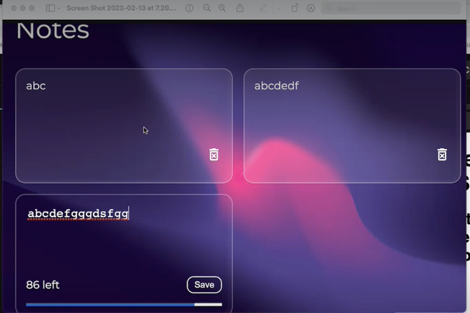
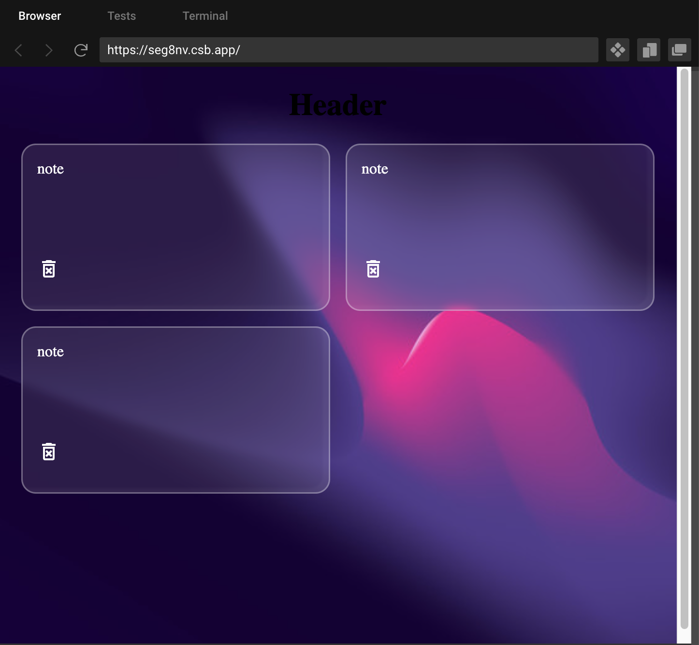
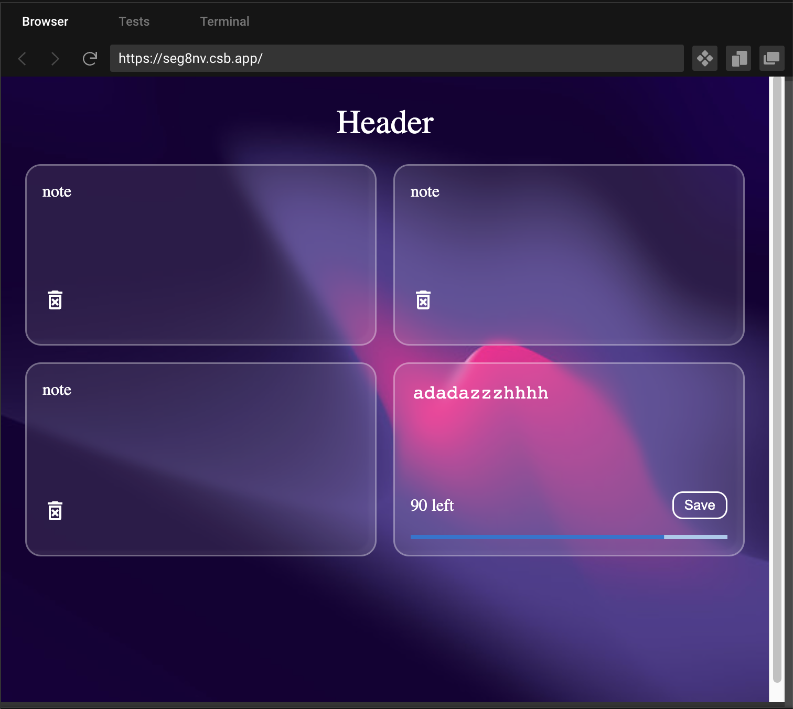
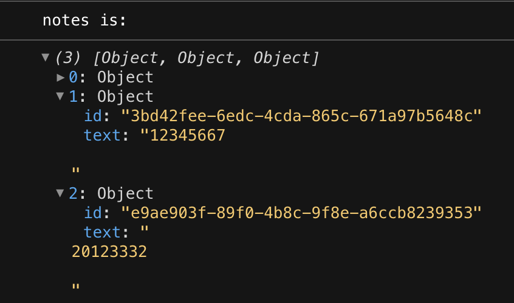

2-13 Ally tut


# 要点

+ html标签的onChange属性的使用, 当用户在textarea输入之后如何用一个state承载用户输入的内容, 以及如何set这个state的值
+ 前端react中, 对于state的数组的CRUD
  + C: setState([...state, {element}])
  + D: filter


最终效果演示

用到 grid, mui, local storage

每当点击save, 会自动出现新的卡片, 且笔记内容会更新在local storage中 (当刷新browser后, 这些notes还暂存在local storage中)

点击垃圾桶, 自动删除




# Review 4min-

Web storage

```js
cookie: 4kb大小 对于比较小的数据又需要在客户端和服务器之间频繁传送的, 可以使用cookie
sessionStorage:	5Mb大小	生命周期较短, 关闭窗口可能就丢失了
localStorage: 5Mb大小 生命周期长一些, 存储的是永久性的数据, 关闭窗口也会存在, 数据不能被爬虫抓取, 工作中用的多一点
```

今天就用localStorage来写


# Hands-on

## 准备工作

目录结构

```react
|--- src
    |--- components
            Header.js
            Notes.js
            Note.js
            CreateNote.js
		|--- css
						App.css
						Note.css
				
```


dependency

```react
@mui/material		// 必须先装这个, 才能使用mui其他dependency
@mui/icons-material
@emotion/react
@emotion/styled
uuid

```


布局我们用grid来写


按照目录结构保证各组件间可以正常链接 17min- 28min


App.js

```react
import Header from "./components/Header";
import Notes from "./components/Notes";
import "./styles.css";
import "./css/App.css";

export default function App() {
  return (
    <div className="main">
      <Header />
      <Notes />
    </div>
  );
}
```


Header.js

```react
function Header() {
  return (
    <div className="header">
      <h1 className="notes__title">Header</h1>
    </div>
  );
}

export default Header;
```


Notes.js

```react
import Note from "./Note";

import "../css/Note.css";

function Notes() {
  return (
    <div className="notes">
      <Note />
      <Note />
      <Note />
    </div>
  );
}

export default Notes;
```


Note.js

```react
import DeleteForeverOutlinedIcon from "@mui/icons-material/DeleteForeverOutlined";

function Note() {
  return (
    <div className="note">
      <div className="note__body">note</div>
      <div className="note__footer">
        <DeleteForeverOutlinedIcon />
      </div>
    </div>
  );
}

export default Note;

```


css 28min-

复制粘贴到Note.css

```css
.note {
  background: rgba(255, 255, 255, 0.1);
  backdrop-filter: blur(5px);
  box-shadow: inset -6px -4px 2px rgba(255, 255, 255, 0.03);
  border-radius: 15px;
  border: 1.5px solid rgba(255, 255, 255, 0.326);
  color: #fff;
  padding: 15px;
  min-height: 140px;
  display: flex;
  flex-direction: column;
  justify-content: space-between;
  word-wrap: break-word;
}

.note__footer {
  display: flex;
  align-items: center;
  justify-content: space-between;
  margin-bottom: 15px;
}

.note textarea {
  white-space: pre-wrap;
  background: transparent;
  border: none;
  color: #fff;
  resize: none;
  font-size: 18px;
}

.note textarea:focus {
  outline: none;
}

.note textarea::placeholder {
  color: #fff;
}

.note__save {
  background: transparent;
  transition: 0.1s ease-in-out;
  border: 1.5px solid #fff;
  border-radius: 10px;
  color: #fff;
  padding: 4px 10px;
  font-size: 13px;
  cursor: pointer;
}

.note__save:hover {
  background: #fff;
  border: 1.5px solid #fff;
  color: #4b1589;
}

.note__delete {
  cursor: pointer;
}

.note__delete:hover {
  transform: scale(1.1);
}

.char__progress {
  background-color: #fff !important;
}

```


32min-写App.css布局

```css
body {
  background-image: url("https://i.ibb.co/cbHkZjQ/background.jpg");
  background-repeat: no-repeat;
  background-size: cover;
}

/* root element */
.main {
  max-width: 960px;
  margin: 0 auto;
  padding: 0px 15px;
  min-height: 100vh;
}

.header {
  display: flex;
  width: 100%;
  justify-content: center;
}

.notes__title {
  color: #fff;
  font-weight: 400;
}

.notes {
  max-width: 1200px;
  margin: 0 auto;
  display: grid;
  grid-gap: 1rem;
  /*repeat 3 colums, each column occupy 300px at most*/
  grid-template-columns: repeat(3, minmax(300px, 1fr));
}

/* responsive */
@media screen and (max-width: 900px) {
  .notes {
    grid-template-columns: repeat(2, minmax(300px, 1fr));
  }
}

@media screen and (max-width: 500px) {
  .notes {
    grid-template-columns: repeat(1, minmax(300px, 1fr));
  }
}
```

可以看到如下效果




## 50min- 继续

CreateComponent 的static page


```react
import LinearProgress from "@mui/material/LinearProgress";

function CreateNote() {
  return (
    <div className="note">
      <textarea
        cols="10"
        rows="5"
        placeholder="Type...."
        maxLength="100"
      ></textarea>

      <div className="note__footer">
        <span className="label">90 left</span>
        <button className="note__save">Save</button>
      </div>

      <LinearProgress
        className="note__progress"
        variant="determinate"
        value="80"
      />
    </div>
  );
}

export default CreateNote;
```

可见我们的CreateNote 组件




## 1h03min- 试图改为dynamic page

主要是两个state: 

+ inputText: string,  用来暂存当前CreateNote的textarea的value
+ notes: [],  用来存储一系列的{id: uuid(), text: {inputText}}


### 暂存当前textarea内的text

在notes.js中定义state与必要的方法

```react
import Note from "./Note";

import "../css/Note.css";
import CreateNote from "./CreateNote";

import { useState } from "react";

function Notes() {
  // define state
  const [notes, setNotes] = useState([]);
  const [inputText, setInputText] = useState("");

  // e是干啥的? 将event的value assign给inputText
  const textHandler = (e) => {
    setInputText(e.target.value);
  };

  return (
    <div className="notes">
      <Note />
      <Note />
      <Note />
      <CreateNote inputText={inputText} textHandler={textHandler} />
    </div>
  );
}

export default Notes;
```


将改变state的方法传入CreateNote component

```react
import LinearProgress from "@mui/material/LinearProgress";

function CreateNote({ inputText, textHandler }) {
  return (
    <div className="note">
      <textarea
        cols="10"
        rows="5"
        // 将inputText显示到textarea
        value={inputText}
        placeholder="Type...."
        maxLength="100"
        // 一旦标签被改动, 就重新set inputText
        onChange={textHandler}
      ></textarea>
	
      <div className="note__footer">
        <span className="label">90 left</span>
        <button className="note__save">Save</button>
      </div>

      <LinearProgress
        className="note__progress"
        variant="determinate"
        value="80"
      />
    </div>
  );
}

export default CreateNote;
```


帮同学debug  1h9min-1h14min


### Save  inputText 1h14min- 1h19min

将暂存当前textarea中的text加入到notes中

即将当前inputText的值, 加入notes中 当点击save button时

在Notes.js的functional component内部定义:

```react
// add new element into state: notes
// 为什么不直接写 state.push() ? 而是这种写法? 因为你只有通过setState才能改变state的值
const saveHandler = () => {
  setNotes((prevState) => {
    return [...prevState, { id: uuid(), text: inputText }];
  });
};

// 并将 saveHandler 传给 CreateNote component
<CreateNote
        inputText={inputText}
        textHandler={textHandler}
        saveHandler={saveHandler}
/>
```

触发方式: 并在CreateNote component中接收上saveHandler, 放在 button的onClick属性上

```react
function CreateNote({ inputText, textHandler, saveHandler }) {
  return (
			...

   		<div className="note__footer">
        <span className="label">90 left</span>
        <button 
          className="note__save"
        	onClick={saveHandler}>
          	Save
      	</button>
      </div>
    ...
  );
}
```


### useEffect 1h19min-

在notes.js中加上useEffect, 用来更新notes的内容

```react
// 当notes 这个状态发生变化时, 就打印notes
useEffect(() => {
  console.log("notes is: ");
  console.log(notes);
}, [notes]);
```


此时当你点击 CreateNote的save button, 就会把notes state打印出来




1h 22min

清空CreateNote的textarea的value once click on save button

notes.js: saveHandler中多加一行

```react
const saveHandler = () => {
    setNotes((prevState) => {
      return [...prevState, { id: uuid(), text: inputText }];
    });
    setInputText(""); // 清空textarea
  };
```


### 将notes map 为 组件 1h23min-

Notes.js

```react
// 最后的retrun jsx
return (
    <div className="notes">
      {notes.map((note) => {
        return <Note key={note.id} text={note.text} />;
      })}

      <CreateNote
        inputText={inputText}
        textHandler={textHandler}
        saveHandler={saveHandler}
      />
    </div>
  );
```

并修改note, 允许传入text

note.js

```react
function Note({ text }) {
  return (
    <div className="note">
      <div className="note__body">{text}</div>
      <div className="note__footer">
        <DeleteForeverOutlinedIcon />
      </div>
    </div>
  );
}
```


### 存储notes到localStorage 1h30min-1h41min

在Notes.js component中定义如下的useEffect, 定义何时将notes state 存放到localStorage, 又何时取localStorage中对应存放的值

```react
  // 初次渲染, 会去get localStorage中名为"Notes"的Item
  useEffect(() => {
    const data = JSON.parse(localStorage.getItem("Notes"));
    console.log("data: ", data);
    if(data.length > 0){
      setNotes(data)
    }
  }, []);

  // 当notes 这个状态发生变化时, 就执行第一个argument函数
  useEffect(() => {
    console.log("notes is: ", notes);

    // save notes to local storage
    localStorage.setItem("Notes", JSON.stringify(notes)); // 要toString, 并使用JSON格式
  }, [notes]);
```


### Progress bar 1h41min-

CreateNote.js

```react
function CreateNote({ inputText, textHandler, saveHandler }) {
  // 新定义变量体现word limit 与当前打字进度
  const charLimit = 100;
  const charLeft = charLimit - inputText.length;

  return (
    <div className="note">
      <textarea
        cols="10"
        rows="5"
        value={inputText}
        placeholder="Type...."
        maxLength="100"
        onChange={textHandler}
      ></textarea>

      <div className="note__footer">
        <span className="label">90 left</span>
        <button className="note__save" onClick={saveHandler}>
          Save
        </button>
      </div>

      <LinearProgress
        className="note__progress"
        variant="determinate"
        value={charLeft}			// 体现进度
      />
    </div>
  );
}
```


此时你在CreateNote component的textarea打字时， 就会实时体现打字进度了


1h44min-1h149min 帮学生 debug


### Delete note 1h49min- 2h


notes.js的functioanl component中定义deleteNote function

```react
function Notes() { 
  ...
	const deleteNote = (id) => {
    // filter里写的是保留的条件
    const filteredNotes = notes.filter((note) => note.id !== id);
    setNotes(filteredNotes);
  };
  ...
}
```


将 deleteNote 和它的argument 传入note component中

onClick deleteIcon时触发deleteNote(id)函数

```react
function Note({ text, deleteNote, id }) {
  return (
    <div className="note">
      <div className="note__body">{text}</div>
      <div className="note__footer" style={{ justifyContent: "flex-end" }}>
        <DeleteForeverOutlinedIcon
          className="note__delete"
          onClick={() => deleteNote(id)}
        />
      </div>
    </div>
  );
}

export default Note;
```


Q&A 2h- 


# 最终代码

App.js

```react
import Header from "./components/Header";
import Notes from "./components/Notes";
import "./styles.css";
import "./css/App.css";

export default function App() {
  return (
    <div className="main">
      <Header />
      <Notes />
    </div>
  );
}
```


Notes.js

```react
import Note from "./Note";

import "../css/Note.css";
import CreateNote from "./CreateNote";

import { useEffect, useState } from "react";
import { v4 as uuid } from "uuid";

function Notes() {
  // define state
  const [notes, setNotes] = useState([]);
  const [inputText, setInputText] = useState("");

  // e是干啥的?
  const textHandler = (e) => {
    setInputText(e.target.value);
  };

  // add the value of inputState as an element into state: notes
  // 为什么不直接写 state.push() ? 而是这种写法? 因为你只有通过setState才能改变state的值
  const saveHandler = () => {
    setNotes((prevState) => {
      return [...prevState, { id: uuid(), text: inputText }];
    });
    setInputText(""); // 清空textarea
  };

  const deleteNote = (id) => {
    // filter里写的是保留的条件
    const filteredNotes = notes.filter((note) => note.id !== id);
    setNotes(filteredNotes);
  };

  // 初次渲染, 会去get localStorage中名为"Notes"的Item
  useEffect(() => {
    const data = JSON.parse(localStorage.getItem("Notes"));
    console.log("data: ", data);
    if (data.length > 0) {
      setNotes(data);
    }
  }, []);

  // 当notes 这个状态发生变化时, 就执行第一个argument函数
  useEffect(() => {
    console.log("notes is: ", notes);

    // save notes to local storage
    localStorage.setItem("Notes", JSON.stringify(notes)); // 要toString, 并使用JSON格式
  }, [notes]);

  return (
    <div className="notes">
      {notes.map((note) => {
        return (
          <Note
            key={note.id}
            text={note.text}
            deleteNote={deleteNote}
            id={note.id}
          />
        );
      })}

      <CreateNote
        inputText={inputText}
        textHandler={textHandler}
        saveHandler={saveHandler}
      />
    </div>
  );
}

export default Notes;

```


Note.js

```react
import DeleteForeverOutlinedIcon from "@mui/icons-material/DeleteForeverOutlined";

function Note({ text, deleteNote, id }) {
  return (
    <div className="note">
      <div className="note__body">{text}</div>
      <div className="note__footer" style={{ justifyContent: "flex-end" }}>
        <DeleteForeverOutlinedIcon
          className="note__delete"
          onClick={() => deleteNote(id)}
        />
      </div>
    </div>
  );
}

export default Note;
```

CreateNote.js

```react
import LinearProgress from "@mui/material/LinearProgress";

function CreateNote({ inputText, textHandler, saveHandler }) {
  const charLimit = 100;
  const charLeft = charLimit - inputText.length;

  return (
    <div className="note">
      <textarea
        cols="10"
        rows="5"
        value={inputText}
        placeholder="Type...."
        maxLength="100"
        onChange={textHandler}
      ></textarea>

      <div className="note__footer">
        <span className="label">90 left</span>
        <button className="note__save" onClick={saveHandler}>
          Save
        </button>
      </div>

      <LinearProgress
        className="note__progress"
        variant="determinate"
        value={charLeft}
      />
    </div>
  );
}

export default CreateNote;
```

Header.js

```react
function Header() {
  return (
    <div className="header">
      <h1 className="notes__title">Header</h1>
    </div>
  );
}

export default Header;
```


css 前面放好了
