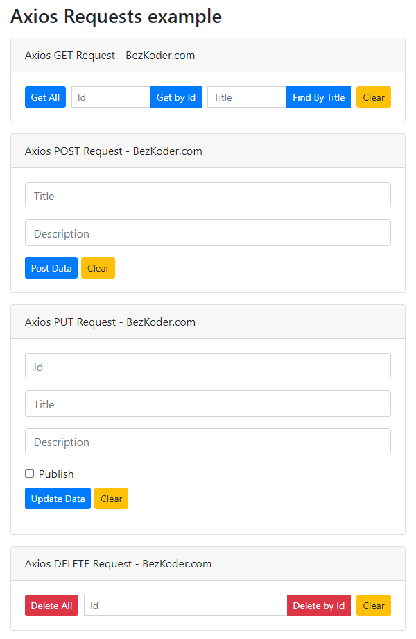

https://www.bezkoder.com/axios-request/


Axios is a promise-based HTTP Client Javascript library for Node.js and Browser. In this tutorial, we will create examples that use Axios to make Get/Post/Put/Delete request. The final section shows a simple Axios HTTP Client to interact with Rest API.


# 1. Introduction

## Axios feature

Axios can run in the Node.js and Browser with the same codebase.
– On the server-side it uses the native Node.js `http` module
– On the client-side (browser) it uses `XMLHttpRequests`

Additionally, there are important features that you should know:

- Supports the Promise API
- Intercept request and response ([Axios Interceptors tutorial](https://www.bezkoder.com/axios-interceptors-refresh-token/))
- Transform request and response data
- Cancel requests
- Automatic transforms for JSON data
- Client side support for protecting against XSRF

(from https://github.com/axios/axios#features)


## Install Axios

用npm 或者 yarn

# 2. Axios basics

## Axios response object schema

The response for a Axios request (后端服务器发来的response) contains: 6要素

- `data`: parsed response body provided by the server
- `status`: HTTP status code
- `statusText`: HTTP status message
- `headers`: HTTP headers (lower case)
- `config`: the request config that was provided to `axios`
- `request`: the last client request instance that generated this response


e.g.

```json
{
  // data -------------------
  "data": {
    "id": 1,
    "title": "Axios Request",
    "description": "Tut#1 Description",
    "published": true
  },
  // status ----------------
  "status": 200,
  // statusText ------------
  "statusText": "OK",
  // headers
  "headers": {
    "content-length": "162",
    "content-type": "application/json; charset=utf-8"
  },
  // config ----------------
  "config": {
    "url": "/tutorials/1",
    "method": "get",
    "headers": {
      "Accept": "application/json, text/plain, */*"
    },
    "baseURL": "http://localhost:8080/api",
    "transformRequest": [
      null
    ],
    "transformResponse": [
      null
    ],
    "timeout": 0,
    "xsrfCookieName": "XSRF-TOKEN",
    "xsrfHeaderName": "X-XSRF-TOKEN",
    "maxContentLength": -1,
    "maxBodyLength": -1
  }
  // ------------------------------
}
```


### Axios response body

Axios Response Object has `data` field that contains the parsed response body.
We can use `then` or `await` to receive the response body as follows:

```js
// 方式一: 用 then
axios.get('/bezkoder.com/tutorials')
  .then(function (response) {
    console.log(response.data);
  });

// 方式二: 用 await
const { data } = await axios.get(url);
```


## Axios error handling

We use `catch()` for handling errors.

```js
axios.get('/bezkoder.com/tutorials')
  .then(...)
  .catch(function (error) {
    if (error.response) { // get response with a status code not in range 2xx
      console.log(error.response.data);
      console.log(error.response.status);
      console.log(error.response.headers);
    } else if (error.request) { // no response
      console.log(error.request);
      // instance of XMLHttpRequest in the browser
      // instance ofhttp.ClientRequest in node.js
    } else { // Something wrong in setting up the request
      console.log('Error', error.message);
    }
    console.log(error.config);
  });	// end of catch()
```


### Axios error handling with async-await

If you want to use async-await, just wrap the axios call with try/catch block.

```js
async function getTutorial() {
  try {
    const response = await axios.get('/bezkoder.com/tutorials');
    console.log(response);
  } catch (error) {
    if (error.response) { // get response with a status code not in range 2xx
      console.log(error.response.data);
      console.log(error.response.status);
      console.log(error.response.headers);
    } else if (error.request) { // no response
      console.log(error.request);
    } else { // Something wrong in setting up the request
      console.log('Error', error.message);
    }
    console.log(error.config);
  }
}
```


# 3. Axios CRUD

一般有两种方式: 

+ then( )
+ Async/await : 用的更多, 最后给的例子里用的都是这种方式


```js
// 以下API一般都遵守下面的格式 arg1: url, arg2: body, arg3: {
axios.CRUD(url, 										// arg1
           {body}, 									// arg2
           {headers:{}, params: {}}	// arg3
)
```

这些就跟在postman里写API doc一样的, 指明什么方法, 然后指明body 或者params headers之类的


## 3.1 GET request

方式一: then

```js
axios.get('/bezkoder.com/tutorials')
  .then(function (response) {
    console.log(response);
  })
  .catch(function (error) {
    console.log(error);
  })
  .then(function () {
    // always executed
});
```

方式二: Async/await

```js
async function getTutorial() {
  try {
    const response = await axios.get('/bezkoder.com/tutorials');
    console.log(response);
  } catch (error) {
    console.error(error);
  }
}
```


### GET with param

You can use the `params` config option to set query string params.

```js
axios.get(
  '/bezkoder.com/tutorials',
  {
    params: {
      title: 'ios'
    }
  }
);

// this is equivalent
axios.get('/tutorials?title=ios');
```


### GET with header

To send Axios GET request with Headers, we pass an option object with `headers` property.

```js
axios.get(
  '/bezkoder.com/tutorials',
  // get()的第二个arg是一个obj, 里面成员为heaer{}
  {
    headers: {
      'x-access-token': 'token-value'
    }
  }
);
```


### GET with header and param

We can merge `params` and `headers` in a Axios GET request like this.

```js
axios.get(
  '/bezkoder.com/tutorials',
   // get()的第二个arg是一个obj, 里面成员为heaer{}, params{} 
  {
    params: {
      title: 'ios'
    },
    headers: {
      'x-access-token': 'token-value'
    }
  }
);
```


## 3.2 POST request

### POST with body

You can perform an Axios POST object request with `body` as second parameter.

```js
axios.post(
  '/bezkoder.com/tutorials',
   // post() 第二个arg为obj, 即body
  {
    title: title,
    description: description,
  }
);
```


### POST with header

To send Axios POST request with Headers, we pass an option object with `headers` property right after the `body`.

```js
await axios.post(
  '/bezkoder.com/tutorials',
  // post() 第二个arg为obj, 即body
  {
    title: title,
    description: description,
  },
  // post() 第三个arg为obj, 成员为headers{}
  {
    headers: {
      "x-access-token": "token-value",
    },
  }
);
```


## 3.3 PUT request

You can perform an Axios PUT json object request with `body` as second parameter.

```js
axios.put(
  '/bezkoder.com/tutorials/42',
  // put()的第二个arg为body obj
  {
    title: title,
    description: description,
    published: true,
  }
);
```


### PUT with header

To send Axios PUT request with Headers, we pass an option object with `headers` property right after the `body`.

```js
axios.put(
  '/bezkoder.com/tutorials/42',
  // put()的第二个arg为body obj
  {
    title: title,
    description: description,
    published: true,
  },
  // put()的第三个arg为obj, 成员由headers{}
  {
    headers: {
      "x-access-token": "token-value",
    },
  }
);
```


## 3.4 DELETE request

```js
axios.delete('/bezkoder.com/tutorials/42');
```


### DELETE with header

To send Axios DELETE request with Headers, we pass an option object with `headers` property.

```js
axios.delete(
  '/bezkoder.com/tutorials/42',
  // delete()的第二个arg为obj, 成员有headers{}
  {
    headers: {
      "x-access-token": "token-value",
    },
  }
);
```


## 3.5 Create axios instance

We can create a new instance of axios using `axios.create(config)` method.

```js
const instance = axios.create({
  baseURL: 'https://bezkoder.com/api/',
  timeout: 2000,
  headers: {'X-Custom-Header': 'bezkoder'}
});
```


# 4. :gem: Axios request example with RESTful API

We will build a HTTP Client to make CRUD requests to Rest API in that:

- Axios GET request: get all Tutorials, get Tutorial by Id, find Tutorial by title
- Axios POST request: create new Tutorial
- Axios PUT request: update an existing Tutorial
- Axios DELETE request: delete a Tutorial, delete all Tutorials





This Axios Client works with the following Web API:

| Methods | Urls                           | Actions                                           |
| :------ | :----------------------------- | :------------------------------------------------ |
| POST    | /api/tutorials                 | create new Tutorial                               |
| GET     | /api/tutorials                 | retrieve all Tutorials                            |
| GET     | /api/tutorials/:id             | retrieve a Tutorial by `:id`                      |
| PUT     | /api/tutorials/:id             | update a Tutorial by `:id`                        |
| DELETE  | /api/tutorials/:id             | delete a Tutorial by `:id`                        |
| DELETE  | /api/tutorials                 | delete all Tutorials                              |
| GET     | /api/tutorials?title=[keyword] | find all Tutorials which title contains `keyword` |


:bangbang: build a server by yourself


以下见博客里的图片, 即在前端输入参数的例子

## 4.1 C

Create a Tutorial using axios POST request:

## 4.2 R

Retrieve all Tutorials using axios GET request:

Retrieve a Tutorial by Id using axios GET request:

Find Tutorials by title using axios GET request with params:

## 4.3 U

Update a Tutorial using axios PUT request:

## 4.4 D

Delete Tutorial using axios DELETE request:


# Source Code

*index.html*

```html
<!DOCTYPE html>
<html>
  <head>
    <meta charset="utf-8" />
    <meta name="viewport" content="width=device-width, initial-scale=1" />
    <title>Axios Requests example</title>
    <link
      rel="stylesheet"
      href="https://cdn.jsdelivr.net/npm/bootstrap@4.6.0/dist/css/bootstrap.min.css"
    />
  </head>
  <body>
    <div class="container my-3" style="max-width: 600px">
      <h3>Axios Requests example</h3>

      <div class="card mt-3">
        <div class="card-header">Axios GET Request - BezKoder.com</div>
        <div class="card-body">
          <div class="input-group input-group-sm">
            <button class="btn btn-sm btn-primary" onclick="getAllData()">Get All</button>

            <input type="text" id="get-id" class="form-control ml-2" placeholder="Id">
            <div class="input-group-append">
              <button class="btn btn-sm btn-primary" onclick="getDataById()">Get by Id</button>
            </div>

            <input type="text" id="get-title" class="form-control ml-2" placeholder="Title">
            <div class="input-group-append">
              <button class="btn btn-sm btn-primary" onclick="getDataByTitle()">Find By Title</button>
            </div>

            <button class="btn btn-sm btn-warning ml-2" onclick="clearGetOutput()">Clear</button>
          </div>   
          
          <div id="getResult"></div>
        </div>
      </div>

      <div class="card mt-3">
        <div class="card-header">Axios POST Request - BezKoder.com</div>
        <div class="card-body">
          <div class="form-group">
            <input type="text" class="form-control" id="post-title" placeholder="Title">
          </div>
          <div class="form-group">
            <input type="text" class="form-control" id="post-description" placeholder="Description">
          </div>
          <button class="btn btn-sm btn-primary" onclick="postData()">Post Data</button>
          <button class="btn btn-sm btn-warning" onclick="clearPostOutput()">Clear</button>

          <div id="postResult"></div>
        </div>
      </div>

      <div class="card mt-3">
        <div class="card-header">Axios PUT Request - BezKoder.com</div>
        <div class="card-body">
          <div class="form-group">
            <input type="text" class="form-control" id="put-id" placeholder="Id">
          </div>
          <div class="form-group">
            <input type="text" class="form-control" id="put-title" placeholder="Title">
          </div>
          <div class="form-group">
            <input type="text" class="form-control" id="put-description" placeholder="Description">
          </div>
          <div class="form-check">
            <input type="checkbox" class="form-check-input" id="put-published">
            <label class="form-check-label" for="put-published">Publish</label>
          </div>
          <div class="form-group mt-2">
            <button class="btn btn-sm btn-primary" onclick="putData()">Update Data</button>
            <button class="btn btn-sm btn-warning" onclick="clearPutOutput()">Clear</button>
          </div>

          <div id="putResult"></div>
        </div>
      </div>

      <div class="card mt-3">
        <div class="card-header">Axios DELETE Request - BezKoder.com</div>
        <div class="card-body">
          <div class="input-group input-group-sm">
            <button class="btn btn-sm btn-danger" onclick="deleteAllData()">Delete All</button>

            <input type="text" id="delete-id" class="form-control ml-2" placeholder="Id">
            <div class="input-group-append">
              <button class="btn btn-sm btn-danger" onclick="deleteDataById()">Delete by Id</button>
            </div>

            <button class="btn btn-sm btn-warning ml-2" onclick="clearDeleteOutput()">Clear</button>
          </div>    
          
          <div id="deleteResult"></div>      
        </div>
      </div>
    </div>

    <script src="https://unpkg.com/axios/dist/axios.min.js"></script>

    <script src="main.js"></script>
  </body>
</html>
```


main.js

```js
const instance = axios.create({
  baseURL: "http://localhost:8080/api",
  headers: {
    "Content-Type": "application/json",
  },
});

function htmlizeResponse(res) {
  return `<div class="alert alert-secondary mt-2" role="alert"><pre>` + JSON.stringify(res, null, 2) + "</pre></div>";
}

async function getAllData() {
  let resultElement = document.getElementById("getResult");
  resultElement.innerHTML = "";

  try {
    const res = await instance.get("/tutorials");

    const result = {
      status: res.status + "-" + res.statusText,
      headers: res.headers,
      data: res.data,
    };

    resultElement.innerHTML = htmlizeResponse(result);
  } catch (err) {
    resultElement.innerHTML = htmlizeResponse(err);
  }
}

async function getDataById() {
  let resultElement = document.getElementById("getResult");
  resultElement.innerHTML = "";

  const id = document.getElementById("get-id").value;

  if (id) {
    try {
      const res = await instance.get(`/tutorials/${id}`);

      const result = {
        status: res.status + "-" + res.statusText,
        headers: res.headers,
        data: res.data,
      };

      resultElement.innerHTML = htmlizeResponse(result);
    } catch (err) {
      resultElement.innerHTML = htmlizeResponse(err);
    }
  }
}

async function getDataByTitle() {
  let resultElement = document.getElementById("getResult");
  resultElement.innerHTML = "";

  const title = document.getElementById("get-title").value;

  if (title) {
    try {
      // const res = await instance.get(`/tutorials?title=${title}`);
      const res = await instance.get("/tutorials", {
        params: {
          title: title
        }
      });

      const result = {
        status: res.status + "-" + res.statusText,
        headers: res.headers,
        data: res.data,
      };

      resultElement.innerHTML = htmlizeResponse(result);
    } catch (err) {
      resultElement.innerHTML = htmlizeResponse(err);
    }
  }
}

async function postData() {
  let resultElement = document.getElementById("postResult");
  resultElement.innerHTML = "";

  const title = document.getElementById("post-title").value;
  const description = document.getElementById("post-description").value;

  try {
    const res = await instance.post("/tutorials", {
      title: title,
      description: description,
    });

    const result = {
      status: res.status + "-" + res.statusText,
      headers: res.headers,
      data: res.data,
    };

    resultElement.innerHTML = htmlizeResponse(result);
  } catch (err) {
    resultElement.innerHTML = htmlizeResponse(err);
  }
}

async function putData() {
  let resultElement = document.getElementById("putResult");
  resultElement.innerHTML = "";

  const id = document.getElementById("put-id").value;
  const title = document.getElementById("put-title").value;
  const description = document.getElementById("put-description").value;
  const published = document.getElementById("put-published").checked;

  try {
    const res = await instance.put(`/tutorials/${id}`, {
      title: title,
      description: description,
      published: published
    });

    const result = {
      status: res.status + "-" + res.statusText,
      headers: res.headers,
      data: res.data,
    };

    resultElement.innerHTML = htmlizeResponse(result);
  } catch (err) {
    resultElement.innerHTML = htmlizeResponse(err);
  }
}

async function deleteAllData() {
  let resultElement = document.getElementById("deleteResult");
  resultElement.innerHTML = "";

  try {
    const res = await instance.delete("/tutorials");

    const result = {
      status: res.status + "-" + res.statusText,
      headers: res.headers,
      data: res.data,
    };

    resultElement.innerHTML = htmlizeResponse(result);
  } catch (err) {
    resultElement.innerHTML = htmlizeResponse(err);
  }
}

async function deleteDataById() {
  let resultElement = document.getElementById("deleteResult");
  resultElement.innerHTML = "";

  const id = document.getElementById("delete-id").value;

  try {
    const res = await instance.delete(`/tutorials/${id}`);

    const result = {
      status: res.status + "-" + res.statusText,
      headers: res.headers,
      data: res.data,
    };

    resultElement.innerHTML = htmlizeResponse(result);
  } catch (err) {
    resultElement.innerHTML = htmlizeResponse(err);
  }
}

function clearGetOutput() {
  document.getElementById("getResult").innerHTML = "";
}

function clearPostOutput() {
  document.getElementById("postResult").innerHTML = "";
}

function clearPutOutput() {
  document.getElementById("putResult").innerHTML = "";
}

function clearDeleteOutput() {
  document.getElementById("deleteResult").innerHTML = "";
}
```

