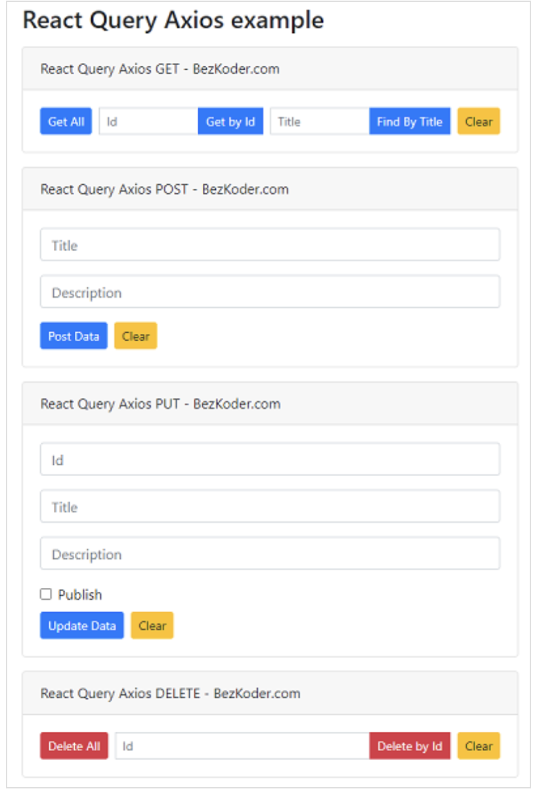

https://www.bezkoder.com/react-axios-example/

[Axios](https://www.npmjs.com/package/axios) is a promise-based HTTP Client Javascript library for Node.js and Browser. In this tutorial, we will create React example that use Axios to make Get/Post/Put/Delete request with Rest API and JSON data in a React functional component (with Hooks).

# React Axios example Overview

We will build a React Client with React Query and Axios library to make CRUD requests to Rest API in that:

- React Query Axios GET request: get all Tutorials, get Tutorial by Id, find Tutorial by title
- React Query Axios POST request: create new Tutorial
- React Query Axios PUT request: update an existing Tutorial
- React Query Axios DELETE request: delete a Tutorial, delete all Tutorials

This React Query Axios Client works with the following Web API:

| Methods | Urls                           | Actions                                           |
| :------ | :----------------------------- | :------------------------------------------------ |
| POST    | /api/tutorials                 | create new Tutorial                               |
| GET     | /api/tutorials                 | retrieve all Tutorials                            |
| GET     | /api/tutorials/:id             | retrieve a Tutorial by `:id`                      |
| PUT     | /api/tutorials/:id             | update a Tutorial by `:id`                        |
| DELETE  | /api/tutorials/:id             | delete a Tutorial by `:id`                        |
| DELETE  | /api/tutorials                 | delete all Tutorials                              |
| GET     | /api/tutorials?title=[keyword] | find all Tutorials which title contains `keyword` |

# How to import Axios in React

There are 2 ways to import Axios into React Application:

+ Using CDN: 不展示了
+ Installing *axios* module: using npm or yarn 

# Create Axios instance in React

# CRUD

## React Axios Get JSON data

## React Axios Post

## React Axios Put

## React Axios Delete

# Conclusion