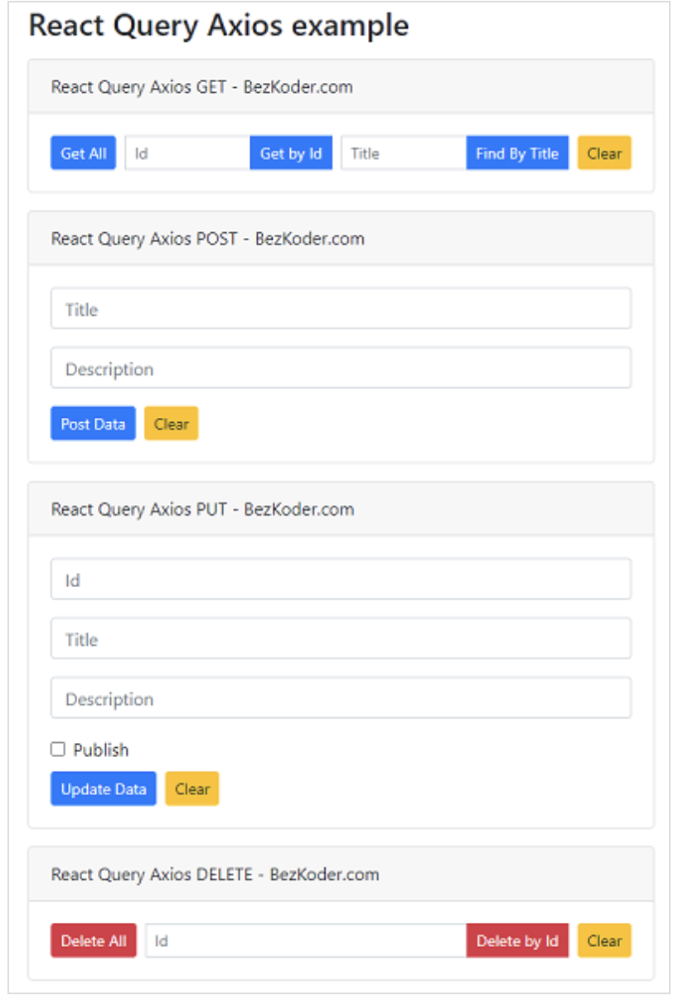

https://www.bezkoder.com/react-query-axios/

用react query with axios 做CRUD

# React Query overview

Most state management libraries (including Redux) are good for working with client state, but not for server state. It’s because server state is persisted remotely in a location the client side cannot control, it can become outdate in our applications and we need to make asynchronous APIs for fetching and updating.

React Query is one of the best libraries for managing server state. It helps us fetch, cache, synchronize and update data without touching any global state.

React Query helps us:

- remove complicated and misunderstood code and replace with several React Query logic
- easier to maintain and build new features without worrying about wiring up new server state data sources
- make our application feel faster and more responsive
- save bandwidth and increase memory performance

# React Query and Axios example

We will build a React Client with React Query and Axios library to make CRUD requests to Rest API in that:

- React Query Axios GET request: get all Tutorials, get Tutorial by Id, find Tutorial by title
- React Query Axios POST request: create new Tutorial
- React Query Axios PUT request: update an existing Tutorial
- React Query Axios DELETE request: delete a Tutorial, delete all Tutorials

This React Query Axios Client works with the following Web API:

| Methods | Urls                           | Actions                                           |
| :------ | :----------------------------- | :------------------------------------------------ |
| POST    | /api/tutorials                 | create new Tutorial                               |
| GET     | /api/tutorials                 | retrieve all Tutorials                            |
| GET     | /api/tutorials/:id             | retrieve a Tutorial by `:id`                      |
| PUT     | /api/tutorials/:id             | update a Tutorial by `:id`                        |
| DELETE  | /api/tutorials/:id             | delete a Tutorial by `:id`                        |
| DELETE  | /api/tutorials                 | delete all Tutorials                              |
| GET     | /api/tutorials?title=[keyword] | find all Tutorials which title contains `keyword` |

# Setup React Query and Axios

## React Query

## Axios

# 实现CRUD

## React Query Axios GET

## React Query Axios POST

## React Query Axios PUT

## React Query Axios DELETE

其他类似的教程
https://www.bezkoder.com/react-hooks-crud-axios-api/