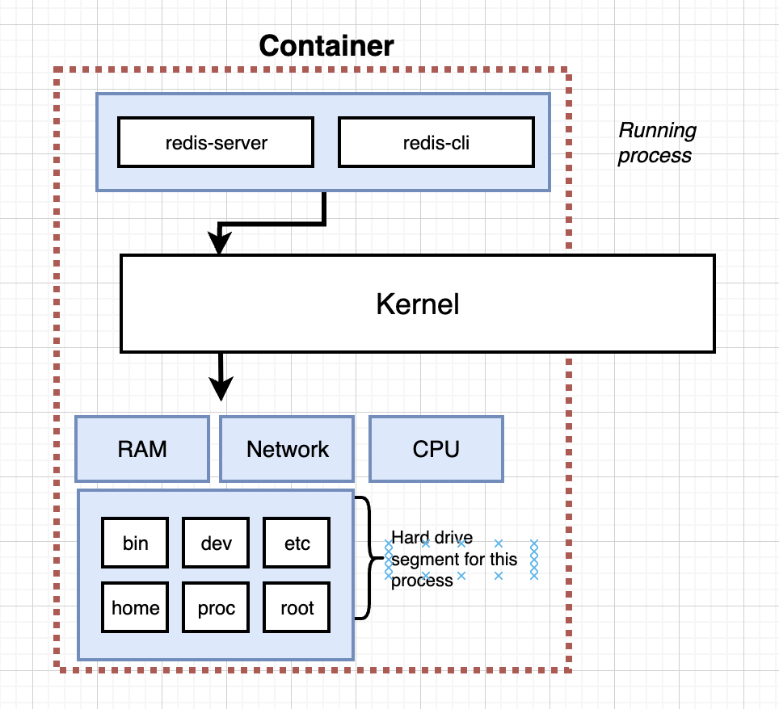
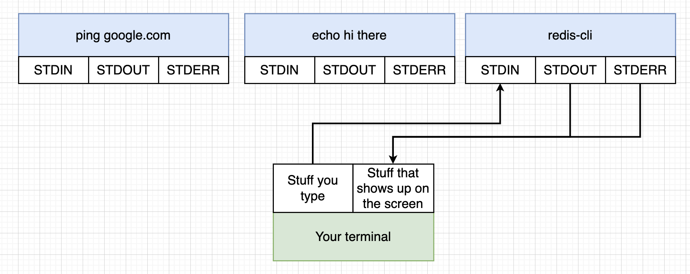

C2 Manipulating Containers uising docker client


# Key takeaways


```js
docker run <container id>						// run default command
docker run <container id> <command>	// override default command

docker ps
docker ps --all

// container lifecycle
docker create <image name>
docker start <container id>

docker logs		// retrive logs

docker system prune

docker stop
docker kill

// 
docker exec -it <container id> <command>  // run command inside a running container
docker exec -it <container id> sh					// enter the container
```


# Hands-on

## `docker run`

### docker run in detail

```js
docker run <iamge name>  // try to create and run a image instance - container
```

what's behind the scene of running it


### Overriding default command

P13

```js
docker run <iamge name> <command>
```


e.g.

```js
(base) ➜  ~ docker run busybox echo hi there
hi there
```


```js
(base) ➜  ~ docker run busybox ls
bin
dev
etc
home
lib
lib64
proc
root
sys
tmp
usr
var
```

you see a lot of folders, they are coming from the file system snapshot in busybox image

+ but if you run `docker run hello-world ls`, it will pops error as hello-world image's file system snapshot has no `ls` command program 

what behind the scene is: 

+ first loaded the file system snapshot to your disk `docker create <image name>`
+ then run the 'startup command' in your running process `docker start <container id>`


## `docker ps`

```js
// firstly start a long-running docker instance
docker run busybox ping google.com

// then in another terminal run below to check all docker container running
docker ps
```


```js
// run below to check all container created 
docker ps --all
```


## Container lifecycle

container 的CRUD

```js
docker run = docker create + docker start
```

```js
docker create <image name>
```

```js
docker start <container id>
```


e.g.

```js
docker create hello-world
<container-id> // returned here

docker start -a <container-id>		// -a means watch for this container's output and print it in terminal, if no '-a' in this command container's output will not be displayed in terminal
```


restarting stopped container

```js
(base) ➜  ~ docker run busybox echo hi there
hi there

(base) ➜  ~ docker ps --all
CONTAINER ID   IMAGE     COMMAND           CREATED          STATUS                      PORTS     NAMES
21095999b08d   busybox   "echo hi there"   15 seconds ago   Exited (0) 14 seconds ago             flamboyant_galileo

(base) ➜  ~ docker start -a 21095999b08d v   // this re-issue the startup command which restart the container
hi there
 
```

remove stopped containers

```js
(base) ➜  ~ docker system prune
WARNING! This will remove:
  - all stopped containers
  - all networks not used by at least one container
  - all dangling images
  - all dangling build cache

Are you sure you want to continue? [y/N] 
```


### `docker logs`

retrive logs

+ not running container again but just retrive logs

```js
(base) ➜  ~ docker create busybox echo hi there
dda0062b60a5d0db85be941e9258d95bd2b8efdcc97109e652f1d486d71ae68e
(base) ➜  ~ docker start dda0062b60a5d0db85be941e9258d95bd2b8efdcc97109e652f1d486d71ae68e
dda0062b60a5d0db85be941e9258d95bd2b8efdcc97109e652f1d486d71ae68e
(base) ➜  ~ docker logs dda0062b60a5d0db85be941e9258d95bd2b8efdcc97109e652f1d486d71ae68e
hi there

```


### `docker stop`

stopping a running container 

```js
docker stop <container id>		// give some grace time for the container to stop
// or   
docker kill <container id>		// stop the container immediately
```


## `docker exec`

P20-22

Executing command in running container

```js
docker exec -it <container id> <command>
```


e.g.

in a terminal create and start a container for redis:

```js
docker run redis
```

in another terminal, run: 

```js
(base) ➜  ~ docker exec -it 2bf272ab82e7 redis-cli
127.0.0.1:6379> set myvalue 5
OK
127.0.0.1:6379> get myvalue
"5"
127.0.0.1:6379> 
```



IT flag's role

P22

```js
-it // allows us to provide input into the container

-i -t // actually a combination of -i -t
// -i allows terminal's input going into the STDIN for the container
// -t make the input and output format prettier in terminal
```


every container has 3 'port' to outside

+ STDIN: standard in
+ STDOUT: standard out
+ STDERR: standard error




entering the docker container

+ so that you don't have to run `docker exec` over and over again

getting a command prompt in a container 

```js
docker exec -it <container id> sh		// again 'sh' is an additional command 
```


starting with a shell

```js
docker run -it busybox sh
```


container isolation

just demonstrate if two containers not connected, they do not share their file system