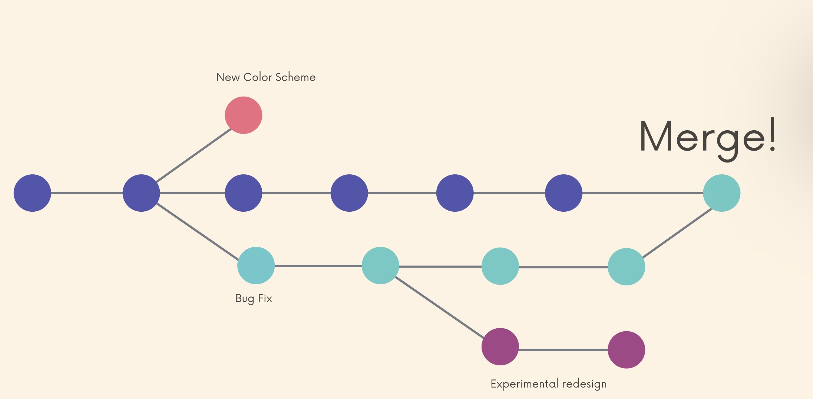

Working with Branches


## Abstract

一些git的get指令

```js
git log
// 展示截止本branch最新更新的commit history: 可以显示branch reference指向哪个commit, 以及HEAD指向哪个branch reference
// 只有具有merge 关系的branch相互在log中才能看到对方

git status
// 展示本branch的status


```


## 1. Introducing Branches

Every commit has a unique hash (identifier), each commit references at least one parent commit 


In real large project, we often work in multiple contexts => need branching for different contexts. It we make changes on one branch, they do not impact the other branches (unless we merge the changes)




### The Master Branch 

"Master" is just the default branch name, there is nothing special about it

In 2020, Github renamed the default branch from `master` to `main`


### What is HEAD?


Run `git log`

```terminal
commit 856f44e91769a4c9e486b82854d202634259bccd (HEAD -> main, origin/main, origin/HEAD)
Author: XUeshuo Li <spoonlee24k@gmail.com>
Date:   Tue Jul 25 17:29:58 2023 +1000

    1st commit

commit 0af60e0cdc43b328dec5d0cff784968bce0ad270
Author: Shawn <103415723+Additivemenu@users.noreply.github.com>
Date:   Tue Jul 25 17:25:22 2023 +1000

    Initial commit
```

We often encounter term "HEAD" in Git


HEAD is simply a pointer that refers to the current "location" in your repository. It points to a particular branch reference. So far, HEAD always points to the latest commit you made on the master branch by default, but soon we'll see that we can move around and HEAD will change! 


branch reference指向 commit history 中的 node, 而 HEAD指向 branch reference

(这里PPT里有一组动画)


## 2. Git command on branch

### Viewing branch

```terminal
git branch
```


### Create & Switch branch

```js
git branch <branch-name>
// make a new branch based upon the current HEAD
// note this just create a new branch but not swich you to that branch
```

```js
git switch <branch-name>
```

PPT 有图形化`git log` 结果 的展示


More practice with branching

以下`git log`结果, 可看到

+ branch reference指向哪个commit
+ HEAD指向哪个branch reference

```console
commit 03fce397288c1fe47fc4bb8e0583ff354e520636 (HEAD -> oldies, japanSong)
Author: XUeshuo Li <spoonlee24k@gmail.com>
Date:   Wed Jul 26 09:25:18 2023 +1000

    add new song: see you again

commit 856f44e91769a4c9e486b82854d202634259bccd (origin/main, origin/HEAD, main)
Author: XUeshuo Li <spoonlee24k@gmail.com>
Date:   Tue Jul 25 17:29:58 2023 +1000

    1st commit

commit 0af60e0cdc43b328dec5d0cff784968bce0ad270
Author: Shawn <103415723+Additivemenu@users.noreply.github.com>
Date:   Tue Jul 25 17:25:22 2023 +1000

    Initial commit
```


#### Another option: git checkout

```js
git checkout <branch-name>
```

historically, we used `git checkout <branch-name>` to switch branches. This still works. The checkout command does a milllion additional things


```js
git switch -c <branch-name>
  // create and switch to that branch
```


#### :bangbang: switching brnaches with unstaged changes？

49

如果在一个branch做了修改, 但是却没有将其commit, 此时想switch到另一个branch, 会遇到如下提示:

```terminal
(base) ➜  play-with-git git:(oldies) ✗ git switch japanSong 
error: Your local changes to the following files would be overwritten by checkout:
        README.md
Please commit your changes or stash them before you switch branches.
Aborting
```


so a good practice: remember to commit or stash before you switch branch


### Delete & Renaming Branches

50

一般也用不到Delete


```js
git branch -m <new-branch-name>
  // rename the branch that HEAD points at
```


## 3. How Git stores HEAD & Branches

51


all in `.git` folder, don't touch it!


## 4. Branching Exercise

52

https://plum-poppy-0ea.notion.site/Branching-Exercise-b5460c881d56400cb046357d9a430bf8


