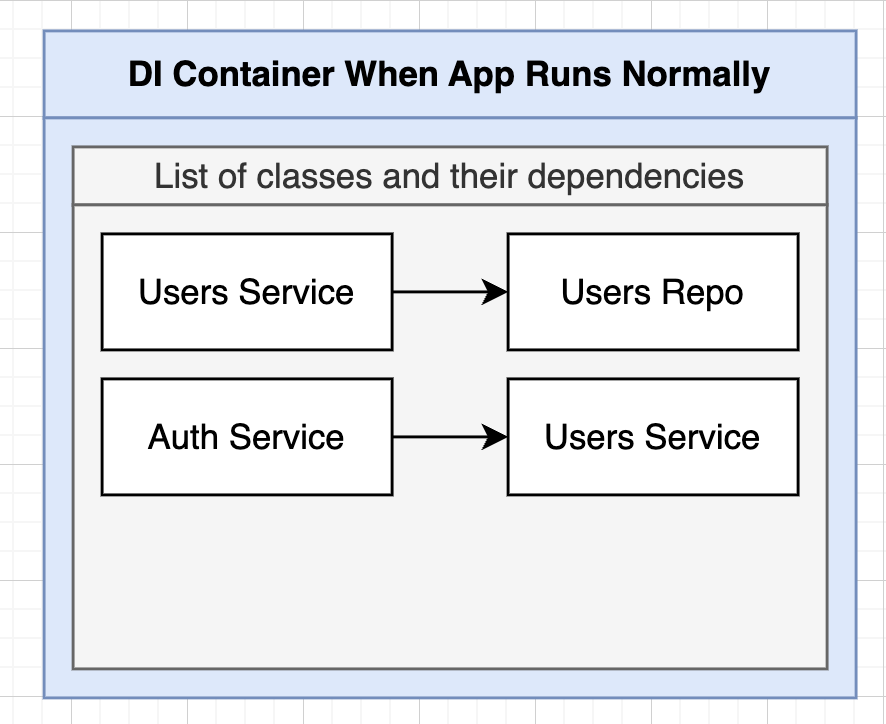
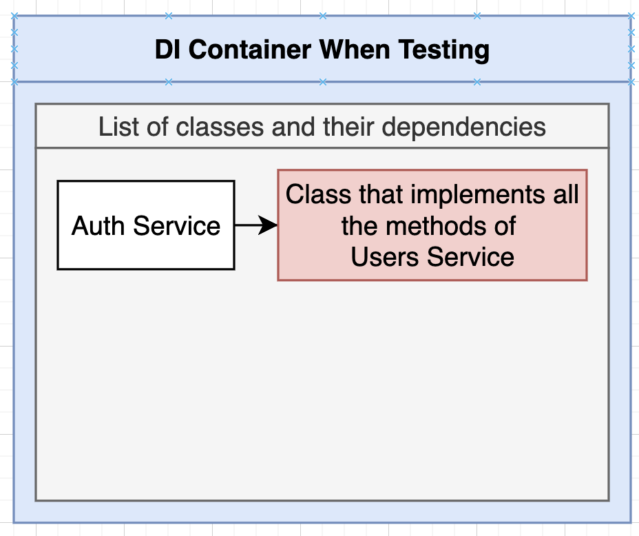
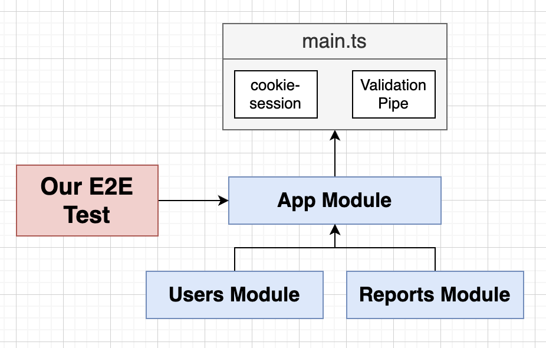
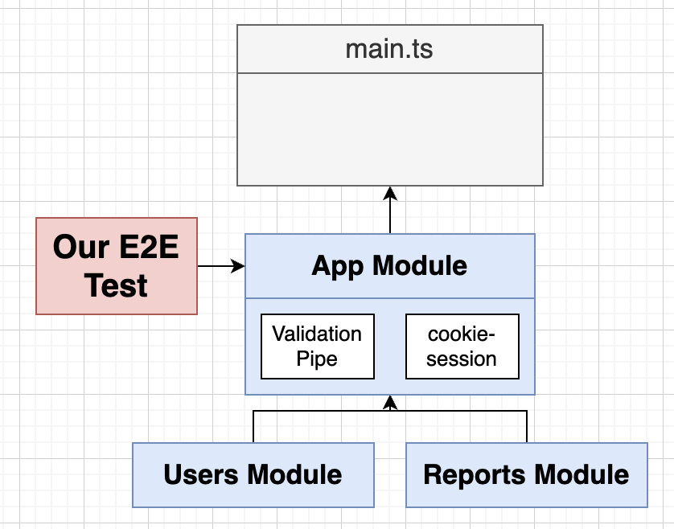

1


Continuing the app built in last section of course


# Key takeaways

3 steps for a unit test:

```ts
describe('UsersService', () => {
	// 1. declare dependency variables
  
  // 2. setup test module
  
  // 3. test cases
});
```


most of time, we do unit test on service. Unit testing on controller is too easy!

> :bangbang: ​When setting up test module, Jest might not understand the root path alias, you need to config it


for integration(e2e) test, we would like to seperate dev and test env, and we would also like to config app in app.module, to fit the environment 


# Unit Testing

C12

in nest, most of time we are testing services over controllers


## unit testing a service

Let's say we want to perform unit test on `AuthServic` class, 

At normal runtime, AuthService has dependencies on `UserService` which in turn depends on `UserRepo`



To avoid introducing dependencies, we use mask those dependencies as mock class 




> unit test file is usually placed inside src/ folder, along with your normal app file, but with extension `.spec.ts`
>
> To run the test file
>
> ```ts
> npm run test:watch		//run all the test files  
> 
>  "test:watch": "jest --watch --maxWorkers=1",  // by default in package.json
> 
> // press p, then type the file name regex pattern to run a specific unit test file
> 
> ```
>
> 


in user folder, create file user.service.spec.ts:

P91-94

```ts
import { Test } from '@nestjs/testing';
import { AuthService } from './auth.server';
import { UsersService } from './users.service';
import { User } from './user.entity';

it('can create an instance of auth service', async () => {
  // ! construct a fake copy of the user service with some fake methods
  // use TypeScript ensure our fake UserService has the same shape as the real one
  const fakeUserService: Partial<UsersService> = {
    // as find(), create() are async methods in real UserService, so we need to return a promise
    find: () => Promise.resolve([]),
    create: (email: string, password: string) =>
      Promise.resolve({ id: 1, email, password } as User),
  };

  // wire up the testing DI container
  const module = await Test.createTestingModule({
    providers: [
      AuthService,
      { provide: UsersService, useValue: fakeUserService }, // ! use mock dependency: tell nest to replace the real UserService with the fake one we just constructed
    ],
  }).compile();

  const service = module.get(AuthService); // cause DI container to create a new AuthService instance

  expect(service).toBeDefined();
});
```


a little bit code layout improvement: 

P95

```ts
import { Test } from '@nestjs/testing';
import { AuthService } from './auth.server';
import { UsersService } from './users.service';
import { User } from './user.entity';

describe('AuthService', () => {
  let service: AuthService;		// making the unit to be tested available in good scope

  beforeEach(async () => {
    // ! construct a fake copy of the user service with some fake methods
    // use TypeScript ensure our fake UserService has the same shape as the real one
    const fakeUserService: Partial<UsersService> = {
      // as find(), create() are async methods in real UserService, so we need to return a promise
      find: () => Promise.resolve([]),
      create: (email: string, password: string) =>
        Promise.resolve({ id: 1, email, password } as User),
    };

    // wire up the testing DI container
    const module = await Test.createTestingModule({
      providers: [
        AuthService,
        { provide: UsersService, useValue: fakeUserService }, // ! use mock dependency: tell nest to replace the real UserService with the fake one we just constructed
      ],
    }).compile();

    service = module.get(AuthService); // cause DI container to create a new AuthService instance
  });

  it('can create an instance of auth service', async () => {
    expect(service).toBeDefined();
  });
  
});

```


now let's add some test cases for unit testing `AuthService`

---

test case for AuthService's signup 

P96-105

```ts
import { Test } from '@nestjs/testing';
import { AuthService } from './auth.server';
import { UsersService } from './users.service';
import { User } from './user.entity';

import { BadRequestException, NotFoundException } from '@nestjs/common';

describe('AuthService', () => {
  let service: AuthService; // the unit under test
  let fakeUserService: Partial<UsersService>; // fake copy of the user service

  // beforeEach() is a hook that runs before each test case: we wire up the testing DI container
  beforeEach(async () => {
    // ! construct a fake copy of the user service (the dependency in the unit under test) with some fake methods
    // use TypeScript ensure our fake UserService has the same shape as the real one
    const users: User[] = []; // this is a fake database
    fakeUserService = {
      // as find(), create() are async methods in real UserService, so we need to return a promise
      find: (email: string) => {
        const filteredUsers = users.filter((user) => user.email === email);
        return Promise.resolve(filteredUsers);
      },
      create: (email: string, password: string) => {
        const user = {
          id: Math.floor(Math.random() * 99999),
          email,
          password,
        } as User;
        users.push(user);
        return Promise.resolve(user);
      },
    };

    // wire up the testing DI container
    const module = await Test.createTestingModule({
      providers: [
        AuthService,
        { provide: UsersService, useValue: fakeUserService }, // ! use mock dependency: tell nest to replace the real UserService with the fake one we just constructed
      ],
    }).compile();

    service = module.get(AuthService); // cause DI container to create a new AuthService instance
  });

  /**
   * test cases ==============================================
   * first figure out what we want to test: a list of scenarios
   * 1. simulate test function
   * 2. declare expected results
   */

  // test case1
  it('can create an instance of auth service', async () => {
    expect(service).toBeDefined();
  });

  // test case2
  it('creates a new user with a salted and hashed password', async () => {
    const user = await service.signup('asdf@asdf.com', 'asdf'); // simulate a user signing up

    // declare expected results
    expect(user.password).not.toEqual('asdf');
    const [salt, hash] = user.password.split('.');
    expect(salt).toBeDefined();
    expect(hash).toBeDefined();
  });

  // test case3
  it('throws an error if user signs up with email that is in use', async () => {
    await service.signup('asdflkj@asdlfkj.com', 'passdflkj');

    await expect(
      service.signup('asdflkj@asdlfkj.com', 'passdflkj'),
    ).rejects.toThrow(BadRequestException);
  });

  // test case4
  it('throws if signin is called with an unused email', async () => {
    await expect(service.signin('asdf@asdf.com', 'passdword')).rejects.toThrow(
      NotFoundException,
    );
  });

  // test csae5 - till p102
  it('throw if an invalid password is provided', async () => {
    await service.signup('laskk@akga.com', 'password');

    await expect(
      service.signin('laskk@akga.com', 'wrongpassword'),
    ).rejects.toThrow(BadRequestException);
  });

  // test case6
  it('returns a user if correct password is provided', async () => {
    await service.signup('asdf@asdf.com', 'mypassword');
    const user = await service.signin('asdf@asdf.com', 'mypassword');

    expect(user).toBeDefined();
  });

  //
});

```


## unit testing a controller

P106-110

when testing controllers, decorator applied on the route handler is not get tested

user.controller.spec.ts

```ts
import { Test, TestingModule } from '@nestjs/testing';
import { UsersController } from './users.controller';

import { UsersService } from './users.service';
import { AuthService } from './auth.server';
import { User } from './user.entity';
import { NotFoundException } from '@nestjs/common';

describe('UsersController', () => {
  let controller: UsersController; // unit under test
  let fakeUsersService: Partial<UsersService>; // fake dependency
  let fakeAuthService: Partial<AuthService>; // fake dependency

  beforeEach(async () => {
    fakeUsersService = {
      findOne: (id: number) => {
        return Promise.resolve({
          id,
          email: 'asdf@asdf.com',
          password: 'asdf',
        } as User);
      },
      find: (email: string) => {
        return Promise.resolve([{ id: 1, email, password: 'asdf' } as User]);
      },
      // remove: () => {},
      // update: () => {},
    };
    fakeAuthService = {
      // signup: () => {},
      signin: (email: string, password: string) => {
        return Promise.resolve({ id: 1, email, password } as User);
      },
    };

    const module: TestingModule = await Test.createTestingModule({
      controllers: [UsersController],
      providers: [
        { provide: UsersService, useValue: fakeUsersService },
        { provide: AuthService, useValue: fakeAuthService },
      ],
    }).compile();

    controller = module.get<UsersController>(UsersController);
  });

  // test cases ===========================================================================================
  it('should be defined', () => {
    expect(controller).toBeDefined();
  });

  it('findAllUsers - return a list of users with the given email', async () => {
    const users = await controller.findAllUsers('asdf@asdf.com');

    expect(users.length).toEqual(1);
    expect(users[0].email).toEqual('asdf@asdf.com');
  });

  it('findUser - return a single user with the given id', async () => {
    const user = await controller.findUser('1');

    expect(user).toBeDefined();
  });

  it('findUser throws an error if user with the given id is not found', async () => {
    fakeUsersService.findOne = () => null;

    await expect(controller.findUser('1')).rejects.toThrow(NotFoundException);
  });

  it('signin updates session object and return user', async () => {
    const session = { userId: -1 };
    const user = await controller.signin(
      { email: 'asdf@asdf.com', password: 'asdf' },
      session,
    );

    expect(user.id).toEqual(1);
    expect(session.userId).toEqual(1);
  });
});

```


# Integration Test

C13 P111-


## Wire default middleware to app module

integration test files are placed under /test directory

```ts
npm run test:e2e

 "test:e2e": "jest --config ./test/jest-e2e.json"		// in package.json
```

integration test is like simulating the whole request -response process starting from receiving an incoming request

+ so you need to attach middlewares to  app in the test module. (by default, the 2 middleware below are only in src/main.ts)
  +  we could do this using global pipe / global middleware -> more nest -authentic

```ts
// src/main.ts -> in devlopment environment
import { NestFactory } from '@nestjs/core';
import { AppModule } from './app.module';
import { ValidationPipe } from '@nestjs/common';
const cookieSession = require('cookie-session'); // old way of importing

async function bootstrap() {
  const app = await NestFactory.create(AppModule);
	
  // ------------- below middleware needs to be attached to test module app ----------
  app.use(
    cookieSession({
      keys: ['asdfgh'],
    }),
  );

  app.useGlobalPipes(
    new ValidationPipe({
      whitelist: true, // stripe out any other fields that is not defined in the DTO
    }),
  );
  // -----------------------------------------------------------------------------------
  
  await app.listen(3000);
}
bootstrap();
```


by default, the cookie-session middleware and ValidationPipe are configed in main.ts for development. In E2E test, test module cannot found them 



we want to wire them up to App Module as gloabl middleware and global pipe instead so that it work for both test and dev




src/app.module.ts

+ we move `ValidationPipe` and `cookie-session`  from main.ts into app module

```ts
import { MiddlewareConsumer, Module, ValidationPipe } from '@nestjs/common';
import { APP_PIPE } from '@nestjs/core';

import { TypeOrmModule } from '@nestjs/typeorm';
import { AppController } from './app.controller';
import { AppService } from './app.service';
import { UsersModule } from './users/users.module';
import { ReportsModule } from './reports/reports.module';
import { User } from './users/user.entity';
import { Report } from './reports/report.entity';

const cookieSession = require('cookie-session');

@Module({
  // eslint-disable-next-line prettier/prettier
  imports: [
    TypeOrmModule.forRoot({
      type: 'sqlite',
      database: 'db.sqlite',
      entities: [User, Report],
      synchronize: true, // ! only in development mode, serves as the same purpose as database migration (this is a special case in TypeORM, normally you would use migrations in other ORM)
    }),
    UsersModule,
    ReportsModule,
  ],
  controllers: [AppController],
  providers: [
    AppService,
    {
      provide: APP_PIPE,
      useValue: new ValidationPipe({ whitelist: true }), // ! attach a global pipe to the app
    },
  ],
})

export class AppModule {
  configure(consumer: MiddlewareConsumer) {
    // ! attach a global middleware to the app
    consumer
      .apply(
        cookieSession({
          keys: ['asdfgh'],
        }),
      )
      .forRoutes('*');
  }
}

```

src/main.ts

```ts
import { NestFactory } from '@nestjs/core';
import { AppModule } from './app.module';

async function bootstrap() {
  const app = await NestFactory.create(AppModule);
  await app.listen(3000);
}
bootstrap();

```


test/auth-e2e.spec.ts

+ then, we set the e2e test case

```ts
import { Test, TestingModule } from '@nestjs/testing';
import { INestApplication } from '@nestjs/common';
import * as request from 'supertest';
import { AppModule } from './../src/app.module';

describe('Authentication System (e2e)', () => {
  // 1.
  let app: INestApplication;

  // 2.
  beforeEach(async () => {
    const moduleFixture: TestingModule = await Test.createTestingModule({
      imports: [AppModule],
    }).compile();

    app = moduleFixture.createNestApplication();
    await app.init();
  });

  // 3.
  it('handles a signup request', () => {
    // simulating a user signing up process

    const email = 'asdf123@asdf.com';

    return request(app.getHttpServer())
      .post('/auth/signup')
      .send({ email, password: 'asdf' })
      .expect(201)
      .then((res) => {
        const { id, email } = res.body;
        expect(id).toBeDefined();
        expect(email).toEqual(email);
      });
  });
});

```


## seperate test and dev database 

P117 + C14

what we want to do in this part:

+ Dev database for developer to quick manual test
+ Test database for automatic testing, needs to be frequently wiped out every time when starting a new test 

so that we want to sepeate dev and test database


to do this, we want to 

```ts 
    TypeOrmModule.forRoot({
      type: 'sqlite',
      database: 'db.sqlite',			// ******** we want to customize this depending on in dev or test env
      entities: [User, Report],
      synchronize: true, // ! only in development mode, serves as the same purpose as database migration (this is a special case in TypeORM, normally you would use migrations in other ORM)
    }),
    UsersModule,
    ReportsModule,
  ],
```


see implementations below (can actually get instructions from GPT)

---

Add 2 env file under the project root:

```ts
// .env.test
DB_NAME=test.sqlite
```

```ts
// .env.development
DB_NAME=db.sqlite
```


Then wire up the app.module to be able to read env variable from env file

```ts
npm install @nestjs/config
```

add ConfigModule and ConfigService to app.module in the imports: 

```ts
// app.module.ts
import { ConfigModule, ConfigService } from '@nestjs/config';  


imports: [
    ConfigModule.forRoot({
      isGlobal: true, // ! make the config module available globally
      envFilePath: `.env.${process.env.NODE_ENV}`,
    }),
    TypeOrmModule.forRootAsync({
      // use dependency injection to get the ConfigService
      inject: [ConfigService],
      useFactory: (config: ConfigService) => ({
        type: 'sqlite',
        database: config.get<string>('DB_NAME'),
        entities: [User, Report],
        synchronize: true,
      }),
    }),
    UsersModule,
    ReportsModule,
  ],
```


read env variable from different env files 

```ts
npm install cross-env
```

then rewrite the script:

+ `--maxWorkers=1` declares only run 1 test

```ts
  "scripts": {
    "build": "nest build",
    "format": "prettier --write \"src/**/*.ts\" \"test/**/*.ts\"",
    "start": "cross-env NODE_ENV=development nest start",
    "start:dev": "cross-env NODE_ENV=development nest start --watch",
    "start:debug": "cross-env NODE_ENV=development nest start --debug --watch",
    "start:prod": "node dist/main",
    "lint": "eslint \"{src,apps,libs,test}/**/*.ts\" --fix",
    "test": "cross-env NODE_ENV=test jest",
    "test:watch": "cross-env NODE_ENV=test jest --watch --maxWorkers=1",
    "test:cov": "cross-env NODE_ENV=test jest --coverage",
    "test:debug": "cross-env NODE_ENV=test node --inspect-brk -r tsconfig-paths/register -r ts-node/register node_modules/.bin/jest --runInBand",
    "test:e2e": "cross-env NODE_ENV=test jest --config ./test/jest-e2e.json  --maxWorkers=1"
  },
```


then, we want to delete the database before running test 

---

src/jest-e2e.json

```ts
{
  "moduleFileExtensions": ["js", "json", "ts"],
  "rootDir": ".",
  "testEnvironment": "node",
  "testRegex": ".e2e-spec.ts$",
  "transform": {
    "^.+\\.(t|j)s$": "ts-jest"
  },
  "setupFilesAfterEnv": ["<rootDir>/setup.ts"]
}
```

test/setup.ts

```ts
// this gets run before any tests are run
import { rm } from 'fs/promises';
import { join } from 'path';

global.beforeEach(async () => {
  try {
    // ! remove the test database before each test
    await rm(join(__dirname, '..', 'test.sqlite'));
  } catch (e) {}
});

```


at last, our auth.e2e-spec.ts looks like:

---

+ we add 2nd test case

```ts
import { Test, TestingModule } from '@nestjs/testing';
import { INestApplication } from '@nestjs/common';
import * as request from 'supertest';
import { AppModule } from './../src/app.module';

describe('Authentication System (e2e)', () => {
  // 1. variables ==================================================
  let app: INestApplication;

  // 2. setup =======================================================
  beforeEach(async () => {
    const moduleFixture: TestingModule = await Test.createTestingModule({
      imports: [AppModule],
    }).compile();

    app = moduleFixture.createNestApplication();
    await app.init();
  });

  // 3. test cases =================================================
  // test case 1
  it('handles a signup request', () => {
    // simulating a user signing up process

    const email = 'asdf123@asdf.com';

    return request(app.getHttpServer())
      .post('/auth/signup')
      .send({ email, password: 'asdf' })
      .expect(201)
      .then((res) => {
        const { id, email } = res.body;
        expect(id).toBeDefined();
        expect(email).toEqual(email);
      });
  });

  // test case 2
  it('sign up as new user then get the currently logged in user', async () => {
    const email = 'asdf@asdf.com';

    const res = await request(app.getHttpServer())
      .post('/auth/signup')
      .send({ email, password: 'asdf' })
      .expect(201);

    const cookie = res.get('Set-Cookie');

    const { body } = await request(app.getHttpServer())
      .get('/auth/whoami')
      .set('Cookie', cookie)
      .expect(200);

    expect(body.email).toEqual(email);
  });
});

```

