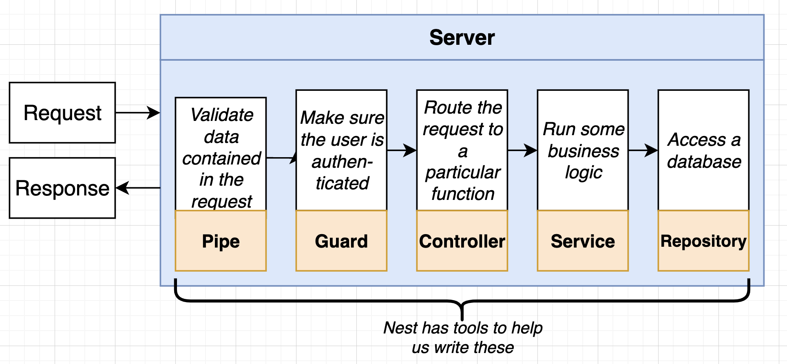

setup the project from scratch

```js
npm init -y

npm install @nestjs/common@7.6.17 @nestjs/core@7.6.17 @nestjs/platform-express@7.6.17 reflect-metadata@0.1.13 typescript@4.3.2
```


what we get in package.json

```js
"dependencies": {
  "@nestjs/common": "^7.6.17",		// contains vast majorities of functions, classes, etc
  "@nestjs/core": "^7.6.17",
  "@nestjs/platform-express": "^7.6.17",	// let Nest use ExpressJs for handling HTTP request
  "reflect-metadata": "^0.1.13",		// help make decorators work, 
  "typescript": "^4.3.2"			// we write NestJs App in TypeScript
}
```


steps of creating a Nest App

1. Intall Dependencies
2. setup TypeScript Compiler configurations
3. create a nest module and controller
4. start the app!


## TS config

tsconfig.json

```json
{
  "compilerOptions": {
    "module": "CommonJS",
    "target": "ES2017",
    "experimentalDecorators": true,
    "emitDecoratorMetadata": true
  }
}
```


## :bangbang: creating nest module &  controller 





## start up a nest app

src > main.ts 

```ts
import { Controller, Get, Module } from "@nestjs/common";
import { NestFactory } from "@nestjs/core";

@Controller() // this is called decorator (Annotation in Java)
class AppController {
  @Get()
  getRootRoute() {
    return "Hello World!";
  }
}

@Module({
  controllers: [AppController],         // Nest will instantiate it
})
class AppModule {}

async function bootstrap() {
  const app = await NestFactory.create(AppModule);
  await app.listen(3000);
}

bootstrap();
```


then run below code to start

```js
npx ts-node-dev src/main.ts
```


### refactor code 

src > main.ts

```ts
import { NestFactory } from "@nestjs/core";
import { AppModule } from "./app.module";

async function bootstrap() {
  const app = await NestFactory.create(AppModule);
  await app.listen(3000);
}

bootstrap();
```

src > app.module.ts 

```ts
import { Module } from "@nestjs/common";
import { AppController } from "./app.controller";

@Module({
  controllers: [AppController], // Nest will instantiate it
})
export class AppModule {}
```

src > app.controller.ts

```ts
import { Controller, Get, Module } from "@nestjs/common";

@Controller('/app') // this is called decorator (Annotation in Java)
export class AppController {
  @Get('/asdf')
  getRootRoute() {
    return "Hello World!";
  }

  @Get('/bye')
  getByeThere() {
    return 'bye there!'
  }
}
```

