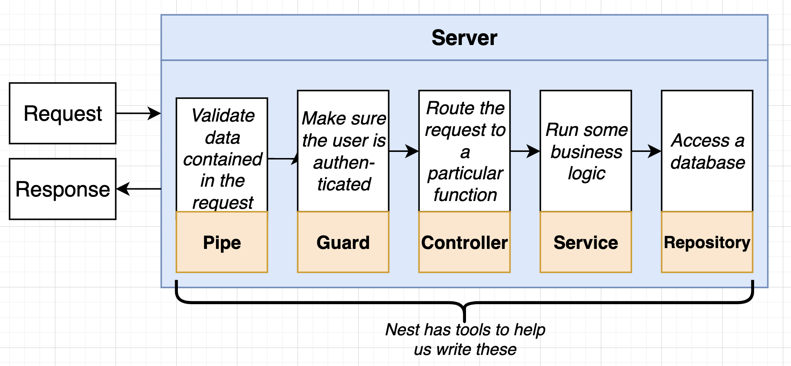
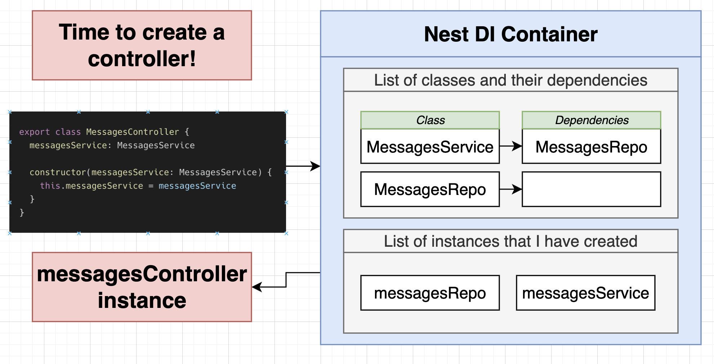

# Key takeaway



+ Controlelr -> Service -> Repository
  + Inversion of Conrtrol & Dependence Injection
    + why we use them
  + NestJs Modules wiring up
    + imports
    + providers
    + exports


# 1. Generating nest project using CLI

C3

```js
npm install -g @nestjs/cli
```


App goal: store and retrieve messages stored in a plain json file


+ API 1: get all message from server
  + Controller + Service + Repository
+ API 2: post a new message to server 
  + Pipe + Controlelr + Service + Repository
+ API 3:  get a message by id from server


## :bangbang: Hands-on

```js
nest new <project-name> // this by default create a directory that is init as a git repo
  
nest new <project-name> --skip-git		// this will not

```


package.json

```json

  "scripts": {
    "build": "nest build",
    "format": "prettier --write \"src/**/*.ts\" \"test/**/*.ts\"",
    "start": "nest start",
    "start:dev": "nest start --watch",		// npm run start:dev => run app as dev mode
    "start:debug": "nest start --debug --watch",
    "start:prod": "node dist/main",
    "lint": "eslint \"{src,apps,libs,test}/**/*.ts\" --fix",
    "test": "jest",
    "test:watch": "jest --watch",
    "test:cov": "jest --coverage",
    "test:debug": "node --inspect-brk -r tsconfig-paths/register -r ts-node/register node_modules/.bin/jest --runInBand",
    "test:e2e": "jest --config ./test/jest-e2e.json"
  },
```


nest uses eslint by default, but lecturer turn it off


a nest app at least needs to have a module and a controller

## Create module

we can use nest CLI to generate classes file or module file more conveniently

```js
// at root path of the project: 
nest generate module <module-name>
```


## Create controller 

```js
// at root path of the project: 
nest generate controller messages/messages --flat
```

this generate messages controller under messages folder and wire it up to the messages module we just created. `--flat` means 'don't create an extra folder called controllers


# 2. Validating Request Data with Pipes 

C4

nest also have different decorators to extract info from different parts of a http request

+ `Headers()`
+ `@Body()`
+ `@Param('id')`
+ `@Query()`


## Using Pipes for Validation


## Adding validation rules

steps to set up automatic validation

1. tell nest to use global validation
2. create a class that describes the different properties that the request body should have
   + Dto (data transfer object)
3. add validation rules to the class
4. apply that class to the request handler

写法和SpringBoot如出一辙


main.ts

+ need class-validator & class-transformer package

```ts
import { NestFactory } from '@nestjs/core';
import { MessagesModule } from './messages/messages.module';
import { ValidationPipe } from '@nestjs/common';

async function bootstrap() {
  const app = await NestFactory.create(MessagesModule);
  
  app.useGlobalPipes(
    new ValidationPipe()
  );    // dependency injection here
  
  await app.listen(3000);
}
bootstrap();
```


messages > messages.module.ts

```ts
import { Module } from '@nestjs/common';
import { MessagesController } from './messages.controller';

@Module({
  controllers: [MessagesController]
})
export class MessagesModule {}
```

messages > messages.controller.ts

```ts
import { Controller, Get, Post, Body, Param } from '@nestjs/common';
import { CreateMessageDto } from './dtos/create-message.dto';

@Controller('messages')
export class MessagesController {

    @Get()
    listMessages() {
        return [{ id: 1, text: 'Hello World' }];
    }   
		
  	// how does Dto type preserved in javascript at runtime? 
    @Post()
    createMessage(@Body() body: CreateMessageDto) {
        console.log(body);
    }

    @Get('/:id')
    getMessage(@Param('id') id: string) {
        console.log(id);
    }

}
```

messages > dtos > create-message.dto.ts

```ts
import {IsString} from 'class-validator';

export class CreateMessageDto{
    @IsString()
    content: string;
}
```


## Behind the scenes of validation

P20

Data Transfer Object: http request body 到 request handler之间的中间信息状态, 

+ `class-transformer`: responsible for deserialization process - plain JSON data to JS class instance
+ `class-validator`: checking field of a JS class instance against a validation rule using decorators


```ts
request body in JSON --class-transformer--> 
specific Dto instance --class-validator--> 
 if no error
 	form to request handler
 else 
   return error to client
```


how type info of typescript is perserved when running compiled javascript code

---

p21

TS code not gets run directly, but be converted to JS first => how does the decorator info in TS works in JS context? 


dist > corresponding to message.controller.ts file, it has code pieces of: 

+ it defines how those decorators works when compiling TS to JS

```js
__decorate([
    (0, common_1.Post)(),
    __param(0, (0, common_1.Body)()),
    __metadata("design:type", Function),
    __metadata("design:paramtypes", [create_message_dto_1.CreateMessageDto]),
    __metadata("design:returntype", void 0)
], MessagesController.prototype, "createMessage", null);
```


# 3. Services & Repositories 

C5 1hr


Services: it's a class

+ 1st place to put any <u>business logic</u>
+ One service might use one or more repositories to find or store data

Repositories: it's a class

+ 1st place to put <u>storage-related logic</u>
+ Usually ends up being a `TypeORM` entity, a `Mongoose` schema, or similar


We would frequently have similar method names in services & repositories

```js
// e.g. pseudo code
MessageService{
  findOne(id: string)
  findAll()
  create(message: string)
}

MessageRepository{
  findOne(id: string)
  findAll()
  create(message: string)
}
```


p22-27

see final codes


## :bangbang: IoC & Dependency Injection

P28-30

why dependency injection exist

+ in the above code, we have dependency chain like: controller -> service -> repository


Inversion of Control principle for better code scalability, maintainability:

+ Classes shoud <u>not</u> create instances of its dependencies on its own
  + 换言之, classes需要第三方来负责为其inject dependency, 这在SpringBoot里就是Container负责的


bad example:

```js
import { MessagesRepository } from "./messages.repository";

export class MessagesService{
    private messagesRepo: MessagesRepository;

  	// bad as not follow IoC:  class creating its dependency on its own
    constructor(){
        this.messagesRepo = new MessagesRepository();
    }
}
```

better example

+ inject a specific dependency
+ we followingly use this pattern

```js
import { MessagesRepository } from "./messages.repository";

export class MessagesService{
    private messagesRepo: MessagesRepository;

		// better MessageService receives its dependency, but it specifically asks for 'MessageRepository'
    constructor(messageRepo: MessageRepository){
        this.messagesRepo = messagesRepo;       // ! dependency injection
    }
}
```

best example

+ inject a dependency that implements the interface. This could be beneficial to ensures open-close principle
  + e.g. in test environment, we would need to create a fake Repository class that implement the same interface to simulate the behaviour of real Repository Class 

```js
interface Repository{
  findOne(id: string);
  findAll();
  create(content: string);
}

export class MessagesService{
  messageRepo: Repository;
  // best: MessageService receives its dependency, and it doesn't specifically require 'MessagesRepository'  -> possibly to apply polymorphism, ensures open-close principle
  constructor(repo: Repository){
    this.messageRepo = repo;
  }
}
```


how dependency injection works

p29



Nest DI Container Work Flow:

1. At app startup, register all classes (except controller classes) with the container
2. Container will figure out what each dependency each class has
   + **Use the 'Injectable' decorator on each class and add them to the modules list of providers**
3. We then ask the container to create an instance of a class (e.g. controller instance)for us
4. Container creates all required dependencies and gives us the instance
   + **Happens automatically - Nest will try to create controller instances for us**
5. Container will hold onto the created dependency instances and reuse them if needed
   + Flyweight Pattern, SpringBoot Bean container also does this


## Refactor using DI

P30-31

message module

```ts
import { Module } from '@nestjs/common';
import { MessagesController } from './messages.controller';
import { MessagesService } from './messages.service';
import { MessagesRepository } from './messages.repository';

@Module({
  controllers: [MessagesController],
  providers: [MessagesService, MessagesRepository], // things that can be used as dependency for other classes (Bean in Spring)
})
export class MessagesModule {}
```

message controller

```ts
import {
  Controller,
  Get,
  Post,
  Body,
  Param,
  NotFoundException,
} from '@nestjs/common';
import { CreateMessageDto } from './dtos/create-message.dto';
import { MessagesService } from './messages.service';

@Controller('messages')
export class MessagesController {
  // private messageService: MessagesService;
  // constructor(messageService: MessagesService) {
  //   this.messageService = messageService;       // ! dependency injection
  // }

  // syntax sugar: equivalent to above
  constructor(private messageService: MessagesService) {}

  @Get()
  listMessages() {
    return this.messageService.findAll();
  }

  // how does Dto type preserved in javascript at runtime?
  @Post()
  createMessage(@Body() body: CreateMessageDto) {
    return this.messageService.create(body.content);
  }

  @Get('/:id')
  async getMessage(@Param('id') id: string) {
    const message = await this.messageService.findOne(id);

    if (!message) {
      throw new NotFoundException('message not found!');
    }
    return message;
  }
}
```

message service

```ts
import { Injectable } from "@nestjs/common";
import { MessagesRepository } from "./messages.repository";

@Injectable()       // like @Bean in Spring
export class MessagesService{

    // private messagesRepo: MessagesRepository;
    // constructor(messagesRepo: MessagesRepository){
    //     this.messagesRepo = messagesRepo;       // ! dependency injection
    // }

    // syntax sugar: equivalent to above
    constructor(private messagesRepo: MessagesRepository){} 

    // 套娃
    findOne(id: string){
        return this.messagesRepo.findOne(id);
    }

    findAll(){
        return this.messagesRepo.findAll();
    }

    create(content: string){
        return this.messagesRepo.create(content);
    }
}
```

message repository

```ts
import { Injectable } from "@nestjs/common";
import { readFile, writeFile } from "fs/promises";

// here for simplicity,  we just use a json file as a database
@Injectable()       // like @Bean in Spring
export class MessagesRepository{
    async findOne(id: string){
        const contents = await readFile('messages.json', 'utf-8');
        const messages = JSON.parse(contents);  // to js obj
        return messages[id];
    }

    async findAll(){
        const contents = await readFile('messages.json', 'utf-8');
        const messages = JSON.parse(contents);  // to js obj
        return messages;
    }

    async create(content: string){
        const contents = await readFile('messages.json', 'utf-8');
        const messages = JSON.parse(contents);  // to js obj
        const id = Math.floor(Math.random() * 999);  

        messages[id] = { id, content };

        await writeFile('messages.json', JSON.stringify(messages));
    }

}
```


# 4. Organizing Code with modules 

C6 30min

just a simple demo to enhance understanding of modules


```ts
computer module
	|- CPU module
  		|- Power module
  |- Disk module
  		|- the same power module
```


create a new nest project: di

---

```ts
// at root of di: 
nest g module computer
nest g module cpu
nest g module disk
nest g module power

// generate service in each module
nest g service power
nest g service disk
nest g service cpu
  
  
// generate controller
nest g controller computer
  
```


code

---

power module

```ts
import { Module } from '@nestjs/common';
import { PowerService } from './power.service';

@Module({
  providers: [PowerService],    // providers are only accessible inside the module
  exports: [PowerService]   // we want to export the PowerService so that other modules can use it
})
export class PowerModule {}
```

```ts
import { Injectable } from '@nestjs/common';

@Injectable()
export class PowerService {
  supplyPower(watts: number) {
    console.log(`Supplying ${watts} watts of power`);
  }
}
```


cpu module:

```ts
import { Module } from '@nestjs/common';
import { CpuService } from './cpu.service';
import { PowerModule } from 'src/power/power.module';

@Module({
  imports: [PowerModule],   // easy to see the module dependency
  providers: [CpuService],
  exports: [CpuService],
})
export class CpuModule {}
```

```ts
import { Injectable } from '@nestjs/common';
import { PowerService } from 'src/power/power.service';

@Injectable()
export class CpuService {

    constructor(private powerService: PowerService) {}

    compute(a:number, b:number){
        console.log('Drawing 10 watts of power from PowerService')
        this.powerService.supplyPower(10);
        return a + b;
    }

}
```

disk module

```ts
import { Module } from '@nestjs/common';
import { DiskService } from './disk.service';
import { PowerModule } from 'src/power/power.module';

@Module({
  imports: [PowerModule], // easy to see the module dependency
  providers: [DiskService],
  exports: [DiskService],
})
export class DiskModule {}
```

```ts
import { Injectable } from '@nestjs/common';
import { PowerService } from 'src/power/power.service';

@Injectable()
export class DiskService {
  constructor(private powerService: PowerService) {}

  getData() {
    console.log('Drawing 20 watts of power from PowerService');
    this.powerService.supplyPower(20);
    return 'data!';
  }
}
```


computer module:

```ts
import { Module } from '@nestjs/common';
import { ComputerController } from './computer.controller';
import { CpuModule } from 'src/cpu/cpu.module';
import { DiskModule } from 'src/disk/disk.module';

@Module({
  imports: [CpuModule, DiskModule],
  controllers: [ComputerController],
})
export class ComputerModule {}

```

```ts
import { Controller, Get } from '@nestjs/common';
import { CpuService } from 'src/cpu/cpu.service';
import { DiskService } from 'src/disk/disk.service';

@Controller('computer')
export class ComputerController {
  constructor(
    private cpuService: CpuService,
    private diskService: DiskService,
  ) {}

  @Get()
  run() {
    return [this.cpuService.compute(1, 2), this.diskService.getData()];
  }
}
```

visit localhost:3000/computer, see result

