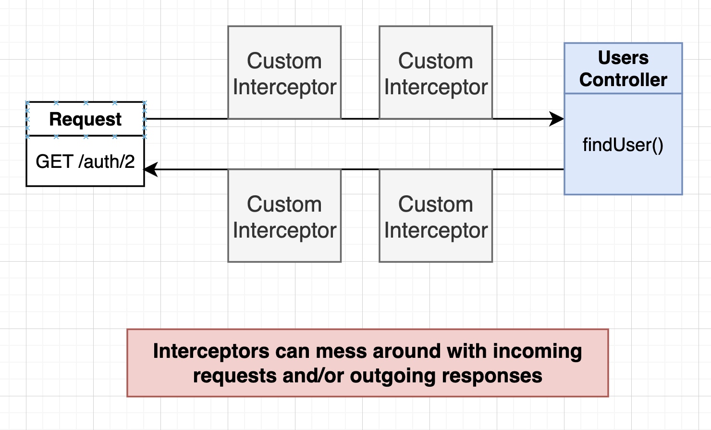

# key takeaways

+ TypeORM apis

  + some api supports passing entity as argument, this will enabled hooks in Entity but less efficient as 2 trips to db

  + some api do not support entity as argument but just plain object, this will not enabled hooks in Entity, but more efficient as 1 trip to db

+ interceptor
  + runs before an incoming request is proceeded to a route handler

+ decorator
  + can be seen as a function that gets runned at the beginning of a route handler in controller

+ gurard
  + guard controller if a request is not satisfying a specific requirement


# Project Intro

C7

start to build a new project with simple CRUD


App overview

+ Authentication: user sign up with email/password
+ Business: 
  + Users get an estimate for how much their car is worth based on the make/model/year/mileage
  + User can report what they sold their vehicles for

+ Access Control: admins have to approve reported sales


API design & Module design

```ts
User Module -> UserController, UserService, UserRepository
  POST /auth/signup
    - body {email, passowrd}
  POST /auth/signin
    - body {email, password}

Report Module -> ReportController, ReportService, ReportRepository
  GET /reports
    - get {make, model, year, mileage, longitute, latitude }
  POST /reports
    - body {make, model, year, mileage, longitute, latitude, price}
  PATCH /reports/:id
    - {approved}
```


create a new project

```ts
nest new mycv --skip-git

// cd to the project root path
nest g module users
nest g module reports
  
nest g controller users
nest g controller reports
  
nest g service users
nest g service reports
```


# Persisting data with TypeORM

C8


## setup database connection 

Nest works well with TypeORM AND Mongoose. Here we just use TypeORM with sqlite, we will move to use Postgres later on


```js
npm i @nestjs/typeorm typeorm sqlite3
```

in app module (the root module of project), add TypeOrmModule in import and config it as:

````ts
import { Module } from '@nestjs/common';
import { TypeOrmModule } from '@nestjs/typeorm';
import { AppController } from './app.controller';
import { AppService } from './app.service';
import { UsersModule } from './users/users.module';
import { ReportsModule } from './reports/reports.module';

@Module({
  // eslint-disable-next-line prettier/prettier
  imports: [
    TypeOrmModule.forRoot({
      type: 'sqlite',
      database: 'db.sqlite',
      entities: [],
      synchronize: true,
    }),
    UsersModule,
    ReportsModule,
  ],
  controllers: [AppController],
  providers: [AppService],
})
export class AppModule {}
````

now when you run `npm run start:dev`, you will see sqlite database file created!


## Creating an entity and repository

p44 

a lot wiring stuff to do with modules in nest.js


Users module folder > user.entity.ts

+ define database table structure in ts fashion, corresponds to a sql table

```ts
import { Entity, Column, PrimaryGeneratedColumn } from 'typeorm';

@Entity()
export class User {
  @PrimaryGeneratedColumn()
  id: number;

  @Column()
  email: string;

  @Column()
  password: string;
}
```


Wire it up to its parent module (user module)

+ this creates a repository

```ts
import { Module } from '@nestjs/common';
import { TypeOrmModule } from '@nestjs/typeorm';
import { UsersController } from './users.controller';
import { UsersService } from './users.service';
import { User } from './user.entity';

@Module({
  imports:[TypeOrmModule.forFeature([User])],   // this connects the entity to its parent module -> this creates a repository for the entity
  controllers: [UsersController],
  providers: [UsersService]
})
export class UsersModule {}
```


Wire it up to the root module (app module)

```ts
import { Module } from '@nestjs/common';
import { TypeOrmModule } from '@nestjs/typeorm';
import { AppController } from './app.controller';
import { AppService } from './app.service';
import { UsersModule } from './users/users.module';
import { ReportsModule } from './reports/reports.module';
import { User } from './users/user.entity';

@Module({
  // eslint-disable-next-line prettier/prettier
  imports: [
    TypeOrmModule.forRoot({
      type: 'sqlite',
      database: 'db.sqlite',
      entities: [User],			// ****
      synchronize: true,
    }),
    UsersModule,
    ReportsModule,
  ],
  controllers: [AppController],
  providers: [AppService],
})
export class AppModule {}
```


similar process for report entity (not showing the code here)


also possible to view db.sqlite file in vscode (using sqlite extension)


## Understanding TypeORM Decorators

P46


app.module.ts

+ synchronize: true
  + note this config is only used in development. we never want this config in production as it is dangerious to accidently change the database structure  
  + in production, we would need to write a migration file to define how to do database migration

```ts
import { Module } from '@nestjs/common';
import { TypeOrmModule } from '@nestjs/typeorm';
import { AppController } from './app.controller';
import { AppService } from './app.service';
import { UsersModule } from './users/users.module';
import { ReportsModule } from './reports/reports.module';
import { User } from './users/user.entity';
import { Report } from './reports/report.entity';

@Module({
  // eslint-disable-next-line prettier/prettier
  imports: [
    TypeOrmModule.forRoot({
      type: 'sqlite',
      database: 'db.sqlite',
      entities: [User, Report],
      synchronize: true, // ! only in development mode, serves as the same purpose as database migration (this is a special case in TypeORM, normally you would use migrations in other ORM)
    }),
    UsersModule,
    ReportsModule,
  ],
  controllers: [AppController],
  providers: [AppService],
})
export class AppModule {}
```


quick note on repository

repository APIs https://typeorm.io/data-source

+ there may be more than 1 way to do a task

```ts
create()
save()

find()
findOne()

remove()
```


setting up body validation for create-user

+ just similar step to the last notes C3-6, not show code here


# Creating & Saving User data

C9

CRUD user apis


## Create

controller -> service -> repository


in user service, we define business logic how to create a user

+ Note we use user repository to create a new user instance, instead of mannually create one using `new`, because it is safer in this way

```ts
import { Injectable } from '@nestjs/common';
import { Repository } from 'typeorm';
import { InjectRepository } from '@nestjs/typeorm';
import { User } from './user.entity';

@Injectable()
export class UsersService {
  private repo: Repository<User>;

  constructor(@InjectRepository(User) repo: Repository<User>) {
    this.repo = repo; // dependency injection
  }

  create(email: string, password: string) {
    const user = this.repo.create({ email, password });     // create a new user instance using repo (this is safer as validation rule is applied), but not persist it to DB
    return this.repo.save(user);
  }
}
```


review on the workflow

P52


hooks to entity

P53

:bangbang: a good practice: create entity instance and save the entity instance, don't create plain instance as you may lose some code logic like hooks in an Entity

```ts
import { Injectable } from '@nestjs/common';
import { Repository } from 'typeorm';
import { InjectRepository } from '@nestjs/typeorm';
import { User } from './user.entity';

@Injectable()
export class UsersService {
  private repo: Repository<User>;

  constructor(@InjectRepository(User) repo: Repository<User>) {
    this.repo = repo; // dependency injection
  }

  create(email: string, password: string) {
    const user = this.repo.create({ email, password });     // create a new user instance using repo (this is safer as validation rule is applied), but not persist it to DB
    return this.repo.save(user);        // this saves a User Entity instance to db, not a plain user object, so hooks to the entity will be called
  }
}
```


e.g. we can add additional hooks to entity 

```ts
import {
  AfterInsert,
  AfterRemove,
  AfterUpdate,
  Entity,
  Column,
  PrimaryGeneratedColumn,
} from 'typeorm';

@Entity()
export class User {
  @PrimaryGeneratedColumn()
  id: number;

  @Column()
  email: string;

  @Column()
  password: string;

  // like AOP in spring, this is a hook that will be called after insert
  @AfterInsert()
  logInsert() {
    console.log('Inserted User with id', this.id);
  }

  @AfterUpdate()
  logUpdate() {
    console.log('Updated User with id', this.id);
  }

  @AfterRemove()
  logRemove() {
    console.log('Removed User with id', this.id);
  }
}
```


## Query 

P55


## :bangbang:Update

P56

Save() vs insert() & update() 

+ Save()
  + also can be applied on entity instance => hooks to that entity enabled
  + but less efficient as it need 2 trips: retieve entity from db, update it, then save it back to db
+ insert() & update()
  + can only be applied on plain instance
  + 1 trip to db, more efficient


in user service class:

```ts
  // Partial comes from typescript, it declares a type consisting of any partial fields of User, providing flexibilities
  async update(id: number, attrs: Partial<User>) {
    const user = await this.findOne(id);        // entity
    if (!user) {
      throw new Error('user not found!');
    }

    Object.assign(user, attrs);     // assign partial fields to user
    return this.repo.save(user);    // save entity, apply hooks
  }
```


## Remove

P57

Again: remove() vs. delete()

+ remove() is for removing entity
  + Entity -> hooks enabled
  + but less efficient as 2 way trip to db
+ Delete() is more flexible for plain instance


```ts
  async remove(id: number) {
    const user = await this.findOne(id);        // entity
    if (!user) {
      throw new Error('user not found!');
    }
    return this.repo.remove(user);    // remove entity, apply hooks
  }
```


## Adding service to contoller

P58


user controller

```ts
import {
  Controller,
  Post,
  Body,
  Get,
  Patch,
  Delete,
  Param,
  Query,
} from '@nestjs/common';
import { CreateUserDto } from './dtos/create-user-dto';
import { UpdateUserDto } from './dtos/update-user.dto';
import { UsersService } from './users.service';

@Controller('auth') // prefix for all routes inside this controller
export class UsersController {
  constructor(private usersService: UsersService) {}

  @Post('/signup')
  createUser(@Body() body: CreateUserDto) {
    //! here we validate the body using CreateUserDto
    // create a new user
    this.usersService.create(body.email, body.password);
  }

  @Get('/:id')
  findUser(@Param('id') id: string) {
    return this.usersService.findOne(parseInt(id));
  }

  @Get()
  findAllUsers(@Query('email') email: string) {
    return this.usersService.find(email);
  }

  @Delete('/:id')
  removeUser(@Param('id') id: string) {
    return this.usersService.remove(parseInt(id));
  }

  @Patch('/:id')
  updateUser(@Param('id') id: string, @Body() attrs: UpdateUserDto) {
    return this.usersService.update(parseInt(id), attrs);
  }
}
```


## :bangbang: Exceptions handling

usually, the expcetion is return back to controller from service


e.g. in user service 

+ we throw a specific type of HTTP exception, instead of just `throw new Error('')`
  + :bangbang: note but protocols other than HTTP (e.g. WebSocket, gRPC) ´might not know how to handle http exceptions,  you would need to use protocol specific exception or implement your own exception filters 

```ts
 
import { Injectable, NotFoundException } from '@nestjs/common';
import { Repository } from 'typeorm';
import { InjectRepository } from '@nestjs/typeorm';
import { User } from './user.entity';


@Injectable()
export class UsersService {
  private repo: Repository<User>;

  constructor(@InjectRepository(User) repo: Repository<User>) {
    this.repo = repo; // dependency injection
  }
  
  
  // ........
  
// Partial comes from typescript, it declares a type consisting of any partial fields of User, providing flexibilities
  async update(id: number, attrs: Partial<User>) {
    const user = await this.findOne(id);        // entity
    if (!user) {
      throw new NotFoundException('user not found!');
    }

    Object.assign(user, attrs);     // assign partial fields to user
    return this.repo.save(user);    // save entity, apply hooks
  }

  async remove(id: number) {
    const user = await this.findOne(id);        // entity
    if (!user) {
      throw new NotFoundException('user not found!');
    }
    return this.repo.remove(user);    // remove entity, apply hooks
  }
  
}
```


# Custom data serialization

C10 (diagrams in draw.io file 10)

This means to customize what field of entity is accessible by response data


## one way is to use Interceptors

p62


+ what we do before, controller just return entity instance straightaway


+ with class serializer interceptor, we intercept the process when serializing the entity instance by adding addtional logic that controlls how to serialize the entity instance (e.g.exclude a certain field)
  + :bangbang: but this is not the most ideal way to allow customized reponse field


:gem: e.g. when get user by id, we don;t want its password being returned:

```ts
import {
  AfterInsert,
  AfterRemove,
  AfterUpdate,
  Entity,
  Column,
  PrimaryGeneratedColumn,
} from 'typeorm';

import { Exclude } from 'class-transformer';

@Entity()
export class User {
  @PrimaryGeneratedColumn()
  id: number;

	// ...

  @Column()
  @Exclude()    // this applies when converting this entity instance to a plain object
  password: string;

	// ...
}
```


```ts
import {
  Controller,
  Post,
  Body,
  Get,
  Patch,
  Delete,
  Param,
  Query,
  NotFoundException,
  
  UseInterceptors,
  ClassSerializerInterceptor
} from '@nestjs/common';
import { CreateUserDto } from './dtos/create-user-dto';
import { UpdateUserDto } from './dtos/update-user.dto';
import { UsersService } from './users.service';

@Controller('auth') // prefix for all routes inside this controller
export class UsersController {
  constructor(private usersService: UsersService) {}
	
  // ...
	
  @UseInterceptors(ClassSerializerInterceptor)      // this will hide the password field in the response
  @Get('/:id')
  async findUser(@Param('id') id: string) {
    const user = await this.usersService.findOne(parseInt(id));
    if (!user) {
      throw new NotFoundException('user not found!');
    }
    return user;
  }

	// ...
}
```


## solution to serialization: DTO

P63

`custom interceptor`:  use dto to define how to serialize an entity for a particular route handler

check more at https://docs.nestjs.com/interceptors, interceptor is based on AOP


:gem: ​e.g. we have 2 different route that both access UserService.findOne() that returns a User Entity Instance, but we want the 2 route return 2 different plain object that has different fields 


To do so, we could use custom interceptor to define DTO class, which describes how to serialize a user for a particular route handler


### build custom interceptor

P64

firstly look at 'what is interceptor' (similar to middleware in express.js)

:bangbang: note ​**Interceptors can be applied to **

+ **a single handler, **
+ **all the handlers in a controller, **
+ **or globally**




define an Interceptor class

```ts
import {
  UseInterceptors,
  NestInterceptor,
  ExecutionContext,
  CallHandler,
} from '@nestjs/common';
import { Observable } from 'rxjs';
import { map } from 'rxjs/operators';
import { plainToClass } from 'class-transformer';

export class SerializerInterceptor implements NestInterceptor {
  intercept(
    context: ExecutionContext,
    handler: CallHandler,
  ): Observable<any> | Promise<Observable<any>> {
    // run something before a request is handled by the request handler
    console.log('Im running before the handler', context);

    return handler.handle().pipe(
      map((data: any) => {
        // run something before the response is sent out
        console.log('Im running before the response is sent out', data);
      }),
    );
  }
}
```

source code of NestInterceptor interface: 

```ts
/**
 * Interface describing implementation of an interceptor.
 *
 * @see [Interceptors](https://docs.nestjs.com/interceptors)
 *
 * @publicApi
 */
export interface NestInterceptor<T = any, R = any> {
    /**
     * Method to implement a custom interceptor.
     *
     * @param context an `ExecutionContext` object providing methods to access the
     * route handler and class about to be invoked.
     * @param next a reference to the `CallHandler`, which provides access to an
     * `Observable` representing the response stream from the route handler.
     */
    intercept(context: ExecutionContext, next: CallHandler<T>): Observable<R> | Promise<Observable<R>>;
}

```


apply the interceptor to a handler 

```ts
import {
  Controller,
  Post,
  Body,
  Get,
  Patch,
  Delete,
  Param,
  Query,
  NotFoundException,
  UseInterceptors,
} from '@nestjs/common';
import { CreateUserDto } from './dtos/create-user-dto';
import { UpdateUserDto } from './dtos/update-user.dto';
import { UsersService } from './users.service';
import { SerializerInterceptor } from 'src/interceptors/serialize.interceptor';

@Controller('auth') // prefix for all routes inside this controller
export class UsersController {
  constructor(private usersService: UsersService) {}

	// ...
  
  @UseInterceptors(SerializerInterceptor) // apply the interceptor to this handler ******
  @Get('/:id')
  async findUser(@Param('id') id: string) {
    console.log('handler is now running');

    const user = await this.usersService.findOne(parseInt(id));
    if (!user) {
      throw new NotFoundException('user not found!');
    }
    return user;
  }
  
  // ...
}
```

Now, when you run the get user by id request, you see

```shell
Im running before the handler ExecutionContextHost {
  args: [
    IncomingMessage {
      _readableState: [ReadableState],
      _events: [Object: null prototype] {},
      _eventsCount: 0,
      _maxListeners: undefined,
      socket: [Socket],
      httpVersionMajor: 1,
      httpVersionMinor: 1,
      httpVersion: '1.1',
      complete: true,
      rawHeaders: [Array],
      rawTrailers: [],
      joinDuplicateHeaders: null,
      aborted: false,
      upgrade: false,
      url: '/auth/4',
      method: 'GET',
      statusCode: null,
      statusMessage: null,
      client: [Socket],
      _consuming: false,
      _dumped: false,
      next: [Function: next],
      baseUrl: '',
      originalUrl: '/auth/4',
      _parsedUrl: [Url],
      params: [Object],
      query: {},
      res: [ServerResponse],
      body: {},
      route: [Route],
      [Symbol(kCapture)]: false,
      [Symbol(kHeaders)]: [Object],
      [Symbol(kHeadersCount)]: 14,
      [Symbol(kTrailers)]: null,
      [Symbol(kTrailersCount)]: 0
    },
    ServerResponse {
      _events: [Object: null prototype],
      _eventsCount: 1,
      _maxListeners: undefined,
      outputData: [],
      outputSize: 0,
      writable: true,
      destroyed: false,
      _last: false,
      chunkedEncoding: false,
      shouldKeepAlive: true,
      maxRequestsOnConnectionReached: false,
      _defaultKeepAlive: true,
      useChunkedEncodingByDefault: true,
      sendDate: true,
      _removedConnection: false,
      _removedContLen: false,
      _removedTE: false,
      strictContentLength: false,
      _contentLength: null,
      _hasBody: true,
      _trailer: '',
      finished: false,
      _headerSent: false,
      _closed: false,
      socket: [Socket],
      _header: null,
      _keepAliveTimeout: 5000,
      _onPendingData: [Function: bound updateOutgoingData],
      req: [IncomingMessage],
      _sent100: false,
      _expect_continue: false,
      _maxRequestsPerSocket: 0,
      locals: [Object: null prototype] {},
      statusCode: 200,
      [Symbol(kCapture)]: false,
      [Symbol(kBytesWritten)]: 0,
      [Symbol(kNeedDrain)]: false,
      [Symbol(corked)]: 0,
      [Symbol(kOutHeaders)]: [Object: null prototype],
      [Symbol(errored)]: null,
      [Symbol(kHighWaterMark)]: 16384,
      [Symbol(kRejectNonStandardBodyWrites)]: false,
      [Symbol(kUniqueHeaders)]: null
    },
    [Function: next]
  ],
  constructorRef: [class UsersController],
  handler: [AsyncFunction: findUser],
  contextType: 'http'
}
handler is now running
Im running before the response is sent out User { id: 4, email: 'adfs123@gmail.com', password: 'password2' }
```


### Adding serialization logic inside interceptor

接上一步

p65


Dto:

```ts
import { Expose } from 'class-transformer';

export class UserDto {
  @Expose()
  id: number;

  @Expose()
  email: string;
}
```

in interceptor, we define the serialization logic using the dto

+ but it is hardcoded for plainToClass that only UserDto can be transformed, we want it to be more reusable. 

```ts
import {
  UseInterceptors,
  NestInterceptor,
  ExecutionContext,
  CallHandler,
} from '@nestjs/common';
import { Observable } from 'rxjs';
import { map } from 'rxjs/operators';
import { UserDto } from 'src/users/dtos/user.dto';
import { plainToClass } from 'class-transformer';

export class SerializerInterceptor implements NestInterceptor {
  intercept(
    context: ExecutionContext,
    handler: CallHandler,
  ): Observable<any> | Promise<Observable<any>> {
      
    return handler.handle().pipe(
      map((data: any) => {
        // ! data is the return value from the handler. but not yet serialized
        return plainToClass(UserDto, data, {
          excludeExtraneousValues: true, // setup: only @Expose() fields in dto will be returned
        });
      }),
    );
  }
}
```


### Refactor

use dependency injection to pass dto down to interceptor so that we can reuse the dto serialization logic

---

P66

Controller

```ts
  @UseInterceptors(new SerializerInterceptor(UserDto)) // apply the interceptor to this handler
  @Get('/:id')
  async findUser(@Param('id') id: string) {
    console.log('handler is now running');

    const user = await this.usersService.findOne(parseInt(id));
    if (!user) {
      throw new NotFoundException('user not found!');
    }
    return user;
  }
```

Interceptor

```ts
export class SerializerInterceptor implements NestInterceptor {
  constructor(private dto: any) {} // dependency injection

  intercept(
    context: ExecutionContext,
    handler: CallHandler,
  ): Observable<any> | Promise<Observable<any>> {
    return handler.handle().pipe(
      map((data: any) => {
        // ! data is the return value from the handler. but not yet serialized
        return plainToClass(this.dto, data, {
          excludeExtraneousValues: true, // setup: only @Expose() fields will be returned
        });
      }),
    );
  }
}
```


use custom decorate for cleaner code

---

P67

interceptor

+ add a customized decorate 

```ts
// a custom decorator
export function Serialize(dto: any) {
  return UseInterceptors(new SerializerInterceptor(dto));
}
```

controller

+ apply the decorator to a handler

```ts
  @Serialize(UserDto) // apply the interceptor to this handler
  @Get('/:id')
  async findUser(@Param('id') id: string) {
    console.log('handler is now running');

    const user = await this.usersService.findOne(parseInt(id));
    if (!user) {
      throw new NotFoundException('user not found!');
    }
    return user;
  }
```


Controller-wide sesrialization

---

P68

controller 

+ just move `@Serialize(UserDto)` onto the top of the controller so that it is applied onto all route handlers inside
  + if you want different rotue handler having different output format, just apply interceptor with different dto onto the respective route handler 

```ts
@Controller('auth') // prefix for all routes inside this controller
@Serialize(UserDto) // apply the interceptor to this handler
export class UsersController {
  constructor(private usersService: UsersService) {}

  @Post('/signup')
  createUser(@Body() body: CreateUserDto) {
    //! here we validate the body using CreateUserDto
    // create a new user
    this.usersService.create(body.email, body.password);
  }

  @Get('/:id')
  async findUser(@Param('id') id: string) {
    console.log('handler is now running');

    const user = await this.usersService.findOne(parseInt(id));
    if (!user) {
      throw new NotFoundException('user not found!');
    }
    return user;
  }

	// .. other route handlers
}
```


type safety

---

P69

interceptor

+ just add a little more constraint on dependency injection type

```ts
interface ClassConstructor {
  new (...args: any[]): {};
}

// a custom decorator
export function Serialize(dto: ClassConstructor) {
  return UseInterceptors(new SerializerInterceptor(dto));
}
```


# Authentication starts from scratch

C11 just sign up & sign in (using session)


## Auth intro


where to add sign up and sign in logic?

+ Option1: put everthing related to user in UserService
  + feasible when app is small, but when app grows, the UserService will become bloated
+ Option2: create a new Service: AuthService that is dependent on UserService
  + more modular, feasible for large app


Coding

P71

wire up the file like this


## Sign up

P72-75


password hashing process understanding

(Optional)

+ authentication workflow without salt (web security 学过了)

+ Hash function -> dictionary attack -> salt (web security学过了)
  + authentication workflow with salt 


AuthService > signup

+ we implemented hashed + salted password

```ts
import { BadRequestException, Injectable } from '@nestjs/common';
import { UsersService } from './users.service';

import { randomBytes, scrypt as _scrypt } from 'crypto';
import { promisify } from 'util';

const scrypt = promisify(_scrypt);

@Injectable()
export class AuthService {
  constructor(private usersService: UsersService) {}

  async signup(email: string, password: string) {
    // 1. see if email is in use
    const users = await this.usersService.find(email);
    if (users.length) {
      throw new BadRequestException('email in use');
    }

    // 2. Hash the user's password
    // generate a salt
    const salt = randomBytes(8).toString('hex');
    // hash password + salt
    const hash = (await scrypt(password, salt, 32)) as Buffer;
    // join hashed result + salt
    const result = salt + '.' + hash.toString('hex');

    // 3. Create a new user and save it
    const user = await this.usersService.create(email, result);

    // 4. return the user
    return user;
  }

  signin() {
    //...
  }
}

```


## Sign in

p76-

AuthService:

```ts
 async signin(email: string, password: string) {
    const [user] = await this.usersService.find(email);
    if (!user) {
      throw new NotFoundException('user not found!');
    }

    const [salt, storedHash] = user.password.split('.');
    const hash = (await scrypt(password, salt, 32)) as Buffer;

    if (storedHash !== hash.toString('hex')) {
      throw new BadRequestException('bad password');
    }
    
    return user;
  }
```


### setup session

p77-


workflow of manipulating session


```shell
npm i cookie-session @types/cookie-session
```


main.ts

+ setup middleware of cookie session in our app

```ts
import { NestFactory } from '@nestjs/core';
import { AppModule } from './app.module';
import { ValidationPipe } from '@nestjs/common';
const cookieSession = require('cookie-session'); // old way of importing

async function bootstrap() {
  const app = await NestFactory.create(AppModule);
	
  // ********************
  app.use(
    cookieSession({
      keys: ['asdfgh'],
    }),
  );
  // ********************

  app.useGlobalPipes(
    new ValidationPipe({
      whitelist: true, // stripe out any other fields that is not defined in the DTO
    }),
  );
  
  await app.listen(3000);
}
bootstrap();

```


toy api to see how to access and manipulate session (reflects the workflow above)

```ts
import {
  Controller,
  Post,
  Body,
  Get,
  Patch,
  Delete,
  Param,
  Query,
  Session,
  NotFoundException,
} from '@nestjs/common';
// ... imports

@Controller('auth') // prefix for all routes inside this controller
@Serialize(UserDto) // ! apply the interceptor to this handler
export class UsersController {
  constructor(
    private usersService: UsersService,
    private authService: AuthService,
  ) {}

  // toy api to see how to access session ----------------------------
  @Get('/colors/:color')
  setColor(@Param('color') color: string, @Session() session: any) {
    session.color = color;
  }
  @Get('/colors')
  getColor(@Session() session: any) {
    return session.color;
  }
  // ----------------------------------------------------------------

 	// other router handlers ... 
}
```


### Controller

P79-81 


add route in user controller: 

+ note the mechanism when server will attach the set-cookie header in response header - only when server operation changes (数值上) existing session, and this is done automatically
+ run script like sign up -> sign in -> who am I -> sign out -> who am i to check out results

```ts
   @Post('/signout')
  signOut(@Session() session: any) {
    session.userId = null;
  }

  @Get('/whoami')
  whoAmI(@Session() session: any) {
    return this.usersService.findOne(session.userId);
  }

  @Post('/signup')
  async createUser(@Body() body: CreateUserDto, @Session() session: any) {
    //! here we validate the body using CreateUserDto
    const { email, password } = body;

    const user = await this.authService.signup(email, password);
    session.userId = user.id; //! only when session gets changed, it will be sent back to the client in response header
    return user;
  }

  @Post('/signin')
  async signin(@Body() body: CreateUserDto, @Session() session: any) {
    const { email, password } = body;
    const user = await this.authService.signin(email, password);
    session.userId = user.id; //! only when session gets changed, it will be sent back to the client in response header
    return user;
  }
```


## :bangbang: ​Two more auth task


Task1: automatically tell a route handler who the currently signed in user is  -> need interceptor & decorator

Task2: reject requests to certain route handlers if the user is not signed in -> need guard


### Task1

P82-88

automatically tell a route handler who the currently signed in user is  -> need interceptor & decorator


communicating from interceptor to decorator


interceptor runs first, then decorator runs


users > interceptors > current-user.interceptor.ts

+ adds new field `currentUser` to request object
+ interceptor could be injectable, also need to wire it up to the module to be able to use it as a provider (Bean)

```ts
import {
  NestInterceptor,
  ExecutionContext,
  CallHandler,
  Injectable,
} from '@nestjs/common';

import { UsersService } from '../users.service';

@Injectable()
export class CurrentUserInterceptor implements NestInterceptor {
  constructor(private usersService: UsersService) {}

  /**
   *
   * @param context " ExecutionContext is like a wrapper around incoming request"
   * @param handler "CallHandler is reference to a route handler"
   */
  async intercept(context: ExecutionContext, handler: CallHandler) {
    const request = context.switchToHttp().getRequest();
    const { userId } = request.session || {};

    if (userId) {
      const user = await this.usersService.findOne(userId);
      request.currentUser = user; // ! this is passing info to decorator
    }

    return handler.handle(); // proceed to route handler execution
  }
}
```

then, we could extract `currentUser` param from the request object using a customized param decorator

users > decorators > current-user.decorator.ts 

+ param decorator is like a tool that we could use to extract param info from the request object
+ decorators are not injectable

```ts
import { createParamDecorator, ExecutionContext } from '@nestjs/common';

export const CurrentUser = createParamDecorator(
  // data is the arg we provided for this decorator
  // context is like a wrapper around incoming request
  (data: never, context: ExecutionContext) => {
    const request = context.switchToHttp().getRequest();
    return request.currentUser;     // ! this will be the param in controller when using this decorator
  },
);
```


user controller

+ apply the `CurrentUserInterceptor` to the controller
+ then use ` @CurrentUser() ` to extract param info from request object
  + 可以认为param decorator其实是在route handler的开头加了一些extracting param info的code (作为function来执行), 本质上它内部的逻辑还是在route handler里跑的, 但interceptor定义的逻辑是在route handler执行之前跑的
  + 同理, 其实也可以不用`@CurrentUser()`这个customized param decorator, 使用`@request` decorator来extract `currentUser` info, 但是这样代码可读性下降

```ts
import {
  Controller,
  Post,
  Body,
  Get,
  Patch,
  Delete,
  Param,
  Query,
  Session,
  NotFoundException,
  UseInterceptors,
} from '@nestjs/common';
import { CreateUserDto } from './dtos/create-user-dto';
import { UpdateUserDto } from './dtos/update-user.dto';
import { UsersService } from './users.service';
import { Serialize } from 'src/interceptors/serialize.interceptor';

import { User } from './user.entity';
import { UserDto } from './dtos/user.dto';
import { AuthService } from './auth.server';
import { CurrentUser } from './decorators/current-user.decorator';
import { CurrentUserInterceptor } from './interceptors/current-user.interceptor';

@Controller('auth') // prefix for all routes inside this controller
@Serialize(UserDto) // ! apply the interceptor to all route handlers in this handler
@UseInterceptors(CurrentUserInterceptor) // this adds a new field currentUser to the request object
export class UsersController {
  constructor(
    private usersService: UsersService,
    private authService: AuthService,
  ) {}

	// other route handlers ...

  @Get('whoami')
  whoAmI(@CurrentUser() user: User) {
    return user;
  }
  
  // other route handlers ...

}
```

now that, it could be more easy to get the user instance who is logged in (just in 1 line of code in controller)


>  here we just apply the customized interceptor `CurrentUserInterceptor` to one controller. If we have many controllers, then applying the interceptor one by one could be somewhat tedious. 
>
> It is possible that we could also apply the interceptor to the whole application although there might be some overkills as some controllers might not need `CurrentUserInterceptor`. But we are not gonna show code how to do this, just check this online. 


### Task2

P89

 reject requests to certain route handlers if the user is not signed in -> need guard


similar to interceptor, we could apply a Guard at 3 levels: app, controller, or a route handler


Src > guards > auth.guard.ts

```ts
import { CanActivate, ExecutionContext } from '@nestjs/common';

export class AuthGuard implements CanActivate {
  /**
   *
   * @param context : ExecutionContext is like a wrapper around incoming request
   * @returns
   */
  canActivate(context: ExecutionContext) {
    const request = context.switchToHttp().getRequest();
    return request.session.userId;
  }
}
```


UserController

+ add the `AuthGuard` to a route hander, if user is not signed-in, then return response with status code of 403

```ts
import {
  Controller,
  Post,
  Body,
  Get,
  Patch,
  Delete,
  Param,
  Query,
  Session,
  NotFoundException,
  UseInterceptors,
  UseGuards,
} from '@nestjs/common';
import { CreateUserDto } from './dtos/create-user-dto';
import { UpdateUserDto } from './dtos/update-user.dto';
import { UsersService } from './users.service';
import { Serialize } from 'src/interceptors/serialize.interceptor';

import { User } from './user.entity';
import { UserDto } from './dtos/user.dto';
import { AuthService } from './auth.server';
import { CurrentUser } from './decorators/current-user.decorator';
import { CurrentUserInterceptor } from './interceptors/current-user.interceptor';
import { AuthGuard } from 'src/guards/auth.guard';

@Controller('auth') // prefix for all routes inside this controller
@Serialize(UserDto) // ! apply the interceptor to all route handlers in this handler
@UseInterceptors(CurrentUserInterceptor) // this adds a new field currentUser to the request object
export class UsersController {
  constructor(
    private usersService: UsersService,
    private authService: AuthService,
  ) {}

	// ... other route handlers
  
  @Get('whoami')
  @UseGuards(AuthGuard)	
  whoAmI(@CurrentUser() user: User) {
    return user;
  }
  
  // ... other route handlers

}
```

