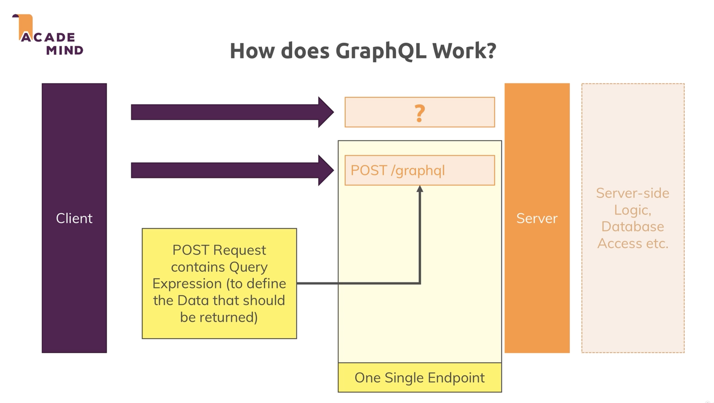
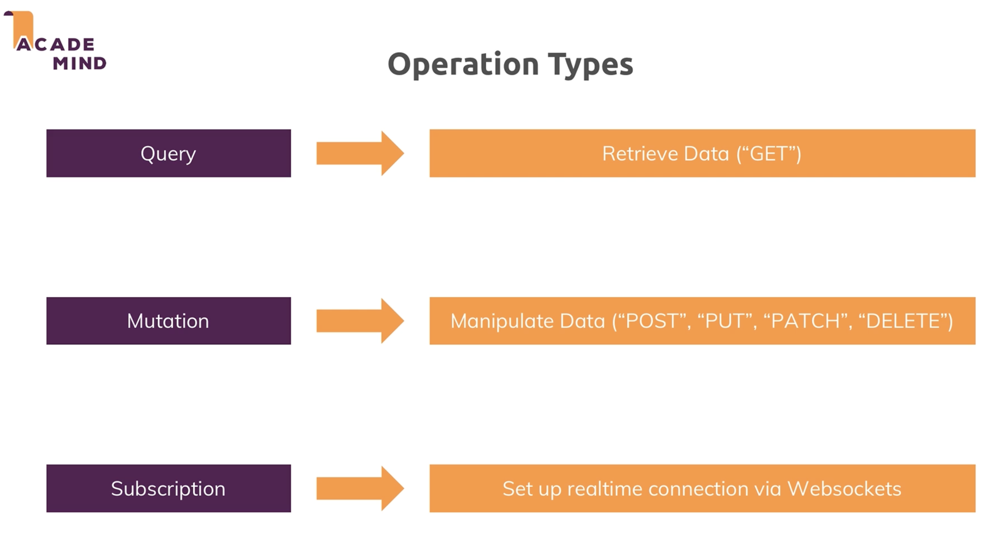
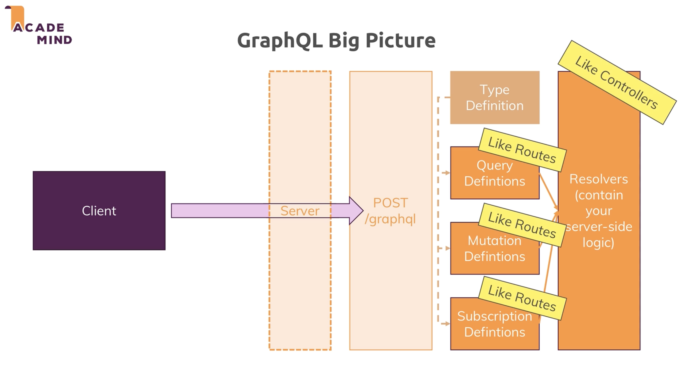

C28 GraphQL

REST on Steroids

# Intro

+ what is 
+ GraphQL vs REST
+ how to use GraphQL

what is GraphQL?

REST API: stateless, client-independent API for exchanging data

GraphQL API: stateless, client-independent API for exchanging data with higher query flexibility

REST API limitations: data format returned from a REST API is fixed

+ We may just want a part of the info extract from a REST API 
  + Solution1:  create more REST API endpoint => lots of endpoints => not flexible, hard to maintain
  + Solution2: add query parameters => API becomes hard to understand
  + Solution3: use GraphQL

How does GraphQL work?

graphQL query is similar to database query language, just declare the data structure should be returned

+ single endpoint if using graphQL (POST/graphql)

graphQL Analogy to REST apis

use POST because Request Body defines Data Structure of retrieved data (the data should be returned)

+ Type definition
+ Query
+ Mutation
+ Subscription
+ ...

+ server-side resolver analyses request body, fetches and prepares and returns data

