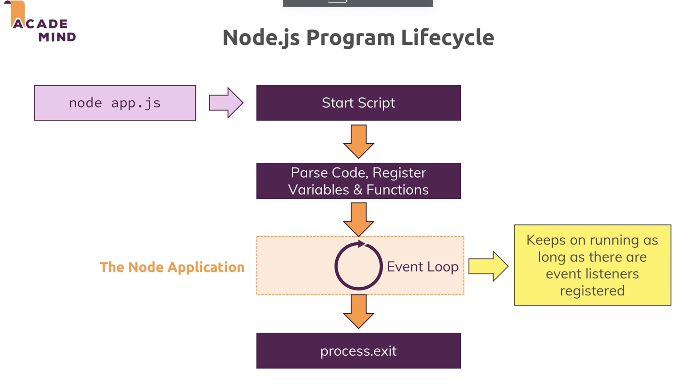

C3 Basics of Node.js


# Abstract


Node features

+ Event Driven Code Execution
  + Event Loop
    + Callback

+ Node.js core modules


# 1. Init demo

## How the Web Works

讲 Client - server - database 的架构

+ server 作为Facade access database


HTTP, HTTPs protocols basic intro

[bytebytego: how does HTTP work](https://blog.bytebytego.com/p/how-does-https-work-episode-6)


## Create a node server 

26

Core glogbal Modules

+ `http`: launch a server, send requests

+ `https`: launch a SSL server

+ `fs`: 

+ `path`

+ `os`


app.js

+ we create a server and pass a requestListener (which is a function) to it
  + if a request is received, do what is defined in listener

```js
const http = require("http"); // look for a local file named 'http.js'

// 写法1
// function rqListener(req, res){
// }
// http.createServer(rqListener);

// 写法2
// http.createServer(function (req, res) {}); 

// 写法3
const server = http.createServer((req, res) => {
    console.log(req)
}); // same thing

server.listen(3000);
```


## Node Lifecycle & Event Loop

Event loop: node,js runs mutltiple threads behind the scenes

https://nodejs.org/en/docs/guides/event-loop-timers-and-nexttick





## Request & response

### Understanding request

```js
const http = require("http"); // look for a local file named 'http.js'

const server = http.createServer((req, res) => {
  console.log(req.url, req.method, req.headers);

}); // same thing

server.listen(3000);     
```

visist localhost:3000/test, 得到:

```json
/test GET {
  host: 'localhost:3000',
  connection: 'keep-alive',
  'sec-ch-ua': '"Not/A)Brand";v="99", "Google Chrome";v="115", "Chromium";v="115"',
  'sec-ch-ua-mobile': '?0',
  'sec-ch-ua-platform': '"macOS"',
  'upgrade-insecure-requests': '1',
  'user-agent': 'Mozilla/5.0 (Macintosh; Intel Mac OS X 10_15_7) AppleWebKit/537.36 (KHTML, like Gecko) Chrome/115.0.0.0 Safari/537.36',
  accept: 'text/html,application/xhtml+xml,application/xml;q=0.9,image/avif,image/webp,image/apng,*/*;q=0.8,application/signed-exchange;v=b3;q=0.7',
  'sec-fetch-site': 'none',
  'sec-fetch-mode': 'navigate',
  'sec-fetch-user': '?1',
  'sec-fetch-dest': 'document',
  'accept-encoding': 'gzip, deflate, br',
  'accept-language': 'zh-CN,zh;q=0.9'
```


### Sending Responses

利用response class的method来直接write() 

```js
const http = require("http"); // look for a local file named 'http.js'

const server = http.createServer((req, res) => {
  console.log(req.url, req.method, req.headers);

  res.setHeader("Content-Type", "text/html");
  res.write("<html>");
  res.write("<head><title>My First Page</title></head>");
  res.write("<body><h1>Hello from my Node.js server!</h1></body>");
  res.write("</html>");

  res.end(); // stop writing response
}); 

server.listen(3000);
```

re-run, visit localhost:3000, you will see the html


more on [http headers](https://developer.mozilla.org/en-US/docs/Web/HTTP/Headers) if interested


### :moon: Redirect request & Parsing Request body


Streams & Buffers


:gem: demo

+ root path: '/'
  + form  action='/message' method = 'POST'
  + input
  + button: onClick direct to '/message' and do a HTTP POST method to server
+ when at '/message'
  + parse the incoming data to String using Buffer, then write to a local file, then direct webpage back to '/'

代码要比java简洁很多, 同时定义callback function也比java方便

```js
const http = require("http"); // look for a local file named 'http.js'
const fs = require("fs");

const server = http.createServer((req, res) => {
  const url = req.url;
  const method = req.method;

  if (url === "/") {
    res.write("<html>");
    res.write("<head><title>Enter Message</title></head>");
    res.write(
      "<body><form action='/message' method='POST'><input type='text' name='message'><button type='submit'>Send</button></form></body>"
    );
    res.write("</html>");
    return res.end();
  }

  // when click on Send button on the page of localhost:3000, direct to here
  if (url === "/message" && method === "POST") {
    const body = [];
    // callback is run for every incoming data
    req.on("data", (chunk) => {
      console.log(chunk);
      body.push(chunk);
    });

    req.on('end', ()=>{
      const parsedBody = Buffer.concat(body).toString();
      console.log(parsedBody);
      const message = parsedBody.split('=')[1];
      fs.writeFileSync("message.txt", message);
    })

    res.statusCode = 302;
    res.setHeader("Location", "/"); // after the POST request is processed, the client will be redirected to the server's root URL.
    return res.end();
  }

  res.setHeader("Content-Type", "text/html");
  res.write("<html>");
  res.write("<head><title>My First Page</title></head>");
  res.write("<body><h1>Hello from my Node.js server!</h1></body>");
  res.write("</html>");

  res.end(); // stop writing response
});

server.listen(3000);
```


# 2. Node.js specific features

## Event Driven Code Execution

一句话: Node.js 的代码还是一行一行执行的, 只是遇到callback时不是立马执行它而是把它register之后待触发条件满足再执行. 

:bangbang: 这就带来一个问题, 需要关注methods之间是否存在dependency

```js
// register this first, then skip to doSomething1()
defineCallBackHere( ()=>{
  doSomething2();
})
// run 
doSomething1();
```

to be logically correct, doSomething1 cannot be done ahead of doSomething2 (有点类似祖母悖论). 

+ i.e. 存在dependency: doSomething2 --> doSomething1, 

如果doSomething2 和doSomething1有这种dependency, 就如下处理

```js
defineCallBackHere( ()=>{
  doSomething2();
  doSomething1();
})

```

app.js

```js
const http = require("http"); // look for a local file named 'http.js'
const fs = require("fs");

const server = http.createServer((req, res) => {
  const url = req.url;
  const method = req.method;

  if (url === "/") {
    res.write("<html>");
    res.write("<head><title>Enter Message</title></head>");
    res.write(
      "<body><form action='/message' method='POST'><input type='text' name='message'><button type='submit'>Send</button></form></body>"
    );
    res.write("</html>");
    return res.end();
  }

  // when click on Send button on the page of localhost:3000, direct to here
  if (url === "/message" && method === "POST") {
    const body = [];

    // callback is fisrtly registered, then run on every incoming data
    req.on("data", (chunk) => {
      console.log(chunk);
      body.push(chunk);
    });

    // callback is firstly registered
    return req.on('end', ()=>{
      // parse
      const parsedBody = Buffer.concat(body).toString();
      console.log(parsedBody);
      const message = parsedBody.split('=')[1];
      fs.writeFileSync("message.txt", message);		// code flow will be blocked here 

      res.statusCode = 302;
      res.setHeader("Location", "/"); // after the POST request is processed, the client will be redirected to the server's root URL.
      return res.end();
    })

  }

  res.setHeader("Content-Type", "text/html");
  res.write("<html>");
  res.write("<head><title>My First Page</title></head>");
  res.write("<body><h1>Hello from my Node.js server!</h1></body>");
  res.write("</html>");

  res.end(); // stop writing response
});

server.listen(3000);
```


## Blocking & non-blocking code

36

`fs.writeFileSync("message.txt", message)`: code flow will be blocked at this line

`fs.writeFile()`: Asynchronously writes data to a file, replacing the file if it already exists.

+ callback 也可nested.
+ Node.js的核心就是定义callback, event-driven code execution. 遇到某行本应long-run的task, 先register, 然后handle给os进行多线程操作, 这样做code flow很少会被block, 因而more responsive

```js
// callback is firstly registered
    return req.on('end', ()=>{
      // parse
      const parsedBody = Buffer.concat(body).toString();
      console.log(parsedBody);
      const message = parsedBody.split('=')[1];
  
      fs.writeFile("message.txt", message, (err)=>{
        // callback runs onError or done writing the file
        res.statusCode = 302;
        res.setHeader("Location", "/"); // after the POST request is processed, the client will be redirected to the server's root URL.
        return res.end();
      });   
    })
```


## :moon: Node.js - look behind the scenes

Single Thread, Event Loop & Blocking Code


2 figs (I cannot find the slides)


[chatGPT: Event Loop](./sub_topics/EventLoop.md)


more on Node.js Event Loop Phases

https://nodejs.org/en/docs/guides/event-loop-timers-and-nexttick

more on blocking & non-blocking code

https://nodejs.org/en/docs/guides/dont-block-the-event-loop


## Using Node Module system

refactor code using Node Module

Module 也保证了encapsulation, 在一个js file里是不能modify另一个js file的!

app.js

```js
const http = require("http"); // look for a local file named 'http.js'
const routes = require("./routes");

console.log(routes.someTextL);
const server = http.createServer(routes.handler);

server.listen(3000);
```

Routes.js

+ exports 的几种写法

```js
const fs = require("fs");

const requestHandler = (req, res) => {
  const url = req.url;
  const method = req.method;

  if (url === "/") {
    res.write("<html>");
    res.write("<head><title>Enter Message</title></head>");
    res.write(
      "<body><form action='/message' method='POST'><input type='text' name='message'><button type='submit'>Send</button></form></body>"
    );
    res.write("</html>");
    return res.end();
  }

  // when click on Send button on the page of localhost:3000, direct to here
  if (url === "/message" && method === "POST") {
    const body = [];

    // callback is fisrtly registered, then run on every incoming data
    req.on("data", (chunk) => {
      console.log(chunk);
      body.push(chunk);
    });

    // callback is firstly registered
    return req.on("end", () => {
      // parse
      const parsedBody = Buffer.concat(body).toString();
      console.log(parsedBody);
      const message = parsedBody.split("=")[1];

      fs.writeFile("message.txt", message, (err) => {
        // callback runs onError or done writing the file
        res.statusCode = 302;
        res.setHeader("Location", "/"); // after the POST request is processed, the client will be redirected to the server's root URL.
        return res.end();
      });
    });
  }

  res.setHeader("Content-Type", "text/html");
  res.write("<html>");
  res.write("<head><title>My First Page</title></head>");
  res.write("<body><h1>Hello from my Node.js server!</h1></body>");
  res.write("</html>");

  res.end(); // stop writing response
};

// 写法1
// module.exports = requestHandler;

// 写法2
module.exports = {
    handler: requestHandler,
    someTextL: 'some hard coded text'
};

// 写法3
// module.exports.handler = requestHandler;
// module.exports.someText = 'some hard coded text';
// // shortcut 写法
// exports.handler = requestHandler;
// exports.someText = 'some hard coded text';
```


