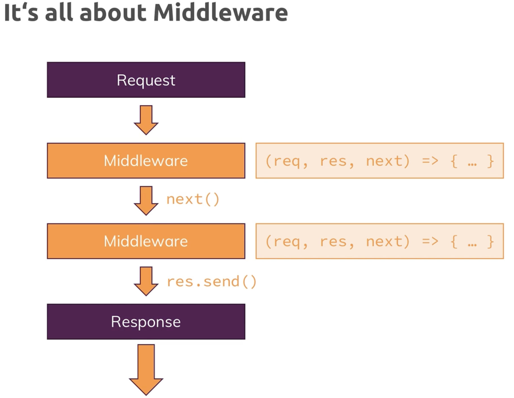

C5:  working with Express.js


1h34min content

# Abstract

note content of web page in this class is still hard coded


handling HTTP request-response 

+ middleware in Express.js

  + `app.use( )`	...
  + `next()`
  + middleware ordering
  + Middleware for 
    + bodyPaser
    + serving files statically 

+ router in Express.js

  + filters for HTTP methods
  + filters for URL path

+ The concept of "View"

  + `sendFile()` allows send html file back to browser
  + serving files statically 

  


# 1. Intro


## What is Express.js


Express.js is a back-end web application framework for building *<u>RESTful APIs</u>* with Node.js. It is designed for building web applications and APIs. [It has been called the de facto standard server framework for Node.js](https://en.wikipedia.org/wiki/Expressjs)[1](https://en.wikipedia.org/wiki/Expressjs). Express.js works on top of Node.js web server functionality to simplify its APIs and add helpful new features. It makes it easier to organize your application’s functionality with middleware and routing. [It adds helpful utilities to Node.js HTTP objects and facilitates the rendering of dynamic HTTP objects](https://www.geeksforgeeks.org/express-js/)[2](https://www.geeksforgeeks.org/express-js/).


## Install Express.js


install express.js to you local path

```console
npm install --save express
```


## :moon: middleware 

Express.js is all about middleware




app.js

- `app.use()` is a method to set up middleware in Express. Middleware are functions that process incoming requests.

```js
const express = require("express"); // hold cmd to see source code

const app = express();

// middleware1
app.use((req, res, next) => {
  console.log("In the middleware!");
  next(); // call this to allow the request to continue to the next middleware in line
});
// middleware2
app.use((req, res, next) => {
  console.log("In another middleware!");
  res.send("<h1>Hello From Express.js</h1>");
});

app.listen(3000);	// create a server that intake app as request-response handler listening on port3000
```

runn app.js, check out at localhost:3000, you will see

```console
In the middleware!
In another middleware!
```

and browser received the html we sent in the 2nd middleware


# 2. Routes

## 2.1 Handling different routes

63

check app.use() offical doc:

[Express 5.x - API Reference (expressjs.com)](http://expressjs.com/en/5x/api.html#app.use)

:gem: app.js

```js
const express = require("express"); // hold cmd to see source code

const app = express();

// 1st middleware
app.use("/", (req, res, next) => {
  console.log("This always runs!");
  next();
});
// 2nd middleware
app.use("/add-product", (req, res, next) => {
  console.log("In 2nd middleware!");
  res.send("<h1>The 'Add Product Page'</h1>");
});
// 3rd middleware
app.use("/", (req, res, next) => {
  console.log("In 3rd middleware!");
  res.send("<h1>Hello From Express.js</h1>");
});

app.listen(3000);
```


**Important Note on Middleware Ordering**: *<u>Middleware and routes in Express are executed in the order they're defined.</u>* This means that the third middleware (root route "/") will only run for requests that haven't been handled by previous middleware. Given the current code, if you visit the root route ("/"), only the first and third middleware will run. If you visit "/add-product", the first and second middleware will run.

However, because both the second and third middleware send responses (using `res.send()`), it's essential to ensure that no request matches both routes. If that were to happen, there would be an error because you can't send multiple responses to a single request. In this code, there's no conflict because the specific path "/add-product" will only trigger the second middleware, and the more general path "/" will only trigger the third middleware.


:bangbang: notes:  the order of middleware and route definitions in Express is crucial: 

+ ***<u>More specific paths or routes should be defined before more general ones</u>*** to ensure that they are correctly matched and handled.

if you define app.js as:

```js
const express = require("express"); // hold cmd to see source code

const app = express();

// 1st middleware
app.use("/", (req, res, next) => {
  console.log("This always runs!");
  next();
});

// 2rd middleware
app.use("/", (req, res, next) => {
  console.log("In 3rd middleware!");
  res.send("<h1>Hello From Express.js</h1>");
});

// 3nd middleware
app.use("/add-product", (req, res, next) => {
  console.log("In 2nd middleware!");
  res.send("<h1>The 'Add Product Page'</h1>");
});

app.listen(3000);
```

- now if you try to access `'/add-product'` in your browser, you would expect the third middleware to handle this request. However, because the second middleware with the `'/'` route is defined first, it will catch all incoming requests (because `'/'` matches all routes).
- This means the response from the second middleware will be sent, and the third middleware will never get a chance to handle the `'/add-product'` route.


### Assignment2

```console
npm init

npm install --save-dev nodemon

npm install --save express
```

app.js

```js
const express = require("express"); // hold cmd to see source code

const app = express();

app.use("/user", (req, res, next) => {
  console.log("In 1nd middleware!");
  res.send("<h1>Users' Page</h1>");
});

app.use("/", (req, res, next) => {
  console.log("In 2rd middleware!");
  res.send("<h1>Hello From Express.js</h1>");
});

app.listen(3001);
```


## 2.2 Parsing incoming requests

64


[req.body](http://expressjs.com/en/5x/api.html#req.body): 

`req.body`

Contains key-value pairs of data submitted in the request body. By default, it is `undefined`, and is populated when you use body-parsing middleware such as [body-parser](https://www.npmjs.org/package/body-parser) and [multer](https://www.npmjs.org/package/multer).


app.js

+ The `bodyParser.urlencoded({extended: false})` middleware parses incoming requests with URL-encoded payloads. This means that when a form is submitted on a website and sends data to the server, this middleware will parse the form data and make it accessible through `req.body` in your route handlers.

```js
const express = require("express"); // hold cmd to see source code
const bodyParser = require("body-parser");

const app = express();

app.use(bodyParser.urlencoded({extended: false})); // register request body parser

// routes handling middleware ---------------
app.use("/", (req, res, next) => {
  console.log("This always runs!");
  next();
});

app.use("/add-product", (req, res, next) => {
  console.log("In 2nd middleware!");
  // send below to requested browser
  res.send(
    '<form action="/product" method="POST"><input type="text" name="title"><button type="submit">Add Product</buttom></form>'
  );
});

app.use("/product", (req, res, next) => {
  console.log(req.body);		// with bodyPaser, we can use req.body
  res.redirect("/");
});

app.use("/", (req, res, next) => {
  console.log("In 3rd middleware!");
  res.send("<h1>Hello From Express.js</h1>");
});

app.listen(3000);
```


## 2.3 :full_moon: Limit middleware execution to a certain HTTP method

:bangbang: additional filtering

`app.use()` works for all HTTP methods, now if I want to make additional filtering to limit a path to a specific type of HTTP method, how to do that?

use `app.get()`, `app.post()`...

:book: [methods of express() application](http://expressjs.com/en/5x/api.html#app.get.method)


:gem: app.js

+ `app.post("/product", ...)` this makes sure only a HTTP POST request at "/product" will be direct to this middleware. Other HTTP method will not be directed to this middleware (e.g. just type localhost:3000/product to your browser)

```js
const express = require("express"); // hold cmd to see source code
const bodyParser = require("body-parser");

const app = express();

app.use(bodyParser.urlencoded({extended: false})); // register request body parser


// routes handling middleware ---------------
app.use("/", (req, res, next) => {
  console.log("This always runs!");
  next();
});

app.use("/add-product", (req, res, next) => {
  console.log("In 2nd middleware!");
  res.send(
    '<form action="/product" method="POST"><input type="text" name="title"><button type="submit">Add Product</buttom></form>'
  );
});

// additional filtering, only run at post request
// if app.use(...), it will also run at get request
app.post("/product", (req, res, next) => {
  console.log(req.body);
  console.log("in post: /product")
  res.redirect("/");
});

app.use("/", (req, res, next) => {
  console.log("In 3rd middleware!");
  res.send("<h1>Hello From Express.js</h1>");
});

app.listen(3000);
```


## 2.4 :full_moon: Using Express Router 

65

now make the code more modular, split up into several router files


:gem: 04-express-router

router > admin.js

```js
const express = require("express");

const router = express.Router();

router.get("/add-product", (req, res, next) => {
  console.log("In 2nd middleware!");
  res.send(
    '<form action="/product" method="POST"><input type="text" name="title"><button type="submit">Add Product</buttom></form>'
  );
});

// additional filtering, only run at post request
// if app.use(...), it will also run at get request
router.post("/product", (req, res, next) => {
  console.log(req.body);
  console.log("in post: /product");
  res.redirect("/");
});

module.exports = router;
```

router > shop.js

```js
const express = require("express");

const router = express.Router();

router.get("/", (req, res, next) => {
  console.log("In 3rd middleware!");
  res.send("<h1>Hello From Express.js</h1>");
});

module.exports = router;
```

app.js

```js
const express = require("express"); // hold cmd to see source code
const bodyParser = require("body-parser");

const adminRoutes = require("./routes/admin");
const shopRoutes = require("./routes/shop");

const app = express();
app.use(bodyParser.urlencoded({ extended: false })); // register request body parser

// routes handling middleware ---------------
app.use(adminRoutes);
app.use(shopRoutes);

app.listen(3000);
```


:bangbang: note here the order of middle still matters! 


---

Add 404 error page

app.js

+ add a "catch all" middleware to return 'Page Not Found!'

```js
const express = require("express"); // hold cmd to see source code
const bodyParser = require("body-parser");

const adminRoutes = require("./routes/admin");
const shopRoutes = require("./routes/shop");

const app = express();
app.use(bodyParser.urlencoded({ extended: false })); // register request body parser

// routes handling middleware ---------------
app.use(adminRoutes);
app.use(shopRoutes);

// add a 'catch all' middle, if it can run up to here, it means no match in previous middlewares
app.use((req, res, next) => {
  res.status(404).send("<h1>Page Not Found!</h1>");
});

app.listen(3000);
```


### Filtering Path

---

app.js

+ 为adminRoutes添加一个path filter
  + URL以 ‘/admin’ 开头的都会被direct to adminRoutes . 就类似SpringBoot里@RESTController('/path1')一样

```js
const express = require("express"); // hold cmd to see source code
const bodyParser = require("body-parser");

const adminRoutes = require("./routes/admin");
const shopRoutes = require("./routes/shop");

const app = express();
app.use(bodyParser.urlencoded({ extended: false })); // register request body parser

// routes handling middleware ---------------
app.use('/admin', adminRoutes);
app.use(shopRoutes);

app.use((req, res, next) => {
  res.status(404).send("<h1>Page Not Found!</h1>");
});

app.listen(3000);
```

admin.js

+ router.method({path}, (req, res, next) => {} )中 path为relative path to '/admin'
+ :bangbang: 但其他地方的path, 都为absolute path, 得写全

```js
const express = require("express");

const router = express.Router();

// "/admin/add-product" => GET
router.get("/add-product", (req, res, next) => {
  console.log("In 2nd middleware!");
  res.send(
    '<form action="/admin/product" method="POST"><input type="text" name="title"><button type="submit">Add Product</buttom></form>'
  );
});

// "/admin/add-product" => POST
router.post("/product", (req, res, next) => {
  console.log(req.body);
  console.log("in post: /product");
  res.redirect("/");
});

module.exports = router;
```


# 3. Views

前面我们是直接res.send('') 以String的形式写html的, 这次send real HTML file upon request


views > 

shop.html

```html
<!DOCTYPE html>
<html lang="en">
  <head>
    <meta charset="UTF-8" />
    <meta name="viewport" content="width=device-width, initial-scale=1.0" />
    <title>Document</title>
  </head>
  <body>
    <header>
      <nav>
        <ul>
          <li><a href="/">Shop</a></li>
          <li><a href="/add-product">Add Product</a></li>
        </ul>
      </nav>
    </header>

    <main>
        <h1>My Products</h1>
        <p>List of all the products</p>
    </main>
  </body>
</html>
```

add-product.html

```html
<!DOCTYPE html>
<html lang="en">
  <head>
    <meta charset="UTF-8" />
    <meta name="viewport" content="width=device-width, initial-scale=1.0" />
    <title>Document</title>
  </head>
  <body>
    <header>
      <nav>
        <ul>
          <li><a href="/">Shop</a></li>
          <li><a href="/add-product">Add Product</a></li>
        </ul>
      </nav>
    </header>

    <main>
      <form action="admin/add-product" method="POST">
        <input type="text" name="title">
        <button type="submit">Add Product</button>
      </form>
    </main>
  </body>
</html>
```

404.html

```html
<!DOCTYPE html>
<html lang="en">
<head>
    <meta charset="UTF-8">
    <meta name="viewport" content="width=device-width, initial-scale=1.0">
    <title>Page Not Found!</title>
</head>
<body>
    <h1>Page Not Found!</h1>
</body>
</html>
```


## Serving html files


app.js

+ use core module 'path' to formulate the path string to the html file
  + __dirname is a global variable provided by node, it points to the absolute path of the current file in operating system

```js
const path = require('path')

const express = require("express"); // hold cmd to see source code
const bodyParser = require("body-parser");

const adminRoutes = require("./routes/admin");
const shopRoutes = require("./routes/shop");

const app = express();
app.use(bodyParser.urlencoded({ extended: false })); // register request body parser

// routes handling middleware ---------------
app.use('/admin', adminRoutes);
app.use(shopRoutes);

app.use((req, res, next) => {
  res.status(404).sendFile(path.join(__dirname, 'views', '404.html'));
});

app.listen(3000);
```

Alternatively, 也可用一个变量统一存储project的root directory name

util > path.js

```js
const path = require("path");
module.exports = path.dirname(require.main.filename);	// 自动找到本project的root directory name
```

```js
// 在需要的js file中
const rootDir = require("../util/path");
res.sendFile(path.join(rootDir, "views", "shop.html"));
```


Styling html

很繁琐


## Serving files statistically


```js
app.use(express.static(path.join(__dirname, 'public')));
```

+ The line you provided is an instruction for your Express.js application to serve static files, such as HTML, CSS, and JavaScript files, images, etc., from a directory named "public" in the root of your application. 

+ So, when you use this line in your Express application, any files in the `public` directory will be served up directly. For instance, if you had an image at `public/images/myImage.jpg`, it would be accessible in your browser at `http://yourServerAddress/images/myImage.jpg`.

  This is commonly used for serving up assets like stylesheets, scripts, and images, or even a full static website, without needing a specific route for each file.


:gem: demo in class

app.js

```js
const path = require('path')
const express = require("express"); // hold cmd to see source code
const bodyParser = require("body-parser");
const adminRoutes = require("./routes/admin");
const shopRoutes = require("./routes/shop");

const app = express();
app.use(bodyParser.urlencoded({ extended: false })); 

// ******** this middleware allows to retrive file under the path "public"
app.use(express.static(path.join(__dirname, 'public')));

// routes handling middleware ---------------
app.use('/admin', adminRoutes);
app.use(shopRoutes);

// page not found middleware
app.use((req, res, next) => {
  res.status(404).sendFile(path.join(__dirname, 'views', '404.html'));
});

app.listen(3000);
```

e.g. 

404.html

+ we put all css file under "/public/css"

```html
<!DOCTYPE html>
<html lang="en">
  <head>
    <meta charset="UTF-8" />
    <meta name="viewport" content="width=device-width, initial-scale=1.0" />
    <title>Page Not Found!</title>
    <!-- it ask for access an external file -->
    <link rel="stylesheet" href="/css/main.css">
  </head>
  <body>
    <header class="main-header">
      <nav class="main-header__nav">
        <ul class="main-header__item-list">
          <li class="main-header__item"><a class="active" href="/">Shop</a></li>
          <li class="main-header__item">
            <a href="/admin/add-product">Add Product</a>
          </li>
        </ul>
      </nav>
    </header>
    <h1>Page Not Found!</h1>
  </body>
</html>
```

