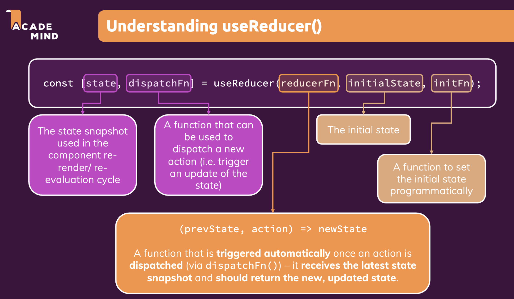

Handling side effects, using Reducers & Using the context API

+ Effects: separate UI interaction logic with other oepration logic (the side effect)
+ Reducers: managing more complex state 
+ Context: managing App-Wid or Component-Wide State with Context


# 1. Effects & useEffect

## What are "(side) effects" & introducing useEffect

143

React's `Main job`: render UI & react to user input

What we learned React.js in the past lectures:

```js
1. Evaluate & Render JSX
2. Manage State & Props
3. React to (User) Events & Input
4. Re-evaluate Component upon State & Props Change
```


`Side Effect`:  anything else other than `Main Job`, not ReactJs's main concerns.   React side effects can involve asynchronous data fetching, manually changing the DOM, using timers, logging, and more. In a React component, operations like these that don't directly relate to rendering the UI are referred to as side effects.

+ These tasks **must happen outside of the normal component evaluation and render cycle** - especially since they might block/delay rendering of component (e.g. Http requests). 
+ :bangbang: 其实核心思想就是想让<u>负责render UI与UI交互的逻辑</u>(main job)和<u>其他操作</u>(Side effect)进行分离, 从而减少后者对UI rendering & reaction的影响 => Java GUI里是通过Event Dispatch Thread来做的

```js
e.g.
1. Store Data in Browser Storage; 
2. Send Http Request to Backend Servers 
3. Set & Manage Timers
...
```


### :full_moon: useEffect() hook

:star: Solution: Handling side effects with the useEffect() Hook

```js
useEffect(()=>{...}, [dependencies]);
```

+ arg1: a callback function (the effect + return(()=>{})) that should be executed <u>**AFTER every component evaluation**</u> IF the specified dependencies changed. 
  
  + ```js
    React rendering component tree to UI
    
    after rendering
    	if (any of dependencies changed)
        do ()=>{} in return(()=>{}) in callback
        do effect in callback
    
    React rendering component tree to UI
    ...
    ```
    
  + Your side effect code goes into this function. 可以认为这里设置了一个callback function, 执行ReactJs component function时(即re-render时)会直接跳过useEffect()的代码块, 等时机合适callback function才会被执行
  
+ arg2: dependencies of this effect - the function only runs if the dependencies changed
  + specify your dependencies of your function here


---

chatGPT:

The `useEffect` Hook is executed after every render, including the first one. By default, effects run after every completed render, but you can choose to fire them only when certain values have changed.


+ Case 1: no dependency

```javascript
import React, { useState, useEffect } from 'react';

function Example() {
  const [count, setCount] = useState(0);

  // Similar to componentDidMount and componentDidUpdate:
  useEffect(() => {
    // Update the document title using the browser API
    document.title = `You clicked ${count} times`;
  });

  return (
    <div>
      <p>You clicked {count} times</p>
      <button onClick={() => setCount(count + 1)}>
        Click me
      </button>
    </div>
  );
}
```
In the above example, `useEffect` is setting the document title after React updates the DOM. Whenever the `count` state changes, React will re-render the component, and `useEffect` will be called after the render is done.


+ Case 2: with dependency

The `useEffect` hook can also take a second argument, which is an array of dependencies. The effect will only run when one of these dependencies changes. Here's an example:

```javascript
import React, { useState, useEffect } from 'react';

function Example() {
  const [count, setCount] = useState(0);

  useEffect(() => {
    document.title = `You clicked ${count} times`;
  }, [count]); // Only re-run the effect if count changes

  return (
    <div>
      <p>You clicked {count} times</p>
      <button onClick={() => setCount(count + 1)}>
        Click me
      </button>
    </div>
  );
}
```
In this example, the `useEffect` callback will only run when the `count` value changes. If the `count` value is the same between renders, React will skip executing the effect.  In React, when you use the `useEffect` hook with a dependency array, the callback function inside `useEffect` will be executed in the following cases:

1. **After the initial render:** The first time a component renders, React will run the `useEffect` hook after the render is committed to the screen.
2. **When one or more dependencies change:** After the initial render, the `useEffect` hook will only run again if one or more of its dependencies change. React will compare the current value of the dependency with its value during the last render, and if it's different, the effect will be run again.

:bangbang: The callback function inside `useEffect` is executed after the render is committed to the screen, not during the render. React first updates the DOM (the render phase), then it performs the side effects (the commit phase). This is why effects are also known as "after-effects". The side effects do not block the browser from updating the screen, which is important to keep the interface responsive. So, in a nutshell: the `useEffect` callback does not run during the render but runs <u>after the render is finished</u> **AND** <u>the changes have been committed to the screen.</u> This is also why React guarantees the DOM has been updated by the time it runs the effects.


Case 2.1

```js
import React, { useState, useEffect } from 'react';

function Example() {
  const [count, setCount] = useState(0);

  // Similar to componentDidMount and componentDidUpdate:
  useEffect(() => {
    // Update the document title using the browser API
    document.title = `You clicked ${count} times`;
  }, []);

  return (
    <div>
      <p>You clicked {count} times</p>
      <button onClick={() => setCount(count + 1)}>
        Click me
      </button>
    </div>
  );
}
```

if you specify an empty dependency, the effect is only executed once at the initial rendering


+ Case 3: cleanup

Another key feature of `useEffect` is cleanup. Some effects might require cleanup (e.g., subscriptions or timers), and you can return a function from `useEffect` to handle this cleanup. This returned function will be called by React before it runs the effect the next time and also before the component unmounting from real DOM.

```javascript
import React, { useState, useEffect } from 'react';

function Example() {
  const [count, setCount] = useState(0);

  useEffect(() => {
    const timerID = setInterval(() => {
      setCount(count => count + 1);
    }, 1000);

    return function cleanup() {
      clearInterval(timerID);
    };
  });

  return (
    <div>
      <p>You clicked {count} times</p>
      <button onClick={() => setCount(0)}>
        Reset
      </button>
    </div>
  );
}
```
In this example, a new timer is set up with `setInterval` when the component mounts and every time it re-renders, and it is cleared with `clearInterval` before every re-render and before unmounting, avoiding potential memory leaks.


## Using the useEffect() Hook

144

:gem: useEffect demo

利用browser提供的localStorage (which is independent of ReactJs) 来存储user的logged in 状态, 并将读取此等状态的逻辑(即`side effect`)与`main job` 分离 => 使用useEffect hook

实现效果, 当你刷新web page时, 如果此前用户已经logged in, 刷新之后用户还保留在logged in 状态.


```js
import React, { useState, useEffect } from "react";

import Login from "./components/Login/Login";
import Home from "./components/Home/Home";
import MainHeader from "./components/MainHeader/MainHeader";

function App() {
  const [isLoggedIn, setIsLoggedIn] = useState(false);

  // note we don't want to run args1 code inside a component function as they are side effects which might disrupt component rendering
  // by putting them in useEfect, we ensure that these code logics are only executed AFTER every component evaluation IF any of the dependencies changed
  // below code only run once if no dependency is specified
  useEffect(() => {
    const storedUserLoggedIn = localStorage.getItem("isLoggedIn"); // when re-render, check if user logged in
    if (storedUserLoggedIn === "1") {
      setIsLoggedIn(true);
    }
  }, []);

  const loginHandler = (email, password) => {
    // We should of course check email and password
    // But it's just a dummy/ demo anyways
    localStorage.setItem("isLoggedIn", "1"); // global variable provided by browser. Item is like a java entry: a key-value pair
    setIsLoggedIn(true);
  };

  const logoutHandler = () => {
    localStorage.removeItem("isLoggedIn");
    setIsLoggedIn(false);
  };

  return (
    <React.Fragment>
      <MainHeader isAuthenticated={isLoggedIn} onLogout={logoutHandler} />
      <main>
        {!isLoggedIn && <Login onLogin={loginHandler} />}
        {isLoggedIn && <Home onLogout={logoutHandler} />}
      </main>
    </React.Fragment>
  );
}

export default App;
```


### useEffect & dependencies

145

:gem: useEffect demo


Login.js

+ 每当user input时, 需要check validity of user input, which is independent to the main job => it's a side effect of user input, so do useEffect()

```js
import React, { useState, useEffect } from "react";

import Card from "../UI/Card/Card";
import classes from "./Login.module.css";
import Button from "../UI/Button/Button";

const Login = (props) => {
  const [enteredEmail, setEnteredEmail] = useState("");
  const [emailIsValid, setEmailIsValid] = useState();
  const [enteredPassword, setEnteredPassword] = useState("");
  const [passwordIsValid, setPasswordIsValid] = useState();
  const [formIsValid, setFormIsValid] = useState(false);

  // dependency between states;  enteredEmail. enteredPassword => formIsValid
  // whenever base state changes, check validity of user input => also a side effect of user input
  useEffect(() => {
    setFormIsValid(
      enteredEmail.includes("@") && enteredPassword.trim().length > 6
    );
  }, [enteredEmail, enteredPassword]);

  const emailChangeHandler = (event) => {
    setEnteredEmail(event.target.value);

    // move below to useEffect args1
    // setFormIsValid(
    //   event.target.value.includes("@") && enteredPassword.trim().length > 6
    // );
  };

  const passwordChangeHandler = (event) => {
    setEnteredPassword(event.target.value);

    // move below to useEffect args1
    // setFormIsValid(
    //   event.target.value.trim().length > 6 && enteredEmail.includes("@")    // setEnteredPassword is set value at the end of this render-cycle
    // );
  };

  const validateEmailHandler = () => {
    setEmailIsValid(enteredEmail.includes("@"));
  };

  const validatePasswordHandler = () => {
    setPasswordIsValid(enteredPassword.trim().length > 6);
  };

  const submitHandler = (event) => {
    event.preventDefault();
    props.onLogin(enteredEmail, enteredPassword);
  };

  return (
    <Card className={classes.login}>
      <form onSubmit={submitHandler}>
        <div
          className={`${classes.control} ${
            emailIsValid === false ? classes.invalid : ""
          }`}
        >
          <label htmlFor="email">E-Mail</label>
          <input
            type="email"
            id="email"
            value={enteredEmail}
            onChange={emailChangeHandler}
            onBlur={validateEmailHandler}
          />
        </div>
        <div
          className={`${classes.control} ${
            passwordIsValid === false ? classes.invalid : ""
          }`}
        >
          <label htmlFor="password">Password</label>
          <input
            type="password"
            id="password"
            value={enteredPassword}
            onChange={passwordChangeHandler}
            onBlur={validatePasswordHandler}
          />
        </div>
        <div className={classes.actions}>
          <Button type="submit" className={classes.btn} disabled={!formIsValid}>
            Login
          </Button>
        </div>
      </form>
    </Card>
  );
};

export default Login;
```


### :moon: What to add & not to add as Dependencies

146

总结一句话, dependency只加"会随着component re-render变化的", 因为useEffect()的设计初衷就是让callback在render cycle的间歇执行.


In the previous lecture, we explored `useEffect()` dependencies.

You learned, that you should add **"everything"** you use in the effect function as a dependency - **<u>i.e. all state variables and functions you use in there.</u>**

That is correct, but there are a **few exceptions** you should be aware of:

- You **DON'T need to add state updating functions** (as we did in the last lecture with `setFormIsValid`): React guarantees that those functions never change, hence you don't need to add them as dependencies (you could though)
- You also **DON'T need to add "built-in" APIs or functions** like `fetch()`, `localStorage` etc (functions and features built-into the browser and hence available globally): These browser APIs / global functions are not related to the React component render cycle and they also never change
- You also **DON'T need to add variables or functions** you might've **defined OUTSIDE of your components** (e.g. if you create a new helper function in a separate file): Such functions or variables also are not created inside of a component function and hence changing them won't affect your components (components won't be re-evaluated if such variables or functions change and vice-versa)

So long story short: <u>You must add all "things" you use in your effect function **if those "things" *could change* because your component (or some parent component) re-rendered.**</u> That's why 

+ *variables or state defined in component functions*,
+ *props or functions defined in component functions*

have to be added as dependencies!


:gem: Here's a made-up dummy example to further clarify the above-mentioned scenarios:

```js
import { useEffect, useState } from 'react'; 

let myTimer; 

const MyComponent = (props) => {  
  const [timerIsActive, setTimerIsActive] = useState(false);   
  const { timerDuration } = props; // using destructuring to pull out specific props values   
  useEffect(() => {    
    if (!timerIsActive) {      
    	setTimerIsActive(true);      
    	myTimer = setTimeout(() => {        
     	 setTimerIsActive(false);     
   		 }, timerDuration);    
    }  
  }, [timerIsActive, timerDuration]);};
```

In this example:

- `timerIsActive` is **added as a dependency** because it's component state that may change when the component changes (e.g. because the state was updated)
- `timerDuration` is **added as a dependency** because it's a prop value of that component - so it may change if a parent component changes that value (causing this MyComponent component to re-render as well)
- `setTimerIsActive` is **NOT added as a dependency** because it's that **exception**: State updating functions could be added but don't have to be added since React guarantees that the functions themselves never change
- `myTimer` is **NOT added as a dependency** because it's **not a component-internal variable** (i.e. not some state or a prop value) - it's defined outside of the component and changing it (no matter where) **wouldn't cause the component to be re-evaluated**
- `setTimeout` is **NOT added as a dependency** because it's **a built-in API** (built-into the browser) - it's independent from React and your components, it doesn't change


### Using the useEffect Cleanup Function

147


Login.js

+ 之前写的: useEffect中 whenever dependency enteredEmail or enteredPassword changes, the side effect function (args1 callback in useEffect) will be executed, this would leads to unnecessary overhead (imagine what if it involves HTTP request in the side effect function). Instead of checking user input on every key stroke, we want to check user input after user type in a chunck of characters  => timer + useEffect cleanup

  + Some effects might require cleanup (e.g., subscriptions or timers), and you can return a function from `useEffect` to handle this cleanup. This returned function will be called by React <u>before it runs the effect the next time</u> and also <u>before the component unmounting</u>  except the initial rendering. 

    + So in e.g. below effect code, the timer is reset before running the effect 

    

```js
const Login = (props) => {
  const [enteredEmail, setEnteredEmail] = useState("");
  const [emailIsValid, setEmailIsValid] = useState();
  const [enteredPassword, setEnteredPassword] = useState("");
  const [passwordIsValid, setPasswordIsValid] = useState();
  const [formIsValid, setFormIsValid] = useState(false);

  // dependency between states;  enteredEmail. enteredPassword => formIsValid
  // whenever base state changes, check validity of user input => also a side effect of user input
  useEffect(() => {
    // the effect -------------------------------
    const identifier = setTimeout(() => {
      console.log("checking input validity...");
      setFormIsValid(
        enteredEmail.includes("@") && enteredPassword.trim().length > 6
      );
    }, 500); // browser built-in
		// ------------------------------------------
    
    // below code will be called by react before it runs the effect next time
    return () => {
      console.log("clean up");
      clearTimeout(identifier); // brower built-in, clear the old timer before we set a new one
    }; // clean up

  }, [enteredEmail, enteredPassword]);

	// event handlers...

  return (
		// jsx...
  );
};
```


### useEffect Summary

148

复习上面的


# 2. UseReducers & Reducers 

149-153

alternative to useState() for managing more complex state: 

Sometimes you have more complex state - for example if it got multiple states, multiple ways of changing it or dependencies to other states. In that case, useState() often becomes hard or error-prone to use

<u>可以认为useReducer是基于useState的一种设计模式, in order to achieve high cohesion, low coupling when managing complex states</u>


## Introducing useReducer & reducers

149

:gem: useReducer demo

接上面的useEffect demo > Login.js 中对应email 有两个state: 一个用来存user的email输入content, 另一个boolean state表示前者的validity. 这里存在state 之间的dependency, 处理这种state dependency可以手写useState, 但是最好用useReducer来集中化管理 => 所以叫"reducer".

```js

const Login = (props) => {
  const [enteredEmail, setEnteredEmail] = useState("");
  const [emailIsValid, setEmailIsValid] = useState();

  const [enteredPassword, setEnteredPassword] = useState("");
  const [passwordIsValid, setPasswordIsValid] = useState();

  const [formIsValid, setFormIsValid] = useState(false);

  useEffect(() => {
    console.log("EFFECT RUNNINg");
  }, []);


  const emailChangeHandler = (event) => {
    setEnteredEmail(event.target.value);

    setFormIsValid(
      event.target.value.includes("@") && enteredPassword.trim().length > 6
    );
  };

  const passwordChangeHandler = (event) => {
    setEnteredPassword(event.target.value);

    setFormIsValid(
      event.target.value.trim().length > 6 && enteredEmail.includes("@")    // setEnteredPassword is set value at the end of this render-cycle
    );
  };
	
  // --------------------------------------------
  // handlers
  const validateEmailHandler = () => {
    setEmailIsValid(enteredEmail.includes("@"));
  };

  const validatePasswordHandler = () => {
    setPasswordIsValid(enteredPassword.trim().length > 6);
  };

  const submitHandler = (event) => {
    event.preventDefault();
    props.onLogin(enteredEmail, enteredPassword);
  };

  return (
    <Card className={classes.login}>
      <form onSubmit={submitHandler}>
        <div
          className={`${classes.control} ${
            emailIsValid === false ? classes.invalid : ""
          }`}
        >
          <label htmlFor="email">E-Mail</label>
          <input
            type="email"
            id="email"
            value={enteredEmail}
            onChange={emailChangeHandler}
            onBlur={validateEmailHandler}
          />
        </div>
        <div
          className={`${classes.control} ${
            passwordIsValid === false ? classes.invalid : ""
          }`}
        >
          <label htmlFor="password">Password</label>
          <input
            type="password"
            id="password"
            value={enteredPassword}
            onChange={passwordChangeHandler}
            onBlur={validatePasswordHandler}
          />
        </div>
        <div className={classes.actions}>
          <Button type="submit" className={classes.btn} disabled={!formIsValid}>
            Login
          </Button>
        </div>
      </form>
    </Card>
  );
};
```


## Using the useReducer() Hook

150




核心思想是将多个和某个网页元素相关, 同时具有dependency的state集中管理, 管理方式写在reducer里, 体现high cohesion, low couping => 类似Command Pattern: invoker -> action object (command object) -> state change. action object作为indirection的存在就是为了能多样化的满足多样化的state change


Login.js

+ 以下将email content state和isEmailValid 两个具有dependency的state, 集中统一管理
  + 这样他们的dependency如何一目了然同时提高了代码的复用率, 而不再像之前那样两个state之间的dependency如何管理的逻辑写到到处都是很难管理
+ password相关的state也可以这么处理

```js
// outside of component function, because it doesn't need to interact with any variable generated by component function
// the basic idea is to make statement management more cohesive
const emailReducer = (state, action) => {
  if (action.type === "USER_INPUT") {
    return { value: action.val, isValid: action.val.includes("@") };
  }
  if (action.type === "INPUT_BLUR") {
    return { value: state.value, isValid: state.value.includes('@') };    // assign value using previous state
  }
  return { value: "", isValid: false };
};

const Login = (props) => {
  const [enteredPassword, setEnteredPassword] = useState("");
  const [passwordIsValid, setPasswordIsValid] = useState();
  const [formIsValid, setFormIsValid] = useState(false);

  const [emailState, dispatchEmail] = useReducer(emailReducer, {
    value: "",
    isValid: false,
  });

  const emailChangeHandler = (event) => {
    // setEnteredEmail(event.target.value);
    dispatchEmail({ type: "USER_INPUT", val: event.target.value }); // dispatch an action obj to reducer

    // move below to useEffect args1
    setFormIsValid(
      event.target.value.includes("@") && enteredPassword.trim().length > 6
    );
  };

  const passwordChangeHandler = (event) => {
    setEnteredPassword(event.target.value);

    // move below to useEffect args1
    setFormIsValid(
      event.target.value.trim().length > 6 && emailState.isValid // setEnteredPassword is set value at the end of this render-cycle
    );
  };

  const validateEmailHandler = () => {
    // setEmailIsValid(emailState.isValid);
    dispatchEmail({ type: "INPUT_BLUR" });
  };

  const validatePasswordHandler = () => {
    setPasswordIsValid(enteredPassword.trim().length > 6);
  };

  const submitHandler = (event) => {
    event.preventDefault();
    props.onLogin(emailState.value, enteredPassword);
  };

  return (
    <Card className={classes.login}>
      <form onSubmit={submitHandler}>
        <div
          className={`${classes.control} ${
            emailState.isValid === false ? classes.invalid : ""
          }`}
        >
          <label htmlFor="email">E-Mail</label>
          <input
            type="email"
            id="email"
            value={emailState.value}
            onChange={emailChangeHandler}
            onBlur={validateEmailHandler}
          />
        </div>
        <div
          className={`${classes.control} ${
            passwordIsValid === false ? classes.invalid : ""
          }`}
        >
          <label htmlFor="password">Password</label>
          <input
            type="password"
            id="password"
            value={enteredPassword}
            onChange={passwordChangeHandler}
            onBlur={validatePasswordHandler}
          />
        </div>
        <div className={classes.actions}>
          <Button type="submit" className={classes.btn} disabled={!formIsValid}>
            Login
          </Button>
        </div>
      </form>
    </Card>
  );
};
```


## useReducer & useEffect

151


类似的, 对password也采用reducer来统一管理相关state

+ Now handler's responsibility: hand over to reducer for state management via dispatcher
+ since we are using useReducer for state management, a composite state is created. Accordingly, you should not put that composite state as the dependency in useEffect() but only the properties that is relevant

```js
import React, { useState, useEffect, useReducer } from "react";

import Card from "../UI/Card/Card";
import classes from "./Login.module.css";
import Button from "../UI/Button/Button";

// outside of component function, because it doesn't need to interact with any variable generated by component function
// the basic idea is to make statement management more cohesive
const emailReducer = (state, action) => {
  if (action.type === "USER_INPUT") {
    return { value: action.val, isValid: action.val.includes("@") };
  }
  if (action.type === "INPUT_BLUR") {
    return { value: state.value, isValid: state.value.includes("@") }; // assign value using previous state
  }

  return { value: "", isValid: false };
};

const passwordReducer = (state, action) => {
  if (action.type === "USER_INPUT") {
    return { value: action.val, isValid: action.val.trim().length > 6 };
  }
  if (action.type === "INPUT_BLUR") {
    return { value: state.value, isValid: state.value.trim().length > 6 }; // assign value using previous state
  }

  return { value: "", isValid: false };
};

const Login = (props) => {

  const [formIsValid, setFormIsValid] = useState(false);
  const [emailState, dispatchEmail] = useReducer(emailReducer, {
    value: "",
    isValid: false,
  });
  const [passwordState, dispatchPassword] = useReducer(passwordReducer, {
    value: "",
    isValid: false,
  });

  // destruct obj + alias assignment
  const { isValid: emailIsValid } = emailState;
  const { isValid: passwordIsValid } = passwordState;

  // dependency between states;  enteredEmail. enteredPassword => formIsValid
  // whenever base state changes, check validity of user input => also a side effect of user input
  useEffect(() => {
    const identifier = setTimeout(() => {
      console.log("checking input validity...");
      setFormIsValid(emailIsValid && passwordIsValid);
    }, 500); // browser built-in

    return () => {
      console.log("clean up");
      clearTimeout(identifier); // brower built-in, clear the old timer before we set a new one
    }; // clean up
  }, [emailIsValid, passwordIsValid]);    // effect only runs when certain part of the state is changed
	
  // ------------------------------------------------------------------------------------------
  // handler: directly hand over to reducer for state management via dispatcher 
  const emailChangeHandler = (event) => {
    dispatchEmail({ type: "USER_INPUT", val: event.target.value }); // dispatch an action obj to reducer
  };
  
  const passwordChangeHandler = (event) => {
    dispatchPassword({ type: "USER_INPUT", val: event.target.value });
  };
  
  const validateEmailHandler = () => {
    dispatchEmail({ type: "INPUT_BLUR" });
  };
  
  const validatePasswordHandler = () => {
    dispatchPassword({ type: "INPUT_BLUR" });
  };

  const submitHandler = (event) => {
    event.preventDefault();
    props.onLogin(emailState.value, passwordState.value);
  };

  return (
    <Card className={classes.login}>
      <form onSubmit={submitHandler}>
        <div
          className={`${classes.control} ${
            emailState.isValid === false ? classes.invalid : ""
          }`}
        >
          <label htmlFor="email">E-Mail</label>
          <input
            type="email"
            id="email"
            value={emailState.value}
            onChange={emailChangeHandler}
            onBlur={validateEmailHandler}
          />
        </div>
        <div
          className={`${classes.control} ${
            passwordState.isValid === false ? classes.invalid : ""
          }`}
        >
          <label htmlFor="password">Password</label>
          <input
            type="password"
            id="password"
            value={passwordState.value}
            onChange={passwordChangeHandler}
            onBlur={validatePasswordHandler}
          />
        </div>
        <div className={classes.actions}>
          <Button type="submit" className={classes.btn} disabled={!formIsValid}>
            Login
          </Button>
        </div>
      </form>
    </Card>
  );
};

export default Login;
```


现在, 关于一个React component的template:

```js

const Reducers

const MyComponent = () => {
  
  // hooks
  //	-- useReducer()
  //  -- useEffect() for running side effect
  
  // handlers
  
  
  // JSX
  
}

```


### Adding nested properties as dependencies to useEffect

case1: good practice:  we **pass specific properties instead of the entire object** as a dependency.

```js
const { someProperty } = someObject;
useEffect(() => {
  // code that only uses someProperty ...
}, [someProperty]);
```

case2: equivalent to case1

```js
useEffect(() => {
  // code that only uses someProperty ...
}, [someObject.someProperty]);
```

case3: avoid below code: Because now the **effect function would re-run whenever ANY property** of `someObject` changes - not just the one property (`someProperty` in the above example) our effect might depend on.

```js
useEffect(() => {
  // code that only uses someProperty ...
}, [someObject]);
```


## Summary: useReducer vs. useState for state management

153

when to use `useReducer`:

+ `useState`: the main state management "tool"
  + great for independent pieces of state/data
  + Great if state updates are easy and limited to a few kinds of updates
+ `useReducer`:  great if you need "more power"
  + should be considered if you have related pieces of state/data
  + can be helpful if you have more complex state updates


# 3. Introducing React Context (Context API)

154 -

可以认为React Context 是基于 state lifting 和 component communication的一种设计模式, 由ancestor作为provider直接为consumer提供需要的state与state change handler,  尤其在component tree很复杂时， 可以大大减少state 被props pass的路径长度


previous: only use state lifting by passing state as props via component one by one


Now: use Context to pass state and state change handler to the component that really needs them!


## Using the Recat Context API

155

:gem: useContext_demo

根据用户的登录状态 => conditional content of ui

```js
Component tree:

App
	|-- MainHeader
				|-- Navigation
							|-- isLoggedIn && <a/>
	|-- <main/>
				|-- !isLoggedIn && Login
				|-- isLoggedIn && Home
```


利用context API:

```js
Component tree:

App (- AuthConxt.Provider)
	|-- MainHeader
				|-- Navigation	(- AuthContext.Consumer)
							|-- isLoggedIn && <a/>
	|-- <main/>
				|-- !isLoggedIn && Login
				|-- isLoggedIn && Home
```


auth-context.js

+ 注意Context内一般是一个object (当然也可以是一个primitive variable)

```js
import React from "react";

const AuthContext = React.createContext({
  isLoggedIn: false,
});

export default AuthContext;
```


App.js

+ 使用AuthContext.Provider 包住App的jsx code

```js
import AuthContext from "./context/auth-context";

function App() {
  const [isLoggedIn, setIsLoggedIn] = useState(false);

  useEffect(() => {
    const storedUserLoggedIn = localStorage.getItem("isLoggedIn"); // when re-render, check if user logged in
    if (storedUserLoggedIn === "1") {
      setIsLoggedIn(true);
    }
  }, []);

  const loginHandler = (email, password) => {
    // We should of course check email and password
    // But it's just a dummy/ demo anyways
    localStorage.setItem("isLoggedIn", "1"); // global variable provided by browser. Item is like a java entry: a key-value pair
    setIsLoggedIn(true);
  };

  const logoutHandler = () => {
    localStorage.removeItem("isLoggedIn"); // remove that loggin item on log out
    setIsLoggedIn(false);
  };

  return (
    <AuthContext.Provider value={{ isLoggedIn: isLoggedIn}}>
      <MainHeader onLogout={logoutHandler} />
      <main>
        {!isLoggedIn && <Login onLogin={loginHandler} />}
        {isLoggedIn && <Home onLogout={logoutHandler} />}
      </main>
    </AuthContext.Provider>
  );
}
```

Navigation.js (MainHeader下的一个child)

+ 使用AuthContext.Consumer来解包

```js
import AuthContext from "../../context/auth-context";

const Navigation = (props) => {
  return (
    <AuthContext.Consumer>
      {(ctx) => {
        return (
          <nav className={classes.nav}>
            <ul>
              {ctx.isLoggedIn && (
                <li>
                  <a href="/">Users</a>
                </li>
              )}
              {ctx.isLoggedIn && (
                <li>
                  <a href="/">Admin</a>
                </li>
              )}
              {ctx.isLoggedIn && (
                <li>
                  <button onClick={ctx.onLogout}>Logout</button>
                </li>
              )}
            </ul>
          </nav>
        );
      }}
    </AuthContext.Consumer>
  );
};

export default Navigation;
```


## useContext hook

156

以上可以更加elegant: 使用useContext hook
