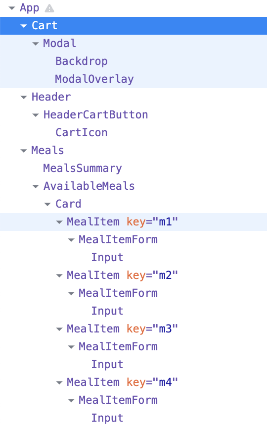

Food order app

164-183


# Abstract

Again, [Thinking in React – React](https://react.dev/learn/thinking-in-react)


# 1. Static Page


## Header

+ Import img as variable


### Cart button


## Meals

leaner jsx for map list

````js
const AvailableMeals = () => {
  // makes jsx part more leaner
  const mealsList = DUMMY_MEALS.map((meal) => {
    return <li>{meal.name}</li>;
  });

  return (
    <section className={classes.meals}>
      <ul>{mealsList}</ul>
    </section>
  );
};
````


### Meal Item

still building static component here


### :bangbang: Form

this Form allow user to choose food quantity 


:bangbang: customize a highly configurable Form component

UI > Input.js

+ 将props.input作为obj进行destruct

```js
const Input = (props) => {
  return (
    <div className={classes.input}>
      <label htmlFor={props.input.id}>{props.label}</label>
      <input {...props.input}/>
    </div>
  );
};
```

Meals > MealItem > MealItemForm.js

+ 可以向component传递object 作为 props之一. 以下Input的input props 中的field和"<input />"的原本的props重名, 因此传下去到"<Input />"直接destruct即可

```js
import Input from "../../UI/Input";

const MealItemForm = (props) => {
  return (
    <form className={classes.form}>
      <Input
        label="Amount"
        input={{
          id: "amount_" + props.id,		// 为了保证每个MealItemForm的id不同, 用来绑定
          type: "number",
          min: "1",
          max: "5",
          step: "1",
          defaultValue: "1",
        }}
      />
      <button>Add</button>
    </form>
  );
};
```


## Shopping Cart

172-

when click on shopping cart, it will pop out a tempory window (a modal) to check ordered meals


### Cart

弹窗页面component:

```js
const Cart = (props) => {
  const cartItems = [{ id: "c1", nam: "Sushi", amount: 2, price: 12.9 }].map(
    (item) => {
      return <li>{item.name}</li>;
    }
  );

  return (
    <div>
      <ul className={classes["cart-items"]}>{cartItems}</ul>
      <div className={classes.total}>
        <span>total Amount</span>
        <span>35.62</span>
      </div>
      <div className={classes.actions}>
        <button className={classes["button--alt"]}>close</button>
        <button className={classes.button}>Order</button>
      </div>
    </div>
  );
};
```


### :bangbang: Add a modal via React portal


public > index.js

+ decalre where the exit of portal should be => 

```html
  <body>
    <noscript>You need to enable JavaScript to run this app.</noscript>
    <div id="overlays"></div>		//exit of portal!
    <div id="root"></div>
  </body>
```


UI > Modal.js

+ Modal作为Wrapper component

```js
import { Fragment } from "react";
import ReactDOM from "react-dom";

import classes from "./Modal.module.css";

const Backdrop = (props) => {
  return <div className={classes.backdrop}></div>;
};

const ModalOverlay = (props) => {
  return (
    <div className={classes.modal}>
      <div className={classes.content}>{props.children}</div>
    </div>
  );
};

// points to the exit of portal
const portalElement = document.getElementById("overlays");

const Modal = (props) => {
  return (
    <Fragment>
      {ReactDOM.createPortal(<Backdrop />, portalElement)}
      {ReactDOM.createPortal(
        <ModalOverlay>{props.children}</ModalOverlay>,
        portalElement
      )}
    </Fragment>
  );
};

export default Modal;

```

Cart.js

+ 使用Wrapper component "<Modal />"作为 Cart component的最外层

```js
import Modal from "../UI/Modal";
import classes from "./Cart.module.css";

const Cart = (props) => {
  const cartItems = [{ id: "c1", nam: "Sushi", amount: 2, price: 12.9 }].map(
    (item) => {
      return <li>{item.name}</li>;
    }
  );

  return (
    <Modal>
      <ul className={classes["cart-items"]}>{cartItems}</ul>
      <div className={classes.total}>
        <span>total Amount</span>
        <span>35.62</span>
      </div>
      <div className={classes.actions}>
        <button className={classes["button--alt"]}>close</button>
        <button className={classes.button}>Order</button>
      </div>
    </Modal>
  );
};
```

最终效果是Cart + Overlay悬浮在其他component之上


component tree:

+ Cart 确实是出现在index.html中我们声明好的portal exit的位置



App.js

```js
function App() {
  return (
    <Fragment>
      <Cart/>   

      <Header />;
      <main>
        <Meals />
      </main>
    </Fragment>
  );
}
```


# 2. Dynamic Page

now start to manage state and build dynamic page


## Manage Cart & Modal state

174-

Implement: 

+ when click on the Cart button in header, the Cart component (弹窗) will show up
+ when click on the close button or the backdrop  in Cart component (弹窗),  the Cart will be hide

=> use state to manage these


App.js

+ 到处传递handlers

```js
function App() {
  const [cartIsShown, setCartIsShown] = useState(false);

  const showCartHandler = () => {
    setCartIsShown(true);
  };

  const hideCartHandler = () => {
    setCartIsShown(false);
  };

  return (
    <Fragment>
      {cartIsShown && <Cart onClose={hideCartHandler}/>}
      <Header onShowCart={showCartHandler}  />;
      <main>
        <Meals />
      </main>
    </Fragment>
  );
}
```


## Cart context

175-176


## Cart Reducer

177


## refs & forward refs

178


## Output Cart Items

179


## More complex Reducer logic

180


## Making Items removable

181


## useEffect hook

182
