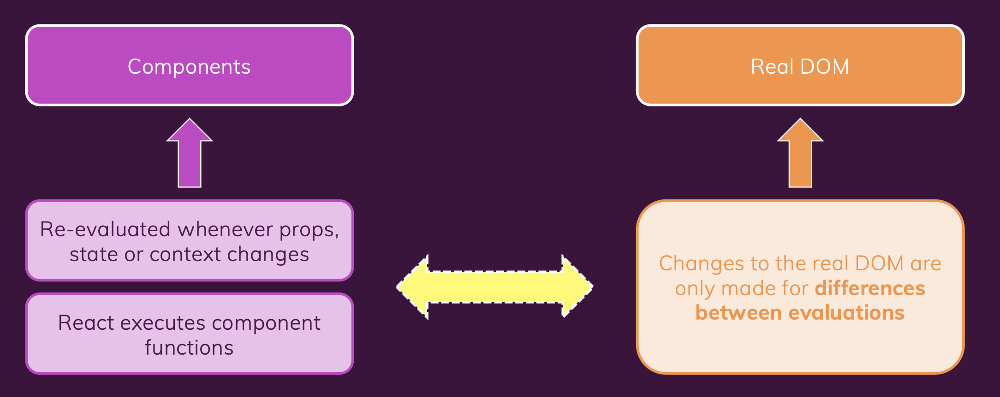

React optimization & behind the scenes

# How does React work behind the scenes


## Introduction


:pencil: [React vs React DOM](./sub_topics/React_vs_ReactDOM.md)

+ React => blueprint of a house, React DOM or React Native=> construction crew 

+ Re-evaluation of component !== re-rendering the real DOM




:pencil: [virtual DOM diffing](./sub_topics/VDOM_diffing.md)

```html
// previous evaluation results
<div>
	<h1>Hi there!</h1>
</div>

// current evaluation results
<div>
	<h1>Hi there!</h1> 
  <!--Changes are required <p> should be inserted in DOM (the rest should stay unchanged)-->
	<p>This is new!</p>		
  <!---->
</div>


```


## Components updates in action