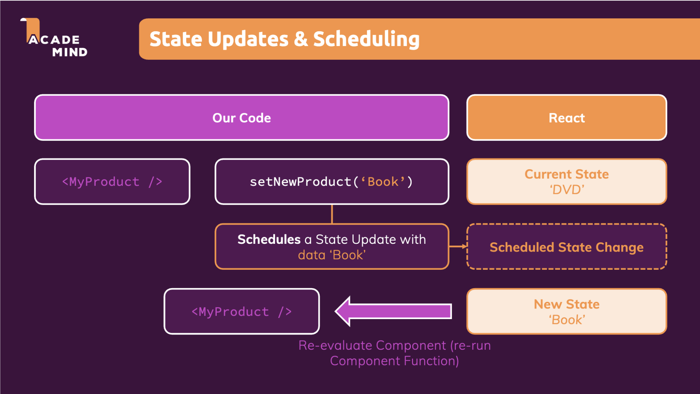

React optimization & behind the scenes


# Abstract

key takeaway

+ State change of a component => re-evaluation of this component => re-run its jsx code => all of its child components gets re-evaluted
  + :bangbang: note re-evaluation of a component !== re-render the real DOM
+ Based on above React re-evaluation mechanism, we can use `React.memo()` to prevent unnecessary component re-evaluation
  + we can use `useCallback()` to declare an object (including callback function) to be singleton to React across render cycles
    + if there are react states involved in that callback function, declare dependencies to useCallback to re-create function object to keep the state up-to-date


# How does React work behind the scenes


## Introduction


:pencil: [React vs React DOM](./sub_topics/React_vs_ReactDOM.md)

+ React => blueprint of a house, React DOM or React Native=> construction crew 

+ :bangbang: Re-evaluation of component !== re-rendering the real DOM


:pencil: [virtual DOM diffing](./sub_topics/VDOM_diffing.md)

```html
// previous evaluation results
<div>
	<h1>Hi there!</h1>
</div>

// current evaluation results
<div>
	<h1>Hi there!</h1> 
  <!--Changes are required <p> should be inserted in DOM (the rest should stay unchanged)-->
	<p>This is new!</p>		
  <!---->
</div>


```


## Components updates in action


now just app.js

+ we use a boolean state to conditionally render a <p> element

```js
import React, { useState } from "react";
import Button from "./components/UI/Button/Button";

import "./App.css";

function App() {
  const [showParagraph, setShowParagraph] = useState(false);

  console.log("APP RUNNING");

  const toggleParagraph = () => {
    setShowParagraph((prevShowParagraph) => {
      return !prevShowParagraph;
    });
  };

  return (
    <div className="app">
      <h1>Hi there!</h1>
      {showParagraph && <p>this is new!</p>}
      <Button onClick={toggleParagraph}>Toggle aragraph!</Button>
    </div>
  );
}

export default App;

```


## A closer look at child component re-evaluaiton

187-

:bangbang: conclusion: 

+ State change of component => cause this component to re-run (re-evaluate) => all code in jsx is re-run => `all of its child component in the jsx is re-run`
  + :bangbang: note re-run a functional component **doesn't** mean its corresponding real DOM gets updated 
  + certainly, there are some waste of resources in such re-run of all child component, we will talk about React.memo() to prevent unnecessary re-evaluations


Case1: 

+ we now introduce a child component DemoOutput.js

```js
import React, { useState } from "react";
import Button from "./components/UI/Button/Button";

import "./App.css";
import DemoOutput from "./components/Demo/DemoOutput";

function App() {
  const [showParagraph, setShowParagraph] = useState(false);

  console.log("APP RUNNING");

  const toggleParagraph = () => {
    setShowParagraph((prevShowParagraph) => {
      return !prevShowParagraph;
    });
  };

  return (
    <div className="app">
      <h1>Hi there!</h1>
      <DemoOutput show={showParagraph}></DemoOutput>
      <Button onClick={toggleParagraph}>Toggle aragraph!</Button>
    </div>
  );
}

export default App;
```


````js
import React from "react";

const DemoOutput = (props) => {
  console.log('DEMOOUTPUT RUNNING!')
  return <p>{props.show ? 'This is new' : ''}</p>;
};

export default DemoOutput;
````


+ app.js is re-evaluated , DemoOutput.js is re-evaluated
+ only <p> is re-rendered? 


---

Case2: 

now we don't pass state as props to DemoOutput, it's props should never get changed

```js
  return (
    <div className="app">
      <h1>Hi there!</h1>
      <DemoOutput show={false}></DemoOutput>
      <Button onClick={toggleParagraph}>Toggle aragraph!</Button>
    </div>
  );
```

But it turns out the DemoOutput.js component is still re-evaluated once we click on toggle button and thereafter triggers the state change in App.js

+ This is because parent's state change will also trigger parrent component's re-evaluation => re-run parent's jsx => also triggers all children component re-evaluation, but doesn't mean the real DOM of children component is re-rendered
  + :bangbang: note re-run or re-evaluation of a component function !== re-render the real DOM


### :moon: Prevent unnecessary Re-Evaluations with React.memo()

188-

To prevent unnecessary re-evaluation of a component: 


:gem: Case1: 

+ use `React.memo()` wrap component name when exporting

  + this tells React: check if any props of this component changed compared to previous props

    ```js
    // pseudo code:
    if ( props === props.prev)
      	then skip re-evaluation of this component 
    ```

```js
import React from 'react';

import classes from './Button.module.css';

const Button = (props) => {
  console.log("Button running!")

  return (
    <button
      type={props.type || 'button'}
      className={`${classes.button} ${props.className}`}
      onClick={props.onClick}
      disabled={props.disabled}
    >
      {props.children}
    </button>
  );
};

export default React.memo(Button);
```

Now that we see:

initial rendering:

```console
APP RUNNING
DemoOutput.js:4 DEMOOUTPUT RUNNING!
Button.js:6 Button running!
```

click on toggle button once, the DemoOutput stops re-evaluating

```console
APP RUNNING
Button.js:6 Button running!
```


:bangbang: why don't we use React.memo() everywhere?

+ React needs to store previous props, this also causes overhead
+ so it's a trade-off,  depends on your project size. For large project, React.memo() can cut off a large component tree from unnecessary re-evaluation

---


:gem: Case2: 

now if we apply the same for Button

```js
import React from 'react';

import classes from './Button.module.css';

const Button = (props) => {
  console.log("Button running!")

  return (
    <button
      type={props.type || 'button'}
      className={`${classes.button} ${props.className}`}
      onClick={props.onClick}
      disabled={props.disabled}
    >
      {props.children}
    </button>
  );
};

export default React.memo(Button);
```

but we still see Button is re-evaluated when its parent component App.js has state change, why? 

+ this is because the mechanism of JS comparisons: 

```js
// for primitive types 
false === false // true
'hi' === 'hi'	// true

// for object 
[1,2,3] === [1,2,3] // false
// function is also object
```


App.js

+ Everytime App.js is re-evaluated, the function App is re-executed
  + the props we pass to DemoOutput is primitive type, `React.memo()` think DemoOutput's props not changed => React skip re-evaluate DemoOutput
  + :bangbang: But the props we pass to Button is a function (also object), <u>so when App.js re-executed, the callback function toggleParagraph will be **re-created,**</u>  so the reference to  toggleParagraph we pass to Button would be different with previous props, so `React.memo()` still thinks Button's props changed => React re-evaluate Button
    + this lead to next class

```js
import React, { useState } from "react";
import Button from "./components/UI/Button/Button";

import "./App.css";
import DemoOutput from "./components/Demo/DemoOutput";

function App() {
  const [showParagraph, setShowParagraph] = useState(false);

  console.log("APP RUNNING");

  const toggleParagraph = () => {		// this callback function will be re-created on re-evaluation
    setShowParagraph((prevShowParagraph) => {
      return !prevShowParagraph;
    });
  };

  return (
    <div className="app">
      <h1>Hi there!</h1>
      <DemoOutput show={false}></DemoOutput>
      <Button onClick={toggleParagraph}>Toggle aragraph!</Button>
    </div>
  );
}

export default App;
```


### Prevent Function Re-Creation with useCallback()

---

189-

The `useCallback` hook is used to memoize functions. This means that it allows you to maintain the same function reference across multiple renders of a component, provided its dependencies haven't changed.


we can use `useCallback()` to tell React: please store the specified variable as a singleton across different render cycles (store it in memory, React will retrive it later if it is used). In this way, the function reference we pass to Button will always be the same and not change any more. 

```js
import React, { useState, useCallback } from "react";
import Button from "./components/UI/Button/Button";

import "./App.css";
import DemoOutput from "./components/Demo/DemoOutput";

function App() {
  const [showParagraph, setShowParagraph] = useState(false);

  console.log("APP RUNNING");

  const toggleParagraph = useCallback(() => {		// useCallback: React will store the callback as singlton
    setShowParagraph((prevShowParagraph) => {
      return !prevShowParagraph;
    });
  }, []);

  return (
    <div className="app">
      <h1>Hi there!</h1>
      <DemoOutput show={false}></DemoOutput>
      <Button onClick={toggleParagraph}>Toggle aragraph!</Button>
    </div>
  );
}

export default App;
```

now when click on toggle button, the Button will not be re-evaluated


#### useCallback() and its dependencies

---

190-

Closure in JavaScript

---

firstly, understand the concept of closure. Think it as a pattern that protect a local variable from being manipulated outside the function (实现数据的私有), 有点类似Java中的encapsulation

```js
// not use closure:
let i = 0;
function fn() {
  i++;	// note i is not private to fn()
  console.log(`this function has been invoked ${i} time`)
}

fun()	// 1
fun()	// 2
i = 100
fun()	// 101
```


```js
// when use closure
function count(){
	let i = 0;		// i is local variable to count(), it cannot be modifier outside count()
  function fn(){
    i++;
    console.log(`this function has been invoked ${i} times`);
  }
  return fn;		// we return fn, because we want to use it from outside
}

const fun = count()

fun()	// 1
fun() // 2
i = 100
fun() // 3
```


:gem: Demo

---

useCallback()可以对一个callback function进行singleton化处理, 但是这也有副作用: what if there are states in that callback function? 如果callback function只被create一次的话, state在这个callback function中只存在最初的snapshot就无法变了

App.js

+ 另外再加一个button用来控制toggle button是否可以被激活
  + 此时我们需要在之前的useCallback() 里声明的需要被singleton处理的callback function中加入一个额外的state: allowToggle (:question: what if this state is not primitive but an object?)
    + :bangbang: 如果我们不对useCallback()声明dependency的话, 那么allowToggle会随同callback function一样被singleton化处理 (memory中只有它一开始时的snapshot, 这个singleton callback function中的allowToggle的值一直不变还是false即使我们点击了Allow Toggling button)
    + 所以我们需要对useCallback()声明dependency, 当dependency的值改变时, re-create callback function (re-init singleton); 当dependency的值不改变时, callback function不会被re-create. 此时当我们点击Allow toggling button时, 就可以保证useCallback()里的callback function的allowToggle保持最新了

```js
import React, { useState, useCallback } from "react";
import Button from "./components/UI/Button/Button";

import "./App.css";
import DemoOutput from "./components/Demo/DemoOutput";

function App() {
  const [showParagraph, setShowParagraph] = useState(false);
  const [allowToggle, setAllowToggle] = useState(false);

  console.log("APP RUNNING");

  const toggleParagraph = useCallback(() => {	// ********* look at this!
    if (allowToggle) {
      setShowParagraph((prevShowParagraph) => !prevShowParagraph);
    }
  }, [allowToggle]);  // dependency of useCallback: if allowToggle changed or have a new value, re-create that singleton function

  const allowToggleHandler = () => {
    setAllowToggle(true);
  };

  return (
    <div className="app">
      <h1>Hi there!</h1>
      <DemoOutput show={showParagraph}></DemoOutput>
      <Button onClick={allowToggleHandler}>Allow toggling!</Button>
      <Button onClick={toggleParagraph}>Toggle aragraph!</Button>
    </div>
  );
}

export default App;
```


## A closer look at State & Components

192-

When a component gets re-evaluated, why state is not re-initialized since all its code is re-executed?

because useState() 's  initialization for a state only occurs if the component doesn't exist before, this include two scenarios:

+ when project is initialized
+ If the component is conditionally attached to the project,  it just re-attached to the project

```js
import React, { useState, useCallback } from "react";
import Button from "./components/UI/Button/Button";

import "./App.css";
import DemoOutput from "./components/Demo/DemoOutput";

function App() {
  const [showParagraph, setShowParagraph] = useState(false);
  const [allowToggle, setAllowToggle] = useState(false);

	...
}

export default App;
```


## State updates & scheduling

193





```js
// a handler within a functional component
const navigateHandler = (navPath) => {
  setCurrentNavPath(navPath);	// this just scheudle state updates, not update states immediately!
  // state was NOT updated here!	
  setDrawerIsOpen(false);
  // React will batch this two states change together
} 
```


gpt

---

React has an internal mechanism to batch and schedule state updates in order to optimize performance. This ensures that, in many cases, multiple state updates that occur in quick succession don't lead to multiple renders. Instead, React batches them together and handles them in a single render cycle.

Let's look into this mechanism more closely:

### 1. Batching:
React batches state updates that occur during React event handlers and lifecycle methods. This means that if you call `setState` (or `useState`'s setter function) multiple times inside a React event handler or lifecycle method, React will group these updates together and re-render the component only once with the batched updates.

**Example without batching:**

```javascript
function Counter() {
  const [count, setCount] = React.useState(0);

  function handleIncrement() {
    setCount(count + 1);
    setCount(count + 1);
  }

  console.log("Render", count);
  return <button onClick={handleIncrement}>Increment</button>;
}
```

In the above code, you might expect the `count` to increase by 2 when the button is clicked, but because of how React batches updates, it will only increase by 1. This is because both `setCount` calls use the same stale value of `count` during the batched update.

**Example using updater function for correct batching:**

```javascript
function handleIncrement() {
  setCount(prevCount => prevCount + 1);
  setCount(prevCount => prevCount + 1);
}
```

Using the updater function (`prevCount => prevCount + 1`), we ensure that each subsequent state update is based on the most recent state.

In conclusion, React's state scheduling and batching mechanisms are fundamental to its performance optimizations. By understanding these mechanisms, developers can better predict how their applications will behave and potentially optimize performance-critical sections.


## Optimizing with useMemo()

194

The `useMemo` hook is used to memoize values, which can be particularly useful when computing derived data or performing expensive calculations.


:gem: 07-optimizing-with-usememo

similar to `useCallback()` where callback function is memorized across render cycles by React, here we use `useMemo()` to memorize data across render cycles


app.js

+ memorize raw input to avoid re-creation of listItems when App is re-evaluated

```js
import React, { useState, useCallback, useMemo } from 'react';

import './App.css';
import DemoList from './components/Demo/DemoList';
import Button from './components/UI/Button/Button';

function App() {
  const [listTitle, setListTitle] = useState('My List');

  const changeTitleHandler = useCallback(() => {
    setListTitle('New Title');
  }, []);


  const listItems = useMemo(()=>[5, 3, 1, 10, 9], [])   // memorize data across render cycles

  return (
    <div className='app'>
      <DemoList title={listTitle} items={listItems} />
      <Button onClick={changeTitleHandler}>Change List Title</Button>
    </div>
  );
}

export default App;
```

DemoList.js

+ memorize sorted-data (it represents the results of a long-running task) across render cycles 

```js
import React, {useMemo} from 'react';

import classes from './DemoList.module.css';

const DemoList = (props) => {

  const {items} = props;

  // this line represents some long-running tasks
  const sortedList =  useMemo(()=>{   // memorize sorted data across render cycles
    console.log(`items sorted`)
    return items.sort((a, b) => a - b);
  }, [items])   // once items gets changed, re-execute 1st arguemnt function

  console.log('DemoList Running!')

  return (
    <div className={classes.list}>
      <h2>{props.title}</h2>
      <ul>
        {sortedList.map((item) => (
          <li key={item}>{item}</li>
        ))}
      </ul>
    </div>
  );
};

export default DemoList;
```

