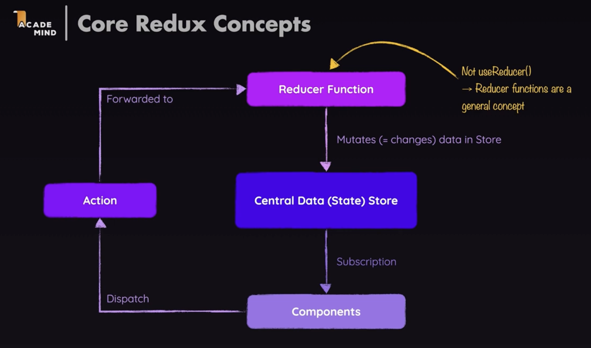

C18 (now C19) Redux basics

2hrs, 可单独看

# Key takeaways

Redux is not React-Specific, it is a js lib for state management, Other programming language might also have implementations of Redux


:bangbang: redux = command + observer pattern​

---

see intro at https://redux.js.org/introduction/getting-started#basic-example:

"The whole global state of your app is stored in an object tree inside <span style="color: yellow">a single *store*</span>. The only way to change the state tree is to create an *<span style="color:yellow">action</span>*, an object describing what happened, and *<span style="color:yellow">dispatch</span>* it to the store. To specify how state gets updated in response to an action, you write pure <span style="color:yellow">*reducer* functions</span> that calculate a new state based on the old state and the action."



:star: brief sum: in my opinion, redux is like a 'backend' on the frontend side, whenver a component want to issue a state change, it needs to dispatch an action (just like we send http request to backend) to reducer, and reducer will execute function to make the actual state change in data(state) store,   then the state change will automatically propogate to the components by subscription

```ts
// analogy:
components -> frontend
dispatch action with payload -> send http request with payload
Reducer Function -> backend 
central data(state) store -> database
subscription -> backend send response back to frontend
```

再打个比方, redux的执行过程就像是用遥控器换台, reducer function相当于遥控器, 而dispatch action就像是按遥控器上的按钮


:bangbang: ​redux vs. redux toolkit

---

+ 本质上redux是command + observer pattern
+ redux不是只局限于react, 是一种状态管理的lib, 基于redux往上还有redux-toolkit
  + 每个react app只有1个redux store, 每个redux store只能绑定1个reducer function, 每个reducer function只能对应1个state object  => leads to bloated state object & reducer function
  + that's where redux-toolkit comes in:
    + allowing state slices 
    + allowing mutating state obj 
    + allowing action name as function name to avoid typo


:bangbang: ​分三步使用Redux (Redux toolkit)管理状态

---

+ define reducer function & slices
+ Connect store with react app
+ extract data & dispatch actions in react componnet
  + useSelector() will automatically subscribe the component to redux store


# 1. Intro

managing cross-component / app-wide state with Redux. 

there are 3 types of states: 

1. local state: state belongs to a single component

   + e.g. listening to user input field

   + should be managed inside the component via `useState` OR `useReducer`

2. cross-component state: state affecting multiple components

   + open/close a modal overlay

   + requires props chain / context API

3. app-wide state: state affecting the entire app

   + user authentication status or chosen theme

   + requires props chain / context API


## Redux vs. React Context API

p404

Limitations of using react context API to manage large scale complex states

+ leads to deeply nested providers
+ leads to large complex provider, hard to maintain
+ Performance: context API is not ready to be used as a replacement for all flux-like state propogation


## How does redux work?

P405


+ 类似command pattern + observer pattern

```js
Component subscribes to the Central Data Store -> 
Component isue Action -> 
reducer execute that Action, which mutates state in store -> 
store informs the componenet state change 
```


# 2. Project hands-on

407-408

## 2.1 :gem: redux without react

```js
npm i redux
```


类似一个大号的useReducer

```js
const redux = require('redux');

// (older state + dispatch action) : New State Object => {}     
// reducer should be a pure function, no side-effects inside
const counterReducer = (state = {counter: 0}, action) => {      // give old state a default value for first run
    if(action.type === 'increment') {

        return {
            counter: state.counter + 1
        };
    }

    if(action.type === 'decrement') {
        return {
            counter: state.counter - 1
        }
    }

    return state;
    
}

const store = redux.createStore(counterReducer);        // this also calls the reducer once to initialize the state
console.log(store.getState());                          // get the current state, { counter: 0 }

// this gets executed whenever the state changes, to simulate a React Component
const counterSubscriber = () => {
    const latestState = store.getState();       // get the latest state after dispatch
    console.log(latestState);
}
store.subscribe(counterSubscriber);             // ! subscribe to the store


// issue actions to the store, which in turn triggers the change of component state
store.dispatch({type: 'increment'});            // dispatch an action, { counter: 1 }
store.dispatch({type: 'decrement'});            // dispatch an action, { counter: 0 }
```


## 2.2 :gem: react-redux

409-417


```js
npm i redux react-redux
```

和context API类似, redux还是分三步走:

+ 定义store
+ 声明store的应用范围
+ 在component中使用store


store > index.js

+ define reducer and bound that reducer to the store
  + :bangbang: always return a branch new state obj in reducer function, always avoid mutating existing state in reducer function

```js
import {createStore} from 'redux';


const initialState = {counter: 0, showCounter: true};

// ! returned state will not merge with existing state, it will replace/overwrite it
const counterReducer = (state = initialState, action) => {
    if(action.type === 'increment') {

        return {
            counter: state.counter++,
            showCounter: state.showCounter
        };
    } 

    if (action.type === 'increase'){
        return {
            counter: state.counter + action.amount,
            showCounter: state.showCounter
        }
    }

    if(action.type === 'decrement'){
        return {
            counter: state.counter - 1,
            showCounter: state.showCounter
        }
    } 

    if (action.type === 'toggle'){
        return {
            counter: state.counter,
            showCounter: !state.showCounter
        }
    }   

    return state;
}   

const store = createStore(counterReducer); // store is created

export default store;
```


### :bangbang: Important

never mutate existing state in the reducer, always overwrite it by returning a new state object

```js
const counterReducer = (state = initialState, action) => {
    if(action.type === 'increment') {
        state.counter++;				// ! avoid mutating exisitng states
        return {
            counter: state.counter,
            showCounter: state.showCounter
        };
    } 
}
```


```js
const counterReducer = (state = initialState, action) => {
    if(action.type === 'increment') {
	
        return {
            counter: state.counter++,   // ! avoid mutating exisitng states
            showCounter: state.showCounter
        };
    } 
}
```

reason behinds: 

[Reference vs Primitive Values (academind.com)](https://academind.com/tutorials/reference-vs-primitive-values/)


index.js

+ wrap `<App>` with react-redux Provider 

```js
import React from "react";
import ReactDOM from "react-dom/client";
import { Provider } from "react-redux";

import "./index.css";
import App from "./App";
import store from "./store";

const root = ReactDOM.createRoot(document.getElementById("root"));
root.render(
  <Provider store={store}>
    <App />
  </Provider>
);

```

App.js

```js
import Counter from './components/Counter';


function App() {
  return (
    <Counter />
  );
}

export default App;

```


components > Counter.js

+ `useSelector()` extract data from store.  just like `useState`
+ `useDispatch()` to dispatch action, and associated payload

```js
import { useSelector, useDispatch } from "react-redux";

import classes from "./Counter.module.css";

const Counter = () => {
  const dispatch = useDispatch();
  const counter = useSelector((state) => state.counter); // useSelector is a hook that allows us to extract data from the store
  const showCounter = useSelector((state) => state.showCounter);

  const incrementHandler = () => {
    dispatch({ type: "increment" });
  };

  const increaseHandler = () => {
    dispatch({ type: "increase", amount: 10 });				// dispatch action and payload
  };

  const decrementHandler = () => {
    dispatch({ type: "decrement" });
  };

  const toggleCounterHandler = () => {
    dispatch({ type: "toggle" });
  };

  return (
    <main className={classes.counter}>
      <h1>Redux Counter</h1>
      {showCounter && <div className={classes.value}>{counter}</div>}
      <div>
        <button onClick={incrementHandler}>increment</button>
        <button onClick={increaseHandler}>increase by 10</button>
        <button onClick={decrementHandler}>decrement</button>
      </div>
      <button onClick={toggleCounterHandler}>Toggle Counter</button>
    </main>
  );
};

export default Counter;
```


Redux with Class-based Components

p414

hooks are not usable in class-based components

just skip 


## 2.3 :bangbang::full_moon: Redux Toolkit

p418-

redux challenges when facing complex state management: 

+ in redux, there could be only 1 store, 1 state object, 1 reducer  

  + action type:  too manny, and easily typo error

  + state object:  too many field, and we have to respect existing state immutability in reducer function

  + reducer function number: too bloated in a single store 


solution =>  redux toolkit, 本质上是基于redux的facade lib, 对developer mask掉上面的不便利的地方

https://redux-toolkit.js.org/introduction/getting-started


store > index.js

+ `createSlice()` 解决上面的痛点
  + 可以mutate existing obj, 但背后redux-toolkit还是把这种代码转化成immutable code (return a brand new state obj)
  + 可以同时定义多个slice, 并merge到store里 (后面会讲到), 以此来来提高代码cohesion, readibility, maintainability
  + avoid typo, by declaring the action as the function name directly

```js
import {createSlice, configureStore} from '@reduxjs/toolkit';

const initialState = {counter: 0, showCounter: true};

const counterSlice = createSlice({
    name: 'counter',
    initialState: initialState,
    reducers: {
        increment(state) {
            state.counter++;        //  internally this mutable code is converted to immutable code by redux toolkit
        },
        decrement(state) {
            state.counter--;
        },
        increase(state, action) {
            state.counter = state.counter + action.payload;
        },
        toggleCounter(state) {
            state.showCounter = !state.showCounter;
        }
    }

});

// configStore will merge reducers into one
const store = configureStore({
    reducer: counterSlice.reducer
})

// !export below to allow component to dispatch actions
export const counterActions = counterSlice.actions;     
// counterSlice.actions.toggleCounter()        // this returns an action object {type: 'counter/toggleCounter', payload: undefined}

// ! export below to register store in the Provider
export default store;
```


index.js & App.js 

+ declare the scope of Provider &&  bound store to the Provider

```js
import React from "react";
import ReactDOM from "react-dom/client";
import { Provider } from "react-redux";

import "./index.css";
import App from "./App";
import store from "./store";

const root = ReactDOM.createRoot(document.getElementById("root"));
root.render(
  <Provider store={store}>
    <App />
  </Provider>
);

// ---------------------------
import Counter from './components/Counter';

function App() {
  return (
    <Counter />
  );
}

export default App;
```


Counter.js

+ dispatch action obj to reducer 

```js
import { useSelector, useDispatch } from "react-redux";

import { counterActions } from "../store";
import classes from "./Counter.module.css";

const Counter = () => {
  const dispatch = useDispatch();
  const counter = useSelector((state) => state.counter); // useSelector is a hook that allows us to extract data from the store
  const showCounter = useSelector((state) => state.showCounter);

  const incrementHandler = () => {
    // dispatch({ type: "increment" });
    dispatch(counterActions.increment()); // internally this is converted to {type: 'counter/increment', payload: undefined}
  };

  const increaseHandler = () => {
    // dispatch({ type: "increase", amount: 10 });
    dispatch(counterActions.increase(10)); // internally this is converted to {type: 'counter/increase', payload: 10}
  };

  const decrementHandler = () => {
    // dispatch({ type: "decrement" });
    dispatch(counterActions.decrement()); // internally this is converted to {type: 'counter/decrement', payload: undefined}
  };

  const toggleCounterHandler = () => {
    // dispatch({ type: "toggle" });
    dispatch(counterActions.toggleCounter()); // internally this is converted to {type: 'counter/toggleCounter', payload: undefined}
  };

  return (
    <main className={classes.counter}>
      <h1>Redux Counter</h1>
      {showCounter && <div className={classes.value}>{counter}</div>}
      <div>
        <button onClick={incrementHandler}>increment</button>
        <button onClick={increaseHandler}>increase by 10</button>
        <button onClick={decrementHandler}>decrement</button>
      </div>
      <button onClick={toggleCounterHandler}>Toggle Counter</button>
    </main>
  );
};

export default Counter;

```


### :bangbang::gem: Working with multiple slices 


依然分三步走

+ define reducers
  + like 定义好遥控器上的功能

+ connect store with components
  + 类似react context api的做法

+ dispatch actions in component
  + 按遥控器上的按钮


file structure:

```ts
src
	app.js
	index.js
	index.css
	> components
		...your react component here
	> store
		index.js		// register slices to redux. 其实背后应该还是把众多slice写在这里
		authSlice.js		// 关于auth 的global state managemnet
		counterSlice.js		// 关于counter的global state management
```


step1: define reducer function

---

+ with redux-toolkit, we can spilt the reducer function into seveeral slices

store > store.js

```js
import { configureStore } from "@reduxjs/toolkit";

import counterSlice from "./counterSlice";
import authSlice from "./authSlice";

// configStore will merge multiple reducers into one
const store = configureStore({
  reducer: { 
    counter: counterSlice.reducer, 
    auth: authSlice.reducer 
  },
});

// ! export below to register store in the Provider
export default store;
```

store > counterSlice.js

```js
import { createSlice} from "@reduxjs/toolkit";

const initialCounterState = { counter: 0, showCounter: true };
const counterSlice = createSlice({
  name: "counter",
  initialState: initialCounterState,
  reducers: {
    increment(state) {
      state.counter++; //  internally this mutable code is converted to immutable code by redux toolkit
    },
    decrement(state) {
      state.counter--;
    },
    increase(state, action) {
      state.counter = state.counter + action.payload;
    },
    toggleCounter(state) {
      state.showCounter = !state.showCounter;
    },
  },
});

// !export below to allow component to dispatch actions
export const counterActions = counterSlice.actions;
// counterSlice.actions.toggleCounter()        // this returns an action object {type: 'counter/toggleCounter', payload: undefined}

export default counterSlice;
```

store > authSlice.js

```js
import { createSlice} from "@reduxjs/toolkit";

const initialAuthState = { isAuthenticated: false };
const authSlice = createSlice({
  name: "auth",
  initialState: initialAuthState,
  reducers: {
    login(state) {
      state.isAuthenticated = true;
    },
    logout(state) {
      state.isAuthenticated = false;
    },
  },
});

// !export below to allow component to dispatch actions
export const authActions = authSlice.actions;

export default authSlice;
```


step2: Connects  store with app

---

```js
import React from "react";
import ReactDOM from "react-dom/client";
import { Provider } from "react-redux";

import "./index.css";
import App from "./App";
import store from "./store";

const root = ReactDOM.createRoot(document.getElementById("root"));
root.render(
  <Provider store={store}>
    <App />
  </Provider>
);
```

```js
import { useSelector } from "react-redux";

import Counter from "./components/Counter";
import Header from "./components/Header";
import Auth from "./components/Auth";
import UserProfile from "./components/UserProfile";

function App() {
  const isAuth = useSelector((state) => state.auth.isAuthenticated);

  return (
    <>
      <Header />
      {!isAuth && <Auth />}
      {isAuth && <UserProfile />}
      <Counter />
    </>
  );
}

export default App;
```


step3: dispatch action in component

---

components > Header.js

```js
import { useSelector, useDispatch } from "react-redux";

import { authActions } from "../store/authSlice";

import classes from "./Header.module.css";

const Header = () => {
  const dispatch = useDispatch();
  const isAuth = useSelector((state) => state.auth.isAuthenticated);

  const logoutHandler = () => {
    dispatch(authActions.logout());
  };


  return (
    <header className={classes.header}>
      <h1>Redux Auth</h1>

      {isAuth && (
        <nav>
          <ul>
            <li>
              <a href="/">My Products</a>
            </li>
            <li>
              <a href="/">My Sales</a>
            </li>
            <li>
              <button onClick={logoutHandler}>Logout</button>
            </li>
          </ul>
        </nav>
      )}
    </header>
  );
};

export default Header;
```

components > Auth.js

```js
import {useDispatch} from 'react-redux';

import { authActions } from '../store/authSlice';

import classes from './Auth.module.css';

const Auth = () => {
  const dispatch =useDispatch();


const loginHandler = (event) => {
  event.preventDefault();
  dispatch(authActions.login());
  
}

  return (
    <main className={classes.auth}>
      <section>
        <form onSubmit={loginHandler}>
          <div className={classes.control}>
            <label htmlFor='email'>Email</label>
            <input type='email' id='email' />
          </div>
          <div className={classes.control}>
            <label htmlFor='password'>Password</label>
            <input type='password' id='password' />
          </div>
          <button>Login</button>
        </form>
      </section>
    </main>
  );
};

export default Auth;
```

components > Counter.js

```js
import { useSelector, useDispatch } from "react-redux";

import { counterActions } from "../store/counterSlice";
import classes from "./Counter.module.css";

const Counter = () => {
  const dispatch = useDispatch();
  const counter = useSelector((state) => state.counter.counter); // useSelector is a hook that allows us to extract data from the store
  const showCounter = useSelector((state) => state.counter.showCounter);

  const incrementHandler = () => {
    // dispatch({ type: "increment" });
    dispatch(counterActions.increment()); // internally this is converted to {type: 'counter/increment', payload: undefined}
  };

  const increaseHandler = () => {
    // dispatch({ type: "increase", amount: 10 });
    dispatch(counterActions.increase(10)); // internally this is converted to {type: 'counter/increase', payload: 10}
  };

  const decrementHandler = () => {
    // dispatch({ type: "decrement" });
    dispatch(counterActions.decrement()); // internally this is converted to {type: 'counter/decrement', payload: undefined}
  };

  const toggleCounterHandler = () => {
    // dispatch({ type: "toggle" });
    dispatch(counterActions.toggleCounter()); // internally this is converted to {type: 'counter/toggleCounter', payload: undefined}
  };

  return (
    <main className={classes.counter}>
      <h1>Redux Counter</h1>
      {showCounter && <div className={classes.value}>{counter}</div>}
      <div>
        <button onClick={incrementHandler}>increment</button>
        <button onClick={increaseHandler}>increase by 10</button>
        <button onClick={decrementHandler}>decrement</button>
      </div>
      <button onClick={toggleCounterHandler}>Toggle Counter</button>
    </main>
  );
};

export default Counter;

```

