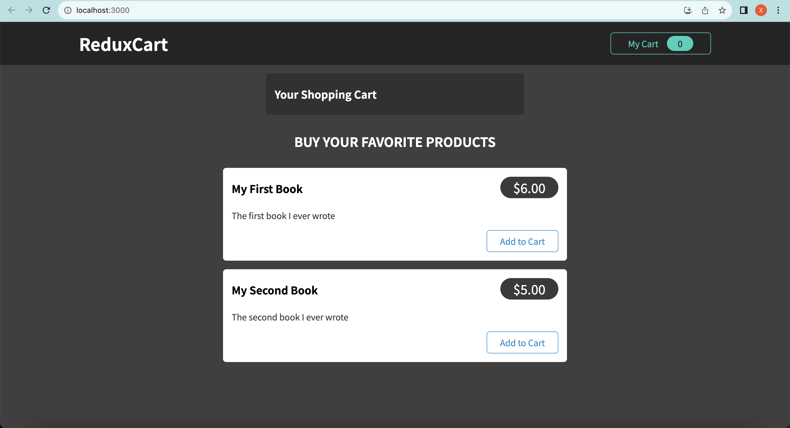

Redux - Advanced


2hrs 


# Key takeaways

handling async tasks with redux

+ where to put the side-effect & async code logic
  + option1: inside component 
    + e.g. inside useEffect(), but there might be too many codes inside useEffect()

  + option2: using action creator (preferred)
    + write more cohesive, cleaner code


+ redux DevTools


# Intro

Reducers must be pure, side-effect free, synchronous functions!

=> but where should side-effects & async tasks be executed?

+ inside the components. e.g. `useEffect()`
+ inside the action creators


## refresher practice 

P428-429

```js
npm i @reactjs/toolkit react-redux
```




需求:

+ click on My Cart to toggle visibility of shopping cart
+ Add item to cart


# Hands-on


## Redux & async code

P430

keep the items in the cart, when refresh the page, they are still on the page

:bangbang: don't perform side-effect in reducer, but where to put our side-effect logic? 

p432

2 options:

+ inside the components
+ inside the action creator


## :bangbang: important

trade-off: fat reducer vs. fat component vs. fat actions

there are two types of codes: 

+ synchronous, side-effect free code
  + prefer reducers
  + avoid action creators or components
+ async code or code with side-effects
  + prefer action creators or components
  + never use reducers


## :moon: Option1: Using useEffect with Redux

P433-435


store > ui-slice.js

+ 管理general ui相关的state
  + notification 弹窗

```js
import { createSlice } from "@reduxjs/toolkit";

const uiSlice = createSlice({
  name: "ui",
  initialState: { cartIsVisible: false, notification: null },
  reducers: {
    toggle(state) {
      state.cartIsVisible = !state.cartIsVisible;
    },
    showNotification(state, action) {
      state.notification = {
        status: action.payload.status,
        title: action.payload.title,
        message: action.payload.message
      };
    },
  },
});

export const uiActions = uiSlice.actions;

export default uiSlice;
```


App.js

+ set a `useEffect()` depends on the state `cart` in redux store
  + keep reducers side-effect & async code free
+ a notification component that reflects the request status
  + dispatch show notification, 可读性很好

```js
import { useEffect } from "react";
import { useSelector, useDispatch } from "react-redux";

import Cart from "./components/Cart/Cart";
import Layout from "./components/Layout/Layout";
import Products from "./components/Shop/Products";
import { uiActions } from "./store/ui-slice";
import Notification from "./components/UI/Notification";

let isInitial = true;

function App() {
  const dispatch = useDispatch();

  const showCart = useSelector((state) => state.ui.cartIsVisible); // useSelector is a hook that allows us to extract data from the store
  const cart = useSelector((state) => state.cart);
  const notification = useSelector((state) => state.ui.notification);

  // ! you just get the idea, never perform side-effects in reducers, but in components or action creators
  useEffect(() => {
    const sendCartData = async () => {
      dispatch(
        uiActions.showNotification({
          status: "pending",
          title: "Sending...",
          message: "Sending cart data!",
        })
      );

      const response = await fetch(
        "https://react-redux-79df7-default-rtdb.asia-southeast1.firebasedatabase.app/cart.json",
        {
          method: "PUT", // ! overwrite the existing data
          body: JSON.stringify(cart),
        }
      );

      if (!response.ok) {
        throw new Error("Sending cart data failed.");
      }

      dispatch(
        uiActions.showNotification({
          status: "success",
          title: "Success...",
          message: "Sent cart data successfully!",
        })
      );
    };

    if(isInitial){
      isInitial = false;
      return;
    }

    // invoke the async code
    sendCartData().catch((error) => {
      dispatch(
        uiActions.showNotification({
          status: "error",
          title: "Error...",
          message: "Sending cart data failed!",
        })
      );
    });
  }, [cart, dispatch]); // dispatch is a dependency, but it is guaranteed to never change by redux

  return (
    <>
      {notification && (
        <Notification
          status={notification.status}
          title={notification.title}
          message={notification.message}
        />
      )}
      <Layout>
        {showCart && <Cart />}
        <Products />
      </Layout>
    </>
  );
}

export default App;
```


## :bangbang::moon: Option2: Using an Action Creator Thunk

P436-438


A "Thunk": refers to a function that delays an action unytil later 

+ an action creator function that does NOT return the action itself but instead another function which eventually returns the action


store > cart-slice.js

```js
import { createSlice } from "@reduxjs/toolkit";

const cartSlice = createSlice({
  name: "cart",
  initialState: {
    items: [],
    totalQuantity: 0,
  },
  reducers: {
    replaceCart(state, action) {
      state.totalQuantity = action.payload.totalQuantity;
      state.items = action.payload.items;
    },

    addItemToCart(state, action) {
      const newItem = action.payload;
      const existingItem = state.items.find((item) => item.id === newItem.id);
      state.totalQuantity++;
      if (!existingItem) {
        state.items.push({
          id: newItem.id,
          price: newItem.price,
          quantity: 1,
          totalPrice: newItem.price,
          name: newItem.title,
        });
      } else {
        existingItem.quantity++;
        existingItem.totalPrice = existingItem.totalPrice + newItem.price;
      }
    },
    removeItemFromCart(state, action) {
      const id = action.payload;
      const existingItem = state.items.find((item) => item.id === id);
      state.totalQuantity--;
      if (existingItem.quantity === 1) {
        state.items = state.items.filter((item) => item.id !== id);
      } else {
        existingItem.quantity--;
        existingItem.totalPrice = existingItem.totalPrice - existingItem.price;
      }
    },
  },
});

export const cartActions = cartSlice.actions;

export default cartSlice;
```

store > cart-actions.js

+ 集中写async code & side effects, 有利于分开reducer与async code, 同时也保持component code clean
  + action creator function returns a function, which automatically get 'dispatch' as the argument

```js
import { uiActions } from "./ui-slice";
import { cartActions } from "./cart-slice";

// async code should always be outside of the reducer function
export const sendCartData = (cart) => {
  return async (dispatch) => {
    dispatch(
      uiActions.showNotification({
        status: "pending",
        title: "Sending...",
        message: "Sending cart data!",
      })
    );

    // async code define --------------
    const sendRequest = async () => {
      const response = await fetch(
        "https://react-redux-79df7-default-rtdb.asia-southeast1.firebasedatabase.app/cart.json",
        {
          method: "PUT", // ! overwrite the existing data
          body: JSON.stringify(cart),
        }
      );

      if (!response.ok) {
        throw new Error("Sending cart data failed.");
      }
    };

    // async code execution -------------
    try {
      await sendRequest();

      dispatch(
        uiActions.showNotification({
          status: "success",
          title: "Success...",
          message: "Sent cart data successfully!",
        })
      );
    } catch (error) {
      dispatch(
        uiActions.showNotification({
          status: "error",
          title: "Error...",
          message: "Sending cart data failed!",
        })
      );
    }
  };
};

export const fetchCartData = () => {
  return async (dispatch) => {
    const fetchData = async () => {
      const response = await fetch(
        "https://react-redux-79df7-default-rtdb.asia-southeast1.firebasedatabase.app/cart.json"
      );

      if (!response.ok) {
        throw new Error("Could not fetch cart data!");
      }

      const data = await response.json();

      return data;
    };

    try {
      const cartData = await fetchData();
      dispatch(
        cartActions.replaceCart({
          items: cartData.items || [],
          totalQuantity: cartData.totalQuantity,
        })
      ); // !
    } catch (error) {
      dispatch(
        uiActions.showNotification({
          status: "error",
          title: "Error...",
          message: "Fetching cart data failed!",
        })
      );
    }
  };
};
```

App.js

+ useEffect() 中直接dispatch action creator即可, 代码更加clean

```js
import { useEffect } from "react";
import { useSelector, useDispatch } from "react-redux";

import Cart from "./components/Cart/Cart";
import Layout from "./components/Layout/Layout";
import Products from "./components/Shop/Products";
import Notification from "./components/UI/Notification";
import { fetchCartData, sendCartData } from "./store/cart-actions";

let isInitial = true;

function App() {
  const dispatch = useDispatch();

  const showCart = useSelector((state) => state.ui.cartIsVisible); // useSelector is a hook that allows us to extract data from the store
  const cart = useSelector((state) => state.cart);
  const notification = useSelector((state) => state.ui.notification);

  useEffect(() => {
    dispatch(fetchCartData());
  }, [dispatch]);

  // ! you just get the idea, never perform side-effects in reducers, but in components or action creators
  useEffect(() => {
    if (isInitial) {
      isInitial = false;
      return;
    }

    dispatch(sendCartData(cart)); // ! dispatch's argument is always an action object, also able to dispatch another dispatch function
  }, [cart, dispatch]); // dispatch is a dependency, but it is guaranteed to never change by redux

  return (
    <>
      {notification && (
        <Notification
          status={notification.status}
          title={notification.title}
          message={notification.message}
        />
      )}
      <Layout>
        {showCart && <Cart />}
        <Products />
      </Layout>
    </>
  );
}

export default App;

```


# Exploring the Redux DevTools

P439

for debugging


browser extension

+ just like react devtools, allowing you to trace state change on action dispatch
+ allowing jump between historical states